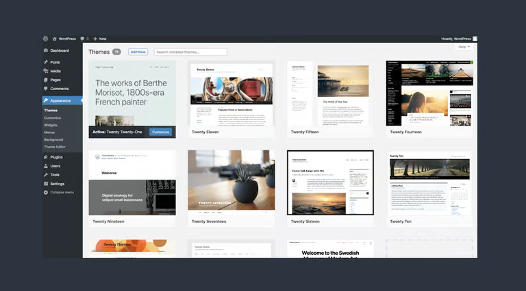
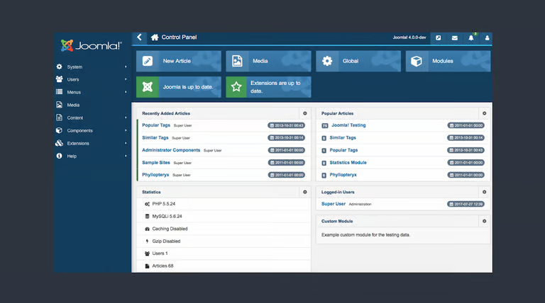
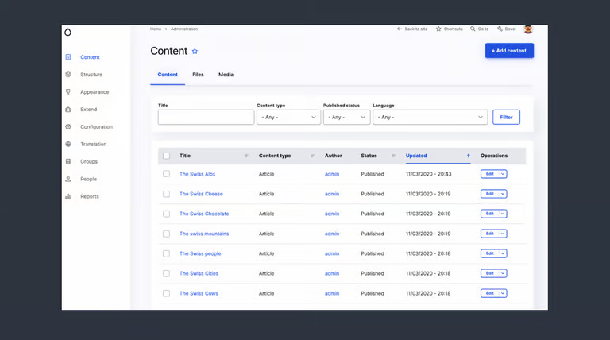
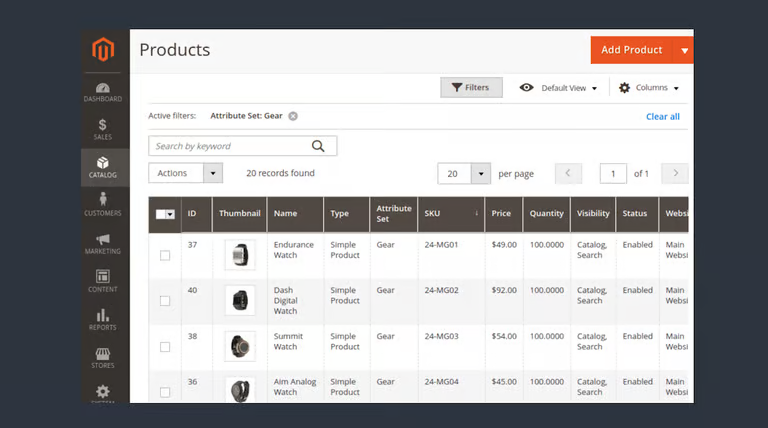
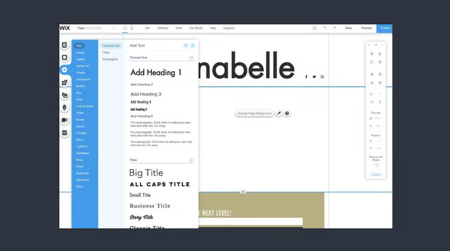

# CMS(콘텐츠 관리 시스템) 정의 

* 웹사이트 및 웹 애플리케이션에서 디지털 콘텐츠 생성, 구성 및 게시가 가능한 소프트웨어 플랫폼
* 기술 전문 지식 없이 사용자가 텍스트, 이미지, 비디오 및 기타 멀티미디어 구성요소와 같은 콘텐츠를 효율적으로 관리하고 제어
* 사용자의 요구사항 및 기능을 제공하기 위해 플러그인 및 확장을 제공하는 모듈식 아키텍처

# CMS 작동 원리 

* 디지털 콘텐츠 생성 수정 관리
* 3계층 아키텍처를 사용
  * 데이터베이스 계층 (model)
    * 컨텐츠, 메타데이터 및 기타 관련 정보를 저장 및 관리
    * 플랫폼에 따라 RDBMS 이거나 NoSQL 데이터베이스 사용 
  * 응용 프로그램 논리 계층 (controller)
    * 사용자 요청을 처리하고 데이터베이스와 상호작용하는 CMS의 백엔드 계층 
    * 사용 언어는 PHP,Python,Ruby 이다.
  * 프레젠테이션 계층 (view)
    * 웹브라우저를 통해 사용자에게 콘텐츠를 표시한다.
    * HTMl, CSS , JS를 활용한 대화형 페이지.

 

# CMS 워크플로우

* 콘텐츠 생성
  * 사용자는 WYSIWYG(What You See Is What You Get) 편집기를 통해 콘텐츠를 생성하여 텍스트, 이미지 및 멀티미디어 구성 요소의 서식을 쉽게 지정하고 조작 한다.
* 콘텐츠 저장소
  * 생성된 콘텐츠는 작성자 정보, 범주 및 태그와 같은 메타데이터와 함께 데이터베이스에 저장되어 구성 및 검색에 용이하다.
* 콘텐츠 관리
  * 승인된 사용자는 콘텐츠를 관리하고 콘텐츠 편집, 검토, 승인 또는 삭제와 같은 작업을 수행하고 사용자 역할 및 액세스 권한을 관리한다.
* 콘텐츠 렌더링 
  * 사용자가 특정 페이지나 리소스를 요청하면 콘텐츠를 검색하고 스타일 지정을 위한 템플릿과 테마를 사용하여 처리한 후 사용자의 웹 브라우저에 제공한다. 

# CMS 대표 플랫폼

## AppMaster

<video src="https://appmaster.io/api/_files/MyDLPCexYFew7yrPDUjYM7/download/#t=0.001"></video>

* 정교하고 전문적으로 로 구별되는 웹 애플리케이션 및 콘텐츠 관리 시스템 생성을 위한 플랫폼
* 사용자 친화적인 drag-and-drop 접근 방식을 사용하는 AppMaster 반응협 웹 사이트 및 웹 응용프로그램을 개발 
* 광범위한 내장 전자 상거래 기능과 광범위한 타사 통합이 대표적 

## WordPress

* 사용편의성, 광범위한 사용자 정의옵션, 방대한 테마 및 플러그인 저장소로 대표적
* 다목적 플랫폼 

## Joomla

* 고급 기능을 갖춘 복잡한 웹 사이트를 만드는데 적합하여 소셜 네트워킹 사이트, 온라인 커뮤니티 및 회원 포털로 사용
* Joomla는 개발자 커뮤니티를 보유하며 사용자 지정을 위한 다양한 확장 및 템플릿을 제공 

## Drupal

* 유연성, 확장성 및 보안으로  유명한 오픈소스 CMS
* 복잡한 데이터 기반 웹 사이트 미 웹 응용 프로그램을 구축하는데 적합
* 정부기관 대학 및 대기업에서 사용
* 광범위한 모듈 시스템을 통해 높은 수준의 사용자 정의 가능성을 제공 

## Magento

* 온라인 상점 구축 및 관리를 위한 포괄적인 기능 모음을 제공하는 전자 상 거래 중심 CMS
* 확장성이 뛰어나므로 소규모 및 대규모 비즈니스에 적합
* Magento 확장 시장과 생태계에 기여하는 대규모 개발자 커뮤니티를 통해 다양한 사용자 지정 옵션 제공 

## Wix

* 기술 전문성이 제한된 사용자를 위한 클라우드 기반 CMS
* 코딩 지식 없이도 시각적으로 매력적인 웹 사이트를 만들 수 있는 사용자 친화적인 drag-and-drop 인터페이스
* 다양한 템플릿과 사용자 지정 옵션, 전자상거래 기능, 다양한 제3자통합을 제공 

# 맞춤형 CMS 구축 방법

* 맞춤형 CMS 구축을 통해 고유한 비즈니스 요구사항에 맞는 디지털 콘텐츠를 효율적으로 관리하고 제공 가능
* 개발 프로세스를 간소화하기 위한 no-code 접근 방식으로 개발자와 비기술 사용자 모두가 코드작성 없이 기능적인 응용프로그램을 설계하는 소루션 
* no-code 플랫폼 활용시 신속한 프로토타이핑, 개발비용절감, 사용자 접근선 향상이 가능
* 특정 요구사항에 맞게 사용자 정의할수 있는 사전 구축된 모듈, 템플릿 및 통합을 제공하여 개발 일정 단축 가능 
* 플랫폼의 API 통합으로 타사 서비스와 원활한 연결 보장 및 CMS의 전반적인 기능과 적응성 향상 

# 정리

* 텍스트, 이미지, 비디오 및 기타 멀티미디어 구성 요소 같은 콘텐츠를 CMS가 관리한다.

* CMS는 콘텐츠를 관리하기 위한 웹 애플리케이션 및 웹사이트를 제공한다.

* 웹 애플리케이션 및 웹사이트를 사용자에게 맞게 재정의 가능하며 다양한 기능이 추가 가능하다.

* CMS 플랫폼은 타사 서비스와 연결이 가능하다.(API)

* 다양한 CMS 플랫폼이 존재한다. 사용자에게 맞는 플랫폼을 선정하여 사용하면 된다.

* 플랫폼중 no-code 접근 방식으로 누구나 접근 가능하며 시간과 인력이 절약 된다.

* 우리 회사에서는 CMS를 직접 구현해서 만들었다. 

  

# 참고 주소

https://appmaster.io/ko/blog/kontenceu-gwanri-siseutem-gucug-bangbeob