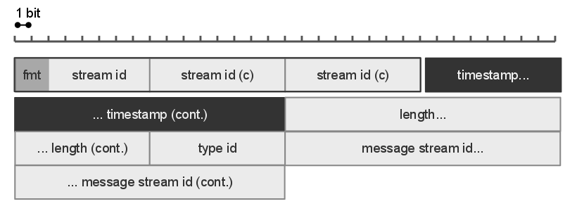
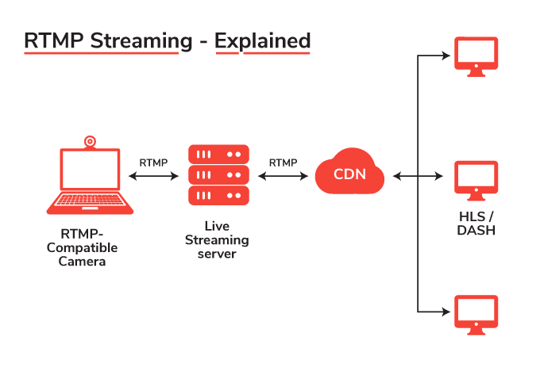

# RTMP(Real-Time-Message-Protocol)

* 플레이어와 서버 간에 인터넷을 통해 오디오, 비디오 및 데이터를 스트리밍하는 프로토콜 
* 어도비 시스템즈사의 독점 컴퓨터 통신 규약이며 어도비 플래시 플레이어와 서버 사이의 통신에 이용 됨
* 기본 포트 1935 -> 1935포트로 실패시 443(RTMPS)나 80포트(RTMPT)로 재시도
* RTMPT (RTMP Tunneled): RTMP 데이터를 HTTP로 감싼 것. 기본 포트는 80번. 
  HTTP 헤더 때문에 RTMP보다는 크기가 큼.
* RTMPS (RTMP Secure): RTMP 데이터를 HTTPS로 감싼 것. 
  플래시 재생기는 SSL 입출력을 지원하므로 그 기능을 사용함.
* RTMPE (Encrypted RTMP): 128비트로 암호화된 RTMP. 
  SSL보다는 가볍지만 SSL 인증같은게 없음. 암호화 채널을 사용하기 때문에 기본 RTMP보다 약간 성능에 영향을 줄 수 있음.
* RTMPTE (Encrypted RTMP Tunneled): 80번 포트 사용. 
  RTMPT, RTMPE 섞어 놓은 형태. 
  플래시 플레이어 9,0,115,0 필요. 서버 성능에 영향을 줌.
* RTMFP (Real Time Media Flow Protocol): UDP에서 동작. 
  기본 RTMP는 TCP에서 동작. 
  항상 암호화 된 상태로 데이터를 전송.

## 동작

* 순수 TCP 기반의 RTMP 프로토콜은 접속을 지속적으로 유지하며 실시간 통신을 함

* 큰 덩어리의 정보를 보내는 능력을 유지하면서 비디오 및 오디오 스트림을 부드럽게 전달하기 위해, 
  비디오 및 데이터를 여러조각(fragments)로 나누기도 함 

* 조각의 크기는 클라이언트와 서버 간에 유동적으로 결정

* 동적 크기 조절은 비활성화 될 수 있다

* 비디오 및 기타 데이터에 대한 스트림 조각들의 기본 크기는 128바이트다.

* 오디오에 대한 스트림 조각들의 기본크기는 64바이트이다 

* 여러개의 스트림이 있을때, 각각의 스트림으로부터 꺼내온 조각들은 인터리빙 되며 한 접속 내에서 다중화 된다.

  즉 여러개의 데이터 스트림 또는 조각을 번갈아가며 결합하거나 섞어서 전송하거나 저장하여 데이터를 관리한다. 

  하지만 실제로 조각들은 인터리빙 되지 않으며  인터리빙과 다중화는 패킷 수준에서 수행된다.

* RTMP 프로토콜은 패킷을 주고 받을 수 있는 여러개의 채널들을 정의 하며 각 채널들은 다른채널에 대해 독립적으로 동작
  ex) RPC 요청 채널, 비디오 스트림 데이터 채널, 오디오 스트림 데이터 채널, 아웃 오브 밴드 제어 메시지 채널 등이 다 따로존재함 

* RTMP 데이터가 패킷화될 때, 패킷 헤더가 생성된다. 
  패킷 헤더는 채널의 아이디(id), 패킷의 타임스탬프(필요한 경우에는), 패킷 페이로드 크기 등을 담고 있다. 
  패킷 헤더 다음에는 패킷 페이로드가 온다.
  

* TCP 통신이기 때문에 소실된 패킷에 대해서 재요청을 한다. 

[출처](https://www.dreamcast.in/blog/rtmp-streaming/)
[출처](https://ko.wikipedia.org/wiki/%EB%A6%AC%EC%96%BC_%ED%83%80%EC%9E%84_%EB%A9%94%EC%8B%9C%EC%A7%95_%ED%94%84%EB%A1%9C%ED%86%A0%EC%BD%9C)

