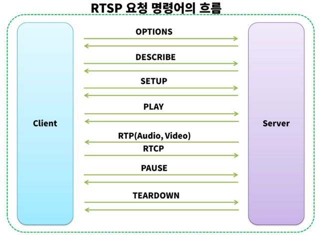

# RTSP(Real-Time-Streaming-Protocol)

* 포트번호 : 554
* 클라이언트 및 서버로 동작 
* 보통 RTSP 서버는 RTCP와 결합한 RTP 규약을 사용하여 전송 
* TCP와UDP 둘다 사용 가능하다.



* Option : 서버에 요청을 보내면 응답값으로 서버에서 사용가능한 메서드 목록을 얻는다. 

* Describe :  서버한테 미디어 세션 정보를 요청하고 SDP(Session Description Protocol)형식의 데이터를 반환한다. 

  ​		    SDP는 미디어 세션의 속성을 설명하는 텍스트 기반의 프로토콜이며, 클라이언트는 이 정보를 해석해서 미디어를 재생할 수 있도록 준비한다.

  ​		    쉽게 생각하면 Get요청이라 생각하면된다.

* Setup :  서버가 특정 미디어 세션을 RTP 트랜스포트 설정 및 세션 식별자를 반환한다.Descripbe 로 받은 세션정보를 통해 세션을 설정 할 수 있다.

* Play :  미디어 스트림을 재생할 수 있다. 재생 하는 구간을 정의할 수 있으며 정의하지않을경우 처음부터 끝까지 재생을 한다. 일시정지 된  영상또한 재생 가능하다.  

* Pause : 미디어 스트림을 일시정지 할 수 있다. play를 통해 다시 재생 가능하며 range변수를 통해 이시 중지 시점을 지정 가능하다. 만약 range가 없다면 무기한으로 일시 중지된다. 

* Record : 프레젠 테이션 설명에 따라 일련의 미디어 데이터를 녹화 할 수 있다. 미디어의 상태에 따라서 녹화 시점과 시간이 달라 질 수 있다. 

* Announce :   클라이언트 -> 서버의 경우 미디어의 프레젠 테이션 설명을 설정 할 수 있다. 

  ​		       서버 -> 클라이언트 의 경우 실시간으로 세션 설명을 업데이트 한다 만약 새로운 미디어스트림이 추가되면 프레젠테이션 설명전체를 다시보낸다.

* Teardown : 세션 종료를 위해 사용한다. 모든 미디어 스트림을 정지시키고 서버 사의 모든 세션 관련 데이터의 할당을 해제한다.
* Get_Parameter : url에 지정된 프레젠테이션 또는 스트림의 변수값을 가져오며 클라이언트나 서버에 ping 테스트가 가능하다. 
* Set_Parameter : url에 지정된 프레젠테이션 또는 스트림의 변수값의 설정을 요청한다. 
* Redirect : 다른 서버 위치로 연결 할 경우 사용한다. 클라이언트가 이 URI의 미디어 송수신을 계속하려면 클라이언트는 현재 세션에 대해 TEARDOWN 요청을 발행하고 지정된 호스트의 새로운 세션에 대해 SETUP을 발행해야 한다
* 임베디드(인터리빙) 바이너리 데이터 : 특정 문제로 RTSP 스트림을 인터리빙하고 데이터를 스트리밍 하는 경우 인터리빙은 사용하며 안된다. RTSP가 TCP를 통해 전달되는 경우 사용하면 좋다. 

## RTSP 명령어

- OPTIONS

  클라이언트가 지원 가능한 메서드 목록을 얻기 위해 서버에게 `OPTIONS` 요청을 보낼 수 있습니다. 

  서버는 이에 대한 응답으로 지원되는 메서드 목록을 반환합니다.

  

```
C->S:  OPTIONS rtsp://example.com/media.mp4 RTSP/1.0
       CSeq: 1
       Require: implicit-play
       Proxy-Require: gzipped-messages

S->C:  RTSP/1.0 200 OK
       CSeq: 1
       Public: DESCRIBE, SETUP, TEARDOWN, PLAY, PAUSE
```


- DESCRIBE

  DESCRIBE 요청에는 RTSP [URL](https://ko.wikipedia.org/wiki/URL) (rtsp://...) 및 관리 가능한 응답 데이터의 유형이 포함된다. 

  이 응답은 보통 [세션 기술 프로토콜](https://ko.wikipedia.org/wiki/세션_기술_프로토콜)(SDP) 포맷으로 되어 있으며 프레젠테이션 설명이 포함된다. 

  그 중에 애그리게이트(aggregate) URL로 제어되는 미디어 스트림들이 나열된다. 

  일반적인 경우 오디오 스트림과 비디오 스트림을 위한 각각의 하나의 미디어 스트림이 존재한다. 

  미디어 스트림 URL은 SDP 컨트롤 필드로부터 직접 취득되거나 SDP 컨트롤 필드를 애그리게이트 URL 뒤에 추가하는 방식으로 취득된다.

```
C->S: DESCRIBE rtsp://example.com/media.mp4 RTSP/1.0
      CSeq: 2

S->C: RTSP/1.0 200 OK
      CSeq: 2
      Content-Base: rtsp://example.com/media.mp4
      Content-Type: application/sdp
      Content-Length: 460

      m=video 0 RTP/AVP 96
      a=control:streamid=0
      a=range:npt=0-7.741000
      a=length:npt=7.741000
      a=rtpmap:96 MP4V-ES/5544
      a=mimetype:string;"video/MP4V-ES"
      a=AvgBitRate:integer;304018
      a=StreamName:string;"hinted video track"
      m=audio 0 RTP/AVP 97
      a=control:streamid=1
      a=range:npt=0-7.712000
      a=length:npt=7.712000
      a=rtpmap:97 mpeg4-generic/32000/2
      a=mimetype:string;"audio/mpeg4-generic"
      a=AvgBitRate:integer;65790
      a=StreamName:string;"hinted audio track"
```


- SETUP

  SETUP 요청은 단일 미디어 스트림이 어떻게 전송되어야 하는지를 규정한다. 

  이 요청이 수행된 뒤에야 (다음에 언급되는) PLAY 요청을 전달할 수 있다. 이 요청에는 미디어 스트림 URL과 전송 지시자를 포함한다. 

  이 지시자에는 보통 [RTP](https://ko.wikipedia.org/wiki/실시간_전송_프로토콜) 데이터(오디오 또는 비디오), 그리고 [RTCP](https://ko.wikipedia.org/wiki/RTCP) 데이터(메타 정보)를 위한 데이터를 수신하기 위한 로컬 포트가 포함되어 있다. 

  서버 응답은 보통 정해진 변수를 확인하는 일을 하며, 서버가 선정한 포트 등 존재하지 않는 부분에 내용을 채운다. 

  각 미디어 스트림은 SETUP을 이용하여 구성을 마쳐야 애그리게이트 플레이 요청 전송을 수행할 수 있다.

```
C->S: SETUP rtsp://example.com/media.mp4/streamid=0 RTSP/1.0
      CSeq: 3
      Transport: RTP/AVP;unicast;client_port=8000-8001

S->C: RTSP/1.0 200 OK
      CSeq: 3
      Transport: RTP/AVP;unicast;client_port=8000-8001;server_port=9000-9001;ssrc=1234ABCD
      Session: 12345678


C->S: SETUP rtsp://example.com/media.mp4/streamid=1 RTSP/1.0
      CSeq: 3
      Transport: RTP/AVP;unicast;client_port=8002-8003
      Session: 12345678

S->C: RTSP/1.0 200 OK
      CSeq: 3
      Transport: RTP/AVP;unicast;client_port=8002-8003;server_port=9002-9003;ssrc=1234ABCD
      Session: 12345678
```


- PLAY

  PLAY 요청은 1개 또는 모든 미디어 스트림을 재생한다. 

  PLAY 요청을 여러 번 보내면 재생 요청들을 복수로 쌓아두고 처리할 수 있다. 

  URL은 애그리게이트 URL(모든 미디어 스트림들을 재생) 또는 하나의 미디어 스트림 URL(해당 스트림에 한해서만 재생)로 구성이 가능하다. 

  재생 범위를 지정할 수 있다. 

  범위를 지정하지 않으면 스트림은 처음부터 끝까지 재생되며 스트림이 일시 중지된 상황이라면 일시 중지된 지점부터 이어서 재생된다.

```
C->S: PLAY rtsp://example.com/media.mp4 RTSP/1.0
      CSeq: 4
      Range: npt=5-20
      Session: 12345678

S->C: RTSP/1.0 200 OK
      CSeq: 4
      Session: 12345678
      RTP-Info: url=rtsp://example.com/media.mp4/streamid=0;seq=9810092;rtptime=3450012
```


- PAUSE

  PAUSE 요청은 1개 또는 모든 미디어 스트림을 일시적으로 중지한다. 그러므로 PLAY 요청과 함께 나중에 이어서 재생할 수 있다. 

  이 요청에는 애그리게이트 URL 또는 미디어 스트림 URL이 포함된다. 

  PAUSE 요청에 range(범위) 변수를 사용하여 일시 중지의 시점을 지정할 수 있다. 해당 범위 변수를 제외할 경우 즉시 무기한으로 일시 중지된다.

```
C->S: PAUSE rtsp://example.com/media.mp4 RTSP/1.0
      CSeq: 5
      Session: 12345678

S->C: RTSP/1.0 200 OK
      CSeq: 5
      Session: 12345678
```


- RECORD

  이 메소드는 프레젠테이션 설명에 따라 일련의 미디어 데이터를 녹화한다. 

  타임스탬프는 시작 시간/종료 시간(UTC)을 반영한다. 

  시간 범위를 지정하지 않으면 프레젠테이션 설명에 지정된 시작 또는 종료 시간을 사용하게 된다. 

  세션이 이미 시작된 경우 녹화는 즉시 시작된다. 

  서버는 요청 URI 또는 기타 URI를 통해 녹화된 데이터의 저장 여부를 결정한다. 

  서버가 요청 URI를 사용하지 않는 경우 응답은 201 처리되며 요청 상태를 기술하고 새로운 자원을 참조하는 엔티티, 그리고 Location 헤더를 포함하게 된다.

```
C->S: RECORD rtsp://example.com/media.mp4 RTSP/1.0
      CSeq: 6
      Session: 12345678

S->C: RTSP/1.0 200 OK
      CSeq: 6
      Session: 12345678
```


- ANNOUNCE

  ANNOUNCE 메소드는 2가지 목적이 있다:

  클라이언트→서버 전송의 경우 ANNOUNCE는 서버에 대한 요청 URL에 의해 식별되는 프레젠테이션 또는 미디어 오브젝트의 설명을 게시한다. 

  서버→클라이언트 전송의 경우 ANNOUNCE는 실시간으로 세션 설명을 업데이트한다. 

  새로운 미디어 스트림이 프레젠테이션으로 추가되는 경우(예: 실시간 프레젠테이션) 컴퍼넌트를 추가로 보내지 않고 프레젠테이션 설명 전체를 다시 보낸다.

```
C->S: ANNOUNCE rtsp://example.com/media.mp4 RTSP/1.0
      CSeq: 7
      Date: 23 Jan 1997 15:35:06 GMT
      Session: 12345678
      Content-Type: application/sdp
      Content-Length: 332

      v=0
      o=mhandley 2890844526 2890845468 IN IP4 126.16.64.4
      s=SDP Seminar
      i=A Seminar on the session description protocol
      u=http://www.cs.ucl.ac.uk/staff/M.Handley/sdp.03.ps
      e=mjh@isi.edu (Mark Handley)
      c=IN IP4 224.2.17.12/127
      t=2873397496 2873404696
      a=recvonly
      m=audio 3456 RTP/AVP 0
      m=video 2232 RTP/AVP 31

S->C: RTSP/1.0 200 OK
      CSeq: 7
```


- TEARDOWN

  TEARDOWN 요청은 세션 종료를 위해 사용된다. 모든 미디어 스트림을 정지시키고 서버 상의 모든 세션 관련 데이터의 할당을 해제한다.

```
C->S: TEARDOWN rtsp://example.com/media.mp4 RTSP/1.0
      CSeq: 8
      Session: 12345678

S->C: RTSP/1.0 200 OK
      CSeq: 8
```


- GET_PARAMETER

  GET_PARAMETER 요청은 URI에 지정된 프레젠테이션 또는 스트림의 변수값을 가져온다. 

  응답 내용은 구현체에 남는다. 

  클라이언트나 서버가 살아있는지(ping) 테스트하기 위해 엔티티 본문 없이 GET_PARAMETER을 사용할 수 있다.

```
S->C: GET_PARAMETER rtsp://example.com/media.mp4 RTSP/1.0
      CSeq: 9
      Content-Type: text/parameters
      Session: 12345678
      Content-Length: 15

      packets_received
      jitter

C->S: RTSP/1.0 200 OK
      CSeq: 9
      Content-Length: 46
      Content-Type: text/parameters

      packets_received: 10
      jitter: 0.3838
```


- SET_PARAMETER

  이 메소드는 URI에 지정된 프레젠테이션 또는 스트림의 변수값의 설정을 요청한다.

```
C->S: SET_PARAMETER rtsp://example.com/media.mp4 RTSP/1.0
      CSeq: 10
      Content-length: 20
      Content-type: text/parameters

      barparam: barstuff

S->C: RTSP/1.0 451 Invalid Parameter
      CSeq: 10
      Content-length: 10
      Content-type: text/parameters

      barparam
```


- REDIRECT

  REDIRECT 요청은 다른 서버 위치로 연결해야 한다고 클라이언트에 알릴 것을 요청한다. 

  클라이언트가 해당 URL에 대해 요청을 발행하는 것을 지시하는 필수 헤더 Location이 포함된다. 

  리다이렉션 발생 시 지시하는 Range 변수를 포함할 수 있다. 

  클라이언트가 이 URI의 미디어 송수신을 계속하려면 클라이언트는 현재 세션에 대해 TEARDOWN 요청을 발행하고 지정된 호스트의 새로운 세션에 대해 SETUP을 발행해야 한다.

```
S->C: REDIRECT rtsp://example.com/media.mp4 RTSP/1.0
      CSeq: 11
      Location: rtsp://bigserver.com:8001
      Range: clock=19960213T143205Z-
```


[출처](https://ko.wikipedia.org/wiki/%EC%8B%A4%EC%8B%9C%EA%B0%84_%EC%8A%A4%ED%8A%B8%EB%A6%AC%EB%B0%8D_%ED%94%84%EB%A1%9C%ED%86%A0%EC%BD%9C)


## RTP(Reail-Time-Transport-Protocol)

* IP 네트워크를 통해 오디오/비디오 데이터를 전송하기 위한 표준 패킷 포맷의 정의
* RTP는 전화, WebRTC, 텔레비전 서비스, 웹 기반 푸시 투 토크 기능을 포함한 화상 통화 분야등의 스트리밍 미디어를 수반하는 통신 엔터테인먼트 시스템에 사용된다. 


[출처](https://ko.wikipedia.org/wiki/%EC%8B%A4%EC%8B%9C%EA%B0%84_%EC%A0%84%EC%86%A1_%ED%94%84%EB%A1%9C%ED%86%A0%EC%BD%9C)


## RTCP(Real-Time-Transport-Protocol)

* RTP 데이터 전송 상태 감시, 세션 관련 정보전송을 위한 프로토콜 
* RTP(실시간 전송 프로토콜)의 자매 프로토콜 
* 멀티미디어 데이터의 전달, 패키징 시에 RTP와 함께 사용하지만 RTCP가 직접 미디어 데이터를 전송하지는 않는다. 
* RTCP의 주 기능은 옥텟 및 패킷 카운트, 패킷손실, 패킷지연 변화, 왕복지연시간 등의 통계정보를 스트리밍 멀티미디어 세션 참여자들에게 주기적으로 보냄으로써 QoS의 피드백을 제공한다. 

[출처](https://ko.wikipedia.org/wiki/RTCP)


### QoS(Quality of Service)란

* 응용 프로그램, 사용자, 데이터 흐름등에 우선순위를 정하여 데이터 전송에 특정 수준의 성능을 보장하기 위한 능력을 말한다. 


[출처](https://ko.wikipedia.org/wiki/QoS)


# RTMP(Real-Time-Message-Protocol)

* 플레이어와 서버 간에 인터넷을 통해 오디오, 비디오 및 데이터를 스트리밍하는 프로토콜 
* 어도비 시스템즈사의 독점 컴퓨터 통신 규약이며 어도비 플래시 플레이어와 서버 사이의 통신에 이용 됨
* 기본 포트 1935 -> 1935포트로 실패시 443(RTMPS)나 80포트(RTMPT)로 재시도
* RTMPT (RTMP Tunneled): RTMP 데이터를 HTTP로 감싼 것. 기본 포트는 80번. 
  HTTP 헤더 때문에 RTMP보다는 크기가 큼.
* RTMPS (RTMP Secure): RTMP 데이터를 HTTPS로 감싼 것. 
  플래시 재생기는 SSL 입출력을 지원하므로 그 기능을 사용함.
* RTMPE (Encrypted RTMP): 128비트로 암호화된 RTMP. 
  SSL보다는 가볍지만 SSL 인증같은게 없음. 암호화 채널을 사용하기 때문에 기본 RTMP보다 약간 성능에 영향을 줄 수 있음.
* RTMPTE (Encrypted RTMP Tunneled): 80번 포트 사용. 
  RTMPT, RTMPE 섞어 놓은 형태. 
  플래시 플레이어 9,0,115,0 필요. 서버 성능에 영향을 줌.
* RTMFP (Real Time Media Flow Protocol): UDP에서 동작. 
  기본 RTMP는 TCP에서 동작. 
  항상 암호화 된 상태로 데이터를 전송.


## 동작

* 순수 TCP 기반의 RTMP 프로토콜은 접속을 지속적으로 유지하며 실시간 통신을 함

* 큰 덩어리의 정보를 보내는 능력을 유지하면서 비디오 및 오디오 스트림을 부드럽게 전달하기 위해, 
  비디오 및 데이터를 여러조각(fragments)로 나누기도 함 

* 조각의 크기는 클라이언트와 서버 간에 유동적으로 결정

* 동적 크기 조절은 비활성화 될 수 있다

* 비디오 및 기타 데이터에 대한 스트림 조각들의 기본 크기는 128바이트다.

* 오디오에 대한 스트림 조각들의 기본크기는 64바이트이다 

* 여러개의 스트림이 있을때, 각각의 스트림으로부터 꺼내온 조각들은 인터리빙 되며 한 접속 내에서 다중화 된다.

  즉 여러개의 데이터 스트림 또는 조각을 번갈아가며 결합하거나 섞어서 전송하거나 저장하여 데이터를 관리한다. 

  하지만 실제로 조각들은 인터리빙 되지 않으며  인터리빙과 다중화는 패킷 수준에서 수행된다.

* 


[출처](https://ko.wikipedia.org/wiki/%EB%A6%AC%EC%96%BC_%ED%83%80%EC%9E%84_%EB%A9%94%EC%8B%9C%EC%A7%95_%ED%94%84%EB%A1%9C%ED%86%A0%EC%BD%9C)


# HLS(Http Live Streaming)

