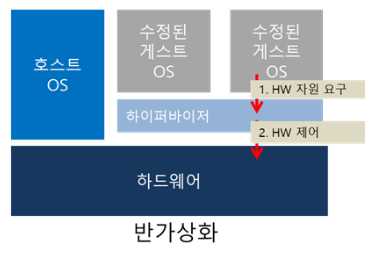

# VM 가상화 플랫폼 

* VM의 등장 이전에는 단일 서버를 여러 사용자가 공유할 수 있도록 물리적으로 공간을 격리를 했다. 
  => 컴퓨터 1대 안에 존재하는 하드웨어와 OS를 분리하지 못하기 때문에 컴퓨터를 여러대 두어서 서버를 돌린다는 말 
* 하이퍼바이저가 출시하면서 기존 물리적 공간을 논리적으로 공간을 분활하여 "VM"이라는 독립적인 가상환경의 서버를 이용 할 수 있게 되었다. 
  => 컴퓨터 1대의 하드웨어와 OS를 논리적으로 공간을 분리하여 하드웨어와 OS의 자원을 독립적으로 사용한다. 
  즉 여러 개의 가상 서버가 존재하면 해당 컴퓨터의 하드웨어와 OS 를 공유의 자원을 사용하는 것 

## 하이퍼바이저 Type1. 네이티브 or 하이퍼바이저형 ( native/bare-metal Or Htpervisor)

* 네이티브는 하드웨어 - 게스트 Os -하이퍼바이저 - 호스트 운영체제 형식으로 존재한다. 
* 하이퍼바이저가 하드웨어를 직접 제어하여 자원을 효율적으로 사용한다
* 별도의 HostOs가 없어서 오버헤드가 적지만 여러 하드웨어 드라이버를 세팅해야한다 
  * 다른건 HostOs를 통해서 하드웨어를 제어한다. 하지만 애는 HostOs가 아닌 하이퍼바이저가 직접 하드웨어를 제어한다. 
* 네이티브형의 종류로는 전가상화,반가상화 두개의 종류가 존재한다.
* 대표적으로 Xen, 마이크로소프트 Hyper-V, KVM이 존재한다.

### 전가상화

* 게스트 OS를 호스트 시스템과 완전히 분리하여 실행

* 하드웨어를 모두 가상화 하는 방식 

* 게스트 OS는 하드웨어 자원을 요청하기 위해 반드시 하이퍼바이저가 중재해야 한다.

* 흐름도

  1. 게스트 OS는 DOM0에게 하드웨어 자원을 요구합니다

  2. DOM0는 하이퍼바이저와 통신을 합니다.
  3. 하이퍼 바이저가 하드웨어를 제어합니다. 

* 단점 
  1. 모든 게스트 OS가 요청을 DOM0를 거쳐 하이퍼바이저와 통신한다
  2. CPU와 RAM처럼 I/O가 잦은 자원을 컨트롤하기에 번거롭다.
  3. 이런 단점을 보안하기 위해 반가상화 기술이 탄생한다.

## 반가상화

* 게스트 OS를 일부 수정하여 필요한 하드웨어 자원을 직접 요구 할 수 있다. 
* 반가상화 방식은 하드웨어를 완전히 가상화 하지 않는다.
* 게스트 OS의 커널을 일부 수정해 하드웨어와 인터렉션 할 수 있지만 OS를 수정할때 별도의 Tool이 필요 할 수 있다.
* 각각의 게스트 OS는 필요한 자원을 직접 요청할 수 있는 능력이 있어 모든 요청을 DOM0가 한꺼번에 처리하여 하드웨어를 제어하는 전가상화 방식에 비해 성능이 좋다. 
* 단점
  1. 게스트 OS을 수정해야한다.
  2. 가상화 술루션과 게스트 Os 를 유지하는데 필요한 관리 오버헤드가 있을 수 있다.

## 하이퍼바이저 Type2. 호스트형(hosted)

* 호스트 OS 위에서 실행이 된다.

* 호스트형의 구조는 물리적 하드웨어 - 호스트 운영체제 - 하이퍼바아저 -GestOs

*  하드웨어 자원을 VM 내부의 게스트 OS에 에뮬레이트 하는 방식이여서 Type1. 네이티브 방식에 비해 오버헤드가 크지만 게스트OS종류에 대한 제약이 없고 

  데스크탑이 아닌 노트북에서도 운영할 수 있다

* 대표적으로 VMware server, VMware Workstation, Vitural box가 존재 

하이퍼 바이저에 의해 구동되는 VM은 각 VM마다 독립된 가상 하드웨어 자원을 할당 받으며 

논리적으로 분리되어 있어 한 VM에 오류가 발생해도 다른 VM으로 퍼지지 않는 장점이 있다. 

[출처](https://www.sharedit.co.kr/posts/5611)

# Container

* VM과 달리 컨테이너는 게스트OS를 필요로 하지 않습니다. 그래서 비교적 더 가벼워 실행 시간도 빠릅니다. 
* 컨테이너는 크기가 작으므로 복제와 배포에도 용이합니다. 만약 기존서버에서 사용하던 도커와 같은 환경으로 도커를 설정한 다른컴퓨터가 존재한다면 
  해당 컴퓨터에 컨테이너를 넣어주기 만하면 기존서버처럼 똑같이 동작합니다.
* 컨테이너는 컨테이너 엔진을 통해 OS,하드웨어를 할당 받아서 사용합니다. 그러므로 VM처럼 일일이 환경을 설정할 필요가 없습니다. 
* 

[출처](https://post.naver.com/viewer/postView.nhn?memberNo=2521903&volumeNo=21385900)

https://www.samsungsds.com/kr/insights/220222_kubernetes1.html

# VM 가상화 Vs Container 

