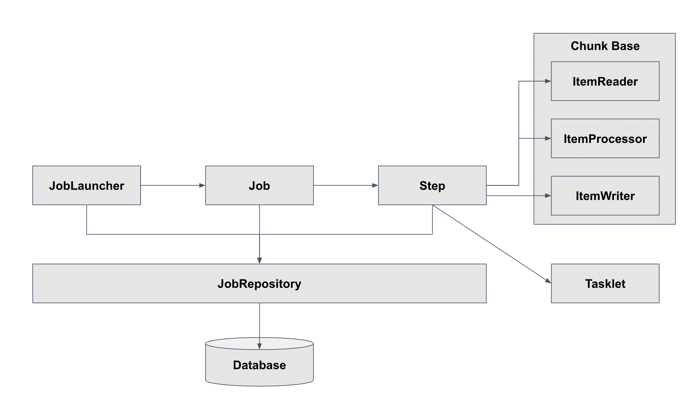
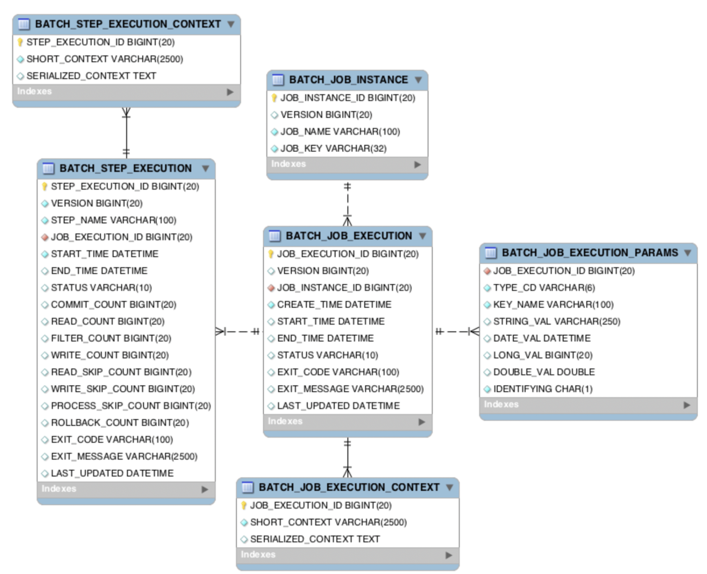
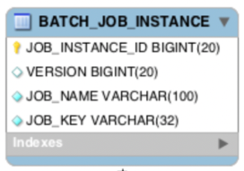
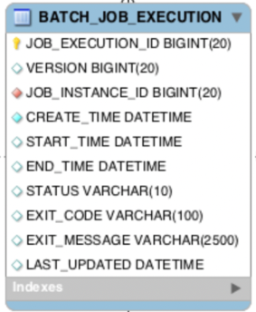
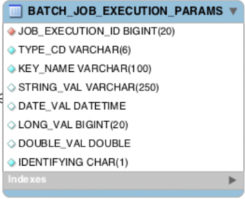
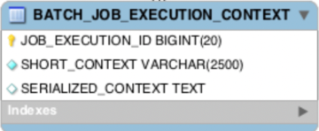
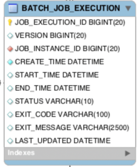
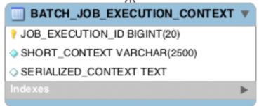
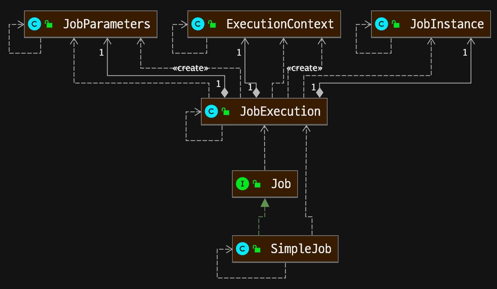
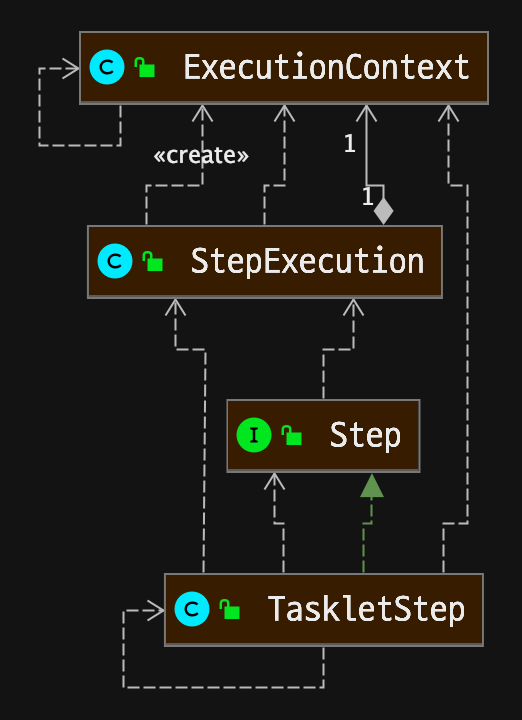

# 목표

1. 기본적으로 통용되는 Batch 개념 살펴보기
2. 기본적으로 통용되는 Scheduler 개념 살펴보기
3. Spring Boot에서 사용하는 Batch 알아보기
4. Spring Boot에서 사용하는 Scheduler 알아보기 

# 목차

[toc]

# Batch(배치)

* 데이터의 일괄처리(데이터를 실시간으로 처리하는 개념은 아니다)로 사용됨
* 사용자에게 빠른 응답이 필요하지 않은 서비스에 적용
  * 은행의 정산작업
  * 파일 정보 일괄 삭제
  * 커머스의 통게 및 집계 기능 등 
* 특정 시간 이후에는 자원을 거의 사용하지 않는 것이 특징 

### 배치의 조건

|      | 조건          | 설명                                                         | 파일 만료시간 정보 삭제 기능                                 |
| ---- | ------------- | ------------------------------------------------------------ | ------------------------------------------------------------ |
| 1    | 대용량 데이터 | 대량의 데이터를 가져오거나, 전달하거나 게산하는 등의 처리를 할 수 있다. | 대량의 데이터를 삭제한다                                     |
| 2    | 자동화        | 심각한 문제 해결을 제외하고 사용자 개입 없이 실행되야한다    | Scheduler를 이용하여 일정시간마다 자동으로 실행하도록 한다   |
| 3    | 견고성        | 잘못된 데이터를 충돌 및 중단 없이 처리할 수 있어야 한다      | 현재 날짜보다 이전인 데이터만 지워주면 되기 때문에 '잘못된 데이터'가 존재 할 수 없다. |
| 4    | 신뢰성        | 로깅 및 추적을 통해 무엇이 잘못되었는지를 추적 한다.         |                                                              |
| 5    | 성능          | 지정한 시간 안에 처리를 완료하거나 동시에 실행 되는 다른 어플을 방해하지 않도록 수행한다 |                                                              |

# 스케줄러 (Scheduler)

* 일정한 시간 간격 또는 일정한 시각에 특정 로직을 돌리기 위해 사용한다
* 배치를 구현하기 위해서 스케줄러를 사용하며 배치와 스케줄러는 비교대상이 아니다.
* 즉 스케줄러는  일정한 시간 간격 또는 일정한 시각에 배치의 조건에 부합하는 데이터를 배치하기 위해 사용한다.
* Spring의 스케줄러
  * Spring Scheduler
    * 단순한 Scheuling의 작업이 필요할 경우 사용 추천
  * Spring Quartz
    * Scheduling의 세밀한 제어가 필요하고 Schduling 서비스 노드가 멀티이기 때문에 클러스터링(Clustering )이 필요할때 사용 추천
    * Clustering : 여러 개체를 묶는 것 혹은 비슷한 객체끼리 묶는 행

# Spring Batch

* Spirng에서 배치 어플리케이션 제작을 위해 제공하는 프레임워크
* 대용량 레코드 처리에 필수적인 기능 제공
  * 로깅/추적, 트랜잭션 관리,, 작업 처리 토계, 작업 재시작, 건너뛰기 등
* 대용량, 고성능 배치 작업을 가능하게 함
  * 최적화,파티셔닝 기술 사용
* 배치가 실패하여 작업을 재시작하게 된다면 처음부터가 아닌 실패한 지점부터 실행하게 된다.
* 중복실행 방지 기능 존재
  * 성공한 이력이 있는 배치는 동일한 Paramerters로 실행 시 Exception 발생 

## Spring Batch 용어 정리

* JobLauncher --(실행)--> Job --(실행)--> Step 구조 
* JobRepository는 Db or memory에 Spring Batch가 실행 될 수 있도록 배치의 메타데이터를 관리하는 클래스다.

### Job

* 배치 처리 과정을 하나의 단위로 만들어 놓는 객체
* 배치 처리 과정에 있어 전체 계층 최상단에 위치
* JobLauncher에 의해 실행 된다
* Job은 N개의 Step을 실행 할 수 있으며 흐름(Flow)를 관리 할 수 있다
  * A Step 실행후 조건에 따라 B Step 또는 C Step을 실행 하도록 설정 할 수 있다.

### JobInstance

* job의 실행 단위
* job을 실행 시키게 되면 하나의 JobInstance가 생성됨
  * 1월1일과 1월2일에 실행하면 각각의 JobInstance가 생성. 1월1일에 실행한 JobInstance가 실패하여 다시 실행을 시키더라도 이 JobInstace는 1월1일에대한 데이터만 처리하게 된다.

### JobParameters

* JobInstance의 구별자 및 JobInstance에 전달하는 매개변수
* JobParameter의 데이터 타입은 아래 네가지만 지원
  * String, Double, Long, Date

### JobExceution

* JobInstance 실행 시도에 대한 정보를 저장하는 객체
* JobInstance 실행에 대한 상태, 시작시간, 종료시간, 생성 시간 등의 정보를 담고 있다.
  * 1월 1일에 실행한 JobInstance가 실패하여 재 실행을 하면 동일한 JobInstance를 실행시키지만 이 각각 두버네 대한 JobExcution은 개별로 생기게 된다.

### Step

* Job의 배치 처리를 정의하고 순차적인 단계를 캡슐화 한다.

* Job은 최소한 1개 이상의 Step을 가지며, Wob의 실제 일괄처리를제어하는 모든 정보가 있다.

* Step의 실행 단위

  * Task 기반 : 하나의 작업 기반으로 실행

    * 단계 내에서 단일 태스크를 수행하기 위한 것 임의의 Step을 실행할 때 읽기/처리/쓰기를 하나의 작업으로 처리하는 방식

    * 각 단게는 하나의 정의된 작업만 수행해야 한다.

    * Step이 중지 될때까지 execute 메서드가 게속 반복해서 수행하고 수행할 때마다 독립적인 트랜잭션을 얻는다.

    * 초기화, 저장 프로시저 실행, 알림 전송과 같은 Job에서 일반적으로 사용

    * tasklet 클래스가 재 사용이 될 수 있는 상황에 적합
      (Job 구성 클래스 내부에 tasklet 구현부를 넣어서 하나의 클래스로 하나의 업무를 정의하는 방식)

    * Tasklet을 사용한 Task 기반 처리

      * 배치 처리 과정이 비교적 쉬운 경우 사용한다
      * 대량 처리를 하는경우 더 복잡하다
      * 하나의 큰 덩어리를 여러 덩어리로 나누어 처리하기 부적합하다 
      * 처리 대상이 한번에 실행해도 컴퓨터 자원에 문제가 없으면 Tasklet을 사용

      

  * Chunk 기반 : 하나의 큰 덩어리를 N개씩 나눠서 실행 

    * 한번에 하나씩 데이터(row)를 일어 Chunk라는 덩어리를 만든뒤, Chunk 단위로 트랜잭션을 다루는 것
    * 한번에 모든행을 읽고 처리하고 쓰는 대신 한번에 고정 된 양의 레코드를 읽고 처리하는 방식
    * Chunk 단위로 트랜잭션을 수행하기 때문에 실패한 경우에 해당 Chunk만큼만 롤백이 되고, 이전에 커밋된 트랜잭션 범위 까지는 반영
    * 일괄 데이터 변경이나 어떤 데이터 변화를 주는 작업에 사용하면 좋다.
    * Chunk를 사용한 chunk 기반 처리
      * ItemReader, ItemProcessor, ItemWriter의 관계 이해 필요
      * 대량 처리를 하는 경우 Tasklet보다 비교적 쉽게 구현
      * 10,000명의 회원을 1,000명씩 나눠서 처리한다면 Chunk

### StepExecution

* Step 실행 시도에 대한 정보를 저장하는 객체
* Step 실해에 대한 상태, 시작시간, 종료시간, 생성시간, read 수, commit수, skip수등의 정보들이 저장
* Job이 여러 개 Step으로 구성되어 있을 경우, 이전단계의 Step이 실패하게 되면 다음 단계가 실행되지 않음으로, 이후 Step에 대한 StepExcution은 생성되지 않음
* JobExecution과 동일하게 실제 Step이 시작이 될때만 생성 

## 실행 및 관리

### Exectuinontext

* Job간, Step간 데이터를 공유할 수 있는 데이터 저장소
* JobExectuinContext
  * commit 시점에 저장
* StepExectuinContext
  * 실행 사이에 저장
* Job 실패시 ExecutuinContext를 통해 마지막 실행값을 재 구성 할 수 있음

### JobRepository

* 배치 처리 정보를 저장하는 컴포넌트를 관리
* Job이 실행되게 되면 Job,Repository에 JobExectuin과 Step Exectuin을 생성하게 되며 JobRepsotiry에서 이러한 Execution 정보들을 저장하고 조회하며 사용한다

### JobLauncher

* Job과 JobParameter를 사용하여 Job을 실행하는 객체

### ItemReader

* Step 에서 Item을 읽어오는 인터페이스
* ItemReader에 대한 다양한 인터페이스가 존재, 다양한 방법으로 Item을 읽어올 수 있음
* Item을 읽어서 ItemProcessor 또는 ItemWriter에게 전달
  * ItempReader에서 읽은 데이터를 수정 또는 Item Writer 대상인지 Filtering 한다.
  * ItempProcessor는 optional
  * ItempProcessor가 하는 일은 ItemReader 또는 ItemWriter가 대신 할 수 있다.

### ItemWriter

* 처리된 데이터를 write 할 때 사용. 
  처리 결과물에 따라 Insert, Update 가능 
  Queue를 사용하면 send도 가능 
* Item을 chunk로 묶어서 처리

### ItemProcessor

* Reader에서 읽어온 Item 데이터를 처리하는 역할
* 배치 처리의 필수 요소는 아니며, Reader, Writer, Processor처리를 분리하여 각각의 역할을 명확히 구분하고 있다.

 

# 스프링 배치 테이블 구조

* Spring Batch Table 구조
* 배치 실행을 위한 메타 데이터가 저장되는 테이블 

* Job이 실행되며 생성되는 최상위 게층의 테이블
* Job_name과 job_key를 기준으로 하나의 row가 생성되며, 같은 job_name과 job_key가 저장 될 수 없다.
* job_key는 BATCH_JOB_EXECUTION_PARAMS에 저장되는 Parametrer를 나열 후 암호화로 저장 

* BATCH_JOB_EXECUTION
* Job이 실행되는 동안 시작/종료시간, job 상태 등을 관리

* BATCH_JOB_EXECUTION_PARAMS

* Job을 실행하기 위해 주입된 parameter 정보 저장

* 지원하는 데이터 타입의 종류 : String, Double, Long, Date

  

* BATCH_JOB_EXECUTION_CONTEXT
* Job이 실행되며 공유해야할 데이터를 직렬화해 저장

* BATCH_JOB_EXECUTION
* Step이 실행되는 동안 필요한 데이터 또는 실행된 결과 저장 

* BATCH_STEP_EXECUTION_CONTEXT
* Step이 실행되며 공유해야할 데이터를 직렬화 해 저장 

## Job의 흐름도

* JobInstance: BATCH_JOB_INSTANCE 테이블과 매핑
* JobExecution: BATCH_JOB_EXECUTION 테이블과 매핑
* JobParameters: BATCH_JOB_EXECUTION_PARAMS 테이블과 매핑
* ExecutionContext: BATCH_JOB_EXECUTION_CONTEXT 테이블과 매핑
* JobInstance의 생성 기준은 JobParameters 중복 여부에 따라 생성된다.
* 다른 parameter로 Job이 실행되면 JobInstance가 생성된다.
* 같은 parameter로 Job이 실행되면, 이미 생성된 JobInstance가 실행된다.
* JobExecution은 (재실행 여부와 상관없이) 항상 새롭게 생성된다.
* JobExecution에는 Job의 시작,종료시간, 상태 등이 저장 된다. 
  * ex)

​	처음 Job 실행 시, data parameter가 2022-01-01로 실행 됐다면, 1번 JobInstance가 생성
​	다음 Job 실행 시, data parameter가 2022-01-02로 실행 됐다면, 2번 JobInstance가 생성
​	다음 Job 실행 시, data parameter가 2022-01-02로 실행 됐다면, 2번 JobInstance가 재 실행

​	이때 Job이 재실행 대상이 아닌 경우 에러가 발생

* Parameter가 없는 Job을 항상 새로운 JobInstance가 실행되도록 RunIncrementer가 제공
* RunIdIncrementer는 항상 다른 run.id를 Parameter로 설정

## Step의 흐름도 

* StepExecution: BATCH_STEP_EXECUTION 테이블과 매핑

* ExecutionContext: BATCH_STEP_EXECUTION_CONTEXT 테이블과 매칭

* ExecutionContext 클래스는 Job과 Step에 Context를 모두 맵핑할 수 있는 클래스이다.

* Job 내에서 공유할 수 있는 BATCH_JOB_EXECUTION_CONTEXT

* 하나의 Step에서 공유할 수 있는 BATCH_STEP_EXECUTION_CONTEXT

* 예제 참고

  ​	참고로 mysql DB에서 batch 실습을 진행할 때는 schema.mysql.sql의 내용 그대로 DB에 insert 하면된다. 

  

# Reference

[출처](https://velog.io/@smallcherry/%EB%B0%B0%EC%B9%98%EC%99%80-%EC%8A%A4%EC%BC%80%EC%A4%84%EB%9F%AC#%EB%B0%B0%EC%B9%98-batch)

[출처](https://rok93.tistory.com/entry/Spring-Batch-%EA%B5%AC%EC%A1%B0)