# 2023/03.16 수업

메인 주소 기준으로 라우터를 각각 나눠라.

node.js에서는 주소를 request로 사용할 수 있다.

localhost:3000/users?name=abc&age=20 

name=abc&age=20  이부분은 request.query로 불러온다.

어떤걸 쿼리로 쓰고 어떤걸 주소의 일부분으로 사용할까?

primary key를 파라미터로 사용한다.

/menu?type=express

/menu/1

/users Get: 모든 사용자 조회

/users Post: 사용자 추가

/users/:id GET:해당아이디를 가진 사용자 조회

/users/:id PUT/PATCH : 사용자 정보 수정

/users/:id DELETE : 사용자 삭제

### 1. req

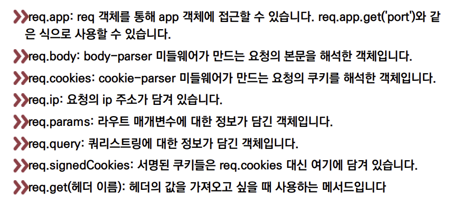

### 2. res

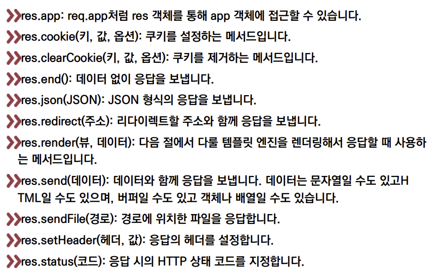

req.status(403).json({result : 'err'});

### 3. 기타

* 응답은 한번만 보내야함
  * 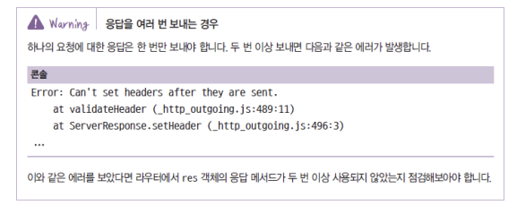

* 메서드 체이닝을 지원
  * 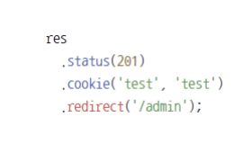

### SSR 

* thymeleaf, jsp, pug, nunkucks...
* 서버에서 완성된 HTML을 전송하는걸 서버 사이드 렌더링이라고 한다.
* 장점은 사용자 입장에서 화면이 탁 하고 뜬다.
* 단점은 서버쪽의 CPU 와 RAM을 사용한다.
* 서버코드의 같은 폴더에서 작업을 한다.

### CSR 

* React, Vue...
* 별도의 앱으로 뜨고 자바스크립트 코드를 생성한다.
* 비어있는 HTML과 본인들이 생성한 자바스크립트 코드를 브라우저에게 전송한다.
* JS안에 화면을 할 수 있는  구성 코드가 존재한다. 그걸 받은 브라우저가 화면을 꾸민다.
* 장점은 서버쪽 자원을 쓰지 않는다.
* 단점은 매우 복잡한 UI면 굉장히 늦은데, 사용자의 CPU와 RAM을 사용한다.

### 둘중 선택해야하는 기준

화면을 이쁘게 꾸미고 UI가 화려하다면 CSR을 선택

검색포탈엔진, lms 같은 사이트 처럼 UI가 화려하지 않으면 SSR로 짜도 된다.

# Pug(구 Jade)

* 문법이 Ruby와 비슷해 코드양이 많이 줄어듦
  * HTML과 많이 달라 호불호가 갈림
  * 익스프레스에 app.set으로 퍼그연결

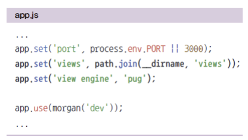

=> 교수님은 Pug를 좋게 생각하신다. 다른 사람의 CSS를 쓸 경우 자식 부모 관계를 Pug를 사용하면 쉽게 넣을 수 있고 뺄 수 있게 지원을 해준다.

### PUG와 HTML 표현 차이

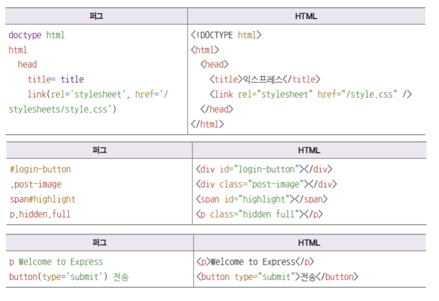

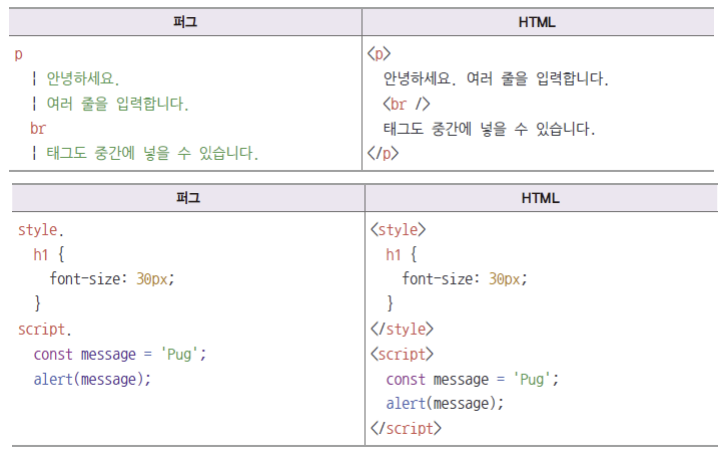

# 넌적스

* Pug의 문법에 적응되지 않는다며 넌적스를 사용하면 좋다.

### 변수

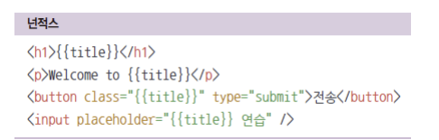

### 내부 변수

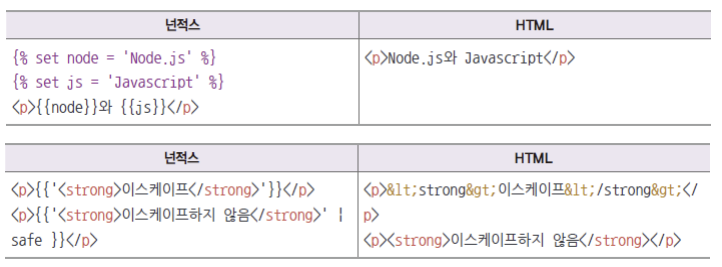

### 반복문

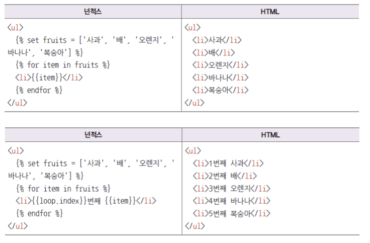

### 조건문

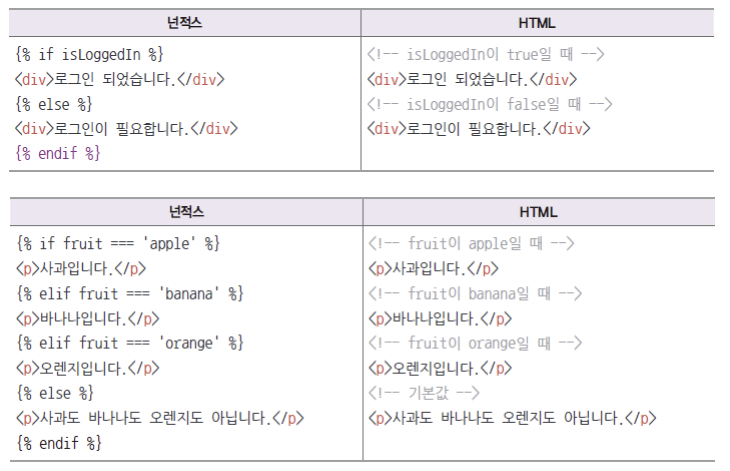

### include

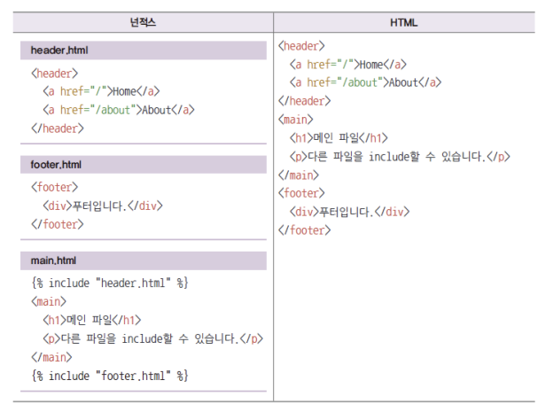

### 레이아웃

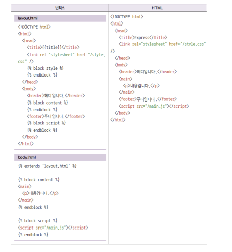

### public 사용법

그림, form 빈칸 체크

 

이렇게 적는다면 저기서 맨처음에 /가 public으로 접속한다는 의미다.

만약 public안에 images가 있다면 /images로 적으면 된다.