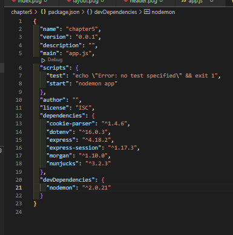
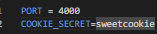
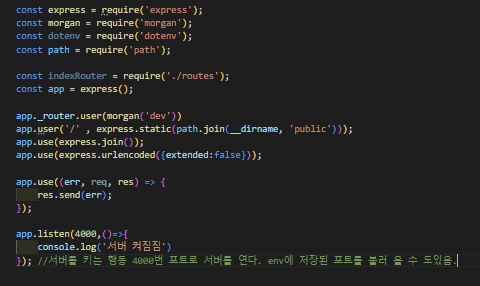

### npm init

 

morgan 

dotenv 

pug  | nunkucks

- npm i express morgan dotenv pug

nodemon

- npm i -D node mon

순서대로 하면 됩니다.

순서대로 패키지를 다운로드하면 위에 사진과 비슷하게 되는데 스크립트 부분에 start "nodemon app"을 작성해주어야 합니다.

그 후 routes , views, public 폴더를 설치해준다.

그리고 .env폴더를 생성해주기.

env 파일에 해당 문구를 작성하면 서버 실행 시 포트번호가 4000이 된다.

쿠키시크릿은 본인이 작성한 쿠키인지에 대한 여부를 조사한다.

# app.js

이런 식으로 코드를 작성해 준다.

이게 서버를 킬 준비를 다 한것이다. 

기초적인 코드이며 기초적인 세팅이다.

