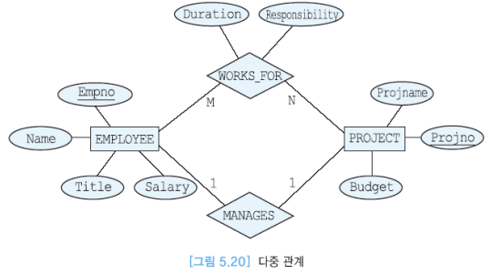

[toc]

# 2장 데이터베이스 설계와 ER 모델

### 데이터베이스 설계

* 개념적 데이터베이스 설계와 물리적 데이터베이스 설계로 구분 
*  개념적 데이터베이스 설계는 실제로 데이터베이스를 어떻게 구현할 것 인가와는 독 립적으로 정보 사용의 모델을 개발하는 과정 
*  물리적 데이터베이스 설계에서는 물리적인 저장 장치와 접근 방식을 다룸 
* 개념적 데이터베이스 설계 과정에서 조직체(실세계)의 엔티티, 관계, 프로세스,   무결성 제약조건 등을 나타내는 추상화 모델을 구축 
* 엔티티는 서로 구분이 되면서 조직체에서 데이터베이스에 나타내려는 객체(사람, 장 소, 사물 등)를 의미 
* 관계는 두 개 이상의 엔티티들 간의 연관을 나타냄 
*  프로세스는 관련된 활동을 나타냄 
* 무결성 제약조건은 데이터의 정확성과 비즈니스 규칙을 의미

=> 물리적 논리적 개념적 분석을 통해서 erd 그리고 설계하고 만드는거 말하는거임.

### 데이터베이스 설계의 개요

*  한 조직체의 운영과 목적을 지원하기 위해 데이터베이스를 생성하는 과정
* 목적은 모든 주요 응용과 사용자들이 요구하는 데이터, 데이터 간의 관계를 표현하는 것 
*  데이터베이스 개발은 일반적인 프로젝트 라이프 사이클 과정을 따름 
* 훌륭한 데이터베이스 설계는 시간의 흐름에 따른 데이터의 모든 측면을 나 타내고, 데이터 항목의 중복을 최소화하고, 데이터베이스에 대한 효율적인 접근을 제공하고, 데이터베이스의 무결성을 제공하고, 이해하기 쉬워야 함

=>  데이터베이스 설계를 통해 데이터를 저장하고 , 사용자들에게 서비스를 제공함 

### 데이터베이스 설계 과정

*  요구사항 분석, 개념적 설계, DBMS의 선정, 논리적 설계, 스키마 정제, 물 리적 설계와 튜닝 등 여러 작업들로 이루어짐 
* 일반적으로, 데이터베이스 설계의 완성도를 높이기 위해서 이런 작업들을 앞뒤로 왔다갔다할 필요가 있음

### 요구사항 수집과 분석

* 흔히 기존의 문서를 조사하고, 인터뷰나 설문 조사 등이 시행됨 
*  인터뷰는 요구사항 수집을 위해 가장 흔히 사용됨 
* 설문 조사는 자유롭게 의견을 적어내도록 하는 방식과 주어진 질문에 대해 서만 답을 하는 방식으로 구분 
* 요구사항에 관한 지식을 기반으로 관련 있는 엔티티들과 이들의 애트리뷰트들이 무엇인가, 엔티티들 간의 관계가 무엇인가 등을 파악함 
*  데이터 처리에 관한 요구사항에 대하여 전형적인 연산들은 무엇인가, 연산들의 의미, 접근하는 데이터의 양 등을 분석함

=> 올바른 요구사항 수집과 분석이 제대로 되지 않으면 개발할때 처음부터 다시 설계를 해야할 경우가 발생할 수 있다.

### DBMS 선정

*  여러 가지 요인들을 검토한 후 DBMS를 선정함 

*  기술적인 요인은 DBMS가 제공하는 데이터 모델, 저장 구조, 인터페이스, 질의어, 도구, 제공되는 서비스 등 

* 정치적인 요인은 고수준의 전략적인 결정 등 

*  경제적인 요인은 DBMS 구입 비용, 하드웨어 구입 비용, 유지 보수(서비스) 비용, 기존의 시스템을 새로운 DBMS에 맞게 변환하는데 소요되는 비용, 인건비,

   교육비 등

* 위에 작성된 개념들은 DBMS에 영향을 받지 않으나 아래 내용부터는 DBMS의 영향을 받는다.

### 개념적 수준의 모델

*  특정 데이터 모델과 독립적으로 응용 세계를 모델링 할 수 있도록 함 
* 데이터베이스 구조나 스키마를 하향식으로 개발할 수 있기 위한 틀 (framework)을 제공함 
* 인기 있는 개념적 수준의 모델은 엔티티-관계(ER: Entity-Relationship) 모 델 
* ER 모델과 같은 개념적인 데이터 모델이 사상될 수 있는 다수의 구현 데이 터 모델(implementation data model)이 존재함 
* 구현 단계에서 사용되는 세 가지 데이터 모델: 관계 데이터 모델, 계층 데이 터 모델, 네트워크 데이터 모델

 

#### 개념적 수준의 모델 요약

* 현실세계에 대한 개념을 추상적 개념으로 표현하는 것
* E-R모델이 존재한다.

### 개념적 설계

* 모든 물리적인 사항과 독립적으로, 한 조직체에서 사용되는 정보의 모델을 구축하는 과정 

* 사용자들의 요구사항 명세로부터 개념적 스키마가 만들어짐 

* 높은 추상화 수준의 데이터 모델을 기반으로 정형적인 언어로 데이터 구조 를 명시함 

* 대표적인 데이터 모델이 ER 모델 

* 개념적 설계의 단계에서는 엔티티 타입, 관계 타입, 애트리뷰트들을 식별하고, 애트리뷰트들의 도메인을 결정하고, 후보 키와 기본 키 애트리뷰트들을 결정함 

* 완성된 개념적 스키마(ER 스키마)는 ER 다이어그램으로 표현됨

  => 결국에는 ER다이어그램으로 표현한다.가 핵심이다.

### 논리적 설계

*  데이터베이스 관리를 위해 선택한 DBMS의 데이터 모델을 사용하여 논리적 스키마(외부 스키마도 포함)를 생성함 
*  개념적 스키마에 알고리즘을 적용하여 논리적 스키마를 생성함 
*  논리적 스키마를 나타내기 위해 관계 데이터 모델을 사용하는 경우에는, ER 모델로 표현된 개념적 스키마를 관계 데이터베이스 스키마로 사상함 
*  관계 데이터베이스 스키마를 더 좋은 관계 데이터베이스 스키마로 변환하 기 위해서 정규화 과정을 적용함 
*  데이터베이스 설계자가 요구사항 수집과 분석 후에 바로 논리적 설계 단계 로 가는 경우가 있는데, 이런 경우에는 흔히 좋은 관계 데이터베이스 스키마가 생성되지 않음

=> 개념적설계를 바탕으로 ER다이어그램을 작성한 것을 바탕으로 DBMS에서 데이터베이스를 생성한다.

### 물리적 설계

*  처리 요구사항들을 만족시키기 위해 저장 구조와 접근 경로 등을 결정함 
*  성능상의 주요 기준은 몇 가지로 구분할 수 있음 
  * 응답 시간: 질의와 갱신이 평균적으로 또는 피크 시간 때 얼마나 오래 걸릴 것인가? 
  * 트랜잭션 처리율: 1초당 얼마나 많은 트랜잭션들이 평균적으로 또는 피 크 시간 때 처리될 수 있는가? 
  *  전체 데이터베이스에 대한 보고서를 생성하는데 얼마나 오래 걸릴 것인 가?

=> 처리 요구 사항을 만족시키기 위해서 어떤 경로를 가지고 어떤 구조를 가질것인가?를 설계하는 것이다.

### 트랜잭션 설계

*  요구사항 수집과 분석 후에 데이터베이스 설계 과정과 별도로 트랜잭션 설 계를 진행할 수 있음 
*  트랜잭션은 완성될 데이터베이스에서 동작할 응용 프로그램 
*  데이터베이스 스키마는 트랜잭션에서 요구하는 모든 정보를 포함해야 함 
*  검색, 갱신, 혼합 등 세 가지 유형으로 구분하여 입력과 출력, 동작 등을 식별함

=> 사용자가 우리의 서비스를 사용하면 정보를 가져오거나 요청을 한다. 이런것을 빠르게 처리해주고 응답해주기 위해서는 트랜잭션 설계가 필요하다.

### ER 모델

* 기본적인 구문으로는 엔티티, 관계, 애트리뷰트가 있고, 기타 구문으로는 **카디날리티 비율** , 참여 제약조건 등이 있음 

*  적은 노력으로 쉽게 배울 수 있고, 전문가가 아니어도 이해하기 쉬우며, 자연어보다는 좀더 정형적이고, 구현에 독립적이어서 데이터베이스 설계자들이 

   최종 사용자들과 의사 소통을 하는데 적합함 

*  ER 모델을 기반으로 만들어진 다수의 CASE 도구(예, ERWin 등)들이 존재 함 

*  이런 도구들은 ER 설계를 자동적으로 오라클, SQL Server, 사이베이스 등 의 데이터 정의어로 변환하고, 어떤 도구는 XML로 변환함 

*  현재는 데이터베이스 설계를 위한 다소 구형 그래픽 표기법

  => ER모델에 대해 자세히 알아야한다 개발을 진행할려면 ERD를 그리게 되는데 해당 개념을 자세하게 모르고 잘못된 설계를 한다면 개발에 어려움이 존재함.

### 엔티티 <-시험에 나옴 

*  하나의 엔티티는 사람, 장소, 사물, 사건 등과 같이 독립적으로 존재하면서 고유하게 식별이 가능한 실세계의 객체 
*  사원처럼 실체가 있는 것도 있지만 생각이나 개념과 같이 추상적인 것도 있 음

=> 엔티티 하나가 ERD의 구성요소가 됨. 

### 엔티티 타입

*  엔티티들은 엔티티 타입(또는 엔티티 집합)들로 분류됨 
*  엔티티 타입은 동일한 애트리뷰트들을 가진 엔티티들의 틀 
*  엔티티 집합은 동일한 애트리뷰트들을 가진 엔티티들의 모임 
*  하나의 엔티티는 한 개 이상의 엔티티 집합에 속할 수 있음 
*  엔티티 타입은 관계 모델의 릴레이션의 내포에 해당하고, 엔티티 집합은 관 계 모델의 릴레이션의 외연에 해당함 
*  엔티티 집합과 엔티티 타입을 엄격하게 구분할 필요는 없음 
* ER 다이어그램에서 엔티티 타입은 직사각형으로 나타냄

### 강한 엔티티 타입

*  강한 엔티티 타입(정규 엔티티 타입)은 독자적으로 존재하며 엔티티 타입 내에서 자신의 키 애트리뷰트를 사용하여 고유하게 엔티티들을 식별할 수 있는 엔티티 타입

### 약한 엔티티 타입 

* 약한 엔티티 타입은 키를 형성하기에 충분한 애트리뷰트들을 갖지 못한 엔 티티 타입 
*  이 엔티티 타입이 존재하려면 소유 엔티티 타입이 있어야 함 
* 소유 엔티티 타입의 키 애트리뷰트를 결합해야만 고유하게 약한 엔티티 타 입의 엔티티들을 식별할 수 있다.

### 애트리뷰트

애트리뷰트는 객체의 속성을 나타내는 말이다.

*  하나의 엔티티는 연관된 애트리뷰트들의 집합으로 설명됨 
* 한 애트리뷰트의 도메인은 그 애트리뷰트가 가질 수 있는 모든 가능한 값들 의 집합을 의미 
  * 예: 사원번호는 1000부터 9999까지의 값을 가짐 
* 여러 애트리뷰트가 동일한 도메인을 공유할 수 있음 
  * 도메인은 애트리뷰트의 타입을 결정하는것(varchar, int etc)
* 키 애트리뷰트는 한 애트리뷰트 또는 애트리뷰트들의 모임으로서 한 엔티 티 타입 내에서 각 엔티티를 고유하게 식별함 
*  ER 다이어그램에서 **기본 키**에 속하는 애트리뷰트는 밑줄을 그어 표시함

### 유도된 애트리뷰트

* 다른 애트리뷰트의 값으로부터 얻어진 애트리뷰트
*  관계 데이터베이스에서 릴레이션의 애트리뷰트로 포함시키지 않는 것이 좋음 
*  ER 다이어그램에서 점선 타원으로 표현함
* 주민등록번호를 받으면 나이 애트리뷰트를 만들 필요가 없음.

### 애트리뷰트들의 유형

* 단순 애트리뷰트 (Address 제외한 것)
* 복합 애트리뷰트 Address만
  * 단순 <-> 복합 

* 단일 값 애트리뷰트 (name. empno,juminno,address ) 

* **다치** 애트리뷰트 ( hobby)

  * 단일 <-> 다치
    

* 키 애트리뷰트  (empno)

  (밑줄그인애들)

  

* 저장된 애트리뷰트 (age 제외 모든것)

* 유도된 애트리뷰트(age)

  * 저장 <-> 유도 

### 차수

* 관계로 연결된 엔티티 타입들의 개수를 의미 
*  실세계에서 가장 흔한 관계는 두 개의 엔티티 타입을 연결하는 2진 관계
  * 

관계에서 차수는 관계를 중심으로 연결된 엔티티의 수를 말한다.

### 카디날리티

*  카디날리티 비율은 한 엔티티가 참여할 수 있는 관계의 수를 나타냄 
*  관계 타입에 참여하는 엔티티들의 가능한 조합을 제한함 
* 관계를 흔히 1:1, 1:N, M:N으로 구분  카디날리티에 관한 정보는 간선 위에 나타냄
* 
*  ER 다이어그램에서 관계 타입과 엔티티 타입을 연결하는 실선 위에 (min, max) 형태로 표기 
* 어떤 관계 타입에 참여하는 각 엔티티 타입에 대하여 min은 이 엔티티 타입 내의 각 엔티티는 적어도 min 번 관계에 참여함을 의미 
* max는 이 엔티티 타입 내의 각 엔티티는 최대한 max 번 관계에 참여함을 의미 
*  min=0은 어떤 엔티티가 반드시 관계에 참여해야 할 필요는 없음을 의미 
*  max=*는 어떤 엔티티가 관계에 임의의 수만큼 참여할 수 있음을 의미
* 

### 전체참여와 부분참여

* 부분 참여는 어떤 관계에 엔티티 타입 E1의 일부 엔티티만 참여하는 것을 의미 
*  약한 엔티티 타입은 항상 관계에 전체 참여
*  전체 참여는 ER 다이어그램에서 이중 실선으로 표시

### 다중관계

* 엔티티가 두개의 관계를 가지는것을 말한다.

### 순환적 관계

* 하나의 엔티티 타입이 동일한 관계 타입에 두 번 이상 참여하는 것

* 부품중 엔진도 철을 사용하고, 타이어휠도 철을 사용한다면 철이 두개의 관계타입에 두번이상참여한다.
* 

###  ER 스키마를 작성하기 위한 지침 

*  엔티티는 키 애트리뷰트 이외에 설명 정보를 추가로 가짐 
* 다치 애트리뷰트는 엔티티로 분류해야 함 
*  애트리뷰트들이 직접적으로 설명하는 엔티티에 애트리뷰트들을 붙임 
*  가능한 한 복합 식별자를 피함 
*  관계는 일반적으로 독자적으로 존재할 수 없지만 엔티티 타입과 관계 타입 을 절대적으로 구분하는 것은 어려움
  * 

### ER 표기법 요약

## 엔티티 타입 및 애트리뷰트들을 식별

* 각 사원에 대해서 사원번호(고유함), 이름, 직책, 급여, 주소를 저장. 주소는 시, 구, 동으로 세분하여 나타냄

* 회사는 여러 개의 프로젝트들을 진행. 각 프로젝트에 대해서 프로젝트번호(고유함), 이름, 예산, 프로젝트가 진행되는 위치를 나타냄.

* 부서에 대해서 부서번호(고유함), 이름, 부 서가 위치한 층을 나타냄

*  공급자에 대해서 공급자번호(고유함), 이름, 신용도를 나타냄

* 부양가족에 대해서 부양가족의 이름과 성별을 저장

* 부품에 대해서 부품번호(고유함), 이름, 가격, 그 부품이 다른 부품들을 포함하는 경우에는 그 부품들에 관한 정보도 나타냄

*  사원은 한 부서에만 속함. 각 부서에 대해서 부서번호(고유함), 이름, 부 서가 위치한 층을 나타냄
*  각 사원에 대해서 사원번호(고유함), 이름, 직책, 급여, 주소를 저장. 주소는 시, 구, 동으로 세분하여 나타냄

**마름모에 대한 서술**

* 사원은 여러 프로젝트에 서 근무할 수 있음. 각 사원이 해당 프로젝트에서 어떤 역할을 수행하고, 얼마 동안 근무해 왔는가를 나타냄. 
* 각 프로젝트마다 한 명의 프로젝트 관리자가 있음. 한 사원 은 두 개 이상의 프로젝트의 관리자가 될 수는 없음. 프로젝트 관리자 임무를 시작한 날짜를 기록

**마름모에 대한 서술**

* 각 사원은 0명 이상의 부양가족을 가질 수 있음. 한 부양가족은 두 명 이상의 사원에 게 속하지 않음. 각 부양가족에 대해서 부양가족의 이름과 성별을 저장

* 약한엔티티타입은 이중직사각형으로 나타냄

* 강한엔티티타입 <<->> 약한엔티티타입 관계를 나타낼때는 식별 관계성 타입으로 표현하기 위해 이중마름모선을 사용함

* 약한엔티티타입은 의존적이기 때문에 무조건 전체참여를 함.

* 강한엔티티타입은 부분참여를 함.

* 각 프로젝트에는 부품들이 필요. 한 부품이 두 개 이상의 프로젝트에서 사 용될 수 있음.

* 부품을 공급하는 공급자들이 있음. 한 명의 공급자는 여러 가지 부품들 을 공급할 수 있고, 각 부품은 여러 공급자들로부터 공급될 수 있음. 
* 각 공급자에 대해서 공급자번호(고유함), 이름, 신용도를 나타냄. 
* 각 공급자에 대 해서 그 공급자가 어떤 부품을 어떤 프로젝트에 얼마나 공급하는가를 나타냄

* 위의 요구사항 분석을 바탕으로 ER을 그린 후 추합하면 회사의 ER스키마 다이어그램이 완성된다.