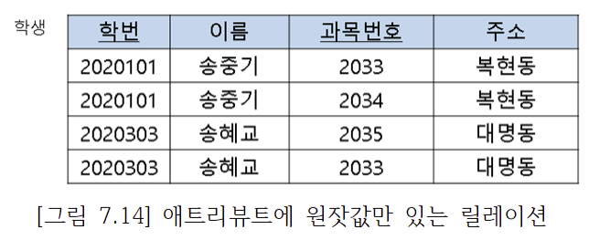

[toc]

# 릴레이션 정규화란

* 릴레이션 정규화는 관계형 데이터베이스에서 데이터의 중복성을 제거하고 데이터의 일관성과 무결성을 유지하기 위해 데이터를 구조화하는 프로세스입니다. 
* 이를 통해 데이터의 저장, 검색, 업데이트 작업이 효율적이고 정확하게 이루어질 수 있습니다.
* 릴레이션 정규화는 주로 함수적 종속성(Functional Dependency) 개념을 기반으로 이루어집니다. 
* 함수적 종속성은 한 릴레이션의 속성들 간의 의존 관계를 나타내며, 한 속성의 값을 통해 다른 속성의 값을 유도할 수 있는 것을 말합니다.
* 릴레이션 정규화는 일반적으로 제1정규형(1NF), 제2정규형(2NF), 제3정규형(3NF), BCNF(Boyce-Codd 정규형) 순서로 진행됩니다. 각 정규형은 다음과 같은 특징을 가지고 있습니다:
* 릴레이션 정규화는 데이터의 중복성과 종속성을 제거하여 데이터의 일관성과 무결성을 유지하는 중요한 작업입니다. 
* 이를 통해 데이터베이스의 효율성과 유지보수성을 향상시킬 수 있습니다.

## 갱신이상(update anomaly)

릴레이션 정규화에서 갱신이상(Update Anomaly)은 데이터베이스에서 데이터를 갱신(삽입, 수정, 삭제)할 때 발생하는 비정상적인 현상을 말합니다. 이러한 갱신이상은 데이터의 중복성과 종속성을 제거하지 않은 경우에 발생할 수 있습니다.

1. 삽입 이상(Insertion Anomaly): 삽입 연산 시 데이터의 부족으로 인해 원하지 않는 정보가 입력되거나, 특정 속성에 대한 정보가 없어서 릴레이션에 행을 삽입할 수 없는 경우입니다. 예를 들어, 주문 정보와 함께 고객 정보를 저장하는 릴레이션에서 고객이 주문을 하지 않았을 경우에도 고객 정보를 입력해야 하는 경우가 있습니다.

2. 수정 이상(Update Anomaly): 수정 연산 시 데이터의 중복으로 인해 일부 정보만 수정되거나 일관성이 깨지는 경우입니다. 예를 들어, 주문 정보와 함께 고객 정보를 저장하는 릴레이션에서 한 고객의 전화번호가 변경되었을 때, 여러 주문 행에 있는 해당 고객의 전화번호를 일일이 수정해야 합니다. 이러한 중복성으로 인해 일관성이 깨질 수 있습니다.

3. 삭제 이상(Deletion Anomaly): 삭제 연산 시 필요한 정보가 함께 삭제되는 경우입니다. 예를 들어, 주문 정보와 함께 고객 정보를 저장하는 릴레이션에서 특정 주문이 삭제되면 해당 주문과 관련된 고객 정보도 함께 삭제되어 고객의 다른 주문 정보가 유실될 수 있습니다.

갱신이상을 해결하기위해서 릴레이션 정규화를 거치게 됩니다.

## 나쁜설계 예시

* 해당 테이블에서는 사원테이블인데 불구하고 해당 사원이 본인이 속한 부서번호 , 부서이름 이 중복이되어 있는것을 확인할 수 있다.
* 이러한 설계는 바람직하지 않으며, 해당사항을 해결하기위해서 정규화 과정을 거쳐야한다.

* 해당 테이블도 부서번호1에 부서이름1이 속하는 대신에 권지용이라는 사원이 여러명 들어가 있는 모습을 볼 수 있다.
* 데이터가 중복이되어서 저장되고 있는 모습이기 때문에 바람직한 모습은 아니다.

## 릴레이션 분해

릴레이션 분해(Relation Decomposition)는 릴레이션을 더 작은 조각으로 분할하는 과정 입니다.

릴레이션 분해는 일반적으로 함수적 종속성 분석, 다치 종속성 분석, 다중값 종속성 분석 등의 기법을 사용하여 수행됩니다. 

분해된 릴레이션은 원래의 릴레이션과 조인 연산 등을 통해 원래의 데이터를 복원할 수 있어야 합니다. 이를 위해 분해된 릴레이션 간의 관계와 조인 조건을 정확하게 정의해야 합니다.

**릴레이션 분해의 수행 목적**

1. 정규화: 릴레이션 분해는 릴레이션의 함수적 종속성을 분석하고 이상(Anomaly)을 제거하여 정규형을 만족시키는 데 사용됩니다. 이를 통해 데이터의 중복성과 종속성을 최소화하고 데이터의 일관성과 무결성을 유지할 수 있습니다.

2. 성능 최적화: 릴레이션 분해는 더 작은 크기의 릴레이션으로 분할하여 데이터의 저장과 처리 성능을 최적화할 수 있습니다. 분해된 릴레이션은 더 작은 크기이므로 검색, 조인 등의 연산을 빠르게 수행할 수 있습니다.

3. 보안 및 접근 제어: 릴레이션 분해는 데이터의 보안과 접근 제어를 강화하기 위해 사용될 수 있습니다. 민감한 데이터를 포함하는 릴레이션을 더 작은 단위로 분할하여 접근 권한을 제어하고 보안을 강화할 수 있습니다.

## 릴레이션 분해 예시

* 기존에 존재하선 사원테이블에서 부서에 해당하는 어트리뷰트들을 부서테이블로 따로 빼서 저장하였다.
* 해당 과정을 통해 갱신이상문제가 해결되었다.
  * 부서이름 수정 
    * 어떤 부서에 근무하는 사원이 여러명 있더라도 사원1 릴레이션에는 부서이름이 포함되어 있지않아서 수정이상이 나타나지않는다.
  * 새로운 부서를 삽입
    * 만일 어떤 신설 부서에 사원이 한명도 배정되어 있지않더라도 부서릴레이션의 기본키가 부서번호이므로 이 부서에 관한 정보를 부서릴레이션에 삽입할 수 있다. 
    * 이전의 경우에는 사원과 부서를 같이 저장했으므로 신설 부서에 무조건 사람이 있어야 했다.
  * 마지막 사원 투플을 삭제
    * 만일 어느 부서에 속한 유일한 사원에 관한 투플을 삭제하더라도 이 부서에 관한 정보는 부서 릴레이션에 남아있다.

## 정규형의 종류

* 1정규형
  * 
  * 한 릴레이션 R이 제 1정규형을 만족할 필요 충분조건은 릴레이션 R의 모든 애트리뷰트가 원자값만을 갖는다는것
  * 릴레이션의 모든 애트리뷰트에 반복그룹이 나타나지 않으면 제1정규형을 만족한다.
  * 해당 반복그룹을 제1정규형으로 변환하는 방법.
  * 
  * 반복 그룹 애트리뷰트에 나타나는 집합에 속한 각 값마다 하나의 투플로 표현한다. 
  * 
  * 모든 반복 그룹 애트리뷰트들을 분리해서 새로운 릴레이션에 넣는다. 원래 릴레이션의 기본키를 새로운 릴레이션에 애트리뷰트로 추가한다.

* 제1정규형의 갱신이상
* 
  * 수정이상 
    * 한 학과에 소속한 학생 수만큼 그 학과으 ㅣ전화번호가 중복되어 저장되므로 여러 학생이 소속된 학과의 전화번호가 변경되었을때 그학과에 속한 모든 학생들의 투플에서 전화번호를 수정하지 않으면 데이터베이스의 일관성이 유지되지 않는다.
  * 삽입이상
    * 한 명의 학생이라도 어떤 학과에 소속되지 않으면 이 학과에 관한 투플을 삽입할 수 없다. 왜냐하면 학번이 기본키의 구성요소인데 엔티티 무결성 제약조건에 따라 기본키에 널값을 입력할 수 없기 때문이다.
  * 삭제 이상
    * 어떤 학과에 소속된 마지막 학생 투플을 삭제하면 이 학생이 소속된 학과에 관한 정보도 삭제된다.

* 2정규형
  * 한 릴레이션 R이 제2정규형을 만족할 필요충분조건은 릴레이션R이 제1정규형을 만족하면서, 어떤 후보키에도 속하지 않는 모든 애트리뷰트들이 R의 기본키에 완전하게 함수적으로 종속하는 것 
  * 기본 키가 두개 이상의 애트리뷰트로 구성되었을 경우에만 제 1정규형이 제2정규형을 만족하는가를 고려할 필요가 있다. 
  * 제 2정규형에 존재하는 갱신 이상
    * 
    * 학생1 릴레이션의 기본키는 한 애트리뷰트인 학번이므로 제2정규형을 만족한다.
  * 수정 이상
    * 여러 학생이 소속된 학과의 전화번호가 변경되었을 때 그 학과에속한 모든 학생들의 투플에서 전화번호를 수정하징 ㅏㄶ으면 데이터베이스의 일관성이 유지되지 않는다.
  * 삽입 이상
    * 어떤 학과를 신설해서 아직 소속 학생이 없으면 그 학과의 정보를 입력할 수 없다. 왜냐하면 학번이 기본키인데 엔티티 무결성 제약조건에 따라 기본키에 널값을 입력 할 수 없기 때문이다.
  * 삭제 이상
    * 어떤 학과에서 마지막 학생의 투플이 삭제되면 그 학과의 전화번호도 함께 삭제된다. 
  * 갱신이상이 생기는 이유
  * 

* 3정규형

  * 한 릴레이션  R이 제3정규형을 만족할 필요 충분 조건은 릴레이션 R이 제2정규형을 만족하면서, 키가 아닌 모든 애트리뷰트가 릴레이션 R의 기본키에 이행적으로 종속하지 않는 것이다.
  * 제 3정규형에 존재하는 갱신이상
    * 
    * 수강 릴레이션에서 각 학생은 여러 과목을 수강할 수 있고, 각 강사는 한 과목만 가르친다. 이 릴레이션의 기본키는(학번,과목)
    * 키가 아닌 강사 애트리뷰트가 기본키에 완전하게 함수적으로 종속하므로 제2정규형을 만족하고, 키가 아닌 강사 애트리뷰트가 기본키에 직접 종속하므로 제3정규형도 만족한다. (강사는 과목과 학번이 존재해야 명확하게 구분가능하다.)
    * 이 릴레이션에는 아래와 같은 함수적 종속성들이 존재한다. 
      * 학번, 과목 -> 강사
      * 강사 -> 과목 
  * 수정 이상
    * 여러 학생이 수강중인 어떤 과목의 강사가 변경되었을 때 그 과목을 수강하는 모든 학생들의 투플에서 강사를 수정하지 않으면 데이터베이스의 일관성이 유지되지 않는다.
  * 삽입 이상
    * 어떤 과목을 신설하여 아직 수강하는 학생이 없으면 어떤강사가 그 과목을 가르친다는 정보를 입력할 수 없다.
    * 학번이 기본키를 구성하는 애트리뷰트인데 엔티티 무결성 제약조건에 따라 기본키를 구성하는 애트리뷰트에 널값을 입력할 수 없기 때문이다.
  * 삭제이상
    * 어떤 과목을 이수하는 학생이 한명밖에 없는데 이 학생의 투플을 삭제하면 그 과목을 가르치는 강사에 관한 정보도 함께 삭제된다. 
  * 갱신이상이 생기는 이유
    * 수강 릴레이션에서 키가 아닌 애트리뷰트가 다른 애트리뷰트를 결정하기 때문이다.
    * 이 릴레이션의 후보키는 (학번,과목)과 (학번,강사) 이다.

* BCNF

  * 한 릴레이션 R이 BCNF를 만족할 필요 충분 조건은 릴레이션 R이 제3정규형을 만족하고, 모든 결정자가 후보키여야만 한다.
  * 수강 릴레이션에서 강사 애트리뷰트는 후보키가 아님에도 불구하고 과목 애트리뷰트를 결정하기 때문에 BCNF가 아니다.
  * 제 3정규형을 만족하는 대부분의 릴레이션들은 BCNF도 만족한다.
  * 하나의 후보키만을 가진 릴레이션 제 3정규형을 만족하면 동시에 BCNF도 만족한다.
  * 제3정규형을 만족하는 릴레이션을 BCNF으로 정규화하려면 키가 아니면서 결정자 역할을 하는 애트리뷰트와 그 결정자에 함수적으로 종속하는 애트리뷰트를 하나의 테이블에 넣고 이 릴레이션에서 결정자는 기본키가 된다.
  * 기존 릴레이션에 결정자를 남겨서 기본 키의 구성요소가 되도록한다. 또한 이 결정자는 새로운 릴레이션에 대한 외래키 역할도 한다. 
  * 
  * 
  * 

  

* 역 정규화 

  * 
  * 정규화 단계가 진행될수록 중복이 감소하고 갱신이상도 감소된다.
  * 정규화가 진전될수록 무결성 제약조건을 시행하기 위해 필요한 코드의 양도 감소된다.
  * 정규화가 데이터베이스 설계의 중요한 요소이지만 성능상의 관점에서만 보면 높은 정규형을 만족하는 릴레이션 스키마가 최적인 것은 아니다.
  * 한 정규형에서 다음 정규형으로 진행될 때마다 하나의 릴레이션이 최소한 두 개의 릴레이션으로 분해된다.
  * 분해되기 전의 릴레이션을 대상으로 질의를 할 때는 조인이 필요 없지만 분해된 릴레이션을 대상으로 질의를 할 때는 같은 정보를 얻기 위해서 보다 많은 릴레이션들을 접근해야 하므로 조인의 필요성이 증가한다. 
  * 데이터베이스 설계자는 응용의 요구 사항에 따라 데이터베이스 설계의 일부분을 역 정규화 함으로써 데이터 중복 및 갱신 이상을 대가로 치르면서 성능상의 요구를 만족시키기도한다.
  * 많은 데이터베이스 응용에서 검색 질의의 비율이 갱신 질의의 비율보다 훨씬 높고 역정규화는 주어진 응용에서 빈번하게 수행되는 검색 질의들의 수행 속도를 높이기 위해서 이미 분해된 두 개 이상으 릴레이션들을 합쳐서 하나의 릴레이션으로 만드는 작업이다.
  * 역정규화는 보다 낮은 정규형으로 되돌아가는 것이다.(제 3정규형 -> 제 2정규형)

* 4정규형

* 5정규형

**일반적으로 산업계의 데이터베이스 응용에서 데이터베이스를 설계할 때 BCNF까지만 고려한다.**

## 관계 데이터베이스 설계의 비공식적인 지침

* 지침1 : 이해하기 쉽고 명확한 스키마를 만들어라
  * 여러 엔티티 타입이나 관계 타입에 속한 애트리뷰트들을 하나의 릴레이션에 포함시키지 않음 
  * 
* 지침 2 : 널값을 피하라
* 지침 3 : 가짜 투플이 생기지 않도록 하라
* 지침 4 : 스키마를 정제하라

## 함수적 종속성의 개요

* 정규화 이론의 핵심
* 릴레이션의 애트리뷰트들의 의미로부터 결정됨
* 릴레이션의 가능한 모든 인스턴스들이 만족해야함.
* 실세계에 대한 지식과 응용의 의미를 기반으로 어떤 함수정 종속성들이 존재하는 가를 파악해야함.
* 함수적 종속성은 제2정규형부터 BCNF까지 적용된다.

## 결정자

* 어떤 애트리뷰트의 값은 다른 애트리뷰트의 값을 고유하게 결정할 수 있음
* 사원 릴레이션에서 사원번호는 사원이름을 고유하게 결정함
* 주소는 사원이름을 고유하게 결정하지 못함
* 결정자는 주어진 릴레이션에서 다른 애트리뷰트(또는 애트리뷰트들의 집합)를 고유하게 결정하는 하나이상의 애트리뷰트들를 의미
* 결정자를 아래와 같이 표기하고, 이를 "A가 B를 결정한다" (또는 "A는 B의 결정자이다") 라고 말함. 

## 함수적 종속성

* 만일 애트리뷰트 A가 애트리뷰트 B의 결정자이면 B가 A에 함수적으로 종속한다고 말함. (A를 통해 B를 구분한다는 말)
* 주어진 릴레이션 R에서 애트리뷰트 B가 애트리뷰트 A에 함수적으로 종속하는 필요충분조건은 각 A값에 대해 반드시 한개의 B값이 대응된다는것
* 예 :  사원번호가 사원이름, 주소, 전화번호의 결정자이므로 사원이름, 주소, 전화번호는 사원번호에 함수적으로 종속
* 예 :  직책은(사원번호, 부서번호)에 함수적으로 종속하지, 사원번호에 함수적으로 종속하지는 않음 

## 완전 함수적 종속성

* 주어진 릴레이션 R에서 애트리뷰트 B가 애트리뷰트 A에 함수적으로 종속하면서 애트리뷰트 A의 어떠한 진부분 집합에도 함수적으로 종속하지 않으면 애트리뷰트B가 애트리뷰트 A에 완전하게 함수적으로 종속한다고 말함 (즉 A를 통해 B를 구분가능하면서 A가 다른 릴레이션을 통해 구분되지 않는 상태)
* A는 복합 애트리뷰트이다.

## 이행적 함수적 종속성

* 한 릴레이션의 애트리뷰트 A,B.C가 주어졌을 때 애트리뷰트 C가 이행적으로 A에 종속한다(A -> C)는 것의 필요 충분조건은 A→B ∧ B→C가 성립하는것이다.
* A가 릴레이션의 기본 키라면 키의 정의에 따라 A->B와 A->C가 성립. 만일 C가 A외에도 B에도 함수적으로 종속한다면 C는 A에 직접함수적으로 종삭하면서 B를거쳐서 A에 이행적으로 종속한다.

## 릴레이션 분해

* 하나의 릴레이션을 두개 이상의 릴레이션으로 나누는것
* 릴레이션을 분해하면 중복이 감소되고 갱신 이상이 줄어드는 장점이 있는 반면에, 바람직하지 않은 문제들을 포함하여 몇가지 잠재적인 문제들을 야기할 수 있다.
  * 
  * 
  * 릴레이션이 분해되기 전에는 조인이 필요 없는 질의가 분해 후에는 조인을 필요로 하는 질의로 바뀔 수 있다.
  * 분해된 릴레이션들을 사용하여 원래 릴레이션을 재구성하지 못 할 수 있다. 

### 무손실 분해

* 분해된 두 릴레이션을 조인하면 원래의 릴레이션에 들어 있는 정보를 완전하게 얻을 수 있음
* 여기서 손실이란 정보의 손실을 뜻함
* 정보의 손실은 원래의 릴레이션을 분해한 후에 생성된 릴레이션들을 조인한 결과에 들어 있는 정보가 원래의 릴레이션에 들어 있는 정보보다 적거나 많은 것을 모두 포함한다. 

