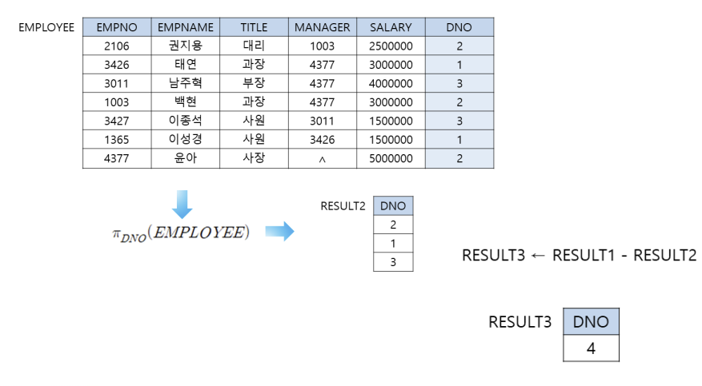
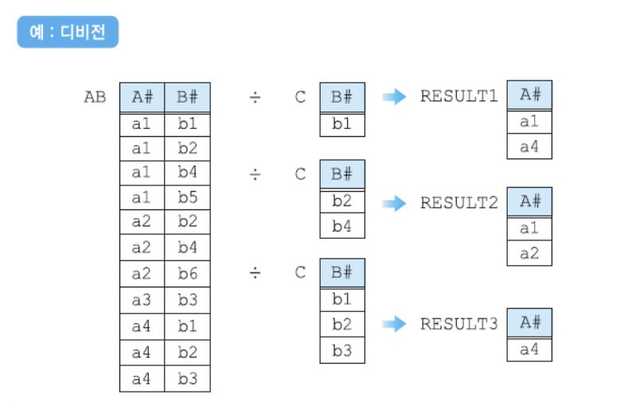

[toc]

# 관계대수

## 관계 데이터모델에서 지원되는 두 가지 정형적인 언어

* 관계 해석( realational calculus)
  * 원하는 데이터만 명시하고 질의를 어떻게 수행할 것인가는 명시하지 않는 선언적인 언어
* 관계 대수 (relational algebra)
* 
  * 어떻게 질의를 수행할 것인가를 명시하는 절차적 언어
  * 관계 대수는 사용 관계 DBMS들에서 널리 사용되는 SQL의 이론적인 기초
  * 관계 대수는 SQL을 구현하고 최적화하기 위해 DBMS의 내부 언어로서도 사용된다.
  * 기존의 릴레이션들로부터 새로운 릴레이션을 생성한다.
  * 릴레이션이나 관계 대수식(이것의 결과도 릴레이션이다.)에 연산자들을 적용하여 보다 복잡한 관계 대수식을 점차적으로 만들 수 있다.
  * 기본적인 연산자들의 집합으로 이루어진다.
  * 산술 연산자와 유사하게 단일 릴레이션이나 두 개의 릴레이션을 입력으로 받아 하나의 결과 릴레이션을 생성한다.
  * 결과 릴레이션은 또 다른 관계 연산자의 입력으로 사용될 수 있다.

* 

* 

* 셀렉션 연산자

* 

  * 한 릴레이션에서 실렉션 조건(selection condition)을 만족하는 투플들의 부분 집합을 생선한다.
  * 단항 연산자
  * 결과 릴레이션의 차수는 입력 릴레이션의 차수와 같다.
  * 결과 릴레이션의 카디날리티는 항상 원래 릴레이션의 카디날리티보다 작거나 같다.
  * 실렉션 조건을 프레디키트(predicate) 라고도 한다.
  * 실렉션 조건은 일반적으로 릴레이션의 임의의 애트리뷰트와 상수, = , <>. <=,< ,>=,> 등의 비교연산자, AND , OR, NOT 등의 부울 연산자를 포함할 수 있다.

  

* 프로젝션 연산자

* 

* 

  * 한 릴레이션의 애트리뷰트들의 부분 집합을 구한다.
  * 결과로 생성되는 릴레이션>애트리뷰트 리스트> 에 명시된 애트리뷰트들만 가진다.
  * 실렉션의 결과 릴레이션에는 중복 투플이 존재할 수 없지만, 프로젝션 연산의 결과 릴레이션에는 중복된 투플들이 존재할 수 있다.

* 집합 연산자 
  * 릴레이션이 투플들의 집합이기 때문에 기존의 집합 연산이 릴레이션에 적용된다.
  * 세가지 집합 연산자 : 합집합, 교집합, 차집합 연산자 
  * 집합 연산자의 입력으로 사용되는 두 개의 릴레이션은 합집합 호환(union compatible) 이어야 한다.
  * 이항 연산자

* 합집합 호환
* 
  * 두 릴레이션 R1(A1, A2, ...., An) 과 R2(B1, B2, ... Bm)이 합집합 호환일 필요 충분조건은 n=m이고, 모든 1<=i<=n에 대해 domain(Ai) = domain(Bi)

* 합집합 연산자
* 
* 
  * 두 릴레이션 R과 S의 합집합 R ∪ S는 R또는 S에 있거나 R과 S모두에 속한 투플들로 이루어진 릴레이션
  * 결과 릴레이션에서 중복된 투플들은 제외된다.
  * 결과 릴레이션의 차수는 R 또는 S의 차수와 같으며, 결과 릴레이션의 애트리뷰트 이름들은 R의 애트리뷰트들의 이름과 같거나 S의 애트리뷰트들의 이름과 같다. 

* 교집합 연산자

* 

* 

  * 두 릴레이션 R과 S의 교집합 R ∩ S는 R과 S 모두에 속한 투플들로 이루어진 릴레이션이다.
  * 결과 릴레이션의 차수는 R또는 S의 차수와 같으며, 결과 릴레이션의 애트리뷰트 이름들은 R의 애트리뷰트들의 이름과 같거나 S의 애트리뷰트들의 이름과같다.

  

* 차집합 연산자

* 

* 

  * 두 릴레이션 R과 S의 차집합 R-S는 R에는 속하지만 S에는 속하지 않은 투플들로 이루어진 릴레이션이다.
  * 결과 릴레이션의 차수는 R또는 S의 차수와 같아며, 결과 릴레이션의 애트리뷰트 이름들은 R의 애트리뷰트들의 이름과 같거나 S의 애트리뷰트들의 이름과 같다. 

  

* 카디션 곱 연산자

* 

  * 카디널리티가 i인 릴레이션R(A1, A2, ..., An) 과 카디날리티가 j인 릴레이션 S(B1,B2,..., Bm)의 카디션 곱 R x S 는 차수가 n+m 이고, 카디날리티가 i*j이고, 애트리뷰트가 A1, A2, ..., An, B1, B2, ..., Bm)이며, R과 S의 투플들의 모든 가능한 조합으로 이루어진 릴레이션이다.
  * 카디션 곱의 결과 릴레이션의 크기가 매우 클 수 있으며, 사용자가 실제로 원하는 것은 카티션 곱의 결과 릴레이션의 일부인 경우가 대부분이므로 카디션 곱 자체는 유용한 연산자가 아니다. 

* 관계 대수의 완전성
  *  실렉션, 프로젝션, 합집합, 차집합, 카티션 곱은 관계 대수의 필수적인 연산자
  * 다른 관계 연산자들은 필수적인 관계 연산자를 두 개이상 조합하여 표현할 수 있다.
  * 임의의 질의어가 적어도 필수저깅ㄴ 관계 대수 연산자들 만큼의 표현력을 갖고 있으면 관계적으로 완전(relationalyy complete)하다고 한다.

* 조인 연산자

  * 두 개의 릴레이션으로부터 연관된 투플들을 결합하는 연산자
  * 관계 데이터베이스에서 두 개 이상의 릴레이션들의 관계를 다루는데 매우 중요한 연산자
  * 세타 조인(theta join), 동등 조인(equijoin) , 자연 조인 (natural join), 외부 조인(outer join), 세미 조인 (semijoin) 

  

* 세타 조인과 동등 조인

* 

  *  두 릴레이션 R(A1, A2, ..., An)과 S(B1, B2, ..., Bm)의 세타 조인의 결과는 차수가 n+m이고, 애트리뷰트가 (A1, A2, ..., An, B1, B2, ..., Bm)이며, 조 인 조건을 만족하는 투플들로 이루어진 릴레이션
  * 세타는 {=, <>, <=, <, >=, >} 중의 하나
  * 동등 조인은 세타 조인 중에서 비교 연산자가 =인 조인

  

* 자연 조인

* 

  * 동등 조인의 결과 릴레이션에서 조인 애트리뷰트를 제외한 조인
  * 여러가지 조인 연산자들 중에서 가장 자주 사용된다.
  * 실제로 관계 데이터베이스에서 대부분의 질의는 실렉션, 프로젝션, 자연조인으로 표현가능하다.

  

* 디비전 연산자

* 

  * 차수가 n+m인 릴레이션 R(A1, A2, ..., An, B1, B2, ..., Bm)과 차수가 m인 릴레이션 S(B1, B2, ..., Bm)의 디비전 R ÷ S는 차수가 n이고, S에 속하는 모든 투플 u에 대하여 투플 tu(투플 t와 투플 u을 결합한 것)가 R에 존재하 는 투플 t들의 집합

* 관계대수 질의의 예시
* 

## 관계 대수의 한계점

* 관계 대수는 산술 연산을 할수 없다.
* 집단 함수(aggregate function)를 지원하지 않는다.
* 정렬을 타나낼 수 없다.
* 데이터베이스를 수정할 수 없다.
* 프로젝션 연산의 결과에 중복된 투플을 나타내느 것이 필요할 때가 있는데 이를 명시하지 못한다. 

*  SQL 
  * 상용 관계 DBMS들의 사실상의 표준 질의어인 SQL을 이해하고 사용할 수 있는 능력은 매우 중요하다.
  * 사용자는 SQL을 사용하여 관계 데이터베이스에 릴레이션을 정의하고, 관계데이터베이스에서 정보를 검색하고, 관계 데이터베이스를 갱신하며, 여러가지 무결성 제약조건을 명시할 수 있다.
