# 1. 뉴스 기사 관리 서비스 설계

### 이번 프로젝트 개요

* 지금까지 배운 내용을 종합해 간단한 뉴스 기사 관리 서비스를 단계별로 구현함
* 재활용 가능한 컨트롤러 구조 설계
* 데이터베이스 연동을 통한 모델 구현
* 부트 스트랩을 이용한 화면 구현
* 뉴스 기사 관리 웹 서비스란? 
  * 인터넷 포털, 신문사 등의 뉴스 기사를 제공하는 회사에서 웹 또는 모바일로 뉴스를 제공하기 위한 서비스 
  * 뉴스 DB에 새로운 뉴스를 등록, 조회, 삭제할 수 있으며 모든 조작은 웹 화면을 통해 이루어짐

### 구현할 내용

* 부트스트랩을 이용한 화면 구현
* 데이터베이스 연동
* 이미지 파일 첨부를 포함한 뉴스 등록
* 뉴스 목록에서 등록한 뉴스 확인
* 뉴스 에러 처리

### 프로젝트 구성요소

* 데이터베이스

  * 9장에서 설치한 H2 데이터베이스를 그대로 사용함 
  * 접속 모드: 네트워크 모드
  * 테이블명: news

*  모델

  * news 테이블과 연동해 데이터를 처리하기 위한 클래스
  * 컨트롤러 이외의 다른 자바 애플리케이션에서도 사용이 가능한 독립적 구조를 가짐
  * News.java: 뉴스 테이블 구조와 매핑되는 DO 클래스
  * NewsDAO.java: 뉴스 데이터 처리를 위한 DAO 클래스

  

* 뷰
  * 뉴스 등록, 목록, 보기, 삭제의 네 가지 기능을 제공하며, 화면은 2개로 구성됨
  * newsList.jsp: 뉴스 관리 메인 화면으로 목록을 보여주고 삭제와 등록을 위한UI 제공
  * newsView.jsp: 특정 뉴스를 선택했을 때 사진과 함께 기사 내용을 보여줌

* 컨트롤러

  * NewsController.java: 뉴스 관리 서비스 컨트롤러

  

  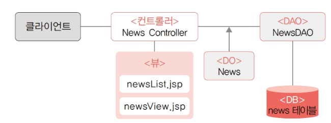

### 

# 2. 모델 구현

### 데이터베이스 생성

* 뉴스 기사 데이터베이스는 제목, 이미지, 내용, 등록 날짜와 시간으로 구성됨 
* H2를 실행하고 웹 콘솔로 로그인한 후에 테이블 생성 SQL을 작성하여 실행 
* ​    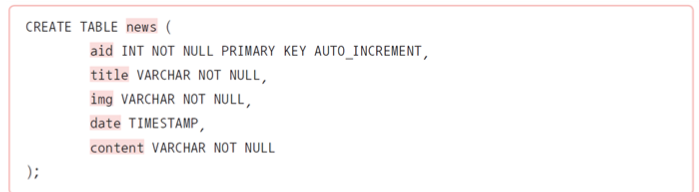
* 테이블의 이름: news
* aid: 기사 고유 아이디인 기본키(PK), 자동 증가 칼럼
* title: 기사 제목, 문자열
* img: 사진 경로, 문자열
* date: 등록 날짜와 시간, 타임스탬프 타입
* content: 기사 내용, 긴 텍스트

### News 클래스

* 뉴스 데이터 구조를 표현하기 위한 DO 클래스로, 테이블 구조와 일치해야 함
* 화면에 보이는 날짜/시간 정보를 처리하기 위해서는 Date 타입보다 문자열이 유리하므로 News 클래스에서는 날짜/시간 정보를 문자열로 처리함 
* 실제 데이터베이스 테이블에 저장되거나 검색할 때는 날짜 형식이 적용되도록 구현함
* 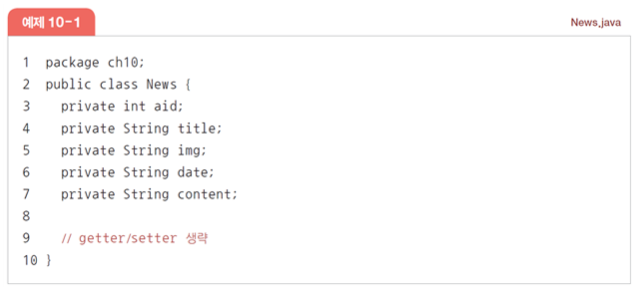

### NewsDAO 클래스

* news 테이블과 연동해서 뉴스 등록, 목록 가져오기, 삭제 기능을 제공하기 위한 DAO 클래스
* 기본 구현 기능 이외의 기능(수정, 검색 등)이 필요한 경우 DAO 클래스에 메서드를 추가해 사용함

### open( ) 메서드 구현

* 데이터베이스 연결을 위한 클래스 기본 구조 작성 
* JDBC 관련 패키지를 import할 때는 java.sql을 사용함
* 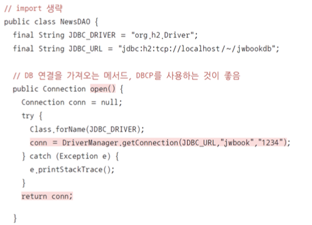

### addNews( ) 메서드 구현

* 뉴스를 추가하는 메서드 
* 인자로 DO 클래스인 News 타입을 받아 SQL을 완성해 실행하는 구조
* 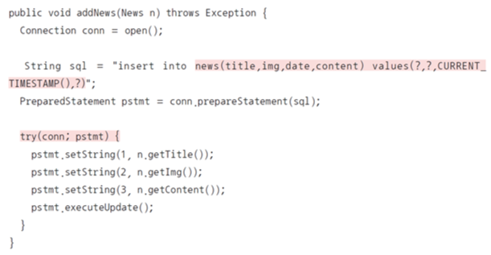
  * CURRENT_TIMESTAMP( )를 이용해 현재 날짜/시간 정보가 등록
  * try(conn; pstmt) 부분은 try-with-resource 기법이 적용된 부분으로 예외 발생 시 해당 리소스를 자동으로 close함

### getAll( ) 메서드 구현

* 뉴스 기사 목록 전체를 가지고 오기 위한 getAll( ) 메서드
* 뉴스 목록을 컨트롤러로 전달하기 위해 List 타입을 리턴
* 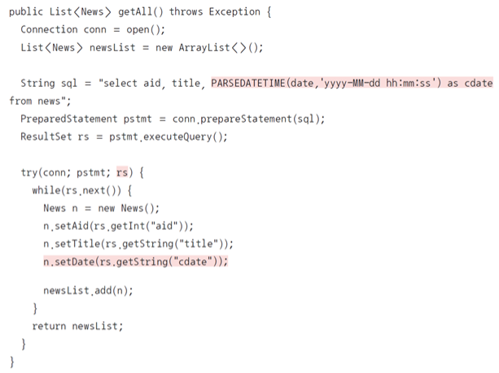

### getNews() 메소드 구현

* 뉴스 목록에서 뉴스를 선택했을 때 특정 뉴스 기사의 세부 내용을 보여주는 메서드
* 선택한 기사의 aid(PK)를 인자로 받아 News 타입을 리턴하며 모든 필드 항목을 포함
* getAll( )과 비슷한 구조이지만 검색 결과는 하나이기 때문에 ResultSet에서 next( ) 메서드는 한 번만 호출하고 데이터를 가지고 옴 
* 문제가 발생해 선택된 aid의 뉴스 기사가 없을 경우
  * if(rs.next( ) == null)인 경우 예외를 발생시킴
  * 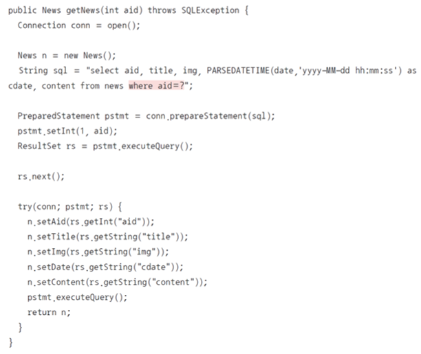

### delNews() 메소드 구현

* NewsDAO의 마지막 부분인 뉴스 삭제를 위한 delNews( ) 메서드
* 삭제할 뉴스의 aid를 받아 뉴스를 삭제함 
* 별도의 리턴은 없고, 실행 결과 삭제된 뉴스가 없는 경우 예외를 발생시킴
* 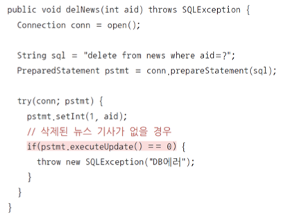

# 3. 컨트롤러 구현

### **init( )** **메서드 구현**

#### NewsController 서블릿 클래스 생성

* 서블릿 생성 메뉴 혹은 클래스 구현을 통한 서블릿 클래스 생성
* 컨트롤러 호출 url 매핑: ‘/news.nhn’으로 설정 
  * 네이버에서 사용하는 뉴스 기사 서비스와 유사하게 표현함
  * 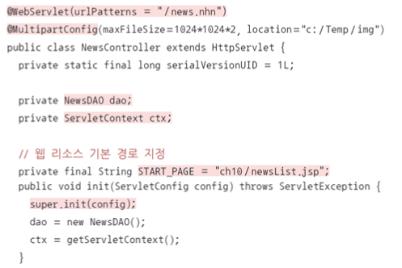

### **service( )** **메서드 구현**

#### ervice( ) 메서드의 기본 구조

* service( ) 메서드는 HttpServlet 클래스에 있는 메서드를 오버라이딩한 것으로 서블릿이 호출될 때마다 실행되는 메서드임
* 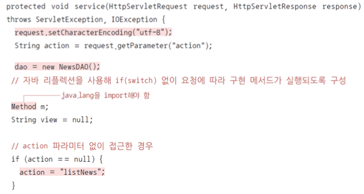

#### 자바 리플렉션으로 메서드 호출

* 자바 리플렉션을 이용해 action으로 전달된 이름의 메서드를 자동으로 호출함
* 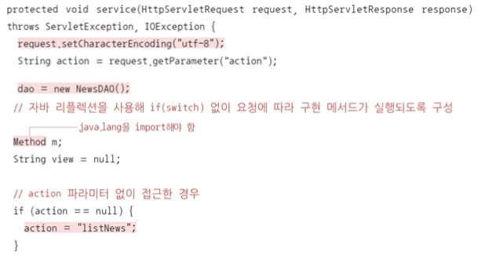

#### 뷰 이동

* 요청 처리 메서드를 호출한 다음 리턴된 뷰 페이지로 이동
* 앞에서 구현했던 것처럼 forward를 하면 되는데, post 요청을 forward로 처리하면 웹 브라우저를 새로 고침할 경우 이전 요청이 한 번 더 실행되는 문제가 있음
* 따라서 컨트롤러에서는 페이지 이동 시 포워딩과 리디렉션 모두 지원할 수 있어야 함
* 이때 일관된 방법으로 리디렉션을 지원하기 위한 별도의 규격화된 접근이 필요함
* 스프링 프레임워크에서는 return “redirect:/뷰 페이지 경로”와 같이 리턴하면 리디렉션이 이루어지는 구조를 제공함
  * 이번 컨트롤러에서도 동일한 규격을 지원하도록 다음과 같이 리턴에 따라 포워딩과 리디렉션이 구분되도록 함
  * 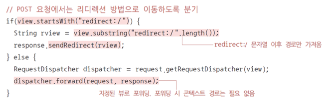

### addNews( ) 메서드 구현

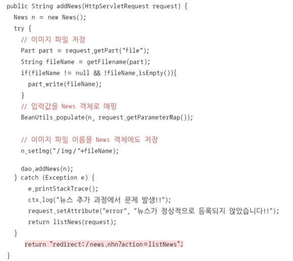

### getAll( ) 메서드 구현

* newsList.jsp에서 뉴스 목록을 보여주기 위한 요청을 처리하는 메서드 
* dao.getAll( ) 메서드를 호출해 목록을 가지고 온 다음 request에 저장하고 newsList.jsp로 포워딩되도록 리턴
* 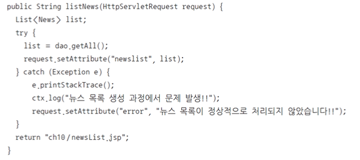

### getNews( ) 메서드 구현

* 특정 뉴스 기사를 클릭했을 때 호출하기 위한 요청을 처리하는 메서드 
* 기본적인 구조는 다른 요청 메서드와 동일함 
* 여기서는 선택한 뉴스의 aid 값을 파라미터에서 읽어와 dao.getNews( )에 전달함
* 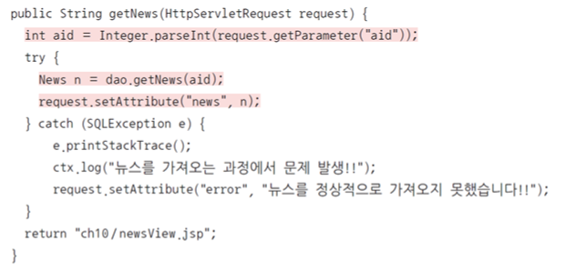
* 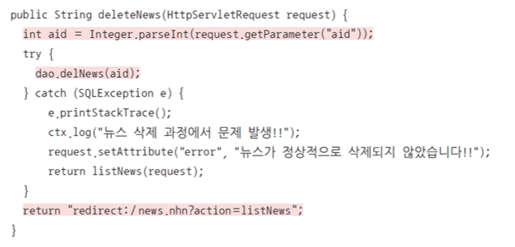

# 4. 뷰 구현

### newsList.jsp의 기본 구조

* 메인 화면으로 뉴스 목록을 보여주는 화면 
* [webapp]에 [ch10] 폴더를 생성하고 ‘newsList.jsp’를 만들기
*  생성된 ‘newsList.jsp’ 파일에 JSTL 사용을 위한 taglib 지시어를 추가하고 부트스트랩 css와 자바스크립트 라이브러리를 등록하기
* 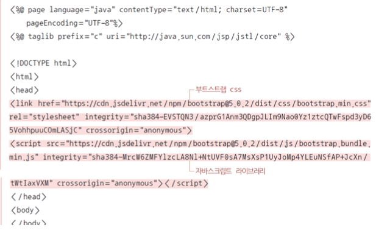

### 목록 출력

* 먼저 전체 화면 영역을 부트스트랩 컨테이너로 묶고 가로 크기를 75%로 지정함 
* 상단 마진 설정과 가운데 배치를 위해 mx-auto로 좌우 마진을 동일하게 설정함
* 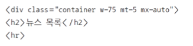
* 목록을 보여주는 부분은 <ul>, <li>를 이용하여 목록 형식으로 구성함
* <c:forEach>를 이용해 request에 저장된 newsList를 가져와 반복해서 출력함 
* 화면에 보이는 뉴스 번호는 실제 aid가 아니라 {status.count}를 이용해 순차 번호로 나타나게 함
* 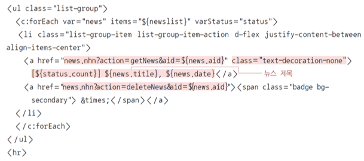

### 에러 출력부

* 뉴스 목록 아래 부분에는 에러 메시지를 출력하는 부분을 추가함 
* 다만 에러 메시지는 request에 “error”가 저장된 경우에만 보여야 하기 때문에 JSTL의 if 태그를 사용해 부트스트랩의 alert 컴포넌트로 출력함 
* 뉴스 삭제에서와 유사하게 삭제 버튼을 추가해 에러 메시지를 닫을 수 있도록 함
* 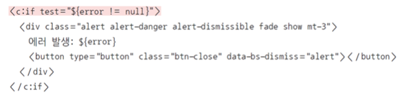

### 뉴스 등록 양식

* 뉴스를 등록하기 위한 버튼을 만들고 버튼을 눌렀을 때 입력 양식이 보이도록 함 
* 부트스트랩의 버튼과 Collapse 컴포넌트로 이벤트가 발생했을 때만 보이는 영역으로 구성 
* 버튼과 Collapse 컴포넌트는 data-bs-toggle, data-bs-target 속성으로 연결함
* 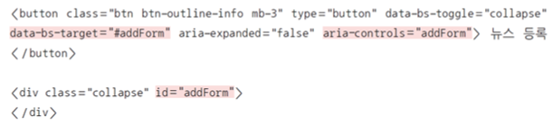
* Collapse 부분에 들어갈 입력 양식은 일반적인 html <form>으로 구현함 
* 부트스트랩의 form-label, form-control로 구성하고 입력 양식을 테두리가 있는 박스 형태로 만들기 위해 card를 적용
* <submit> 버튼을 클릭하면 <form>의 action에 지정된 url로 입력값이 전달됨 
  * 컨트롤러를 호출하면서 action 파라미터를 addNews로 전달함 
  * 또한 등록 양식이기 때문에 get이 아닌 post 방식을 사용함
* 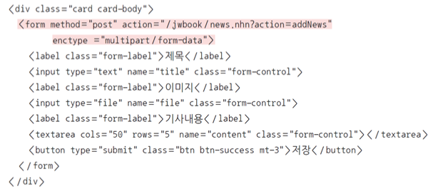

### newsView.jsp

* ‘newsList.jsp’에서 뉴스 제목을 클릭했을 때 뉴스를 보여주는 화면임 
* 기본 jsp 구조는 ‘newsList.jsp’와 동일함
* 여기서는 화면 구성과 관련된 부분만 설명함
* 뉴스 제목과 사진, 기사 내용, 등록 날짜/시간 등은 EL을 이용해 출력함 
* 박스 형태의 화면 구성을 위해 부트스트랩의 card, card-img-top, card-body, card-title, card-text 등을 활용함

# 5. 모든 코드 총 정리

### news.sql

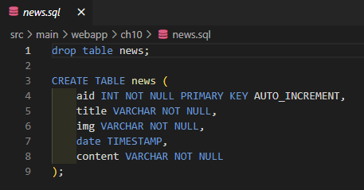

### newsList.jsp

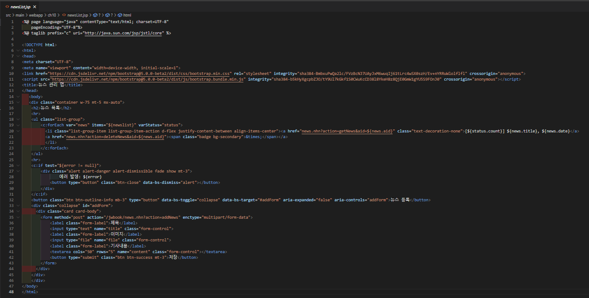

### newsView.jsp

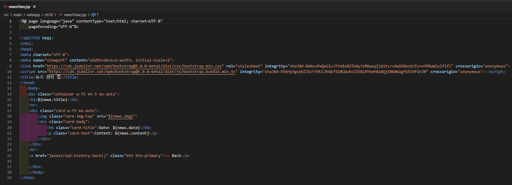

### news.java

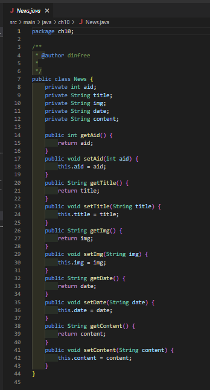

### NewsController.java

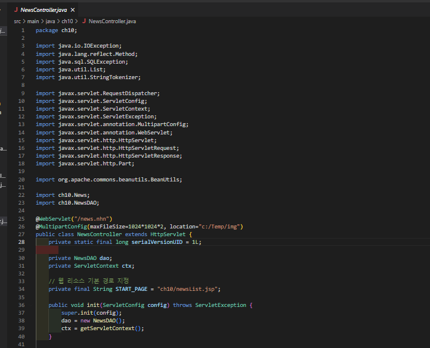

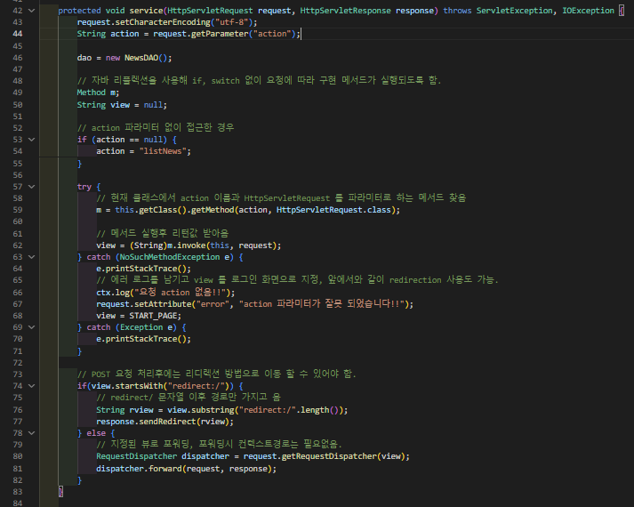

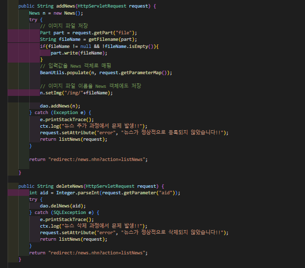

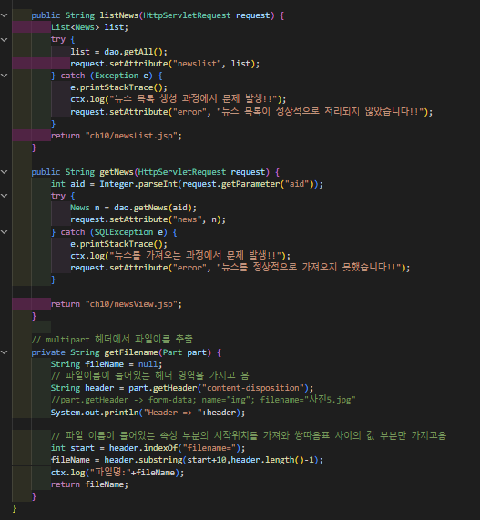

### NewsDAO.java

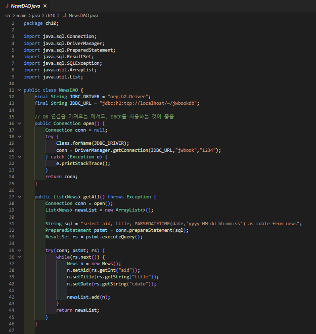

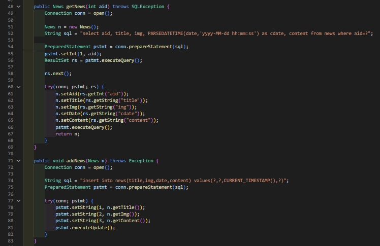

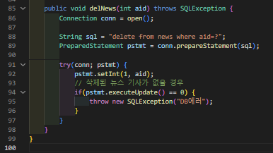