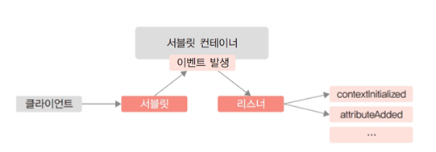
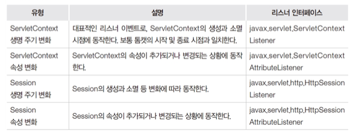
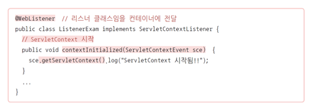
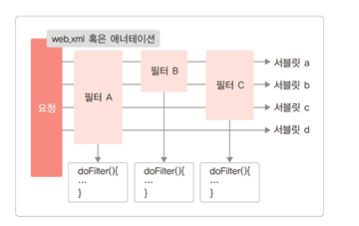
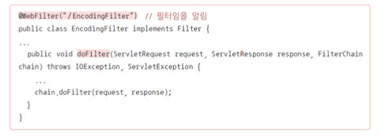
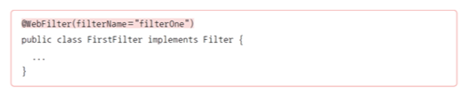
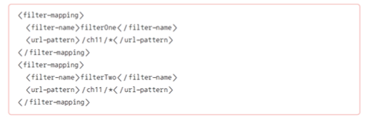
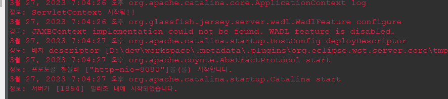
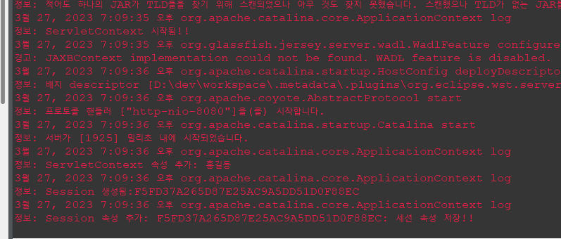
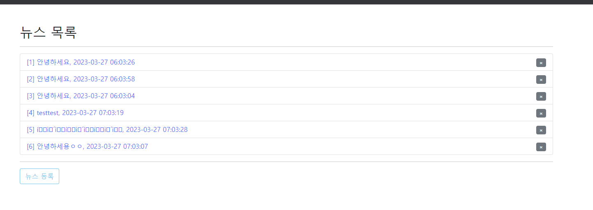

[toc]


# 1. 리스너(Listener)

* 컨테이너에서 발생하는 이벤트를 모니터링하다가 특정 이벤트가 발생하면 실행되는 특수한 서블릿으로, 이벤트 리스너(Event Listener) 라고도 함 
* 웹 애플리케이션 실행에 필요한 정보를 제공하거나 톰캣 시작/종료와 같은 특정 상황에 자동으로 동작하는 프로그램을 구현할 때 사용함
* 리스너는 서블릿과 마찬가지로 애너테이션 기반 코드로 작성할 수 있음
* 리스너는 일반적인 형태의 서블릿이 아니라 특정 이벤트에 따라 동작하는 인터페이스를 구현한 클래스라고 이해하면 쉬움 (관련된 인터페이스를 임플리먼트 해야한다.)
* 리스너가 동작하기 위한 이벤트의 종류와 그에 따른 프로그램 API를 알아야 함
* 이벤트가 발생하면 해당 이벤트를 처리해주는 애가 필요하다. 그 역할을 리스너가 실행한다.
* 쉽게 설명하면 항상 대기하면서 이벤트를 듣고있으면서 올바른 처리를 한다. 


### 리스너의 동작 구조

* 기본적으로 생명 주기 변화와 Scope Object에서 관리하는 속성의 변화를 모니터링하고 해당 이벤트가 발생하면 실행되는 구조임 
  * 예) ServletContext: 웹 애플리케이션 단위로 생성되는 객체로, 보통 톰캣의 시작과 종료와 일치하기 때문에 해당 시점에 실행을 원하는 프로그램이 있다면 리스너로 구현할 수 있음
* 


### 리스너의 대표적인 유형

* 초기화 매개변수와 연동
  * 톰캣이 시작될 때 ‘web.xml’의 ServletContext 초기화 매개변수를 읽어 그에 따라 특정 객체를 초기화한 후 서블릿이나 JSP에 제공함
* 예제 프로그램 등을 배포할 때 샘플 데이터 제공
  * 프로그램을 실행할 때 DB가 필요한 경우 미리 DB와 연결을 만들어두거나 테이블을 생성하고 샘플 데이터를 로딩하는 등의 작업을 자동으로 수행해서 추가적인 작업 없이 프로그램을 실행할 수 있음
* 복잡한 환경 설정 제공
  * 프로그램 실행에 필요한 여러 정보(DB, 다른 서비스 연동 정보, 관리자 계정 정보 등 프로그램 외부에서 변하는 정보를 주입하는 형태)가 고정되어 있지 않고 운영하는 서버 상황에 따라 변경되어야 하는 경우, 이를 파일로부터 읽어와 JSP 및 서블릿 등에 제공함
* 특정 이벤트에 동작하는 기능 구현
  * 웹 애플리케이션을 실행할 때 함께 동작해야 하는 외부 프로그램이나 서비스의 동작 유무를 확인하고 자동으로 실행할 수 있음

* 리스너의 종류
  * 


### 리스너 구현

* 리스너를 구현하기 위해서는 우선 [표 11-1]에서 설명한 리스너 인터페이스를 구현한 클래스를 만들어야 함 
* 애너테이션을 이용해 리스너임을 명시한 다음, 오버라이딩된 메서드 중에서 필요한 부분의 코드를 작성함
* 
  * 서블릿 컨텍스트는 서블릿이 처음 시작될때 실행된다. 


# 2. 필터(Filter)

* 서블릿 필터(Servlet Filter) 라고도 하며 리스너와 마찬가지로 웹 애플리케이션을 지원하기 위한 특수한 형태의 서블릿임 
* 클라이언트 요청에 따라 서블릿이나 JSP가 실행되기 전에 response 혹은 request 객체의 조작이나 추가적인 처리를 할 수 있음
* 필터는 기본적으로 특정 요청에만 동작하며, 여러 개의 필터가 정해진 순서에 따라 배치될 수 있는데 클라이언트 요청 처리 이전에 먼저 실행됨 


### 필터가 대표적으로 활용되는 분야

* 인증(Authentication)
  * 필터를 이용하면 애플리케이션 구조와 상관없이 기존 소스를 최대한 수정하지 않고 인증 기능을 수행하도록 할 수 있음
* 로깅/감사(Logging and Auditing)
  * 특정 페이지 또는 기능에 대해 사용 현황을 모니터링하고 로그로 관리할 필요가 있을 때 인증의 경우와 마찬가지로 필터를 통해 해당 요청을 수행하기 전 로깅 처리를 할 수 있음
* 국제화(Localization)
  * 다국어 처리는 프레임워크 등에서 제공하는 국제화 방법을 사용할 수도 있으며 필터를 이용할 경우 특정 페이지에 들어갈 메시지 등을 해당 언어로 변환해 전달할 수도 있음
* 한글 인코딩 처리(Encoding)
  * 필터를 통해 한 번에 한글 인코딩 처리하는 방법을 활용할 수 있음

* 스프링 시큐리티를 사용할때 필터를 많이 사용한다.


### 필터의 구조

* 리스너와 유사한 구조로, 필터는 톰캣 서버를 시작할 때 필터 구현 클래스의 애너테이션을 참조하여 javax.servlet.Filter 인터페이스를 구현한 클래스가 초기화됨 
* 필터는 여러 개 존재할 수 있으며, 각각의 필터는 init( ) 메서드를 통해 초기화 작업을 수행함
* init( )
  * 필터 초기화 시 한번만 실행됨. 이후 사용자 요청에 따라 서블릿이나 JSP가 호출될 때 애너테이션으로 설정된 필터 매핑 정보를 참조해 특정 서블릿이나 JSP에 대해 서로 다른 필터를 적용할 수 있음
* doFilter( ) 
  * 해당 필터가 적용되었을 때 수행할 작업을 구현하는 메인 메서드가 됨
* destroy( )
  * 필터가 종료될 때 수행할 내용을 구현함


### 필터의 동작 구조



* 필터 A: 모든 서블릿에 적용됨 
* 필터 B: 서블릿 a, b에 적용됨 
* 필터 C: 서블릿 a, b, c에 적용됨 
* 결과적으로 서블릿 a, b는 필터 A, B, C를 차례로 적용받음
* 필터의 적용은 각 필터의 doFilter( ) 메서드의 내용이 수행되는 것으로, ServletRequest와 ServletResponse의 내용을 가로채 필요한 작업을 수행하고 다음 필터로전달하거나, 요청한 서블릿으로 이동하는 구조임

**결국 request, response한 내용을 필터가 가로채셔 필터에 존재하는 코드적으로 처리후 다음 필터로 넘기거나 혹은 서블리스로 넘기는것**


### 필터 구현

* 리스너와 마찬가지로 이클립스에서 필터 생성 메뉴를 통해 손쉽게 생성하거나 javax.servlet.Filter 인터페이스를 구현하는 클래스를 직접 생성해도 됨
* @WebFilter 애너테이션을 사용해 필터임을 알리고 서블릿과 유사하게 필터 요청을 위한 url 매핑 정보를 인자로 추가해주어야 함
* 자동 생성되는 오버라이딩 메서드는 필요한 부분만 구현함 
  * 필터 자체의 생명 주기 메서드가 포함되어 있고, 실제로 필터가 동작할 때는 doFilter( ) 메서드가 호출됨




**여러 개의 필터 순서대로 적용하기**

* 여러 개의 필터를 차례대로 적용하려면 애너테이션만으로는 불가능함 
  * 애너테이션에 의한 필터 실행은 특정 url 매핑 조건에 따라 이루어지는 것으로 실행 순서를 조정할 수 없기 때문
* 만약 필터의 실행 순서를 지정하려면 ‘web.xml’ 파일에 필터를 등록하는 과정을 거쳐야 함
  * 이 경우 필터 서블릿의 @WebFilter에는 url 매핑 대신 filterName 속성이 들어가야 함



**web.xml에 필터를 등록하는 코드의 예시**

* web.xml이 잘못되면 서버가 정상적으로 동작하지 않을 수 있으므로 주의해야한다.
* 


# 3. [실습 11-1] 리스너 종합 실습


### ListenerExam.java

```java
package ch11;

import javax.servlet.ServletContextAttributeEvent;
import javax.servlet.ServletContextAttributeListener;
import javax.servlet.ServletContextEvent;
import javax.servlet.ServletContextListener;
import javax.servlet.annotation.WebListener;
import javax.servlet.http.HttpSessionAttributeListener;
import javax.servlet.http.HttpSessionBindingEvent;
import javax.servlet.http.HttpSessionEvent;
import javax.servlet.http.HttpSessionListener;

/**
 * Application Lifecycle Listener implementation class ServletContextListenerExam
 *
 */
@WebListener
public class ListenerExam implements ServletContextListener, ServletContextAttributeListener, HttpSessionListener, HttpSessionAttributeListener {

    // 리스너 생성자
    public ListenerExam() {
        // TODO Auto-generated constructor stub
    }

    // ServletContext 시작
    public void contextInitialized(ServletContextEvent sce)  { 
    	sce.getServletContext().log("ServletContext 시작됨!!");
    }

    // ServletContext 종료
    public void contextDestroyed(ServletContextEvent sce)  { 
    	sce.getServletContext().log("ServletContext 종료됨!!");
    }

    // ServletContext에 속성 추가
    public void attributeAdded(ServletContextAttributeEvent scae)  { 
    	scae.getServletContext().log("ServletContext 속성 추가: "+scae.getValue());
    }

    // ServletContext에 속성 대치
    public void attributeReplaced(ServletContextAttributeEvent scae)  { 
         // TODO Auto-generated method stub
    }        

    // ServletContext에서 속성 삭제
    public void attributeRemoved(ServletContextAttributeEvent scae)  { 
         // TODO Auto-generated method stub
    }

	/**
     * @see HttpSessionListener#sessionCreated(HttpSessionEvent)
     */
    public void sessionCreated(HttpSessionEvent se)  { 
    	se.getSession().getServletContext().log("Session 생성됨:"+se.getSession().getId());
    }

	/**
     * @see HttpSessionListener#sessionDestroyed(HttpSessionEvent)
     */
    public void sessionDestroyed(HttpSessionEvent se)  { 
        // TODO Auto-generated method stub
    }


	/**
     * @see HttpSessionAttributeListener#attributeAdded(HttpSessionBindingEvent)
     */
    public void attributeAdded(HttpSessionBindingEvent se)  { 
    	se.getSession().getServletContext().log("Session 속성 추가: "+se.getValue());
    }

	/**
     * @see HttpSessionAttributeListener#attributeRemoved(HttpSessionBindingEvent)
     */
    public void attributeRemoved(HttpSessionBindingEvent se)  { 
         // TODO Auto-generated method stub
    }

	/**
     * @see HttpSessionAttributeListener#attributeReplaced(HttpSessionBindingEvent)
     */
    public void attributeReplaced(HttpSessionBindingEvent se)  { 
         // TODO Auto-generated method stub
    }

}

```





### ListenerTestServlet.java

```java
package ch11;

import java.io.IOException;

import javax.servlet.ServletConfig;
import javax.servlet.ServletContext;
import javax.servlet.ServletException;
import javax.servlet.annotation.WebServlet;
import javax.servlet.http.HttpServlet;
import javax.servlet.http.HttpServletRequest;
import javax.servlet.http.HttpServletResponse;
import javax.servlet.http.HttpSession;

/**
 * Servlet implementation class ListenerTestServlet
 */
@WebServlet("/ListenerTestServlet")
public class ListenerTestServlet extends HttpServlet {
	private static final long serialVersionUID = 1L;
       
	ServletContext sc;
	
	public void init(ServletConfig config) throws ServletException {
		super.init(config);
		sc = getServletContext();		
	}
	
    /**
     * @see HttpServlet#HttpServlet()
     */
    public ListenerTestServlet() {
        super();
    }

	/**
	 * @see HttpServlet#doGet(HttpServletRequest request, HttpServletResponse response)
	 */
	protected void doGet(HttpServletRequest request, HttpServletResponse response) throws ServletException, IOException {
		sc.setAttribute("scName", "홍길동");
		HttpSession s = request.getSession();
		s.setAttribute("ssName", s.getId()+": 세션 속성 저장!!");
	}

	/**
	 * @see HttpServlet#doPost(HttpServletRequest request, HttpServletResponse response)
	 */
	protected void doPost(HttpServletRequest request, HttpServletResponse response) throws ServletException, IOException {
		// TODO Auto-generated method stub
		doGet(request, response);
	}

}

```




# 4. [실습 11-2] 필터 실습 : 한글 처리 필터 구현


### EncodingFilter

``` java
package ch11;

import java.io.IOException;
import javax.servlet.Filter;
import javax.servlet.FilterChain;
import javax.servlet.FilterConfig;
import javax.servlet.ServletException;
import javax.servlet.ServletRequest;
import javax.servlet.ServletResponse;
import javax.servlet.annotation.WebFilter;
import javax.servlet.http.HttpServletRequest;

/**
 * Servlet Filter implementation class EncodingFilter
 */
@WebFilter("*.nhn")
public class EncodingFilter implements Filter {

    /**
     * Default constructor. 
     */
    public EncodingFilter() {
        // TODO Auto-generated constructor stub
    }

	/**
	 * @see Filter#destroy()
	 */
	public void destroy() {
		// TODO Auto-generated method stub
	}

	/**
	 * @see Filter#doFilter(ServletRequest, ServletResponse, FilterChain)
	 */
	public void doFilter(ServletRequest request, ServletResponse response, FilterChain chain) throws IOException, ServletException {
		HttpServletRequest httpReq = (HttpServletRequest)request;

		if(httpReq.getMethod().equalsIgnoreCase("POST")) {
			request.setCharacterEncoding("utf-8");
		}
		chain.doFilter(request, response);
	}

	/**
	 * @see Filter#init(FilterConfig)
	 */
	public void init(FilterConfig fConfig) throws ServletException {
		// TODO Auto-generated method stub
	}

}

```


