# 1. REST API 개발


### REST(RESTFUL) API

* 2000년 로이 필딩Roy Fielding의 박사 학위 논문에서 처음 제안된 것으로, 네트워크상에서 클라이언트와 서버 사이의 통신을 구현하는 방법에 대한 아이디어임 
* 하나의 Resource는 여러 형태의 Representation(json, xml, text, rss 등)으로 전달할 수 있다는 개념을 의미함
* Representation
* 클라이언트가 서버로 요청을 보냈을 때 서버가 응답으로 보내주는 Resource(파일, 프로그램 호출 등)의 상태
* 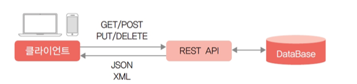
* 기존 JSP와의 차이점은 request ,response하는 방법도 다르다. 
* 특히 기존 JSP에서는 HTML형식으로 응답을 했는데 REST에서는 JSON 형식으로 응답을한다.
* 주소 기반으로 클래스 및 함수를 실행시키며 파라미터는 간결하게 넘긴다.


### REST 통신 방법

1. Post방식 

   * CRUD에서 C를 담당한다고 보면된다.
   * 사용자가 작성한 정보를 보낸다. (ex : 회원가입, 게시글 등록 ,댓글 등록 etc)

2. Get방식

   * CRUD에서 R을 담당한다.
   * 사용자가 조회하고 싶은걸 조회시켜준다 (ex : 개인정보, 게시글 리스트 etc)

3. Put 방식

   * CRUD에서 U를 담당한다.
   * 변경된 정보에 대해서 업데이트할때 사용한다.

4. DELETE 방식

   * CRUD에서 D를 담당한다.
   * 정보를 삭제할때 사용한다.

   

### REST API의 등장 배경

1. 클라이언트-서버 프로그램 구조의 문제점 등장

   * 동시 다중 접속에 대한 안정성, 보안, 백업, 장애 대응, 이중화 등 여러 기술적 문제를 자체적으로 해결할 수 있는 역량과 고수준의 개발자와 서버 엔지니어가 필요함

   * 클라이언트와의 통신을 위해 요청, 응답, 메시지 규격 등 프로토콜을 자체적으로 정의해야 함

   * 전용 프로토콜 사용으로 서비스 간 호환이 어려움


2. 웹을 사용하는 것으로 상당 부분 해결이 가능함

   * 웹은 오랜 기간 검증된 서버 소프트웨어를 통해 안정성, 보안, 백업 등의 모든 솔루션을 갖추고 있음

   * HTTP 프로토콜 사용으로 호환성 제공이 가능함

   * 자바, 서블릿 등 다양한 서버 측 프로그래밍 기술을 그대로 사용할 수 있음

3. 웹은 기본적으로 클라이언트 요청에 대한 응답으로 화면 중심의 HTML을 제공하는 시스템이기 때문에 단순히 데이터를 주고받고자 하는 서비스에는 적합하지 않음

​    

4. 이에 따라 확장성이 뛰어나고 경량의 데이터 구조라고 할 수 있는 JSON이 주목을 받기 시작함 
   * JSON(JavaScript Object Notation): 그 자체로 자바스크립트 객체 구조를 가지고 있어 웹 브라우저에서 바로 이해할 수 있고 처리 가능한 구조라는 특징이 있음

5. 이와 함께 RESTful 개념이 재조명되어 본격적으로 적용되기 시작해 지금의 프런트엔드 중심 개발을 이끌게 됨


* REST는 현재 HTTP와 JSON을 함께 사용하여 Open API를 구현하는 형태로 많이 사용됨 

* 대부분의 Open API는 REST 아키텍처를 기반으로 만들어져 있음 

* 일반적으로 REST 원칙을 따르는 시스템을 RESTful이라 하며 웹 기반으로 구현된 서비스이므로 RESTful 웹 서비스라고 이야기함

* open api가 rest 아키텍처 형식으로 이루어져있기 때문에 open api를 사용할때는 인증키와 http 주소를 맞춰서 알맞게 주소를 작성해서 요청을해야한다.

  


### RESTAPI SERVER 와 기존 SERVER


RESTful 서버와 비 RESTful 서버의 주요 차이점은 요청과 응답을 처리하는 방법입니다.

 RESTful 서버에서 서버는 URI를 통해 리소스를 노출하고 클라이언트는 HTTP 메서드(GET, POST, PUT, DELETE)를 사용하여 리소스에 대한 작업을 수행할 수 있습니다. 서버는 클라이언트 상태를 유지하지 않으며 응답은 일반 텍스트 또는 JSON 개체로 전송됩니다.


비 RESTful 서버에서 서버는 일반적으로 클라이언트 상태를 유지하고 클라이언트는 사용자 지정 프로토콜 또는 API를 사용하여 서버와 통신합니다. 서버는 클라이언트가 작업을 수행하기 위해 호출할 수 있는 일련의 메서드 또는 기능을 노출할 수 있으며 사용자 지정 프로토콜 또는 형식을 사용하여 응답을 보낼 수 있습니다.


결론적으로 RESTful 방식으로 서버를 구성할지 여부는 웹 애플리케이션의 특정 요구 사항에 따라 결정됩니다. RESTful 아키텍처는 많은 이점을 제공하지만 모든 애플리케이션에 최선의 선택은 아닐 수 있습니다. 이 결정을 내릴 때 애플리케이션의 복잡성, 데이터 모델 및 클라이언트와 서버 간의 상호 작용 유형을 고려하는 것이 중요합니다.


# 2. JAX-RS 개요

* REST 원칙을 사용하는 개발 메커니즘을 제공하는 자바 표준 API 
* JAX-RS는 서비스 측 REST 애플리케이션 개발을 단순화하는 인터페이스 및 Java 애너테이션의 집합체라고 볼 수 있음
* 스프링 프레임워크의 경우 
  * RestController라고 하는 자체 규격을 제공하며 필요에 따라 JAX-RS를 사용함 
  * 시스템 자체가 스프링 기반이라고 한다면 JAX-RS를 사용하는 것보다는 스프링의 RestController가 좀 더 편리함
  * 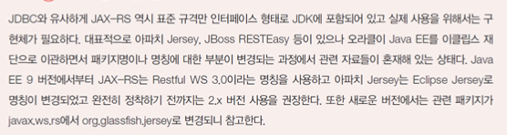

### JAX-RS(Java API for RESTful Web Services)의 등장 배경

* REST 서비스를 제공하기 위해서는 여러 HTTP Method(GET, POST, PUT 등)를 지원하면서 다양한 URI 요청을 처리할 수 있는 서버 프로그램 구조가 필요함 
* 단순히 서블릿만 이용해도 어느 정도 REST 형태의 서비스를 개발할 수 있지만 여러 URI 요청을 구조적으로 손쉽게 처리하려면 규격이 필요함 
* 자바에서는 JAX-RS라고 하는 표준 규격을 만들게 됨 


### JAX-RS 사용과정


#### API 서비스 등록하기

* 먼저 제공하려고 하는 API 서비스에 대한 정보를 컨테이너에 전달해야 함
* @Application 애너테이션을 사용해 어떤 시작 url을 사용할지 지정해야 하며 해당 요청에 대한 구현 클래스의 패키지를 등록해주어야 함
* 모든 REST API 요청이 /api로 시작하도록 지정하기
* 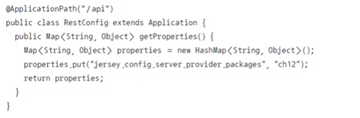
  * 주의할 점) RestConfig 클래스에서 속성으로 저장하는 패키지에 대해서만 REST API 클래스로 사용할 수 있음


#### API 클래스 구현하기

* API 클래스는 서블릿과 달리 별도의 클래스 상속 없이 일반 자바 클래스로 구현됨
* 클래스 앞부분에 @Path 애너테이션으로 하위 URI 시작점을 지정하고(선택 사항) 각각의 요청에 대한 처리를 담당하는 메서드를 구현하면 됨
* REST API 클래스 구현에 필요한 구성요소
  * **메서드**: GET, POST, PUT, DELETE 등 어떤 HTTP 메서드 요청을 처리할 것인지 지정함
  * **요청 경로**: 어떤 URI 요청에 동작할 것인지 지정함
  * **응답 콘텐트 타입**: 어떤 콘텐트 타입(text, html, json, xml 등)으로 응답 메시지를 구성할 것인지 지정함
  * **파라미터**: 클라이언트 요청 파라미터 및 경로 파라미터 값을 메서드에 전달함
* ‘REST API를 구성한다’는 것은 어떤 HTTP 메서드로 요청되는 특정 URI에 동작할 메서드를 구현하고, 요청 파라미터를 메서드에서 사용해 프로그램을 구현한 다음, 처리 결과를 어떤 형태로 전달할지 정의하는 과정을 의미함
* /api/addrbook/list 요청을 처리하는 API 클래스의 예시
  * 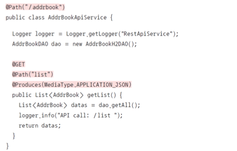

#### REST API 설계 원칙

* 동사 대신 명사 사용

  * 예) 전체 상품 목록을 제공하는 API의 경우 getProductList, getAll, getProducts와 같은 동사 형태보다는 products와 같은 명사 형태가 적합함

  ​    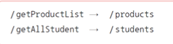

     

* 상태 변경 시 GET 메서드와 쿼리 파라미터 사용 금지
  * 수정, 삭제와 같이 데이터의 상태를 변경하는 경우 파라미터 형태가 아닌 HTTP 메서드와 경로 파라미터로 처리하는 것이 좋음

​    

​    

* 복수 명사 사용

  * 집합형 데이터를 다루는 API의 경우 단수형보다는 복수형을 사용하는 것이 좋음

    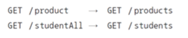

* 관계 형태 표현에 하위 리소스 사용

  * 예) 컴퓨터공학과 학생들 중 홍길동 학생을 찾는 경우

      

  

* 에러 정보 제공
  * 에러 발생 시 단순히 서버 에러 500만 표시하는 것이 아니라 여러 HTTP 상태 코드를 활용해야 하며, 별도의 에러 정보를 응답 메시지 구조에 포함할 수 있어야 함
    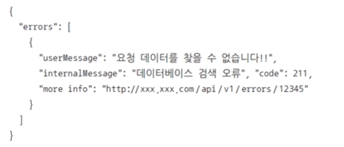


# 3. REST 클라이언트

* REST API를 사용하는 프로그램을 의미함 
* REST API 자체가 HTTP를 사용하기 때문에 HTTP를 지원하는 모든 프로그램은 REST API 클라이언트가 될 수 있음 
  * 예) 웹 브라우저도 서버와 HTTP로 통신하기 때문에 웹 브라우저로 REST API를 호출하는 것이 가능함. 
* REST 클라이언트 구현은 언어에 중립적이기 때문에 자바, 자바스크립트, 파이썬, C/C++ 등 거의 모든 언어를 사용할 수 있음 
* 다만 HTTP 프로토콜에 따라 통신할 수 있는 일종의 통신 프로그램을 구현해야 하고, 수신되는 JSON 메시지를 프로그램에 적합한 객체로 변환하는 작업 등이 요구됨
* 이를 바탕으로 서버를 HTTP 프로토콜에 따라 통신할 수 있는 언어를 채택후 서버를 만들면 어떤 view모델이든 상관없이 다 통신이 가능함.4


### 라이브러리 없이 구현

* 자바에 기본적으로 포함된 URLConnection 클래스를 사용할 수 있으나 코드가 많아지고 처리 과정이 복잡해짐

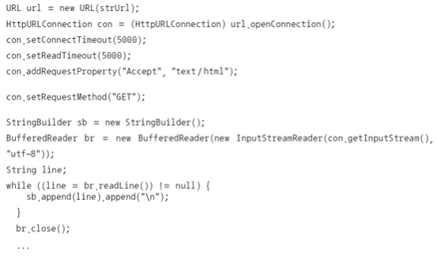


### 아파치 HttpCLient 라이브러리 사용

* 비교적 간결하게 코드를 작성할 수 있음


# 4. [실습 12-1] JAX-RS로 REST API 서버 구현

### RestConfig.java

``` js
package ch12;

import java.util.HashMap;
import java.util.Map;

import javax.ws.rs.ApplicationPath;
import javax.ws.rs.core.Application;

@ApplicationPath("/api")
public class RestConfig extends Application{	
    public Map<String, Object> getProperties() {
        Map<String, Object> properties = new HashMap<String, Object>();
        properties.put("jersey.config.server.provider.packages", "ch12");
        return properties;
    }
}
```


### RestApiExample

```java
package ch12;

import javax.ws.rs.GET;
import javax.ws.rs.POST;
import javax.ws.rs.Path;
import javax.ws.rs.Produces;
import javax.ws.rs.QueryParam;
import javax.ws.rs.core.MediaType;

@Path("/test")
public class RestApiExample {

	@GET
	@Produces(MediaType.TEXT_PLAIN)
	public String sayHello() {
		return "Hello API Service by ryuwonkyu";
	}
	
	@POST
	public String sayHello(@QueryParam("msg") String msg) {
		return msg+" API Service";
	}
}

//전체 요청 경로 : /jwbook/api/test
//동일 요청에 대해 get, post 요청을 구분해서 동작한다.
```


### 실습 결과


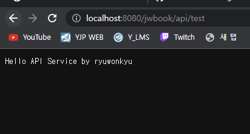


# 5. [실습 12-2] Postman으로 REST API 테스트 


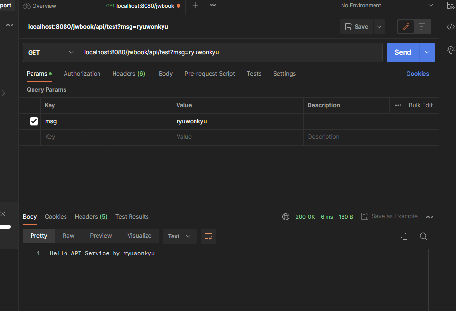

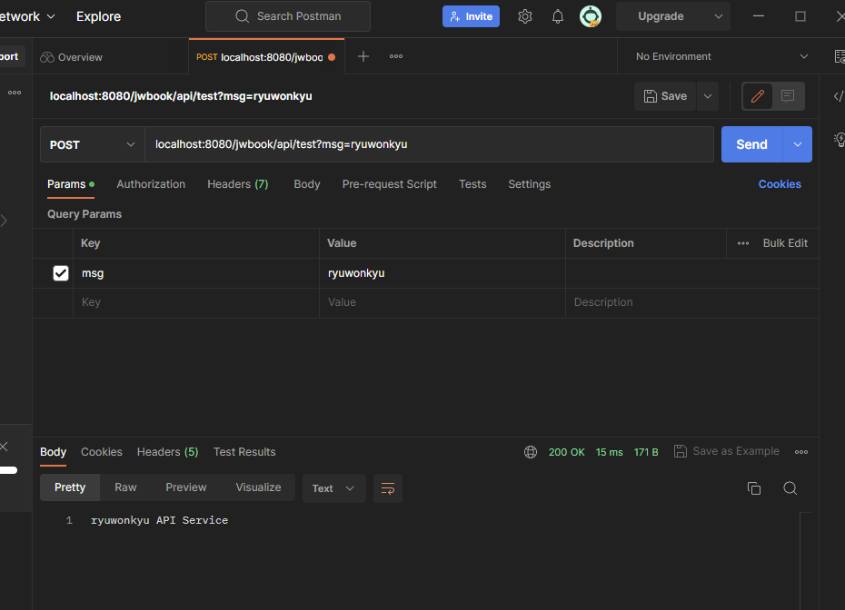


# 6. [실습 12-3] 뉴스 REST API 서버 구현


### NewsApiService

``` java
package ch12;

import java.sql.SQLException;
import java.util.List;

import javax.ws.rs.Consumes;
import javax.ws.rs.DELETE;
import javax.ws.rs.GET;
import javax.ws.rs.POST;
import javax.ws.rs.Path;
import javax.ws.rs.PathParam;
import javax.ws.rs.Produces;
import javax.ws.rs.core.MediaType;

import ch10.News;
import ch10.NewsDAO;

@Path("/news")
public class NewsApiService {
	NewsDAO dao;
	
	public NewsApiService() {
		dao = new NewsDAO();
	}
	
	// 뉴스 등록
	@POST
	@Consumes(MediaType.APPLICATION_JSON)
	public String addNews(News news) {
		try {
			dao.addNews(news);
		} catch (Exception e) {
			e.printStackTrace();
			return "News API: 뉴스 등록 실패!!";
		}
		return "News API: 뉴스 등록됨!!";
	}
	
	// 뉴스 삭제
	@DELETE
	@Path("{aid}")
	public String delNews(@PathParam("aid") int aid) {
		try {
			dao.delNews(aid);
		} catch (SQLException e) {
			e.printStackTrace();
			return "News API: 뉴스 삭제 실패!! - "+ aid;
		}
		return "News API: 뉴스 삭제됨!! - "+ aid;
	}
	
	// 뉴스 목록
	@GET
	@Produces(MediaType.APPLICATION_JSON)
	public List<News> getNewsList() {
		List<News> newsList = null;
		
		try {
			newsList = dao.getAll();
		} catch (Exception e) {
			e.printStackTrace();
		}
		
		return newsList;
	}
	
	// 뉴스 상세 정보
	@GET
	@Path("{aid}")
	@Produces(MediaType.APPLICATION_JSON)
	public News getNews(@PathParam("aid") int aid) {
		News news = null;
		
		try {
			news = dao.getNews(aid);
		} catch (SQLException e) {
			e.printStackTrace();
		}
		return news;
	}
}
```


 **localhost:8080/jwbook/api/news** 로 조회해보기

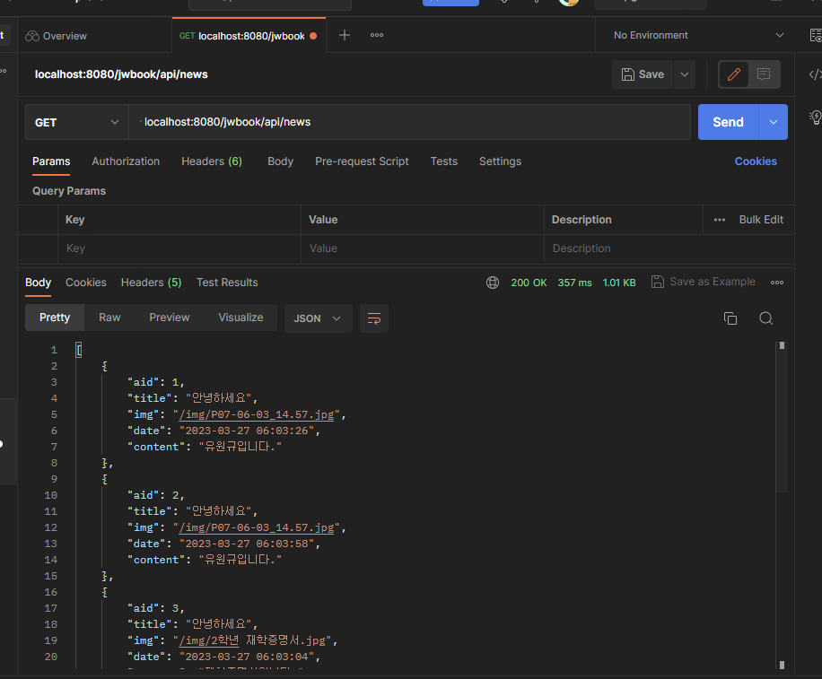


**Post로 Json형태 뉴스 등록하기**


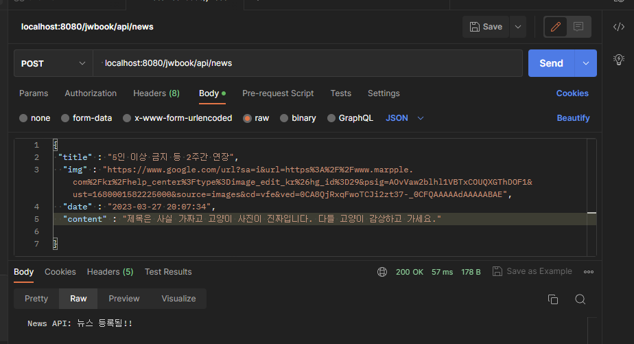


**등록한 뉴스 get방식으로 확인하기**

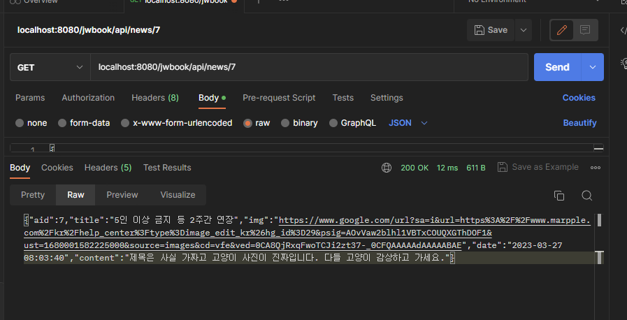


**Delete로 등록한 뉴스 삭제하기**

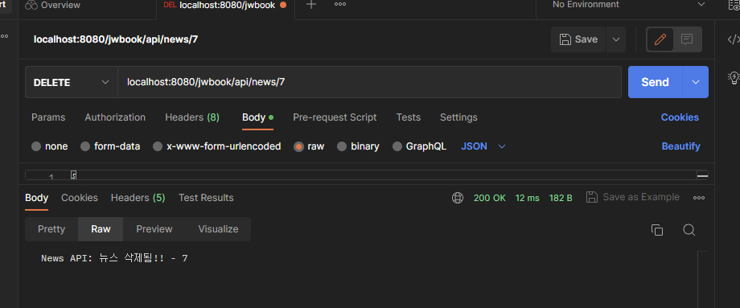