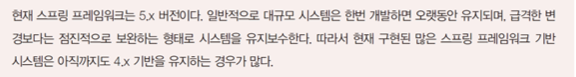
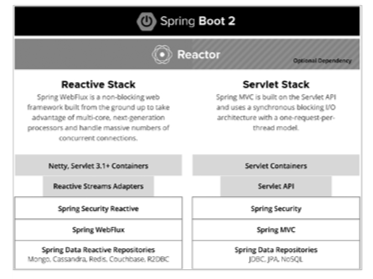
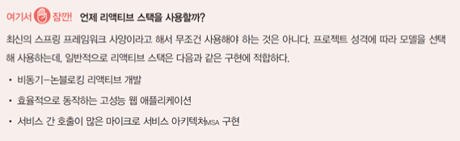
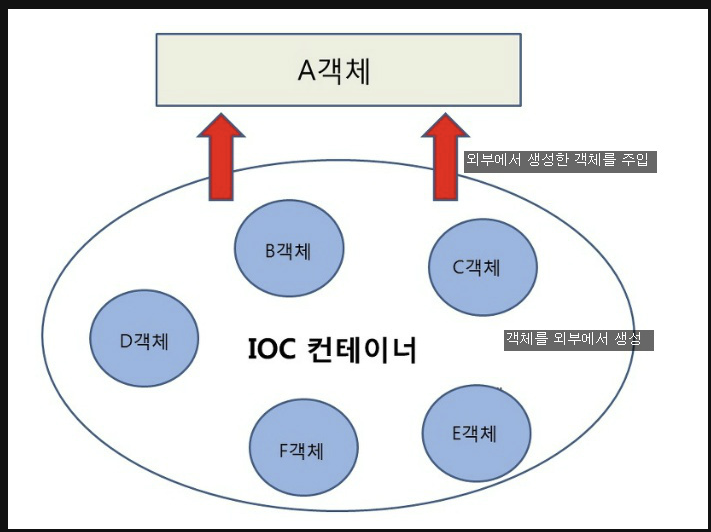
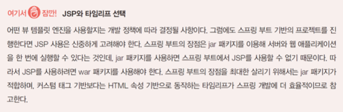

## 1. 스프링 프레임워크와 스프링 부트

### 스프링 프레임 워크

* 자바 기반의 오픈소스 프레임워크로 Java EE에서 요구하는 수준의 복잡한 기능을 Java EE를 사용하지 않고 구현하기 위해 시작됨
* 스프링 프레임워크는 높은 수준의 스프링 기반 애플리케이션을 손쉽게 만들어주는 스프링(spring.io) 프로젝트 중 하나로, 20개 이상의 서로 다른 모듈로 구성됨 
* 프로젝트 규모와 필요 기능에 따라 스프링 프레임워크를 기본으로 여러 모듈을 조합한 형태로 사용하게 됨

### 스프링 프레임워크의 주요 특징

* 경량 컨테이너
  * 객체 생성, 소멸과 같은 생명 주기를 관리하며 스프링 컨테이너로부터 필요한 객체를 얻어올 수 있음
* 제어의 역행 지원(IoC)
  * 메서드나 객체의 호출 제어권이 사용자가 아니라 프레임워크에 있어서 필요에 따라 스프링에서 사용자의 코드를 호출함
* 의존성 주입 지원(DI)
  * 각각의 계층이나 서비스 간에 의존성이 존재할 경우 프레임워크가 서로 연결해줌
* 관점 지향 프로그래밍 지원(Aop)
  * 트랜잭션이나 로깅, 보안과 같이 여러 모듈에서 공통적으로 사용하는 기능의 경우 해당 기능을 분리하여 관리할 수 있음

**의존성 주입 3가지 방법**

1. @Autowired 속성 - 속성에 @Autowired 애너테이션을 적용하여 객체를 주입하는 방식

2. 생성자 - 생성자를 작성하여 객체를 주입하는 방식 (권장하는 방식)

3. Setter - Setter 메서드를 작성하여 객체를 주입하는 방식 (메서드에 @Autowired 애너테이션 적용이 필요하다.)

### 스프링의 주요 프로젝트

* 스프링은 여러 서브 프로젝트로 구성되어 있으며, 각각의 프로젝트는 또 여러 모듈로 구성되어 있음
* 따라서 실제 개발에서는 세부 프로젝트의 모듈을 조합해 개발하게 됨
* 대표적인 스프링 프로젝트
  * **스프링 부트** : 보다 간편하게 스프링 프로젝트를 시작할 수 있도록 해주며, 특히 마이크로서비스 개발 및 웹 애플리케이션 개발에 적합함
  * **스프링 데이터** : 데이터베이스 연동을 위한 보다 편리한 개발을 지원함
  * **스프링 배치** : 대량의 데이터를 일괄 처리하기 위한 솔루션으로 대형 시스템에서 주로 사용함
  * **스프링 시큐리티** : 보안과 관련된 여러 기능을 통합 제공함
  * **스프링** **HATEOAS** : REST API에 대해 하이퍼 미디어 기반으로 서비스 정보를 제공하는 기능으로, API 구조 파악이나 테스트에 유용함

### 스프링 5.x 개선 사항 및 주요 버전

* 자바 11, 12 지원
* 리액티브 프로그래밍 지원
* 함수형 웹 프레임워크
* 코틀린 언어 지원
* 서블릿 3.1, JMS 2.0, JPA2.1, JAX-RS 2.0 등 API 버전 지원 개선
* 하이버네이트5, Jackson 2.6, Junit5 등 지원
* 아파치 톰캣, 제티, 네티, 언더토우 등 서버 지원
* 

### 스프링 부트

* 스프링 프레임워크 기반의 프로젝트를 빠르고 간편하게 시작할 수 있게 해줌
  * 스프링 부트는 스프링에 대한 전문적인 지식이 없어도 특정 목적의 개발환경과 프로젝트 구조를 자동으로 생성하고 바로 사용할 수 있도록 도와줌 
* 톰캣, 제티와 같은 WAS도 내장하고 있으며, 별도의 웹 서버 설치나 실행 없이 스프링 부트 애플리케이션을 실행하는 것으로 웹 애플리케이션의 구동이 가능함
  * 특히 최근 유행하고 있는 MSA 기반의 서비스 개발에 유용함
* 리액티브 스택(Reactive Stack)과 서블릿 스택(Servlet Stack)을 구분함

**스프링 부트 구조**

### 리액티브 스택(Reactive Stack)

* 새로운 비동기 논블로킹 I/O 구조를 사용하며 멀티코어 시스템의 장점을 살리고 대규모 사용자 접속을 처리하는 데 유용한 구조로 설계되어 있음 
* 또한 네티, 언더토우 및 서블릿 3.1 이상의 컨테이너를 사용하며 Spring WebFlux라고 하는 새로운 프레임워크를 사용해 개발됨 
* 물론 아파치 톰캣 8.5 이상도 사용할 수 있음 
* 기본적으로 NoSQL 데이터베이스와의 연동을 지원함

### 서블릿 스택(Servlet Stack)

* 기존과 같이 서블릿 API에 기반한 동기 방식의 블로킹 I/O 구조를 사용하며 하나의 요청은 하나의 스레드로 처리됨 
* 아파치 톰캣과 같은 서블릿 컨테이너를 사용하며, 전통적인 Spring MVC 기반의 서버 프로그램 개발과 JPA, JDBC, NoSQL 데이터베이스 지원을 포함함
* 기존 스프링 부트와 동일한 방식의 개발 모델과 API 구조로 이해하면 됨

### 리액티브 프로그래밍

* 변화에 반응하는 프로그램 모델로, 기본적으로 비동기 I/O 기반으로 데이터 흐름과 변화 전파에 중점을 둔 프로그래밍 패러다임을 말함 
* 리액티브 프로그래밍은 데이터의 흐름을 먼저 정의하고 데이터가 변경되었을 때 연관된 함수나 수식이 업데이트되는 방식
  * React, RxJava와 같이 최근 유행하는 각종 프레임워크와 라이브러리의 기본 철학임
* 최근 리액티브 프로그래밍이 주목 받는 이유 
  * 리액티브 프로그래밍 기법을 통해 개발의 효율을 높여줌 
  * 적은 스레드 개수로 더 많은 부하를 처리할 수 있음

## 2. IoC, DI, AOP

### IoC(Inversion Of Control)

* 우리말로 ‘제어의 역행’이라고 함 
* 기존의 프로그램: main( )처럼 프로그램이 시작되는 곳에서 필요한 객체를 생성하고, 생성된 객체의 메서드를 호출하는 흐름을 가짐 
* IoC : 작업을 수행하는 쪽에서 객체를 생성하는 일반적인 개념을 뒤집은 것으로, 프로그램 제어를 자신이 아닌 다른 곳에 위임함 
* 즉 컨테이너에 객체 생성과 공급을 위임하는 형태임

### IoC의 특징

* IoC에서는 객체가 자신이 사용할 객체를 생성하거나 선택하지 않음
* 객체는 자신이 어떻게 생성되고 어떻게 사용되는지 알 수 없음
* 모든 객체는 제어 권한을 위임받은 특별한 객체(컨테이너)에 의해 만들어지고 사용됨
* 스프링의 경우 
  * 스프링 컨테이너에서 객체를 생성하고 공급하는 역할을 담당함 
  * 스프링 빈(Spring Bean): 스프링 컨테이너에 의해 관리되는 스프링 객체를 말하는 것으로, 기본적으로 XML 기반의 설정 파일을 통해 객체와 관계를 정의하지만 지금은 주로 애너테이션을 통해 관련 설정을 함

### DI(Dependency Injection) 

* IoC를 시스템적으로 구현하는 방법으로 DI(Dependency Injection)와 DL(Dependency Lookup)이 있음 
* **DI** : 우리말로 ‘의존성 주입’이라 불림. 클래스 간의 의존관계를 Bean 설정에 기반해 컨테이너가 자동으로 연결해주는 방식 
* **DL** : 저장소에 저장되어 있는 Bean에 접근하기 위해 개발자가 컨테이너에서 제공하는 API를 이용해 Bean을 찾는 방식
* DL은 컨테이너에 대한 의존성이 커지고 불필요한 코드 사용이 증가하므로 DI 방식이 선호됨 
  * 스프링 프레임워크에서는 기본적으로 DI 방식을 사용함

### AOP(Aspect-Oriented Programming)

* ‘관점 지향 프로그래밍’이라고도 하며 스프링 프레임워크의 핵심 요소 중 하나임 
* AOP 자체를 학습하는 것 보다 핵심 개념을 정리하고 스프링 프레임워크 등을 활용해 실제 구현에 하나씩 적용해가면서 이해도를 높이는 것이 좋음
* 관점 지향 프로그래밍이란 횡단 관심사(Cross-cutting concern)의 분리를 허용함으로써 모듈성을 증가시키는 것이 목적임 
* 따라서 코드 자체를 수정하지 않는 대신 기존 코드에 추가 동작인 어드바이스 (Advise)를 정의하여 추가된 기능이 실행됨 
* 어느 코드가 포인트컷(Pointcut)([예] 특정 이름으로 시작하는 메서드)을 통해 수정되는지를 별도로 지정하는 구조를 가짐

### 실제 프로그램을 개발할 때 AOP가 적용되는 부분

* 예) 뉴스와 게시판 기능을 제공하는 서비스
  1. 뉴스와 게시판은 독립된 기능(모듈)임
  2. 두 모듈은 모두 사용자 인증을 통해 로그인 여부를 체크해야 함
  3. 어떤 뉴스 기사가 클릭되었는지 어떤 게시글이 클릭되었는지 로그를 기록해야 함
  4. 이때 모듈은 달라도 두 모듈은 사용자 인증과 로그를 처리하기 위한 코드가 구현되어야 함
  5. 이러한 구현의 추가는 코드에서 핵심 기능과 뒤섞이고 단순한 중복 코드를 생산함
  6. AOP는 핵심 기능과 횡단 관심사를 분리하고 코드를 일일이 구현하는 대신 어드바이스로 정의하고 코드의 특정 위치에 실행하기 위한 포인트컷을 정의함

# 스프링 프레임 워크 내용 정리 

### IOC 컨테이너란

* IOC 컨테이너는 IOC(Inversion of Control) 패턴을 따르는 모든 컨테이너에 대한 일반적인 용어입니다. 
* IOC 컨테이너는 개체를 만들고 종속성을 주입하고 해당 개체의 수명 주기를 관리하여 애플리케이션의 종속성을 관리하는 역할을 합니다.
* 다른프레임워크, 다른 언어에같은 패턴으로 만들 수 있습니다.

### Spring 컨테이너란

* IoC 패턴을 바탕으로 Spring 방식으로 나타낸 패턴을 Spinrg 컨테이너라고합니다.

* Spring 컨테이너는 Spring Bean의 수명 주기를 관리하는 컨테이너입니다. 
* Spring 애플리케이션의 백본을 구성하는 개체를 생성, 구성 및 관리하는 역할을 합니다. 
* 생성에서 소멸까지 수명 주기 동안 이러한 객체를 관리하는 일관된 수단을 제공합니다. Spring 컨테이너는 IOC(Inversion of Control) 원칙을 구현한 것입니다.

### 경량 컨테이너란

* 경량 컨테이너는 스프링 프레임워크에서 사용하는 IoC 컨테이너 중 하나로, 간단하고 가벼운 기능만을 제공합니다.
*  스프링의 ApplicationContext와 달리 경량 컨테이너는 매우 간단한 객체 생성과 의존성 주입 기능만을 제공합니다. 
* 예를 들어, 스프링의 IoC 컨테이너를 사용하지 않고 Servlet 기반 애플리케이션에서 사용할 수 있는 Google Guice와 같은 프레임워크도 경량 컨테이너에 속합니다.

* 스프링 Ioc 컨테이너가  Spring bean을 관리합니다.
* 스프링 Ioc 컨테이너가 관리하는 bean들 간에 의존관계를 컨테이너가 자동으로 생성하고 주입을 해줍니다.
* 기존에 bean을 사용하기 위해서는 new 생성자를 이용하거나 혹은 getter(), setter()를 사용해야 하지만 스프링 Ioc컨테이너가 spring bean을 관리함으로 써 그럴 필요성이 없어졌습니다.

## 3. WebMv와 RestController 모듈

### 스프링 WebMVC

* MVC 기반 웹 애플리케이션 개발과 구조적으로 거의 동일함 
* 특히 컨트롤러 부분을 제외하면 모델과 뷰는 기존의 코드를 그대로 사용할 수 있을 만큼 유연한 구조를 가짐

​    

### 컨트롤러

* 스프링을 사용하면 컨트롤러를 직접 구현할 필요 없이 특정 요청에 대한 처리 메서드만 작성하면 됨 
* 따라서 불필요한 중복 구현을 하지 않아도 되며, 개발자가 보다 나은 컨트롤러 구조를 만들기 위해 고민할 필요가 없음

### 모델

* 모델 부분은 기존 코드를 그대로 사용할 수 있음 
* 스프링의 JDBCTemplate을 사용해 코드를 간결하게 개선할 수도 있음 
* Spring Data JPA를 적용하면 데이터베이스와 관련된 코드의 많은 부분을 스프링에 넘길 수 있어 보다 간편하게 데이터베이스 관련 작업도 처리할 수 있음

###    뷰 

* JSP를 그대로 사용할 수 있음 
* EL과 JSTL 기반이라면 구조적으로도 나쁘지 않기 때문에 많은 경우 JSP를 뷰로 사용하고 있음 
* 웹 페이지 자체의 독립적 개발이나 테스트 등이 어려워지는 문제가 존재함 
* 최근에는 클라이언트 렌더링 중심의 프런트엔드 기반 개발도 확대되며, REST 기반 개발이 보편화되면서 JSP의 사용이 예전만큼 필수적인 요소는 아님

### 뷰 - 스프링 프레임워크의 경우 

* 자바 기반 프레임워크이지만 JSP에 대한 종속은 없음 
* 타임리프(Thymeleaf), JSP, 프리마커(FreeMarker) 등 다양한 템플릿 엔진과의 연동을 지원함
  * JSP 사용은 별도의 설정이 필요하지만 타임리프의 경우 ‘pom.xml’에 추가만 하면 바로 사용할 수 있음

