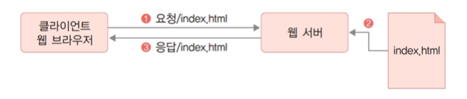
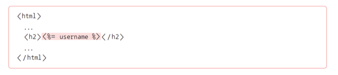
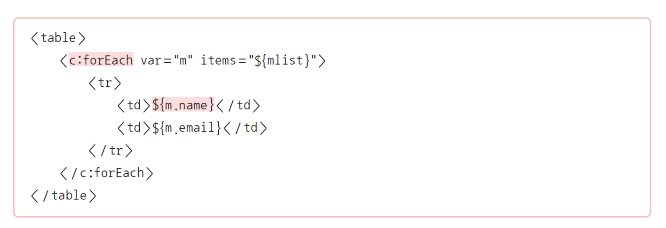
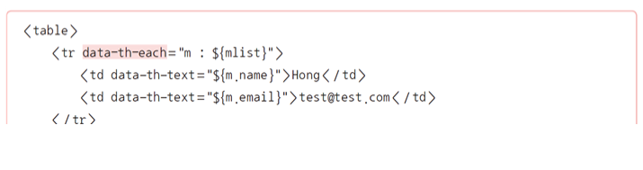
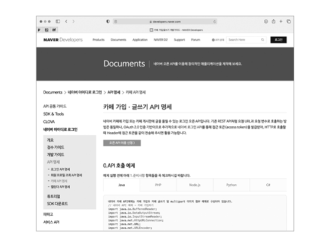
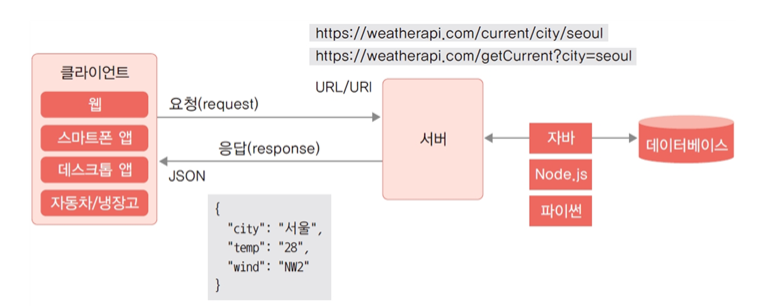
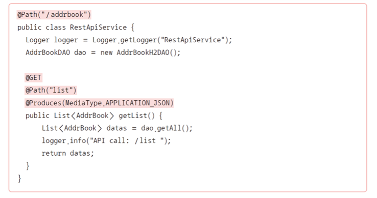
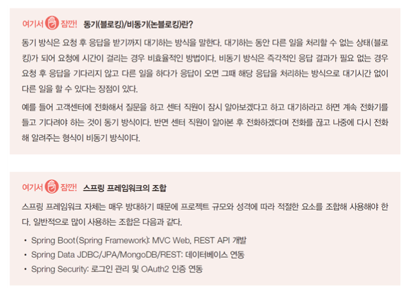

# 1. 서블릿과 JSP

### 서블릿

* 자바 기반의 웹 프로그램 개발을 위해 만들어진 기술
* 자바로 작성된 프로그램을 실행할 수 있는 서버 소프트웨어(톰캣)를 통해 관리됨 
* 서블릿을 실행하기 위해서는 톰캣과 같은 서블릿 컨테이너가 필요함 
* 이러한 서버 소프트웨어는 일반적으로 WAS(Web Application Server)로 불리기도 함
* 기본적인 웹의 요청과 응답 과정

* 서블릿의 역할

  

### JSP의 등장 배경

* 서블릿은 HTML과 데이터를 조합하는 방식에 어려움이 있음
  * 

* 이를 해결하기 위해 JSP가 등장

### JSP(Java Server Pages)

* 서블릿에서 HTML과 데이터 결합을 손쉽게 처리하기 위해 만들어짐 

* HTML에서 자바 코드를 사용할 수 있는 구조

  * 따라서 JSP는 HTML에 자바 코드를 더한 형태로 구성되며, 컨테이너에 의해 서블릿 형태의 자바 코드로 변환 후 컴파일되어 컨테이너에 적재되는 구조가 됨

  ​    

* JSP 문법 자체는 page 지시어 선언 부분을 제외하면 HTML 파일 구조와 동일함
* CSS, 자바스크립트 사용 형식 또한 동일함

### JSP의 문제점

* 데이터를 반복해서 출력하거나 조건을 체크해야 하는 경우 단순한 HTML 문법만으로는 처리할 수 없기 때문에 자바 코드를 중간중간 사용해야 함

* 

  ​    

* HTML 부분은 서블릿 컨테이너(톰캣)에 의해 out.println( )을 사용하는 형태로 변환됨
* 따라서 JSP는 HTML이 아니라 서블릿 형태의 프로그램으로 변환되는 것임

### JSTL/EL

* JSP의 구조적 문제를 해결하기 위해 커스텀 태그를 기반으로 하는 JSTL(JSP Standard Tag Library) 및 EL(Expression Language)이 도입됨
* JSP보다 훨씬 구조적이고 가독성도 높음 
* MVC 패턴과 함께 서블릿과 결합되어 자바 웹 개발의 정석으로 자리 잡아옴

### JSP 대체 솔루션

* JSP의 주된 대체 솔루션인 스프링 프레임워크와 Vue.js에서 사용하는 형식
* 스프링 프레임워크의 기본 템플릿 엔진인 타임리프를 사용하는 경우
  * JSP와 EL 부분은 동일하지만 JSTL 대신 HTML 태그에 data-*- 속성을 사용하기 때문에 서버 실행 없이도 디자인 확인함

* JSP의 주된 대체 솔루션인 스프링 프레임워크와 Vue.js에서 사용하는 형식
* Vue.js를 이용한 클라이언트 사이드 렌더링(CSR)을 사용하는 경우
  * 타임리프와 유사하게 v-* 형태의 속성을 사용함 
  * 프런트엔드 방식이기 때문에 해당 속성은 자바스크립트로 동작하는 Vue.js에서 처리함

# 2. REST API와 JAX-RS

### REST(REpresentational State Transfer)

* 네트워크상에서 클라이언트와 서버 사이의 통신을 구현하는 방법 중 하나
* 대부분의 Open API는 REST 아키텍처를 기반으로 만들어져 있음

* 서버 응답을 앞에서 언급한 다양한 형태로 전달하는 개념임
  * HTTP의 기본 응답이 HTML인데 이를 JSON 등 다른 규격을 사용하는 것으로 접근함
  * 이에 따라 웹을 단순히 브라우저에서 콘텐츠를 이용하는 브라우저 서비스가 아닌 데이터를 주고받기 위한 API 서비스의 형태로 발전시킨 계기가 됨
* 안정되고 검증된 웹 기술을 그대로 사용할 수 있음
* 성능, 안정성, 보안, 백업, 분산 등 여러 인프라의 재활용이 가능함

### REST API의 동작구조

### 자바 웹 개발에서 REST API를 구현하는 방법

* JAX-RS 사용
  * 자바에서 REST API 개발을 위한 서버 프로그램의 표준 규격
    * 
* 스프링 프레임워크의 RestController 사용
  * 스프링 프레임워크 없이 개발한다면 JAX-RS를 사용함 
  * 스프링 프레임워크를 사용한다면 두 방법 중 한 가지를 선택해서 사용할 수 있음
  * 호환성을 위해서라면 JAX-RS를 사용하는 것이 좋음 
  * 스프링만 사용한다면 스프링의 RestController를 사용하는 것이 편리함
  * REST API만 스프링 프레임워크를 사용하는 경우
    * 

# 3.스프링 프레임워크와 자바 웹 개발

### 스프링 프레임워크(Spring Framework)

* 자바 기반의 오픈소스 프레임워크 
* Java EE에서 요구하는 수준의 복잡한 기능을 Java EE를 사용하지 않고 구현하고자 시작됨

​    

### 스프링 프레임워크의 특징

* 경량 컨테이너
  * 객체 생성, 소멸과 같은 생명 주기를 관리하며 스프링 컨테이너로부터 필요한 객체를 얻어 올 수 있음
* 제어의 역행(Inversion of Control, IoC) 지원
  * 메서드나 객체의 호출 제어권이 사용자가 아닌 프레임워크에 있어 필요에 따라 스프링에서 사용자의 코드를 호출함
* 의존성 주입(Dependency Injection, DI) 지원
  * 각 계층이나 서비스 간에 의존성이 존재할 경우 프레임워크가 서로 연결해줌
* 관점 지향 프로그래밍(Aspect-Oriented Programming, AOP) 지원
  * 트랜잭션이나 로깅, 보안과 같이 여러 모듈에서 공통적으로 사용하는 기능의 경우 해당 기능을 분리하여 관리할 수 있음

### 스프링 부트(Spring Boot)

* 스프링 프레임워크 프로젝트를 손쉽게 시작할 수 있도록 하며 개발과 관련한 스프링 구성요소를 편하게 관리할 수 있도록 함
* 2021년의 최신 스프링 프레임워크는 5.x로 핵심 프레임워크 외에 여러 서브 프로젝트로 구성되어 있으며 실제 사용은 주로 스프링 부트를 통해 이루어짐 
* 스프링 부트 2에서는 리액티브 스택(Reactive Stack)과 서블릿 스택(Servlet Stack)을 구분하고 있음

### 서블릿 스택(Servlet Stack)

* 기존과 같이 서블릿 API에 기반한 동기 방식의 블로킹(Blocking I/O) 구조를 사용하며 하나의 요청은 하나의 스레드로 처리됨 

* 아파치 톰캣과 같은 서블릿 컨테이너를 사용하며 전통적인 Spring MVC 기반의 서버 프로그램 개발과 JPA, JDBC, NoSQL 데이터베이스 지원을 포함함

  ​    

### 리액티브 스택(Reactive Stack)

* 새로운 비동기 논블로킹(Non-blocking I/O) 구조를 사용하며, 멀티코어 시스템의 장점을 살리고 대규모 사용자 접속을 처리하는 데 유용한 구조로 설계됨 
* 네티(Netty), 언더토우(Undertow) 및 서블릿 3.1 이상의 컨테이너를 사용하며 Spring WebFlux라고 하는 새로운 프레임워크를 사용해 개발함
* 최신 스프링 프레임워크의 사양이라고 해서 무조건 사용해야 하는 것은 아니고 필요에 따라 모델을 선택해 사용할 수 있음

### 리액티브 스택에 적합한 경우

* 비동기 논블로킹 리액티브 개발
* 효율적으로 동작하는 고성능 웹 애플리케이션
* 서비스 간 호출이 많은 마이크로 서비스 아키텍처MSA 구현
* 

