# 1. 서블릿의 개요

### 서블릿의 동작 과정

* 서블릿 코드 작성, 컨테이너 등록, 클라이언트 요청에 따른 동작 과정

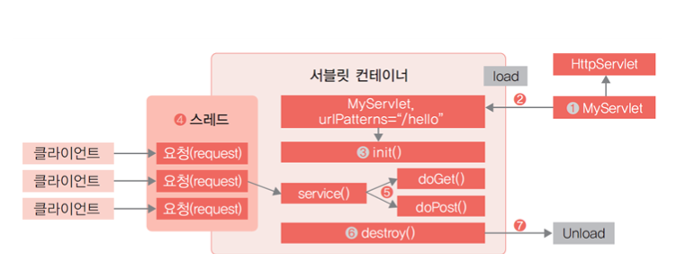

### 서블릿의 장점

* 자바를 기반으로 하므로 자바 API를 모두 사용할 수 있음
* 운영체제나 하드웨어의 영향을 받지 않으므로, 한번 개발된 애플리케이션은 다양한 서버 환경에서도 실행할 수 있음
* 웹 애플리케이션에서 효율적인 자료 공유 방법을 제공함
* 다양한 오픈소스 라이브러리와 개발도구를 활용할 수 있음

### 서블릿의 단점

* HTML 응답을 위해서는 출력문으로 문자열 결합을 사용해야 함
* 서블릿에서 HTML을 포함할 경우 화면 수정이 어려움
* HTML 폼 Form의 데이터 처리가 불편함
* 기본적으로 단일 요청과 응답을 처리하는 구조로 다양한 경로의 URL 접근을 하나의 클래스에서 처리하기 어려움

### 실제 자바 웹 개발에서의 서블릿 조합

* 화면 구성을 위해 JSP와 같은 템플릿 엔진을 사용
* REST API 구현을 위해서는 JAX-RS를 사용함
* 복잡한 서비스 구현을 위해 프런트 컨트롤러 모델 등을 사용함

# 2. 서블릿 클래스 구조와 생명 주기

### 서블릿 클래스의 구조

* 서블릿 자체는 자바로 구현하지만 서블릿 컨테이너에 해당 클래스가 서블릿임을 알려야 하며, 어떤 URL 접근에 실행해야 하는지 등록하는 과정이 필요함
* 서블릿 2.0 
  * 웹 애플리케이션 구조를 컨테이너에 알려주기 위한 배포 서술자 web.xml에 등록해야 함 
* 서블릿 3.0 
  * 별도의 web.xml 작성 없이 자바 애너테이션을 이용함

* javax.servlet.Servlet 인터페이스를 구현한 추상 클래스인 GenericServlet 클래스와 HttpServlet 클래스 중 하나를 상속해 구현함
  * HTTP 프로토콜에 최적화되어 있는 HttpServlet 클래스를 상속해 구현하는 것이 좋음 
* HttpServlet을 상속받아 doGet( ), doPost( ) 메서드를 오버라이딩한 구조

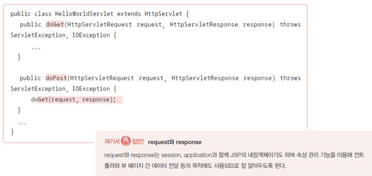

### HttpServletRequest

* HTTP 프로토콜의 request 정보를 서블릿에 전달하기 위한 목적으로 사용함 
  * 이때 사용하는 클래스에는 헤더 정보, 파라미터, 쿠키, URL, URI 등의 정보를 읽어 들이는 메서드와 HTTP Body의 Stream을 읽어 들이는 메서드를 가지고 있음 
* 서블릿 컨테이너에서 생성되고 클라이언트 요청이 doGet( ), doPost( )로 전달될 때 인자로 함께 전달됨
* 서블릿에서 클라이언트와 연결해 처리할 작업은 모두 HttpServletRequest를 통해야 함

### HttpServletRequest의 주요 메서드

### HttpServletResponse

* HttpServletRequest와 마찬가지로 클라이언트와 연결된 처리가 가능함
* 다만 클라이언트에서 서버로 전달하는 것과 관련된 것이 아니라 서버에서 클라이언트로 전달하려는 목적을 위한 기능으로 구성됨
* 서블릿 컨테이너는 요청 클라이언트에 응답을 보내기 위한 HttpServletResponse 객체를 생성하여 서블릿에 전달함 
* 서블릿은 해당 객체를 이용하여 content type, 응답 코드, 응답 메시지 등을 전송할 수 있음

### HttpServletResponse의 주요 메서드

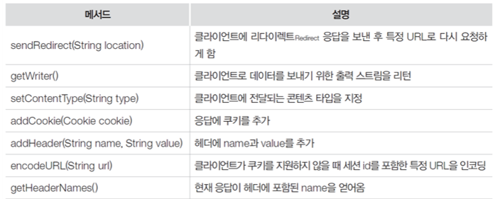

### 서블릿 정보 등록

* 서블릿 클래스만으로는 톰캣에서 실행이 불가능하기 때문에 web.xml 이나 애너테이션으로 서블릿임을 선언해야 함
* 서블릿 2.x에서 사용 가능한 web.xml의 작성 예

* 서블릿 3.0에서 자바 애너테이션을 이용한 등록 
  * 필요하다면 web.xml을 사용하는 것도 가능하지만 애너테이션 사용이 권장됨

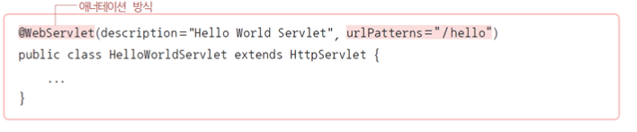

### 서블릿의 생명 주기

* 객체의 생성에서 종료에 이르는 과정

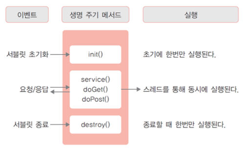

### 서블릿 초기화 : init()메서드

* 클라이언트 요청이 들어오면 컨테이너는 해당 서블릿이 메모리에 있는지 확인함

* 해당 서블릿이 메모리에 없을 경우에는 서블릿을 메모리에 적재해야 하는데, 이때 서블릿의 init( ) 메서드가 호출되며 각종 초기화 작업을 수행함 

* init( ) 메서드는 처음 한번만 실행되므로, 해당 서블릿에 각각의 스레드에서 공통적으로 사용하는 작업이 있다면 init( ) 메서드를 오버라이딩해서 구현함

* 만일 실행 중 서블릿이 변경되는 경우 기존 서블릿은 종료 Destroy되고 다시 시작되면서 init( ) 메서드가 호출됨

  

### 요청/응답 : service() 메서드

* init( ) 메서드는 최초에 한번만 수행되고 이후 요청은 스레드로 실행되며, service( ) 메서드를 통해 각각 doGet( )이나 doPost( )로 분기됨 
* 이때 파라미터로 HttpServletRequest와 HttpServletResponse 클래스 타입인 request와 response 객체가 제공됨 
  * request : 사용자 요청 처리
  * response : 응답 처리    

### 서블릿 종료 : destoy()메서드

* 컨테이너로부터 서블릿 종료 요청이 있을 때 destroy( ) 메서드를 호출함
* init( ) 메서드와 마찬가지로 한번만 실행되며, 서블릿이 종료되면서 정리해야 할 작업이 있을 때는 destroy( ) 메서드를 오버라이딩해서 구현함

# 3. 페이지 이동과 정보 공유

## 페이지 이동

### 데이터를 포함하지 않는 경우

* 사용자 요청 처리 후 별도의 데이터를 포함하지 않는다면 해당 페이지로 바로 리디렉션할 수 있음 
  * 세션에 데이터를 저장한 경우라면 세션이 유효한 동안 모든 페이지에서 세션 정보를 참조할 수 있어 리디렉션을 통해서도 데이터 참조가 가능함
* JSP, 서블릿 모두 response.sendRedirect( )를 사용할 수 있음

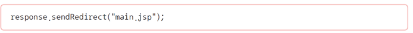

### 데이터를 포함하는 경우

* 데이터를 포함하여 이동한다면 request 속성으로 데이터를 넣은 후 원하는 페이지로 포워딩해야 함 
* 데이터 활용 목적에 따라 session이나 application을 사용할 수도 있으며 여러 데이터를 포함하는 것도 가능함 
* JSP로 구현할 경우

 

### 데이터를 포함하는 경우

* 서블릿으로 구현할 경우

  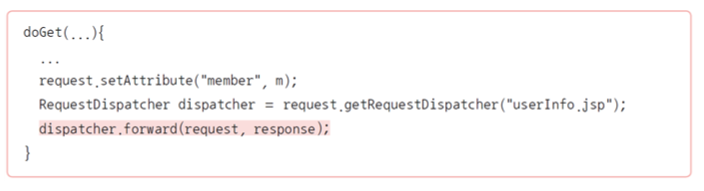

* 스프링 프레임워크로 구현할 경

### URL rewriting 

* HTTP의 Query String을 이용하는 방식으로 URL에 파라미터를 추가해 서버로 요청하는 형식
* 정보 유지를 위해 파라미터를 매 페이지마다 확인하고 계속 추가해 주어야하며,
     복잡한 정보 유지는 어려움

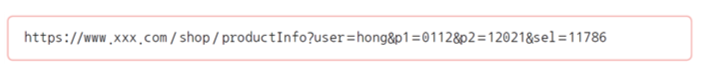

### 쿠키(Cookie)

* 란 클라이언트에 저장되는 작은 정보를 의미함 
* 서버의 요청에 의해 브라우저가 저장하게 되며 서버가 요청할 때 제공하는 형식

​    

### 쿠키의 특징

* 파일로 클라이언트의 컴퓨터에 저장되는 방식이며 보안상 문제가 있을 수 있음
* 광고 혹은 기타 목적으로 사용자의 이용 행태 추적에 이용될 수 있음
  * 이러한 목적의 경우 사용자 정보 활용 동의가 필요함
* 재방문 등의 확인 용도로 많이 사용됨
* ‘name=value’ 형식을 사용함
  * 유효 기간, 요청 경로, 도메인 지정 등의 부가 속성을 포함함
* 주로 자바스크립트를 통해 처리하지만 HttpOnly 설정으로 서버에서만 사용할 수 있도록 설정 가능함

### 쿠키의 동작 과정

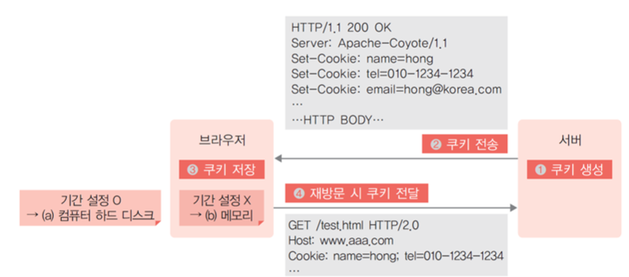

### 쿠키 저장 방법

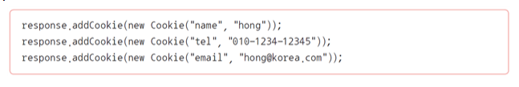

* 위의 코드는 다음의 HTTP 응답으로 클라이언트에 전달됨

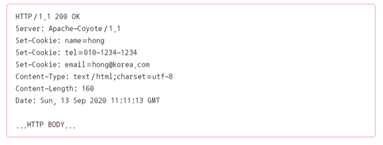

### 세션(Session)

* 클라이언트가 웹 애플리케이션 서버에 접속할 때 서버 쪽에 생성되는 공간으로 내부적으로는 세션 아이디를 통해 참조됨
  * 브라우저 : 서버에 접속할 때 발급받은 세션 아이디를 기억함
  * 서버 : 해당 세션 아이디로 할당된 영역에 접근함

### 세션의 특징

* 세션 유효 시간이나 브라우저 종료 전까지 유지되므로 서로 다른 페이지에서도 정보 공유가 가능함
* 로그인 유지, 장바구니, 컨트롤러 구현 등에서 다양하게 사용됨
* 사용자마다 생성되는 공간임 
* 동시에 많은 사용자가 세션을 통해 대량의 데이터를 관리한다면 충분한 메모리를 비롯한 세션 관리 대책이 필요함

### Scope Object

* 컨테이너에서 서블릿 관리를 위해 자동으로 생성한 객체 중 속성 관리 기능을 제공하며 특정 범위 동안 유지되는 객체를 의미함
* 각각의 객체는 관리 목적에 따라 별도의 메서드로 구현된 기능을 가지고 있고 공통적으로 ‘키-값’ 형태의 맵(Map) 자료구조를 가짐
  * 이를 활용하면 페이지 간, 사용자 간 데이터 공유가 가능함
* JSP 역시 서블릿으로 변환되기 때문에 동일하다고 볼 수 있음 
  * useBean 액션의 scope에 사용되는 page, request, session, application이 해당됨
* 이러한 객체는 각각 생성, 소멸 시기가 정해져 있고 서로 다른 JSP, 서블릿 간의 데이터 전달이나 공유를 위한 용도로 활용됨

# 4. [실습5-1] 서블릿 프로그래밍 : Hello World!

# 5. [실습5-2] 서블릿 프로그래밍 : Hello World!

