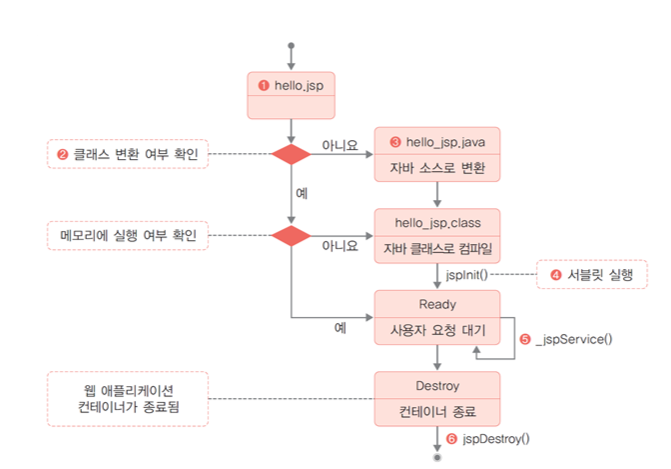
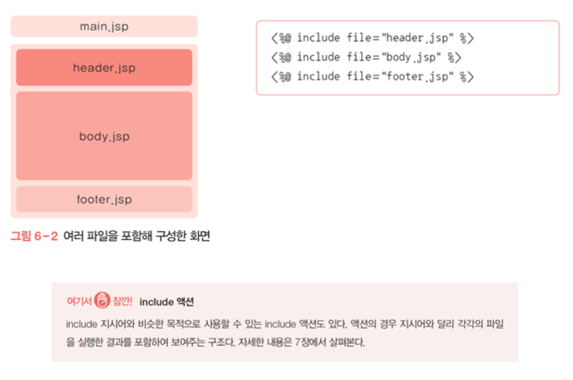
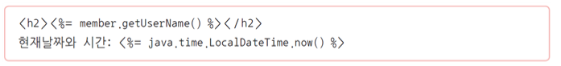
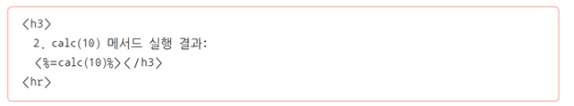
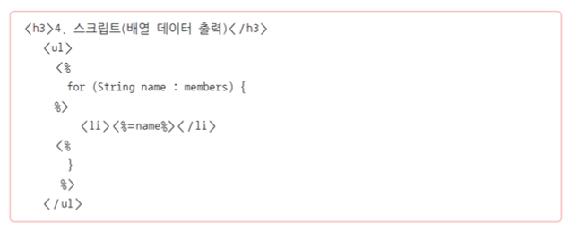
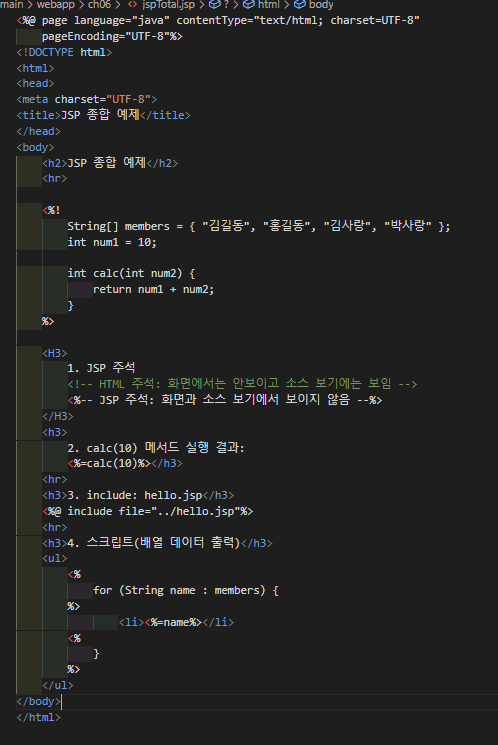
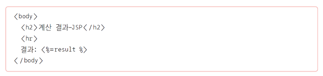
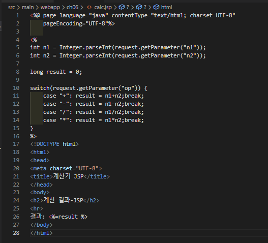

# 1. JSP의 개요

### JSP의 특징

* HTML 페이지에 자바 코드를 직접 사용함
* 서블릿 컨테이너에 의해 관리되는 내장객체의 생명 주기를 이용하여 페이지 간 속성을 관리함
* 커스텀 태그 기술을 사용하여 코드를 태그화(action, JSTL 등)함
* EL Expression Language을 통해 데이터를 표현함

### JSP의 구성요소

* 지시어(Standard Directives)
* 액션(Standard Action)
* 템플릿 데이터(Template Data)
* 스크립트 요소(Script Element)
* 커스텀 태그(Custom Tag)와 EL(Expression Language)

### JSP의 동작 과정

* JSP가 서블릿으로 컴파일되고 실행되는 과정

### JSP의 장점

* HTML 파일에 자바 기술을 거의 무한대로 사용할 수 있으며, 비교적 쉽게 프로그래밍할 수 있음
* 커스텀 태그 라이브러리 등 확장 태그 구조를 사용할 수 있음
* 서블릿으로 변환되어 실행되므로 서블릿 기술의 장점을 모두 가짐
* MVC 패턴, 스프링 프레임워크 등 잘 설계된 구조를 적용할 수 있어 개발 생산성이 향상되고 성능이 보장됨
* 모든 개발이 서버에서 이루어지므로 개발의 집중화를 통한 효율이 오름

### JSP의 단점

* 화면 구성요소를 변경하면 JSP → 자바 → 클래스 → 서블릿 실행 과정을 거치므로 개발 과정에서 사소한 UI 변경일지라도 매번 확인하는 데 시간이 소요됨
* 개발자와 디자이너 간 역할 분담에 제약이 있음
* JSP 파일의 화면 디자인 확인에도 반드시 서블릿 컨테이너의 실행이 필요함

# 2. JSP 지시어

### 지시어(Directives)

* JSP 파일의 속성을 기술하는 요소
* JSP 컨테이너에 해당 페이지를 어떻게 처리해야 하는지를 전달하는 내용을 담음 
* 지시어는 크게 page, include, taglib으로 나눌 수 있으며, 각각의 속성이 다름
* 지시어의 기본 형식
  * 

### page 지시어

* 현재 JSP 페이지를 컨테이너에서 처리(서블릿으로 변환)하는 데 필요한 각종 속성을 기술함 
* 소스코드 맨 앞에 위치하며 이클립스에서 JSP 파일을 생성할 때 자동으로 생성됨
* page 지시어의 구문과 사용 형식

* **language**: 현재 페이지의 스크립트 언어를 지정하는 속성
* **contentType**: 현재 페이지의 파일 형식을 지정하는 속성 
  * 클라이언트 요청에 응답할 때 전달하는 HTTP 헤더 정보가 됨
* **pageEncoding**: JSP 파일을 컨테이너가 처리할 때 사용하는 캐릭터 인코딩을 지정하는 속성 
  * 올바른 한글 처리를 위해서는 ‘UTF-8’로 지정해야 함
* **import**: JSP 파일 내에서 자바 코드(스크립트릿)를 직접 사용하는 경우 일반 자바 코드와 마찬가지로 클래스에 대한 패키지 import가 필요함
* **errorPage**: 현재 JSP 요청 처리 중에 에러가 발생하는 경우 서버 에러를 클라이언트에 전달하지 않고 별도의 페이지에서 처리하기 위한 속성
  * JSP에서 에러 페이지 설정을 넣는 것보다는 서버 설정을 사용하는 것을 권장함

### include 지시어

* 다른 파일을 포함하기 위한 지시어 
* 사용된 위치에 특정 파일(html, jsp)을 불러옴 
* 컨테이너에서는 포함된 파일을 하나로 처리하며 자바 소스를 생성한 뒤 서블릿으로 컴파일함즉
  * include에 사용된 파일의 내용을 모두 포함한 하나의 서블릿 코드로 생성되어 컴파일됨
* 포함되는 파일의 경우 해당 파일을 직접 요청해서 실행하는 것이 아니라면 개별 구성요소를 갖출 필요는 없음(page 지시어, HTML 기본 태그 구성요소 등)
* include 지시어는 원하는 위치에 자유롭게 사용할 수 있음
* include 지시어 사용 형식
  * 
* 하나의 JSP 파일(화면)이 실제로는 여러 파일의 조합으로 구성되는 경우
  * 

### taglib 지시어

* JSP의 태그 확장 메커니즘인 커스텀 태그를 사용하기 위한 지시어 
* taglib 지시어의 구문과 사용 형식
  * 
* **uri**: 태그 라이브러리 위치로 태그를 정의하고 있는 .tld 파일 경로를 나타냄
* **tagdir**: 태그 파일로 태그를 구현한 경우 태그 파일 경로를 나타냄
* **prefix**: 해당 태그를 구분해서 사용하기 위한 접두어
* 태그 파일로 커스텀 태그를 구현한 예시
  * [WEB-INF/tags] 폴더에 있는 ‘printData.tag’ 파일에 태그에서 처리할 내용이 작성되어 있음
  * 

# 3. 템플릿 데이터와 스크립트 요소

### 템플릿 데이터

* JSP의 화면 구성요소를 의미함 
* 시작 부분의 page 지시어를 제외하면 JSP 파일의 전반적인 구조는 HTML의 문서 구조를 따름. 따라서 일반적인 HTML 파일처럼 CSS, 자바스크립트도 사용할 수 있음
  * 기본적으로 HTML5를 사용하며 문서 구조 중심으로 간략하게 작성하고 데이터 표현은 뒤에서 배울 JSTL과 EL을 사용함
  * 화면 디자인을 위해 자체적인 CSS 정의 이외에도 Bootstrap과 같은 라이브러리를 사용할 수 있음 
  * REST API 호출을 위해 Axios 같은 자바스크립트 라이브러리 역시 사용할 수 있음
* 주의할 점) React, Vue와 같은 자바스크립트 요소는 프런트엔드 개발 기술로 JSP와 함께 사용하지 않음

### 스크립트 요소

* JSP는 HTML과 자바 코드를 섞어 사용할 수 있는데, 이때 사용되는 자바 코드를 의미함

* 자주 쓰이는 스크립트 요소 : <%! %>, <%= %>, <% %>

     

#### <%! %>

* 선언(Declaration) 태그

* JSP가 서블릿 코드로 변환될 때 _ jspService( ) 메서드 안에 들어가게 되므로 JSP에서는 일반 자바 코드와 달리 멤버 변수나 메서드 선언은 기본적으로 불가능
*  멤버 변수나 메서드 선언이 필요하다면 사용할 수는 있으나 권장하지 않음

#### <%! %>

* 선언(Declaration) 태그
* JSP가 서블릿 코드로 변환될 때 _ jspService( ) 메서드 안에 들어가게 되므로 JSP에서는 일반 자바 코드와 달리 멤버 변수나 메서드 선언은 기본적으로 불가능함
* 멤버 변수나 메서드 선언이 필요하다면 사용할 수는 있으나 권장하지 않음

#### <%= %>

* 표현(Expression) 태그
* 웹 브라우저를 통해 클라이언트에 전달될(HTML 응답에 포함될) 자바 표현식을 포함
* out.println( )의 인자로 적합한 모든 자바 코드가 가능함
* 사칙연산, 메서드 호출, 변숫값 출력 등에 사용됨
* EL로 대체할 수 있음

#### 로그인 페이지에서 입력한 이름을 가져와 화면에 출력한 다음 사용자 목록을 for 문을 이용해 출력하는 부분의 JSP 코드

* 주의할 점) for 문에서 out.println( )을 이용해 이름과 이메일을 출력하지 않고 표현 태그를 사용함
* 

* out.println( )을 사용한다면 <table>...</table> 부분만 수정

* 

# 4.[실습 6-1] JSP 기초 종합 예제

1. 이클립스에서 [jwbook] → [src] → [main] → [webapp] 폴더에 [ch06] 폴더를 생성한 다음 <New> → <JSP File> 메뉴를 클릭하여 JSP 파일을 생성 
   * 파일 이름: ‘jspTotal.jsp’

2. ‘jspTotal.jsp’의 <body> 내부에 다음 내용을 작성하여 HTML 주석과 JSP 주석 확인
   * 
3. 일반 변수의 선언은 스크립트릿에서 가능하지만 멤버 변수 혹은 함수 선언은 스크립트릿에서 불가능함. 따라서 이번 실습에서는 선언문을 이용해 배열과 함수를 선언해두고 참조하도록 코드를 구성함

4. 스크립트릿을 활용하여 calc( ) 메서드를 호출

   * 선언된 코드는 본문의 표현식 혹은 스크립트릿 등에서 자유롭게 사용할 수 있음

   

5. 2장에서 작성했던 ‘hello.jsp’ 파일을 포함하기.

   * 파일의 위치와 경로를 작성할 때 주의해야 함 

   * 현재 코드의 위치는 [ch06] 폴더에 있고, ‘ hello.jsp’ 파일은 [webapp] 폴더 바로 아래에 있기 때문에 상대 경로로 위치를 표현해주어야 함

   ​    

6. 자바의 for 문으로 앞에서 선언했던 members 배열의 값을 모두 출력하기 
   * 이름을 출력하는 부분에서 out.println( )을 사용하지 않기 위해 for 문을 중간에 닫고 스크립트 요소를 사용한 다음 다시 for 문을 닫는 코드 형식으로 구현

7. 완성된 코드와 실행
   * 서블릿 클래스를 선택한 다음 실행 버튼을 누르기 
   * 마우스 오른쪽 버튼을 클릭하고 [Run as] → [Run on Server]를 클릭하여 실행하기
     * JSP와 마찬가 지로 서버 런타임 선택 화면에서 프로젝트 생성 시 등록한 ‘Tomcat v9.0’을 선택하고 실행

​	

# 5.[실습 6-2] JSP 프로그래밍 : 계산기 구현

### 실습 개요

* **5** 장에서 만들었던 계산기 서블릿을 **JSP** **버전으로 구현** 
* **2** 개의 숫자와 연산자를 선택하고 계산 버튼을 누르면 입력값을  **JSP**로 전달함 
  * HTML 폼을 통해 숫자, 연산자를 입력하고 입력값을 JSP로 전달
  * JSP는 브라우저로부터 전달된 입력값을 가져와 계산 후 결과를 포함한 화면을 출력    

### 입력 파라미터

* **n1, n2**: 숫자 입력. HTML <input>으로 구현함
* **op**: 연산자 선택 드롭다운 리스트로 HTML <select>로 구현함
  * 연산자의 종류 : +, -, *, /

1. [ch05] 폴더의 ‘calcForm.html’ 파일을 복사해 [ch06]에 붙여 넣고 코드 수정

2. [ch06] 폴더에 ‘calc.jsp’ 이름으로 계산기 JSP를 생성하고  page 지시어 바로 아래에 다음 내용을 코딩 

   * 계산기 기본 코드는 서블릿과 동일함 

   * 따라서 기본 생성된 JSP 코드에 5장에서 작성한 ‘CalcServlet.java’의 서블릿 계산기 구현 부분인 doGet( ) 메서드의 내용을 스크립트릿 영역에 넣어주면 됨 

   * 주의할 점) HTML 부분에서 결과를 출력해야 하므로 코드는 앞쪽에 배치해야 함
   * 

3. 결과 화면은 <body> 부분에 표현식을 이용하거나 EL을 사용할 수도 있음

4. 계산기 JSP의 전체 코드

