# 액션태그

* JSP에서 객체 생성과 공유, 페이지 이동과 전달, 태그 파일 작성등에 필요한 기능을 제공하는 일종의 커스텀 태그
* 표준 액션이라고도 불리며 커스텀 태그 기반이지만 별도의 taglib 지시어 사용 없이 jsp 접두어를 사용

# 자바 빈

* 자바의 재활용 가능한 컴포넌트 모델을 의미한다.

* 웹개발에만 국한된 개념이 아니라 POJO라고 하는 단순한 구조를가짐
  * 특정기술이나 프레임워크에 종속하지 않고 기본 생성자와 private 멤버변수에 대한 getter/setter 메서드를 통해 멤버변수(속성)에 접근함

## 자바 빈 구조의 특징

* 인자가 없는 생성자(기본생성자)로 구성됨
* 파일 혹은 네트워크를 통해 객체를 주고받을 수 있는 직렬화 구조가 가능함
* getter, setter 메서드를 통해 멤버 변수(속성)에 접근함
  * 쉽게 설명하면 DTO, VO 같은 class가 자바 빈이라고 볼 수 있다.
  * 추후에는 어노테이션 @getter, @setter를 사용하면 게터세터를 IDE에서 자동적으로 컴파일 해준다.

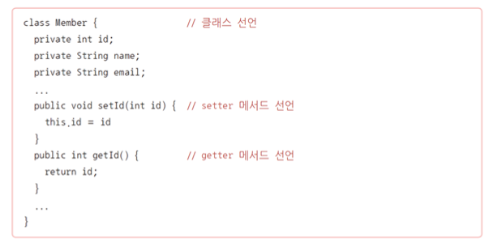

## userBean 액션

* JSP에서 자바 빈 객체를 생성하거나 참조하기 위한 액션
* 매우 유용하지만 JSP를 단순히 뷰 역할로만 사용한다면 사용할 일은 없음
  * 단 이거를 사용하면 MVC패턴에 위배될 수 있음.

## userBean의 기본적인 동작 방식

* useBean을 이용해 만든 객체의 범위는 지정하는속성인 scope에 주어진 id의 객체가 있는지 확인한다.
* 객체가 없다면 새로 객체를 생성하고 해당 scope에 저장한다.

### userBean 액션의 기본 구문과 사용 예

* **id**: 자바 빈을 특정 scope에 저장하거나 가져올 때 사용하는 이름
  * 현재 페이지에서는 해당 인스턴스를 참조하기 위한 변수명이 됨
* **scope**: 해당 클래스 타입의 객체를 저장하거나 가지고 오는 범위로 내장객체의 일부
* **class**: 생성하거나 참조하려는 객체의 클래스명
  * 반드시 패키지명까지 명시해야 하며, 추상클래스나 인터페이스는 사용할 수 없음
* **type**: 특정 타입의 클래스를 명시할 때 사용함 
  * 추상 클래스나 인터페이스, 일반 클래스가 될 수 있으며 class 속성의 클래스에서 상속 혹은 구현이 이루어져야 함
* **beanName**: type과 beanName 사용을 통해 class 속성을 대체할 수 있음

## userBean을 주로 활용하는 경우

* HTML 폼에서 입력한 값을 자바 객체로 연동될 때 주로 활용함
* 예) 회원 가입페이지에서 아이디, 이름, 전화번호, 주소 등 여러 정보를 입력하고 가입하는 경우
  * 입력값을 받아 Member 객체에 넣고 이를 데이터베이스에 저장하기 위한 메서드 호출에 인자로 전달해야함

form을 만들때 각 태그 이름을 지정해줄때 멤버변수와 동일한 애로 작성한다.

근데 유저빈을 사용하면 일일이 집어넣지 않고 넣을 수 있다.

유저에게 form으로 입력받은 정보를 getter.setter를 통해서 자바빈에 담고 데이터베이스에 저장하거나 혹은 데이터를 불러와야하는데

이 과정에서 엄청나게 복잡하게 코드를 작성해야한다.

이거를 해결하기위해 Apache Commons BeanUtils 라이브러리로 해결이 가능하다.

# include , forward 액션

## include 

* 다른 페이지를 포함한다는 점에서 include 지시어와 동일하지만 처리 과정에서 차이가 있음

## forward 액션

* 클라이언트 요청을 다른 페이지로 전환하는 액션

* 리디렉션(response.sendRedirect()) 과 기능적으로 유사하지만 내부적으로는 차이가 있음
  * 리디렉션 : 서버가 클라이언트에게 새로운 페이지로 다시 접속하도록 응답을 보내고, 응답을 받은 클아이언트가 다시 새로운 페이지로 접속하는 방식
  * forward 액션 : 클라이언트가 새롭게 접속하는 것이 아니라 서버에서 내부적으로 새로운 페이지로 이동하고 그 페이지의 내용을 클라이언트에게 응답으로 전달하는 방식
    * 처음에 A를 request하고 A에서 B로 리디렉션을 하면 A에서 처리한 결과를 클라이언트에게 response 후 B를 다시 request를 하는것이다.
    * 처음에 A를 request하고 A에서 B로 포워드를 한다면 A에서 처리한 결과를 가지고 B로 이동하는 것이다

* 단순한 페이지 이동이 필요한 경우 - 리디렉션이 적합

* 최초 request를 유지하거나 request의 setAttribute( )로 속성값을 저장하고 이를 유지하면서 페이지를 이동하는 경우 - forward 액션이 적합

  

# 커스텀 태그란?

### 커스텀 태그

* 사용자 정의 태그를 의미함

* 스크립트릿 사용을 줄이고 태그와 같은 형태로 프로그램 코드를 대체하거나 재활용 가능한 구조를 통해 태그 라이브러리로 활용하고자 개발된 규격임

* 외형적인 형태는XML(HTML) 태그 구조이지만 서블릿 형태로 변환될 때 자바 코드로 변경되어 통합되는 방식

* 커스텀 태그를 사용하기 위한 taglib 지시어를 사용하여 커스텀 태그가 어디에 정의되어 있는지를 먼저 선언해야 하며 태그에 사용할 접두어를 지정해야함

* 커스텀 태그 자체가 서버에서 구조이며, 프로젝트가 특정 커스텀 태그에 종속될 수 있다는 문제 때문에 커스텀 태그를 직접 만드는 방식은 점차 줄어들고 있음

  * 대신 커스텀 태그 기술로 만들어진 JSTL(JSP Standard Tag Library)이 자바 웹 개발에 꼭 필요한 요소가 됨

    

### 커스텀 태그의 예시

* 특정 상품 코드를 전달하면 해당 상품에 대한 세부 정보를 출력하기

  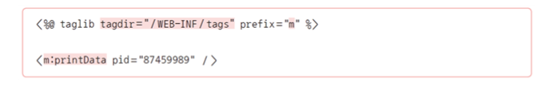

* 태그 파일로 정의된 커스텀 태그를 사용하며 ‘WEB-INF/tags/printData.tag’ 파일로부터 태그 정의를 가지고 옴

* m은 태그 앞에 붙일 접두어로 태그 파일명이 태그 이름이 됨

  

# EL이란?

### 표현 언어(Expression Lnguage, EL)

* 주로 EL이라 불림
*  현재 페이지의 자바 객체 혹은 scope object에 저장된 자바 빈 객체를 손쉽게 접근하고 사용할 수 있게 함 
* 데이터를 표현하기 위한 용도로 설계되었지만, 제한된 객체 참조가 가능하며 해당 객체의 메서드 호출도 가능함
* EL은 단순한 출력 외에도 사칙연산, 비교연산, 논리연산, 3항 연산 등을 지원함 
  * 연산 기능은 핵심 로직의 구현보다는 상황에 따라 출력값을 변경하는 정도의 용도로 사용하는 것이 좋음

### EL의 장점

* 간단한 구문으로 손쉽게 변수/객체를 참조할 수 있음
* 데이터가 없거나 null 객체를 참조할 때 에러가 발생하지 않음

### 자바 빈 접근

* EL을 통해 scope object에 저장된 자바 빈 객체를 참조하는 방법

  

* 앞의 자바 빈 설명에서 만든 Member 클래스의 멤버 정보에 접근하기
  * 컨트롤러에 의해 session에 저장하는 과정이 있었다고 가정함

  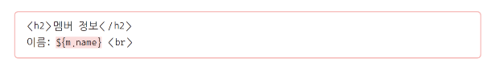

### EL을 사용하지 않을 경우

* 다음과 같이 표현식을 사용하거나 <jsp:getProperty> 액션으로 츌력할 수도있

### EL 연산

* 기본적인 사칙연산, 비교연산, 논리연산, 3항 연산 등이 가능함

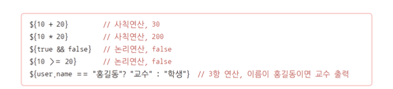

### 배열, 맵 데이터 연동

* 참조하는 객체가 배열이나 맵 형태인 경우 다음과 같이 사용함

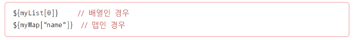

### Scope Object 접근

* EL은 기본적으로 모든 scope에서 자바 빈 객체를 찾음
* 만일 특정 scope만을 대상으로 참조하려면 '내장객체면Scope.속성이름'으로 사용
  * 예) session과 request 모두에 'm' 이라는 이름으로 저장된 객체가 있다고 할때, request scope에 있는 객체를 참조하려면 다음과 같이 사용할 수 있

# JSTL이란?

* JSP에서 스크립트릿(자바 코드 블록)을 사용하지 않고 HTML 형식을 유지하면서 조건문, 반복문, 간단한 연산과 같은 기능을 손쉽게 사용할 수 있도록 지원하기 위해 만들어진 표준 커스텀 태그 라이브러리
* 서버에서만 해석할 수 있는 구조로 인해 디자이너와의 협업에 불편한 부분이 있음
* 개발 과정에서 UI 확인을 위해 서버를 통해야만 하는 비효율적인 문제가 있음 
  * 따라서 모바일 환경 중심의 프런트엔드 개발 트렌드와는 다소 거리가 있음
* 뷰 중심의 JSP 구현에는 core 정도만 사용됨

### JSTL 라이브러리 설치하기

* JSTL은 표준 규격으로만 존재하기 때문에 개발에 적용하기 위해서는 실제 구현된 라이브러리가 필요함
  * Apache Standard Taglib를 주로 사용함

* http://tomcat.apache.org/download-taglibs.cgi에 접속하여 <Impl>, <Spec>을 클릭하여 내려받기
  *  **Impl **: taglibs-standard-impl-1.2.5.jar
  * **Spec**: taglibs-standard-spec-1.2.5.jar

* 다운로드한 라이브러리 파일을 
   [webapp] → [WEB-INF] → [lib] 폴더에 복사하기
  * 경로가 잘못되면 이클립스에서 
     라이브러리 인식을 못하므로 주의해야 함

### JSTL 사용하기 

* JSTL을 JSP에서 사용하려면 taglib 지시어를 추가해야 함 

* 다음에 나올 core 라이브러리 사용을 위해서는 다음과 같이 작성함

  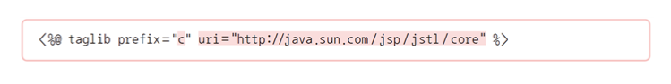

  * 위에 사진처럼 prefix="c"로 지정해두면 c로 지정한 이름으로 c:if 요렇게 적어야한다.

  

# core 라이브러리

* 변수 처리, 흐름제어, URL 관리, 출력 등 가장 기본적인 기능을 구현해둔 라이브러리 

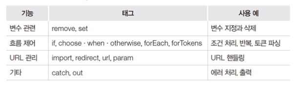

* < c:if >

  * 자바의 if 문과 유사하지만 else는 지원하지 않음 

  * 조건 테스트를 위해 속성을 참조할 범위(Scope)를 지정할 수도 있지만 필수 사항은 아님

  * 사용 형식

    

  * 사용 예시

    

* < c:forEach> 

  * 화면에 데이터를 반복해서 출력할 때 주로 사용함 
  * 자바의 for 문과 같은 개념이지만 커스텀 태그 특성상 정밀한 설정이 가능하지 않기 때문에 제공되는 속성을 잘 활용해야 함 
  * 진행 상태를 확인하기 위해 index, count 등을 지원하는 varStatus를 제공함
  * 사용 형식

  

* var : 배열, 리스트 집합형 객

* varStatus : 반복 진행 상황을 참조하기 위한 객체

* 사용 예시

  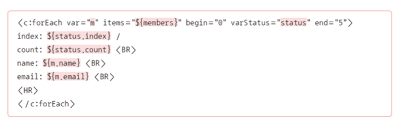

# 빌드 도구

### 자바 빌드도구

* Ant: 가장 오래된 자바 빌드 도구
* Mavern: 2004년에 아파치 프로젝트로 Maven이 새롭게 나옴
  * 이후 오랜 기간 Maven은 절대 다수가 사용하는 자바 빌드 도구가 되었으며 특히 스프링 프레임워크 개발에서 기본 빌드 도구로 활용됨 
* Gradle: 시간이 지남에 따라 좀 더 유연하면서도 복잡한 처리를 쉽게 하기 위한 요구 사항의 증대로 2012년 Gradle이 나옴 
  * 안드로이드 앱 기발의 기본 빌드 도구가 되었음 
* 현재 Maven과 Gradle이 가장 대표적인 빌드 도구임

# Maven과 Gradle

###  Maven과 Gradle의 설정 방식

* Maven: 빌드 설정을 ‘pom.xml’ 파일에 작성함 

  * XML 구조이기 때문에 프로젝트가 커질수록 스크립트의 내용이 길어지고 가독성이 떨어지는 문제가 있음

  

* Gradle: Groovy라고 하는 JVM 기반 언어를 통해 프로그램 구조로 설정함 

  * 따라서 훨씬 적은 양의 스크립트로 짧고 간결하게 작성할 수 있음

  

### 다중 프로젝트

* Maven: 다중 프로젝트에서 특정 설정을 다른 모듈에서 사용하려면 상속을 받아야 함
* Gradle: 설정 주입 방식을 사용하여 다중 프로젝트에 적합함

### 개발 환경

* 안드로이드 프로젝트는 기본적으로 Gradle을 사용함
* 스프링 프레임워크 기반 프로젝트는 Maven, Gradle 중에 선택할 수 있음
* 이클립스는 Maven에 친화적이고 IntelliJ는 Gradle에 친화적임

### 빌드 도구를 사용하는 주요 목적 두가지

* 컴파일/실행 설정과 라이브러리 설정
  * 이 중에서도 라이브러리 설정은 꼭 알아두어야함

* 꼭 필요한 핵심 라이브러리만 설정 파일에 등록해두면 해당 라이브러리에서 필요로 하는 다른라이브러리는 자동으로 함께 설치되기 때문에 신경쓸 필요가 없음

### 리포지터리

* 이러한 라이브러리를 통합 보관하는 일종의 저장소임
* 설정 파일의 내용을 참고해 해당 라이브러리를 글로벌 저장소로부터 로컬 저장소로 다운로드한 다음 프로젝트에 복사하는 과정을 거쳐 사용함
* 해당라이브러리가 로컬 저장소에 있다면 인터넷에서 다운로드하지 않고 바로 사용할 수 있음
* 필요에 따라서는 개발 회사가 자신들에게 필요한 라이브러리만 저장하거나 자체 라이브러리 저장을 위한 저장소를 두고 사용하기도 함

### 이클립스 Maven 설정

* CLI(Comand Line Interface) 방식

  * Maven과 Gradle 모두 기본적으로는 설정 파일을 먼저 만들고 명령줄 인터페이스(CLI)를 통해 기본 프로젝트 구조를 생성한 다음 개발도구에서 import하여사용하는 방식

* Dynamic Web Project 를 Maven 기반으로 변환하는 방식

  * 동적 웹 프로젝트를 Maven 기반으로 변환해 사용함 
  * 이 방법이 가장 간편하면서도 안정적인 방법임

  

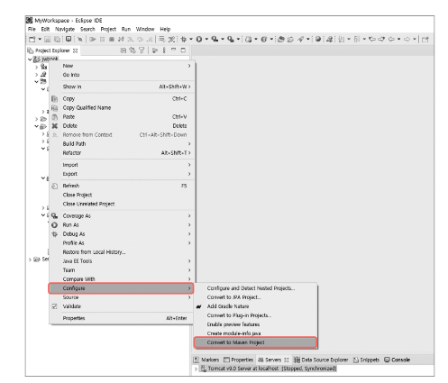

1. Dynamic Web Project를 대상으로 오른쪽 버튼클릭 [Configure] -> [Convert to Maven Project]를 선택하면 바뀐다.

2. Maven 프로젝트를 위해 몇 가지 필요한 사항을 등록하고, <Finish>를 클릭

* **Group Id**: 프로젝트의 고유 식별자로 기본 패키지 이름 규칙에 따라 작성함
* **Artifact Id**: 생성되는 jar(war) 파일의 이름으로 소문자로만 작성함
* **.Version**: 숫자와 점으로 이루어진 버전 관리 번호
* **Packaging**: 빌드 산출물 형태로 jar(일반 앱 혹은 라이브러리) 혹은 war(웹) 형태임

3. 자동으로 기존 프로젝트 구조에 몇몇 폴더 구조와 ‘pom.xml’ 파일이 생성된 것을 확인할 수 있음 

   * 기본적으로 ‘pom.xml’ 파일이 오픈된 상태이며, 하단에 보면 여러 탭이 있어 다양한 형태로 설정 파일 정보를 보여줌

   

4. 프로젝트에 필요한 라이브러리를 등록하기 위해 우선 기존 [WEB-INF/lib]에 복사해두었던 JSTL 관련 라이브러리를 삭제함

5. 필요한 라이브러리는 리포지터리 사이트에서 검색한 버전에 맞게 선택한 화면에서 코드를 복사해서 사용함 
   * 이번 실습에서는 메이븐 리포지터리(https://mvnrepository.com)에 접속하여 ‘JSTL’을 검색하고 1.2 버전의 코드를 복사하여 사용함

6. ‘pom.xml’의 아래 부분에 <dependencies>...</dependencies>를 추가하고 복사한 코드를 이 사이에 붙여넣어 다음과 같이 JSTL 라이브러리 의존성을 추가하기 
   * 다른 라이브러리를 추가할 경우 <dependencies>...</dependencies> 사이에 넣어주어야 함!

7. 파일을 저장하고 ‘pom.xml’ 파일을 프로젝트 탐색기에서 선택한 다음 마우스 오른쪽 버튼을 눌러 [Maven] → [Update Project...]를 선택하고 나오는 화면에서 <OK> 버튼을 클릭

8. 이클립스는 해당 라이브러리를 로컬 리포지터리에 다운로드하고 프로젝트에서 참조할 수 있는 상태로 만듦. 다음과 같이 해당 라이브러리가 프로젝트의 [Maven Dependencies] 에서 참조할 수 있도록 보임

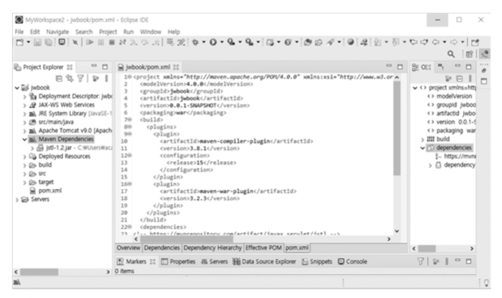

메이븐 장점 다운로드를 통해 라이브러리를 넣을 수 있음 jar를 삭제하고 라이브러리 상점에서 다운로드 받으면 됨.

# 실습

### 7-1 실습

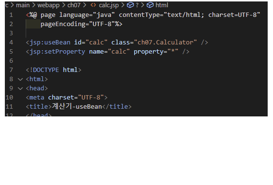

### 실습 7-2

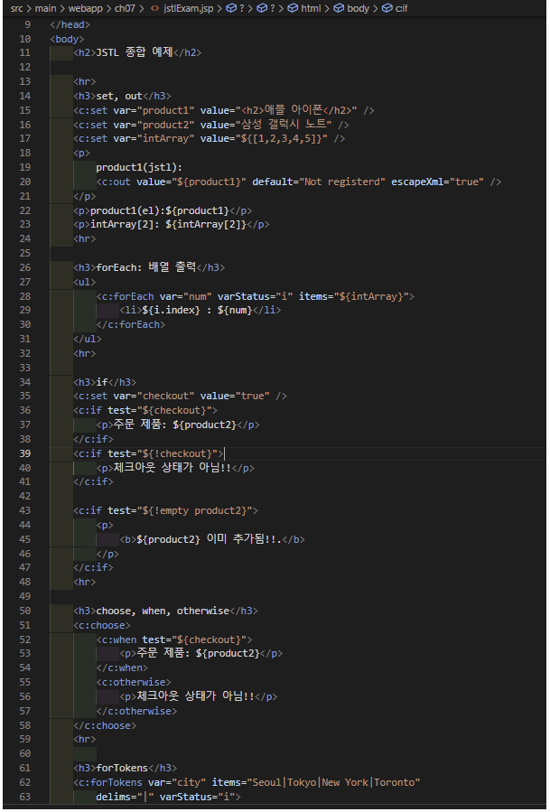