# 1. MVC 패턴

### 디자인 패턴

* 처음에는 건축학적 관점에서 출발 한 개념이었다.
* 1994년 GoF(gang of four)의 ≪Design Patterns: Elements of Reusable Object-Oriented Software≫를 통해 소프트웨어 설계에서 공통적으로 발생하는     문제에 대한 재사용 가능한 솔루션으로 제시됨
* GoF의 디자인 패턴은 생성, 구조, 행동, 동시실행 등의 문제에 대해 여러 패턴을 제시하고 있으며 UML 클래스 다이어그램을 이용해 구조를 표현하고 있다.
* 학문적으로 적립되어 있는개념이 아니라 객체지향을 하다보니 이럴때는 이렇게 사용하는것이 효율적이다를 나타낸 것이다.

-> 디자인패턴에 관련된 내용 조사해서 첨부하기.

#### 디자인 패턴 3가지 종류

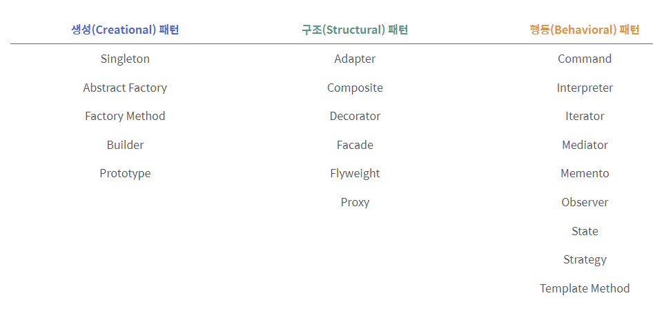

* 디자인 패턴은 크게 3종류로 나눠서 분류한다.
* 또한 4가지의 요소가 존재한다.
  * **패턴 이름(Pattern Name)**
     \- 패턴의 이름은 해당 패턴의 솔루션을 담고 있는 경우가 많습니다. 따라서 설계에 대한 생각을 더욱 쉽게 할 수 있고, 개발자들 간의 의사소통이 원활해집니다.
  * **문제(Problem)**
     \- 언제 패턴을 사용하는가를 서술하며 해결할 문제와 그 배경을 뜻합니다. 문제를 제시함으로써 패턴을 적용하는 것이 의미 있는 사례를 소개하겠습니다. 
  * **해법(Solution) 및 구현(Implementation)**
     \- 앞서 2번에서 다룬 문제(Problem)에 대하여 어떻게 해결할 수 있을 것인가에 대해 해결책을 제시하고, Java를 통해 예제 코드를 다루겠습니다.
  * **결과(Consequence)**
     \- 디자인 패턴을 적용해서 얻는 결과와 장단점을 서술합니다.

### UML(Untified Modeling Langauge)

* 객체지향 설계와 구현을 지원하기 위해 만들어진 일종의 모델링 언어

* 시스템 분석, 설계에 필요한 내용을 여러 다이어그램 형태로 정의한 규격

* 전체적인 모델링을 나타낸다.

  -> 자료조사해서 포함시켜서 보고서 작성하기.

#### UML의 종류와 방법

* OOA (Object Oriented Analysis) : 객체지향 분석
* OOD (Object Oriented Design) : 객체지향 디자인
* OOP (Object Oriented Programming)  : 객체지향 프로그래밍

대표적인 UML2가지 방법

1. Class Diagram(클래스 다이어그램)
   * 클래스와 다른 클래스 사이의 관계를 모델링 한 다이어그램
   * 시스템의 구조를 나타낸다.
   * 필요한 변수, 데이터 타입 함수를 정의 가능
   * 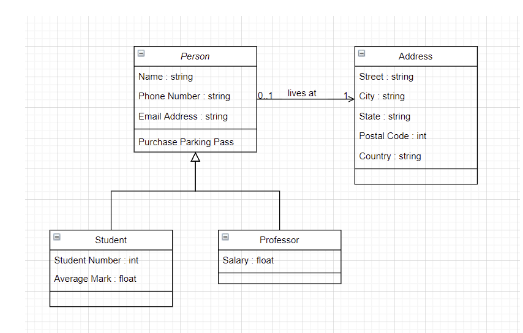

2. Sequence Diagram(시퀀스 다이어그램)

   * 오브젝트, 클래스끼리의 상호작용을 보여준다.

   * 어떤 기능이 어떤 오브젝트 혹은 클래스와 연결되어 작동되는지, 이에따라 어떤 값이 와야하는지, 전체적인 상호작용의순서를 보여준다.

   * 이를 통해 어떤 함수에 어떤 파라미터가 사용되는지, 이에 관한 결과값이 무엇인지 알 수 있다.

   * 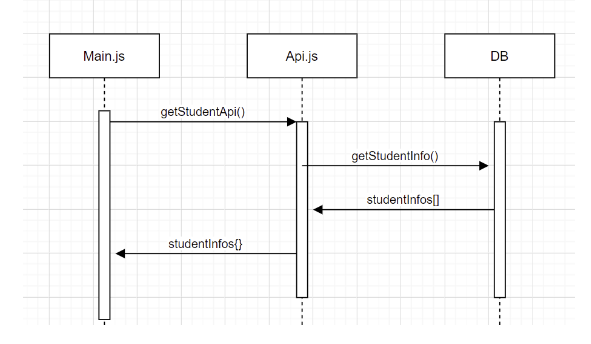'

     

### 추상 팩토리(Abstract Factory) 패턴

* 추상(Abstract): 자바의 추상 클래스 Abstract Class에도 사용되는 표현으로 구체적인 내용의 구현을 하위 객체에 위임하는 모델임 

  * 추상클래스 : 입출력만 정의된 메소드를 가지고있는 것
  * 추상클래스의 목적 
    * 물려받은 자식이 추상클래스의 몸체를 채운다.
    * 자식이 여러개여도 다 똑같은 형식의 입출력을 가진다. 라는 특징을 가진다. 즉 껍데기 측면에서는 다 똑같은 방식으로 접근가능하다.
    * 예시 
      * A라는추상클래스가 존재함.
      * A를 상속받은 수많은 자식이 존재함.
      * A를 상속받은 수많은 자식을 A에 삽입을해서 사용가능하다.
      * A a = new A1(); 
      * 해당 사항이 스프링의 특징중 DI(의존성 주입)과 관련이 되어 있다.
      * 의존성 주입을 프레임워크(스프링)이 대신해준다.
      * 근데 이거를 구분하는 방법은 어노테이션중 @Autowired를 사용하면 스프링이 컴파일하면서 알아서 해준다.
      * 이렇게 사용하면 new해서 객체를 생성할 필요가 없다.

* 팩토리(Factory): 디자인 패턴에서 객체를 생성하는 역할을 의미함 

  * Factory Class를 통해서 객체를 찍어내는 역할이다. 
  * 인스턴스가 필요할때마다 new해서 만드는게아니라 팩토리를 통해서 필요한 인스턴스를 만들어서 공급하는것이다.

* 따라서 추상 팩토리는 객체를 생성하는 것을 별도로 구현하되 관련된 구체적인 구현을 하위 클래스에서 담당하게 하는 설계 모델로 이해할 수 있음

  * 추상팩토리는 스프링부트에서 DI와 밀접한 관계를 지닌다.

  

### 추상팩토리(Abstract Factory Pattern)

* 객체 생성에 대한 문제 해결을 위한 디자인 패턴

* 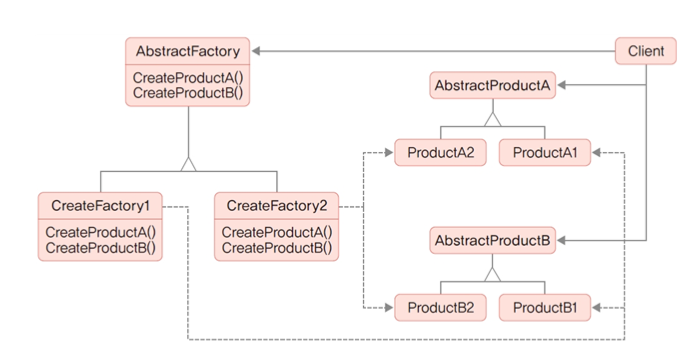

### MVC패턴

* Model-View-Controller의 약어 
* GUI(Graphical User Interface) 기반의 애플리케이션 개발에 사용되는 디자인 패턴
* 지금은 백엔드 기반의 웹 애플리케이션 개발의 기본 모델이 되었음 
  * 모바일 앱 및 프런트엔드 기반 웹 애플리케이션 개발이 늘어나면서 MVP(Model-View-Presenter), MVVM(Model-View-ViewModel) 과 같은 패턴도 널리 사용되고 있음
* MVC 패턴의 목적은 화면과 데이터 처리를 분리하여 코드 간 종속성을 줄이는 것임
* 즉 구성요소 간 역할을 명확하게 하여 코드를 쉽게 분리하고 협업이 용이해짐

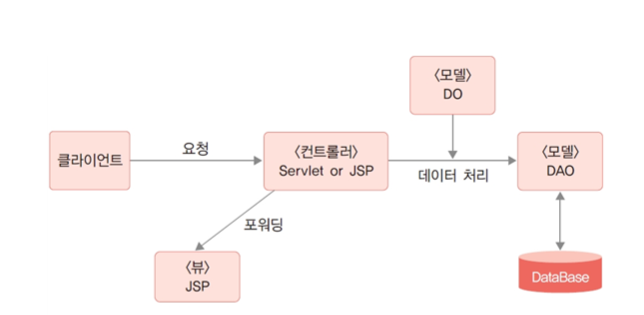

* DAO는 DB만 접속하는게 아닌 파일을 접속해서 무언가를 할 수가 있다.

### 모델(Model)

* 데이터를 처리하는 영역
* 일반적으로 데이터베이스와 연동을 위한 DAO(Data Access Object) 클래스와 데이터 구조를 표현하는 DO(Data Object, 엔티티 클래스) 등으로 구성됨
* 모델은 뷰나 컨트롤러에 독립적인 구조로 데이터베이스 처리를 필요로 하는 여러 애플리케이션에서 공유할 수 있으며, 웹 애플리케이션이 아닌 경우에도 사용할 수 있음
* 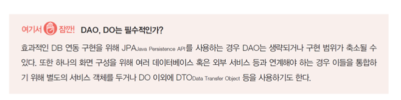

* JPA와 스프링프레임워크의 JPA는 좀 다른개념이다. 주의해야한다.

### 뷰(View)

* 화면 구성을 담당하는 영역
* 주어진 데이터를 출력하는 용도로만 사용하는 것이 바람직함 
* 뷰에서 데이터를 직접 가져오는 방식은 권장하지 않음
* 뷰 영역의 구현을 위해 뷰 템플릿 엔진이 사용되며 JSP 역시 이러한 뷰 템플릿 엔진 중 하나임 
* HTML 이외에 EL, JSTL 등을 사용해 컨트롤러로부터 전달받은 데이터를 출력하고 HTML, CSS 등을 통해 화면을 디자인함 
* 뷰는 기본적으로 모델, 컨트롤러와의 종속성이 없도록 구현해야 함
  * 요즘 뷰는 리액트와,vue.js를 사용한다.
  * 하지만 뷰 모델은 많이 바뀌는데 해당 모델이 바뀌더라도 컨트롤러와 모델은 영향을 받지않게 코드를 짜야한다.

### 컨트롤러(Controller)

* MVC 패턴의 핵심으로 모든 사용자 요청의 중심에 위치함 
* 사용자 요청은 특정 뷰에 바로 전달되지 않고 컨트롤러를 통해야 함 
* 컨트롤러는 사용자 요청에 따라 모델을 통해 데이터베이스와 연동하여 데이터를 처리하고 뷰에 전달함 
* 뷰로 전달하기 위해 데이터가 들어 있는 DO 혹은 List<DO> 형태의 객체를 request에 저장한 후 포워딩함
* 컨트롤러는 특정 뷰를 지정해야 하기 때문에 뷰와 종속관계가 발생할 수밖에 없음
* 따라서 프로젝트의 규모가 클수록 컨트롤러는 복잡해지고 관리가 어려워지는 문제가 있음

### 컨트롤러의 구현

* JSP, 서블릿 모두 가능함 
* JSP: 간단한 기능을 구현할 때 유리함
* 서블릿: 규모 확장과 향후 스프링 프레임워크로의 확장 등에 유리함
  * 컨트롤러를 호출하기
* 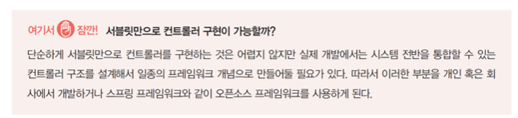

### 구성하는 세가지 방법

1. 사용자 요청마다 컨트롤러를 만들기
2. 특정 모듈 단위로 하나의 컨트롤러 안에서 여러 요청 단위를 구분해 처리하기
   * 2학년2학기때 한 방법이 해당 방법이다.
3. 프런트 컨트롤러를 따로 두어 모든 요청을 하나의 컨트롤러로 모은 다음 요청에 따라 구현 컨트롤러를 호출하기
   * 해당 방법이 mvc2방법이라고 한다.

# 2. 서블릿 컨트롤러 설계

### 컨트롤러의 가장 기본적인 기능 세 가지

1. 클라이언트 요청 처리

   * 클라이언트 요청을 단일 컨트롤러에서 처리할 것인지 개별 컨트롤러에서 처리할 것인지 결정해야 함 

   * 서블릿은 URL 요청을 GET, POST 등의 HTTP 메서드를 통해 처리하는 구조이기 때문에 여러 URL 패턴을 하나의 서블릿에서 처리할 수 있지만 URL에 따라 다른 처리를 구현할 수는 없음

   * 예시1) 어떤 쇼핑몰의 제품 등록과 삭제 기능

     * 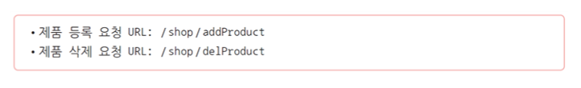
     * 이때 두 URL 요청을 하나의 서블릿으로 처리하도록 URL 매핑 설정을 할 수 있으나, 두 요청 모두 GET 방식이라면 URL이 다르더라도 동일한 doGet( ) 메서드가 호출되기 때문에 어떤 요청이 호출된 것인지 구분할 수 없음 
       * 한가지는 doget 한가지는 dopost 형식으로 하던지 다 다른 방식의 주소로 바꾸던지로 결정해야한다.
     * 따라서 각각의 URL 요청을 별도의 서블릿으로 구현해야 함
     * 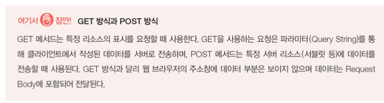

     

   * 예시2) 회원 관리 프로그램의 회원 가입, 승인, 수정, 탈퇴(삭제), 로그인 기능

     * 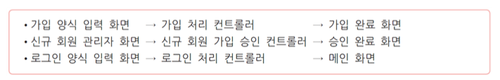
     * 각각의 요청을 처리하기 위한 컨트롤러가 있어야 함
     * 즉 입력/요청 화면과 입력 데이터를 받아 이를 처리하는 컨트롤러, 처리된 결과를 보여주기 위한 화면이 필요함
     * 이 경우 각각의 컨트롤러를 구현해야 하지만 같은 단위의 업무를 하나의 컨트롤러에서 처리하는 것이 구조적으로 관리가 쉬울 수 있음 
       * 물론 하나의 컨트롤러에서 처리할 요청이 지나치게 많은 경우 오히려 코드 관리가 어려울 수 있으므로 주의해야 함

   * 사용자의 요청을 구분해 하나의 서블릿에서 처리하기 위한 두 가지 방법

     1. URL의 파라미터 이용
     2. 프런트 컨트롤러 구현

   * URL의 파라미터 이용

     * ​    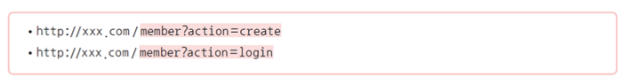
       * **member**: 서블릿 URL 매핑값
       * **action**: 요청을 구분하기 위한 파라미터
     * 요청에는 회원 정보, 로그인 아이디 등의 사용자 데이터가 추가로 포함됨
     * GET, POST 방식이 모두 가능함
     * 컨트롤러에서는 action 값을 비교하여 별도의 메서드 구현 등의 방식으로 처리함
     * 비교적 간단한 방법이지만 action 파라미터의 구조가 변경되며 관련된 HTML, JSP, 컨트롤러의 수정이 필요하다는 단점이 있음

     

   * **프런트 컨트롤러 구현(1)**

     * 모든 요청의 진입점이 되는 컨트롤러가 있고 여기서 서브 컨트롤러를 호출하는 구조 
     * 좀 더 복잡한 구조를 체계적으로 처리할 수 있음 
     * 프런트 컨트롤러 패턴으로 정립되어 있어 여러 구현에 응용되는 디자인 패턴임
     * 모든 요청을 하나로 모으는 방법이 필요하며, 일반적으로는 서블릿 매핑의 구조적인 특징을 활용함
     * ​          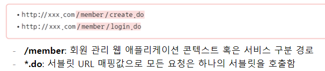
     * 컨트롤러에서는 .do 앞의 요청 이름(create, login)으로 구분하여 별도의 메서드 혹은 서브클래스를 통해 실행함

   * 프론트 컨트롤러의 장점 

     * 요청에 대한 파라미터 없이 명확한 이름(전 예시의 create, login)으로 요청할 수 있음 

     * 요청에 대한 URL 관리가 필요 없음

       

   * 프론트 컨트롤러의 단점

     * 전체 시스템이 세부 시스템이 분리되어 있는 경우: 콘텍스트를 분리하는 것은 세션 관리 등에 부담이 갈 수 있음 

       * 예) 네이버와 같은 포털 형태

     * 단일 콘텍스트에 경로로 구분하는 경우: 프런트 컨트롤러에서 모든 요청을 조건문과 메서드 구현만으로 처리하기에는 컨트롤러 클래스가 비대해짐

     * → 규모가 어느 수준 이상이 되면 경로에 따라 **서브 컨트롤러로 포워딩하는 처리**가 필요함 

       

   * 서브 컨트롤러 구현하기

     * URL 요청을 분석해 사용자 요청을 구분하는 작업이 우선적으로 필요함

     * 메서드를 이용해 사용자 요청을 분리해서 처리함 

       * switch(혹은 if) 문을 사용하는 구조는 기능 추가 또는 변경이 필요할 때 조건문도 함께 관리해야 하는 문제가 있음 

     * 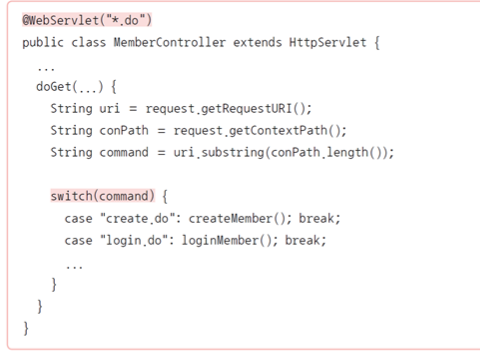

       

   * 서브 컨트롤러 구현하기

     * Command 패턴을 사용하면 switch(혹은 if) 구조 없이해당 요청에 맞는 특정 컨트롤러가 실행되도록 구현할 수 있음
     * 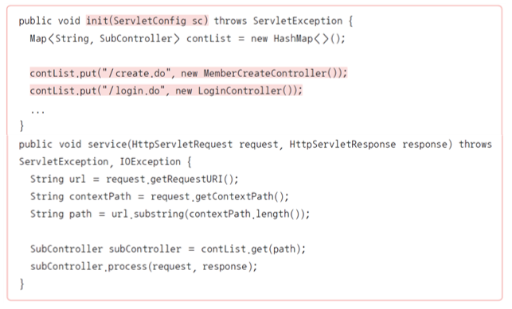
     * Map에 해당 주소를 키값으로 저장하고 해당 클래스를 값으로 집어넣은 후, 해당 경로를 가진애를 Map에서 호출하는 형식이다.

   * 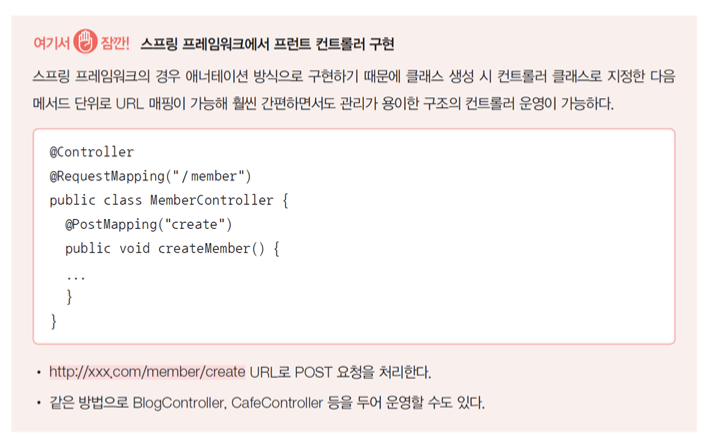

2. 입력값 핸들링
   * 서블릿에서 클라이언트의 입력값을 처리하려면 request.getParameter( )를 이용해야 함 
   * 파라미터가 한두 개라면 문제없겠지만 회원 가입과 같이 여러 정보가 전달되는 경우  모든 값을 request.getParameter( )로 받는 것은 문제가 됨 
   * 또한 DAO 클래스와 연동을 위해서는 입력값을 Member 객체로 만든 후에 전달해야 하므로 기본적으로 다음과 같은 코드 구현이 필요함
   * 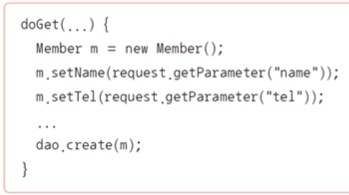
   * JSP에서는 useBean 액션을 통해 입력값을 Member 객체로 쉽게 만들 수 있었음 
   * 서블릿에서는 그런 기능이 제공되지 않기 때문에 별도의 라이브러리를 사용해야 함 
   * 대표적으로 Apache Commons BeanUtils가 쓰임
   * 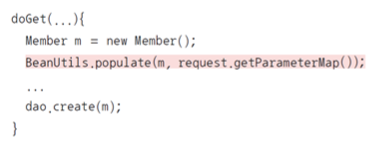
   * 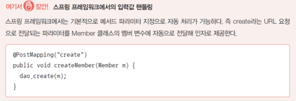

3. 뷰 이동

   * 컨트롤러에서 사용자 요청을 처리한 다음에는 적절한 뷰로 이동할 수 있어야 함 

   * 뷰에서 보여줄 데이터를 포함해서 이동해야 하는 경우와 그렇지 않은 경우로 나뉨

     

   *  데이터를 포함하지 않는 경우

     * 사용자 요청 처리 후 별도의 데이터를 포함하지 않는다면 해당 페이지로 리디렉션Redirection할 수 있음 

     * JSP, 서블릿 모두 response.sendRedirect( )를 사용함

     * 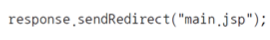

       

   * 데이터를 포함하는 경우
     * request scope object에 속성으로 데이터를 넣은 후 원하는 페이지로 포워딩함 
     * 데이터 활용 목적에 따라 session 또는 application을 사용할 수도 있으며 여러 데이터를 포함하는 것도 가능함
     * 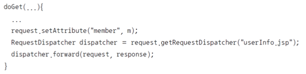
     * 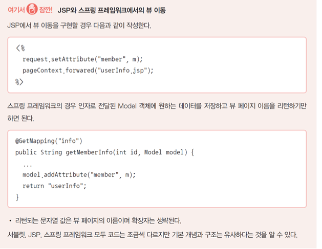

# 3.[실습 8-1] 컨트롤러 기초 예제 : 계산기 구현

### calcForm.html

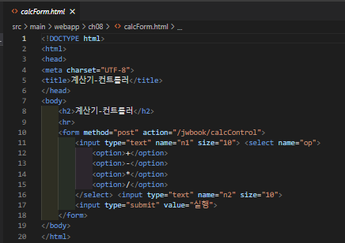

### calcResult.jsp

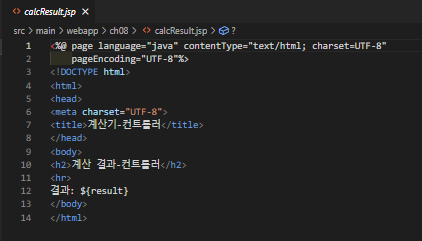

### calcController.java

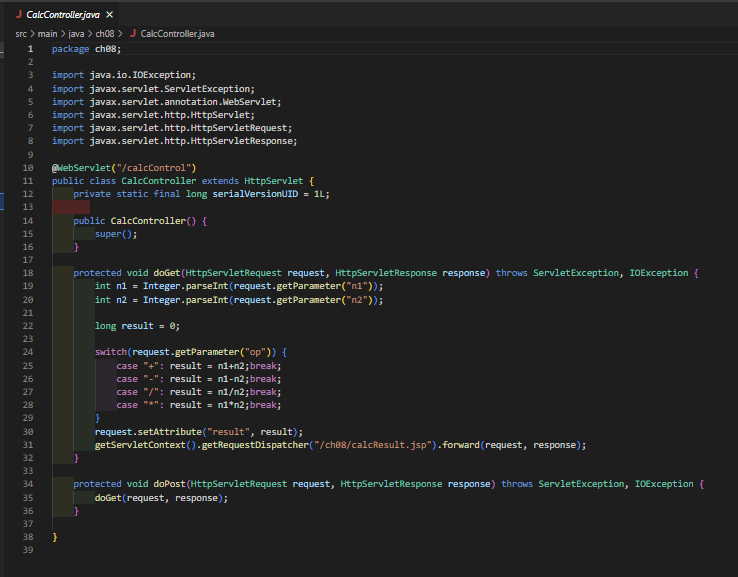

# 4. [실습 8-2] 고급 컨트롤러 서블릿 구현

### productList.jsp

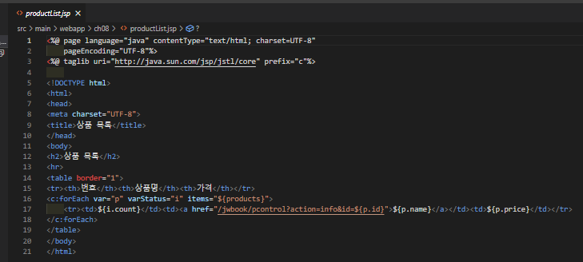

### productInfo.jsp

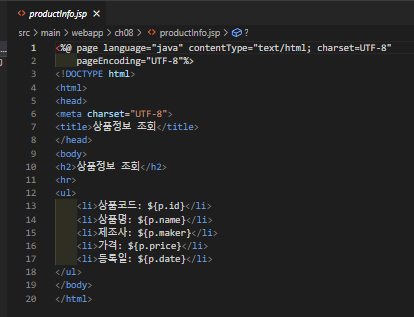

### product.java

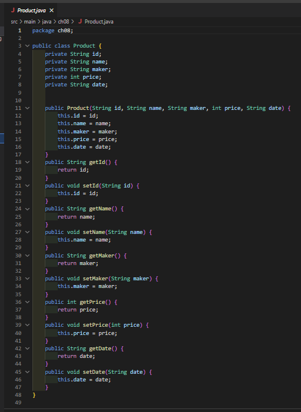

### productService.java

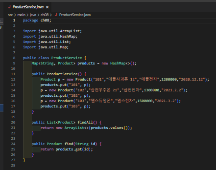

### productControllder.java

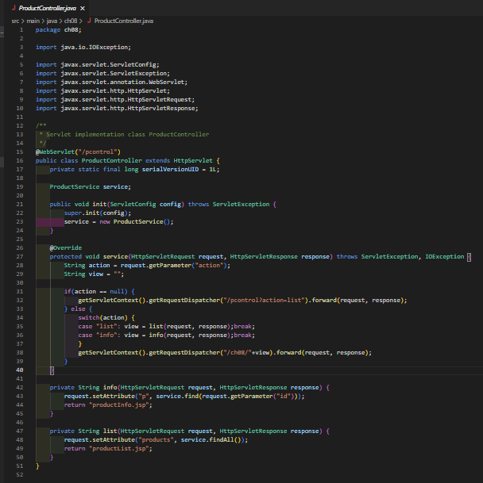
