# 1. 데이터베이스의 개요

### 데이터베이스(Database)

* 사전적으로 여러 사람이 공유하여 사용할 목적으로 체계화하여 통합, 관리하는 데이터의 집합을 의미함 

* 데이터베이스는 방대한 데이터를 쉽게 검색하거나 찾을 수 있도록 체계적으로 분류하고 정리해둔 정보의 집합

* 디지털화된 정보만 의미하는 것은 아님

### DBMS(DataBase Management System)

* 데이터베이스는 DBMS라고 불리는 소프트웨어 시스템을 사용함
* DBMS는 효과적인 데이터 파일 관리와 운영을 위한 구조와 함께 인덱싱, 캐싱, 네트워크 서버, 사용자 및 권한 관리, 백업/복원, 클러스터링 등 다양한 기능을 제공함
* DBMS의 종류: Oracle, MySQL, IBM DB2, MS SQL 등
* 데이터베이스와 데이터베이스 관리 시스템인 DBMS는 다른 의미이지만 보통 데이터베이스라고 하면 DBMS를 포함한 개념을 의미함

### 데이터베이스의 일반적인 특징

* 데이터 중복을 최소화할 수 있음
* 데이터를 쉽게 공유할 수 있음
* 일관성, 무결성, 보안성이 유지됨
* 최신 데이터를 유지할 수 있음
* 데이터의 표준화가 가능함
* 데이터의 논리적·물리적 독립성이 유지됨
* 데이터 접근이 용이함
* 데이터 저장 공간을 절약할 수 있음

### 관계형 데이터베이스(Relational DataBase Management System, RDBMS)

* 전통적이고 가장 보편적인 형태의 데이터베이스이며, 관계를 가지는 데이터 구조가 필요한 경우 가장 적합한 데이터베이스임
* 테이블(Table): 칼럼과 로우 구조로 데이터 구조를 정의하고 관리함 
* SQL(Structured Query Language): 데이터를 관리하는 질의어임. 특히 테이블과 테이블의 관계 지정을 통해 연관성 있는 데이터를 체계적으로 구조화할 수 있음
* 관계형 데이터베이스의 종류: Oracle, IBM DB2, MS SQL, MySQL 등
* 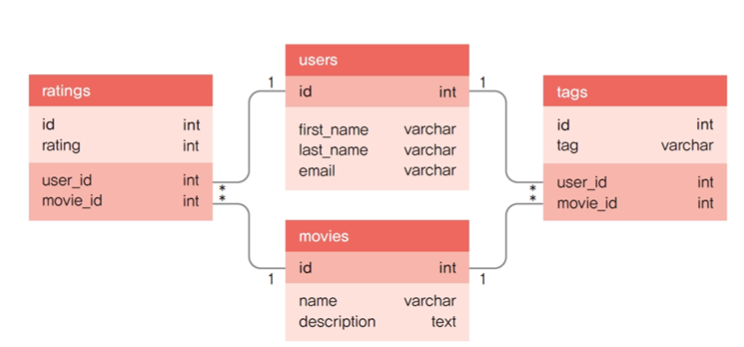

#### 관계형 데이터베이스의 장점

* 다양한 용도로의 사용이 가능하며 높은 성능을 보여줌
* 데이터의 일관성이 보장됨
* 정규화를 통해 갱신 비용을 최소화할 수 있음
* 구조화되어 있고 동일한 구조를 가지는 데이터를 다룰 때 유리함

​    

#### 관계형 데이터베이스의 단점

* 데이터 구조의 변경(칼럼의 수정이나 확장)이 어려움

* 빠른 속도를 요구하는 단순한 처리에 대응하기 어려움

* 데이터 관계는 유용하지만 그로 인한 처리 속도 저하가 발생할 수 있음

### NoSQL 데이터베이스

* 말 그대로 SQL을 ‘사용하지 않는다(No)’는 의미로, ‘SQL을 사용하는 전통적인 RDBMS가 아니다.’라는 의미로 사용되는 데이터베이스를 말함 
* SQL과 다를 수 있지만 데이터 관리를 위해 별도의 쿼리 언어나 구조는 존재함
* NoSQL은 RDBMS의 가장 큰 특징인 테이블 형태의 데이터 구조를 사용하지 않기 때문에 형태가 고정되지 않은 비정형 데이터 처리에 유용함 
* NoSQL의 종류: MongoDB, Redis, Casandra, Hbase, CouchDB 등
* 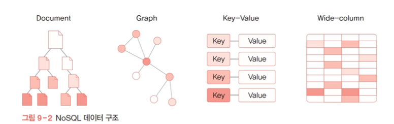

### NoSQL 데이터베이스의 장단점

* 대용량 데이터 처리에 유리함
* 분산 처리에 적합함
* 클라우드 컴퓨팅 환경에 적합함
* 빠른 읽기/쓰기 속도를 제공함
* 유연한 데이터 모델링(비정형)이 가능함
* 복잡한 데이터 관계를 표현할 때 중복 데이터가 발생할 수 있음
* 모든 데이터가 동일한 구조를 가지고 있지 않은 경우에 유리함 
* 빠른 처리 속도를 위해 필요한 데이터를 다른 테이블 등에서 참조하지 않고 데이터 자체에 포함하는 구조에 적합함

### 데이터베이스 특징 비교

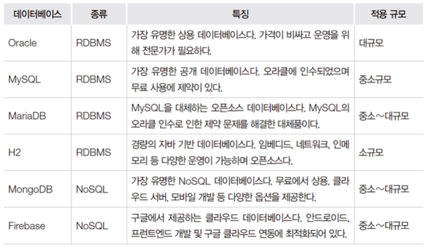

* 오라클이 가장 비싸고 제일 많이 사용하는 데이터베이스다.
* 본인에게 맞는 데이터베이스를 사용하면 된다.
* 일반적으론 mySQL추

### H2 데이터베이스를 추천하는 이유

* 별도의 설치나 관리가 필요 없음(JDBC 드라이버만으로 사용 가능)
* 임베디드 모드, 네트워크, 인메모리 등 다양한 운영이 가능함
* 앱 배포 시 포함이 가능함
* 용량과 메모리 사용이 적음
* 표준 SQL을 모두 지원하고 JPA와의 연계도 용이함
  * 자바 스프링 연습할때 많이 사용한다.

# 2. 관계형 데이터베이스

### 테이블

* 관계형 데이터베이스에서 데이터 관리의 기본 구조 
* 데이터가 가지는 공통적인 속성을 모아 정의한 칼럼(필드)으로 구성됨 
* 칼럼에 저장되는 데이터는 숫자형, 문자형, 날짜형, 불형(Boolean) 등으로 구분됨 
* 파일과 같은 바이너리 데이터를 저장하거나 매우 긴 텍스트를 저장할 수 있는 자료형도 있음
* 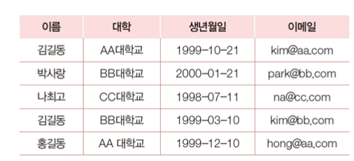

### 칼럼(Column)

* 테이블을 구성하는 기본 속성으로 필드, 어트리뷰트라고도 불림
* 각각의 칼럼에 저장되는 데이터는 동일한 타입이어야 하며 구체적인 자료형은 데이터베이스마다 차이가 있음

​    

### 로우(Row)

* 하나의 데이터셋을 의미하며 레코드 혹은 튜플이라고도 함

### 자료형

* 칼럼에 들어갈 수 있는 데이터 유형
* 일반적으로 숫자형, 문자형, 날짜형, 불형(Boolean) 등으로 구분
* 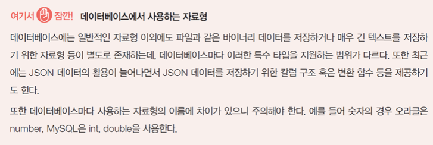

​    

### 제약 조건(Constraint)

* 칼럼에 부여되는 일종의 속성으로 저장될 데이터에 대한 요구사항 
* 제약 조건은 데이터베이스 자체적으로 저장될 데이터에 대한 요구 조건을 설정함
* 따라서 제약 조건을 벗어나는 데이터는 원천적으로 차단됨 
* 데이터베이스의 무결성(Integrity)을 지키기 위한 방법이 됨
* 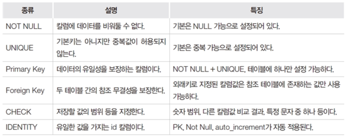

### 키(Key) 

* 관계형 데이터베이스의 제약 조건 중 하나 
* 데이터의 유일성 및 관계 설정을 위해 사용됨 
* 적절한 키의 사용은 데이터베이스 설계에서 매우 중요한 요소임

### 기본키(Primary Key, PK)

* 주키, 프라이머리키라고도 불림 
* 테이블에 저장된 레코드(로우)를 서로 구분할 수 있도록 특정 칼럼에 설정하는 제약 조건 
* 기본키가 존재하지 않으면 데이터가 중복되고 특정 데이터 검색에 오류가 발생하기 때문에 꼭 설정되어 있어야 함
* 보통 기본키는 시퀀스(Sequence)라 불리는 단순 증가 값을 사용함 
* 단순 증가 값은 1부터 시작해서 1씩 단계적으로 증가하는 숫자로, 단순히 데이터를 서로 구분하는 용도로만 사용함

### 외래키(Foreign Key, FK)

* 테이블 간의 관계를 설정하기 위해 사용하며 참조 무결성을 제공하기 위한 용도
* 데이터의 의미는 동일하지만 검색에서 문제가 발생함 
  * 같은 학교임에도 AA대학교 or AA 대학교 or 에이에이 대학교 등과 같이 조건 검색을 해야 하는 문제가 발생함
* 이러한 문제를 원천적으로 차단하기 위해서는 등록 가능한 대학정보 테이블을 별도로 두고 이를 참조할 수 있도록 외래키를 등록해 사용해야 함

​    

### 시퀀스(Sequence)

* 기본키 칼럼을 관리하기 위해 사용하는 데이터베이스 객체
* 보통 데이터를 추가할 때 순차적으로 증가하는 값을 자동으로 생성함
* 최근의 데이터베이스는 auto increment, auto_increment와 같은 속성을 칼럼에 추가하는 것으로 자동 증가 값을 사용할 수 있음

### 트랜잭션(Transaction)

* 프로그램에서 어떤 이벤트가 발생했을 때 여러 테이블의 데이터를 차례로 변경해야 하는 경우가 많이 발생함

* 예) 동일 은행의 A계좌에서 B계좌로 이체한다고 했을 때 

  * 계좌는 테이블로 볼 수 있음 

  * A계좌에서 100만 원을 차감한 후 B계좌에 100만 원을 추가하면 계좌이체가 완료됨 

  * 이때 A계좌에서 차감 후 B계좌에 추가하는 과정에서 에러가 발생하면 A계좌에서 차감했던 금액은 다시 원래대로 되돌려야 함
  * 이렇게 안하면 시스템에 문제가 생겨서 에러가발생하면 돈은 날라가고 추가가안되는 상황이 되는 둥 문제가 심각해 질 수 있음.
  * 그래서 A의 돈 100만원을 뺴서 B계좌에 넣는 행동을 하나의 트랜잭션으로 묶어서 처리해야한다.

* 이때 트랜잭션이란 하나의 논리적 기능을 수행하기 위해 여러 작업을 묶어서 처리하는 것을 의미함
* 이러한 트랜잭션은 데이터베이스 혹은 미들웨어 레벨에서 처리할 수 있어야 함

### Commit 과 rollback

데이터베이스에서 제공하는 트랜잭션 관리를 위한 명령

* commit: 모든 데이터의 변화를 실제 적용함

* rollback: 문제 발생 시 현재까지의 변화를 원래대로 되돌림

* A~C 순으로 진행되는 트랜잭션의 처리 과정
* 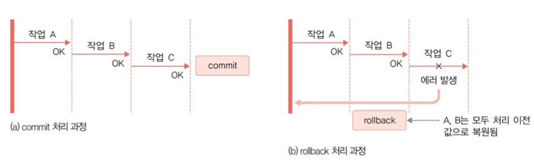

​    

# 3. H2 데이터베이스

### H2 데이터베이스

* 보통 임베디드 데이터베이스로 알려져 있으며 MySQL과 같은 관계형 데이터베이스 관리 시스템임 
* 복잡한 프로그램의 설치가 필요 없고 데이터베이스 파일만 있으면 언제든지 데이터베이스를 실행할 수 있어 프로그램에 포함해서 배포하는 것도 가능함
* 운영 데이터베이스와 상관없이 관계형 데이터베이스를 사용하고 특정 데이터베이스 종속 기능 없이 구현하는 경우 H2와 같은 경량 데이터베이스를 이용해 개발하기도 함

​    

### H2 데이터베이스의 세 가지 모드

* 임베디드 모드

  * 프로그램에서 JDBC URL을 이용해 접속하거나 console 웹을 통해 관리함

  * 데이터 파일만 있으면 동작함

  * 가장 간단하고 지정된 데이터 파일이 없다면 자동 생성하므로 언제든 실행 가능함

  * 톰캣이 실행된 상태에서는 별도의 도구를 통해 데이터베이스 관리가 불가능함

  * 파일을 사용하기 때문에 동시 다중 접속이 불가능하므로 개발이나 테스트가 불편함

    ​    

* 인메모리 모드

  * 프로그램에서 JDBC URL을 이용해 접속하거나 console 웹을 통해 관리함
  * 데이터베이스를 메모리상에서만 운영하는 모드로 처리 속도가 빠름
  * 프로그램 종료 시 데이터가 소멸되기 때문에 일반적인 애플리케이션에는 부적합함

  

* 네트워크 서버 모드
  * H2 데이터베이스를 내려받아 설치한 후에 JDBC를 이용해 접속하거나 console 웹을 통해 관리함
  * 일반적인 데이터베이스와 같이 네트워크 서버로 동작하는 방식임
  * 동시 다중 접속이 가능함
  * 별도의 프로그램 실행과 관리가 필요하기 때문에 데이터베이스 서버를 별도로 실행해야 함
  * 이번 실습에서는 일반적인 데이터베이스 운영 형태인 네트워크 서버 모드를 사용함

# 4. SQL의 개요

### SQL(Structured Query Language)

* 관계형 데이터베이스에서 데이터를 관리하기 위한 쿼리 언어로 대부분의 프로그래밍 언어보다는 단순한 구조를 가지고 있음 
* SQL 자체는 표준 언어이지만 데이터베이스마다 세부적인 차이가 있을 수 있기 때문에 데이터베이스와 호환이 되지 않을 수도 있음
* SQL은 단순히 데이터 관련 작업 이외에 데이터베이스 자체의 관리 기능 수행에도 사용됨

### SQL에서 할 수 있는 일

* 새로운 테이블 생성
* 내장 프로시저Stored Procedure 생성
* 뷰 생성
* 테이블, 프로시저, 뷰 등의 접근 권한 부여
* 데이터베이스에 대해 쿼리 실행
* 데이터베이스로부터 데이터 조회
* 데이터베이스에 기록 삽입, 갱신, 삭제
* 새로운 데이터베이스 생성

### DDL(Data Definition Language)

* 테이블의 생성, 수정, 삭제와 같은 관리 기능을 제공하는 SQL 문
* 스키마, 테이블, 시퀀스, 인덱스, 사용자, 권한 객체를 생성하고 관리하기 위한 명령
* 테이블의 생성, 수정, 삭제와 같은 관리 기능을 제공하는 SQL 문을 의미함 
* DDL을 통해 데이터베이스 스키마, 테이블, 인덱스 등 데이터 저장 및 운영을 위한 객체의 생성과 관리가 가능함

* CREATE

  * 테이블을 생성할 때 사용하는 명령어
  * 각 칼럼의 자료형과 최대 크기를 명시해야 함 
  * 필요에 따라 칼럼에 제약 조건과 속성을 추가할 수 있음 
  * 마지막 칼럼 설정 뒤에 ‘,’를 넣지 않도록 주의

  

*  ALTER

  * 테이블 구조를 수정할 때 사용하는 명령어

  * 테이블에 데이터가 들어가 있는 상태에서는 구조 변경에 여러 제약이 따름 

  * 따라서 테이블을 수정하기 전에 신중히 테이블을 생성하는 것이 좋음

  * 테이블에 데이터가 들어가 있을 때 수정 제약 사항

    * 칼럼의 자료형은 변경할 수 없음
    * 칼럼의 크기를 줄일 수는 없고 늘리는 것만 가능함
    * NOT NULL 속성을 갖는 필드는 추가할 수 있으나, NULL 속성이 있는 필드는 추가할 수 없음

    

*  DROP

  * 테이블 자체를 삭제하는 명령어 
  * 데이터와 함께 테이블과 연관되어 정의된 인덱스, 룰, 트리거, 제약 조건도 함께 삭제되므로 주의해야 함    
  * RESTRICT: 기본값으로 삭제 테이블이 다른 곳에서 참조되고 있다면 삭제를 중지함
  * CASCADE: 삭제 테이블과 의존관계가 있는 모든 개체를 함께 삭제함

  

*  SHOW

  * 테이블 정보를 조회하기 위해서는 데이터베이스마다 제공되는 별도의 명령 혹은 스키마 구조에 접근하는 쿼리를 사용해야 함 
  * H2에서는 다음과 같이 SHOW 명령어를 이용하여 테이블 정보를 확인할 수 있음

​    

### DML(Data Manipulation Language)

* 테이블의 데이터를 조작할 때 사용하는 SQL 문

* 데이터 조작의 기본 기능인 CRUD(Create, Read, Update, Delete)와 관계된 명령으로 이루어짐

* INSERT

  * 테이블에 데이터를 추가하기 위한 명령어
  * 전체 칼럼값을 모두 추가하는 경우 
    * VALUES에 오는 값의 순서는 테이블을 생성할 때 지정한 칼럼 순서와 반드시 일치해야 함
    * 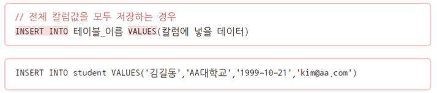
  * 부분 칼럼 데이터만 저장하는 경우
    * NOT NULL 칼럼은 반드시 포함되어야 하며 auto_increment 속성이 적용될 칼럼은 비움
    * 

*  SELECT

  * 테이블에서 데이터를 조회하기 위한 명령어

  * 전체 데이터 혹은 조건에 맞는 데이터만 조회가 가능함 

  * 데이터베이스에서 제일 중요한 쿼리임

  * 효율적인 조회를 위한 작업

    * 여러 테이블의 데이터를 조합해서 조회하기

    * 외래키 칼럼의 코드 데이터를 참조 테이블의 이름 칼럼으로 대체하기

    * 날짜 형식 변경하기

    * 데이터 정렬 또는 집계하기

      

  * SELECT를 통한 단일 테이블 조회

    * 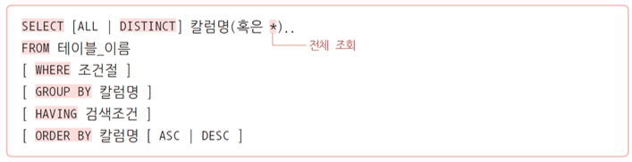
    * 특정 칼럼을 지정하거나 전체 칼럼(*)을 조회할 수 있음
    * DISTINCT: 중복된 값은 제거하고 가지고 옴
    * WHERE: 검색 조건을 지정할 때 사용함
    * GROUP BY: 특정 칼럼을 그룹화할 때 사용함
    * HAVING: 특정 칼럼을 그룹화한 결과에 조건을 설정할 때 사용함
    * ORDER BY: 특정 칼럼을 기준으로 오름차순(ASC)/내림차순(DESC) 정렬할 때 사용함
    * 

    

* DELETE

* UPDATE

* 데이터 조회 함수

  * 데이터 조회의 편의를 위해 제공되는 데이터베이스마다의 전용 함수
  * 이번 예제는 데이터 조회 함수 테스트를 위해 가상의 테이블인 DUAL과 SELECT 문을 사용함

* 숫자 관련 함수
  * 숫자를 조작하기 위한 함수
  * ABS(절댓값), CEILING(올림), ROUND(반올림), FLOOR(버림), SQRT(제곱근) 등
  * 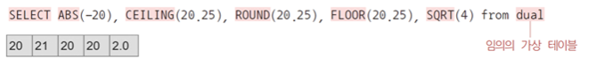

* 문자 관련 함수
  * 문자, 문자열을 조작하기 위한 함수
  * ASCII(아스키코드값), LENGTH(길이), CONCAT(문자열 결합), TRIM(양쪽 공백 제거) 
  * LOWER(소문자 변환), UPPER(대문자 변환), SUBSTRING(부분 선택) 등

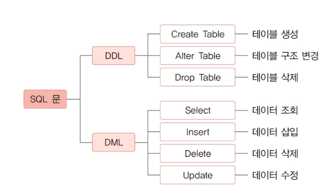

### 조인

* 관계형 데이터베이스에서 2개 이상의 테이블이나 데이터베이스를 조합해 데이터를 검색하는 것

* 조회하고자 하는 칼럼이 서로 다른 테이블에 있을 경우에 주로 사용함

* 여러 개의 테이블을 마치 하나의 테이블인 것처럼 사용할 수 있는 방법임

* 기본키(PK)와 외래키(FK)로 연결된 두 테이블의 데이터를 조합하기 위해 사용할 수 있음

* 조인은 여러 유형이 있으며 조인을 통해 여러 번 쿼리를 보내거나 결과를 프로그램에서 조합할 필요 없이 한 번의 쿼리로 원하는 데이터 구조를 받아볼 수 있

* 조인 형태: Inner Join, Outer Join, Cross Join, Self Join 등

  

* 학생과 부서 테이블이 존재하는데 애네 두개를 많이 조인해서 보여준다면
  * DB에 view를 만들어서 조인한 결과를 보여주는것이 효과적이다.
  * view는 테이블이 아니다 일시적으로 보여주는것일뿐.

* 정규화는 결국 테이블을 계속해서 쪼개는 것이다.
* 서브쿼리로 통계같은거를 보여줄때도 view를 통해서 보여주는게 효과적일 수 있다.

# 5. [실습 9-1] SQL 실습 : 학생정보 목록생

# 6. JDBC 기본 구조와 API의 이해

### JDBC의 등장 배경

* 데이터베이스의 종류가 다양하기 때문에 개발에 많은 어려움이 있음 
* JDBC는 이러한 문제를 해결하기 위한 자바 애플리케이션에서 표준화된 방법으로 다양한 데이터베이스에 접속할 수 있도록 설계된 인터페이스임
* 따라서 애플리케이션 개발자는 각 데이터베이스에 대해 자세히 알지 못해도 JDBC API만 알면 모든 데이터베이스에서 동작할 수 있는 애플리케이션을 개발할 수 있음
* 응용 프로그램에서는 자바에 기본적으로 포함된 JDBC API(인터페이스로 규격만 정의하고 있음)를 사용해 프로그램 코드를 작성하고 실제 데이터베이스 연결은 각 데이터베이스 회사가 제공하는 JDBC 드라이버(JDBC API 구현 클래스)를 이용해 SQL 문으로 데이터를 조작하는 형태로 동작한다.

### JDBC의 구조

* JDBC API: 응용 프로그램에서는 자바에 기본적으로 포함된 JDBC API를 사용해 프로그램 코드를 작성함
* JDBC 드라이버(JDBC API 구현 클래스): 실제 데이터베이스 연결은 각 데이터베이스 회사가 제공하는 JDBC 드라이버를 이용함 
* SQL 문으로 데이터를 조작하는 형태로 동작함
* 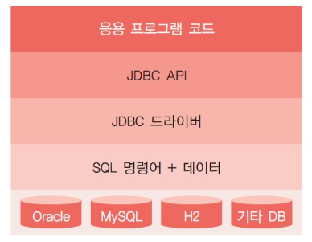

### JDBC 드라이버

* 자바 인터페이스로 정의된 일종의 규격이기 때문에 실제 구현된 클래스가 없으면 동작하지 않음
* 이때 실제 구현된 클래스를 JDBC 드라이버라고 부르며 라이브러리와 같은 개념임
* JDBC API를 사용하는 프로그램을 개발하거나 실행하는 과정에 해당 라이브러리가 반드시 필요함
* JDBC 드라이버는 보통 데이터베이스를 만드는 회사에서 직접 배포함

### JDBC 프로그래밍

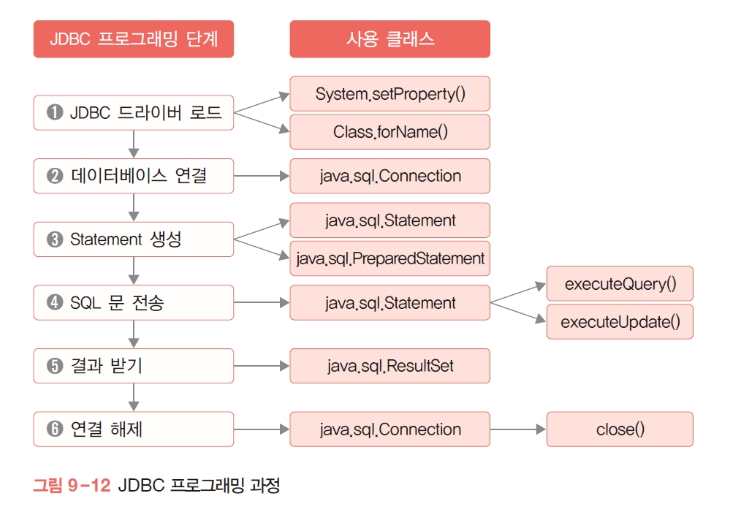

# 7. [실습9-2] JDBC 종합 실습 : 학생 정보 b 조회와 등록

### Student.java

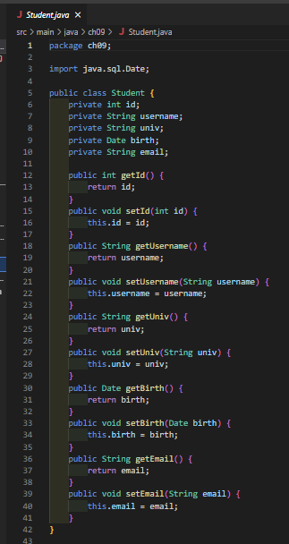

### StudentController.java

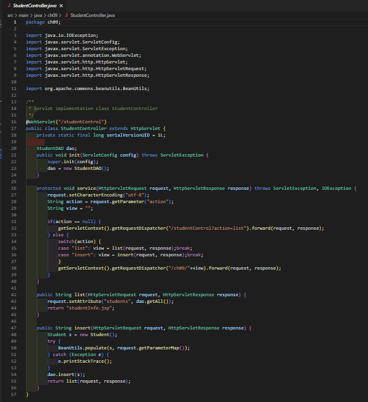

### StudentDAO.java

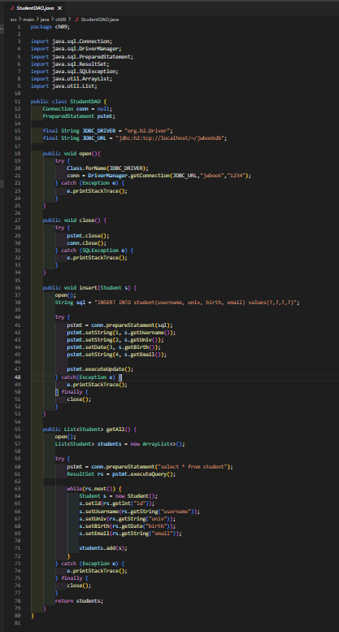

### studentInfo.jsp

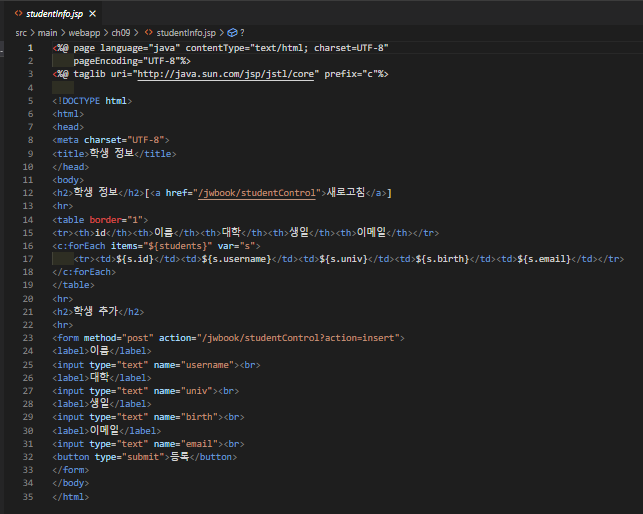

### sql_exam.sql

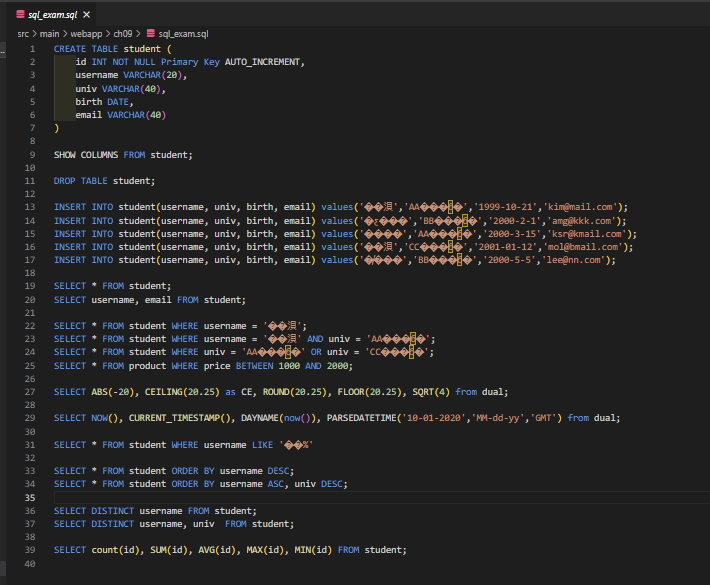
