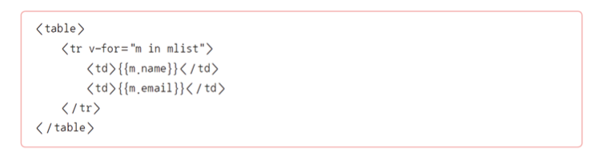
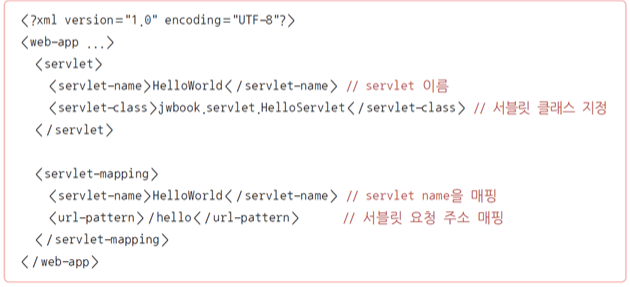
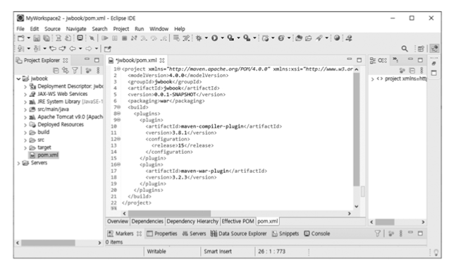

# 1. **HTML 기초** 

### HTML(HyperText Markup Language)

* 모든 웹 콘텐츠는 HTML로 이루어져 있음
* 웹 브라우저는 서버로부터 전달받은 HTML 문서의 구조를 해석해 화면을 구성함 
* 클라이언트인 웹 브라우저가 서버로부터 수신하는 데이터의 구조는 HTML임

​    

### 하이퍼텍스트(HyperText)

* 다른 정보와 연결된 텍스트를 의미하며 사용자가 관련 문서를 링크를 통해 이동하며 정보를 얻을 수 있음 

* 초기 월드 와이드 웹은 바로 이러한 
  정보의 연결에 중점을 두고 설계됨

  

### 마크업 언어(Markup Language)

* 텍스트에 의미를 부여하기 위해 문서에 주석을 다는 표현 시스템 
* 표현하고자 하는 정보가 있을 때 정보의 앞뒤에 태그(Tag) 표기를 달아 정보에 의미를 부여하는 형식 
  * 예) <h1>안녕하세요?</h1>
* XML(eXtensible Markup Language)
  * HTML보다 범용적으로 사용할 수 있는 마크업 언어
  * HTML : 사용할 수 있는 태그의 종류가 정해져 있음 
  *  XML : 자신만의 규격을 정의할 수 있음

### 태그(Tag)

* 태그는 < >를 사용하여 나타냄 
* 태그는 일반적으로 시작과 끝을 표시하는 2개의 쌍으로 이루어져 있으며, 종료 태그 앞에는 /를 붙여야 함 
* 사용할 수 있는 태그는 표준으로 정해져 있으며 태그마다 역할이 다름
* 

### 태그의 특징

* 모든 태그가 종료 태그를 가지는 것은 아님
* 태그 이름은 대소문자를 구분하지 않음
* 태그에 추가적인 정보 부여는 속성을 사용함

### 속성(Attribute) 

* 태그에 추가 정보를 제공하기 위해 사용함 
* 사용할 수 있는 속성 역시 정해져 있음 
* 디자인과 관련된 속성은 거의 사용하지 않고 뒤에서 배울 CSS를 사용함

### 태그 보디(Tag Body)

* 시작 태그와 종료 태그 사이에 위치하는 내용(콘텐츠)을 의미함
* 대체로 텍스트가 위치하며, 다른 태그를 태그 보디에 둘 수도 있음 
  * 즉 태그 사이에 다른 태그를 위치시키는 것이 가능함
* 단, 태그 사이에 부모-자식 관계가 정해져 있는 경우 규칙을 따라야 원하는 결과물을 보여줌
* 

### 시맨틱 태그(Semantic Tag)

* HTML5에서 도입된 개념으로, 특별한 의미를 가지는 태그를 말함 
* 문서의 구조를 정의하는 데 주로 사용됨
* 시맨틱 태그 그 자체로는 별다른 역할을 수행하지 않고 화면 디자인에도 영향을 미치지 않지만 코드의 가독성을 높이는 데 도움을 줌 
  * 또한 부모-자식 관계 없이 다른 태그를 자유롭게 사용할 수 있음 

* 

### HTML 문서의 구조

* **<!DOCTYPE html>**: HTML5 문서를 선언하는 구문으로 웹 브라우저에 문서가 HTML5로 작성됨을 알림

* **<html> … </html>**: HTML 문서의 시작과 끝을 의미함

* **<head> … </head>**: CSS, 자바스크립트, 메타 태그 등이 위치함

  * < title > 태그 : 문서의 상단 제목을 표시

  * <meta> 태그 : 문서의 정보를 설정하는 등도 포함

* **<body> … </body>**: 문서 본문에 해당하는 부분으로 실제 화면에 나타나는 메인 부분

* 자동 생성된 HTML 기본 탬플릿의 예

  * 

  * 

### 제목 태그

* 제목 태그는 <h1>~<h6>까지 있으며, 숫자가 작을수록 큰 글자로 출력됨 
* 단순히 텍스트의 크기를 지정하는 용도가 아니라 문서에서 제목으로 사용될 텍스트에 사용하는 태그를 의미함
  * 어떤 의미에서는 시맨틱 태그로도 볼 수 있다. 
* 즉 <h1>~<h6>을 제목에서의 상-하위 개념으로 이해하는 것이 좋음
* 제목 태그가 중요한 이유는 SEO(Search Engine Optimization)임
  * SEO : 구글과 같은 검색 엔진에서 우리가 만든 HTML 문서의 내용이 잘 검색될 수 있도록 최적화 작업 

### 문단 태그

*  
 태그 : 문단(Paragraph)을 구분하기 위해 사용
   
   

* HTML에서는 연속된 공백이나 줄 바꿈은 단순한 공백으로 처리하기 때문에 문단 구분을 할 때는 
 태그를, 줄을 바꿀 때는   태그를 이용함

  * 줄 바꿈뿐만 아니라 공백도 별도 처리가 필요함 
  * 여러 공백을 표현하려면 ‘&npsp;’를 필요한 만큼 입력하거나 CSS로 여백 설정

### 목록 태그

* 목록 태그는 최신 HTML 문서 작성법에서 매우 중요한 부분임 

* 대다수의 콘텐츠가 목록 형태로 정의될 정도로 많이 사용됨 

  * 예) 신문기사 목록 : 하나의 신문기사는 
로 묶이고 이 안에 제목, 작성일, 신문사, 기자 이름 등이 목록으로 들어가는 구조

    

### 목록 태그 사용법

* 

### 블록 태그

* 라인 전체를 사용하는 태그 
* 즉 다른 태그 요소와 같은 라인에 배치할 수 없음

​    

​    

### 인라인 태그

* 다른 태그 요소와 같은 라인에서 나란히 배치될 수 있는 태그
* 경우에 따라 블록/인라인 두 가지 형식을 혼합한 ‘inline-block’속성을 사용하기도 함

​    

# 2. **CSS 기초** 

### CSS

* 글씨의 색상이나 크기, 이미지 크기나 배치 방법 등 웹 문서의 디자인 요소를 담당

​    

### CSS의 장점

* 웹 문서의 내용과 별개로 디자인만 바꾸거나, 디자인은 그대로 두고 웹 문서의 내용 변경이 용이함
* 다양한 기기(PC, 스마트폰 등)에 맞게 탄력적으로 디자인이 바뀌도록 반응형 디자인(Responsive Design)을 구현할 수 있음
* 동일한 문서 구조이더라도 서로 다른 CSS 테마 적용이 가능함

### CSS의 동작 원리

* CSS 구문은 선택자와 선언부로 구성됨
* 선택자는 디자인을 적용하고자 하는 HTML 요소이므로 선택자 정의가 중요함
* 선언부는 { } 블록을 사용하며, 다수의 속성을 포함함
* 각 속성 정의는 ‘속성:값;’ 형식이며 항상 세미콜론(;)으로 끝남
* 

### CSS를 HTML에 적용하기 위한 방법

* 인라인 스타일 시트 : HTML 태그에 CSS 속성을 정의함
* 내장 스타일 시트 : HTML 문서의 <head> 부분에 CSS 정의 부분을 포함함 
  * 주의할 점) 현재 작성한 문서에만 적용됨
* 외장 스타일 시트 : 별도의 CSS 파일을 생성한 후 HTML 문서에 링크로 포함함 
  * 주의할 점) 하나의 파일로 여러 문서에 적용 가능함

​    

### CSS의 중첩(Cascading) 적용 방식 

* CSS는 위에서 아래로 중첩되는 방식임
  * 외장 CSS에서 적용한 디자인 속성은 내장 스타일 시트에서 수정하거나 속성을 추가할 수 있음 
  * 셀렉터의 중첩에 의해 발생하는 경우에도 동일하게 적용됨

### 셀렉터(Selector)

* 선택자의 다른 명칭 
* HTML 문서에서 특정 부분을 선택하기 위한 구문을 의미함
* 기본적인 선택자 : 태그, 아이디, 클래스

​    

### 태그 셀렉터

* 태그는 HTML의 기본 구성요소로, 태그 이름으로 요소를 선택함
* 태그는 중복 사용되기 때문에 특정 영역을 선택하기보다는 공통 디자인 속성을 정의하는 데 사용됨
* 같은 디자인 속성을 적용할 여러 태그는 콤마(,)로 나열해 일괄 적용할 수 있음
* 

### 아이디 셀렉터

* 아이디(Id) 속성을 사용함 
* 문서에 존재하는 유일한 값으로 아이디를 지정하여 특정 요소를 가장 확실하게 선택할 수 있는 방법 
* 한 곳만 선택이 가능한 셀렉터로 보통 문서의 전반적인 구조에 해당하는 부분에 사용하고 서로 다른 문서 간에도 동일 규격을 따르는 경우 재활용이 가능하도록 설계
* 아이디가 선택자로 올 때는 HTML에서 지정한 아이디 앞에 #을 붙여 정의

### 클래스 셀렉터

* 가장 대표적인 CSS 셀렉터 
* 클래스(Class) 이름으로 구분해 스타일을 만들어두고 HTML에서 클래스 속성을 적용해 원하는 디자인을 적용하는 방법 
  * 즉 CSS 선언이 먼저이고 HTML에서 이를 사용하는 개념
* 재활용이 용이하고 누구나 사용할 수 있도록 라이브러리 등을 만드는 데도 기본이 되는 방법임
* HTML 요소의 클래스가 선택자로 올 때는 클래스 앞에 온점(.)을 붙여 정의함

# 3. **자바스크립트 기초** 

### 자바스크립트(Javascript)

* 정적인 HTML 콘텐츠에서 사용자와 상호작용하며 동적으로 변경하는 부분을 담당
* 객체(Object) 기반의 스크립트 언어로 기본적으로는 웹 브라우저에서 해석되는 인터프리터 언어임 
* Node.js와 같은 프레임워크를 사용하면 서버 프로그래밍에도 사용할 수 있음

​    

### 자바스크립트의 특징

* 동적이며 타입을 명시할 필요가 없는 인터프리터 언어
* 객체지향 프로그래밍과 함수형 프로그래밍을 모두 표현할 수 있음
* HTML의 내용, 속성, 스타일을 변경할 수 있음
* 이벤트를 처리하고 사용자와의 상호작용을 가능하게 함
* 서버와 실시간 통신 기능을 제공

### 자바스크립트가 사용되는 기능

* 최신 뉴스 제목, 뉴스, 환율 등이 자동으로 스크롤되는 화면
* 쇼핑, 뉴스 스탠드 등에서 현재 화면은 유지하면서 해당 콘텐츠의 페이지 섹션의 페이지만 좌우로 변경되는 화면
* 웹 페이지에 날씨 정보 출력(날씨 정보 사이트에 실시간 데이터 요청 후 출력)
* 홈쇼핑 등에서 웹 브라우저를 통한 고객 상담 채팅
* 클릭하면 숨겨진 메뉴가 나오거나 탭 형태의 화면 구성
* 선택에 따라 일부 화면이 바뀌거나 움직이는 형태

### 자바스크립트가 지원하는 프로그램 구성요소

* 변수, 함수, 객체, 클래스
* 반복문, 조건문
* 배열, 리스트, 맵(Map) 등의 자료 구조
* 비동기 처리 지원
* HTTP 요청 및 응답 처리
* HTML 문서에 접근할 수 있는 내장 객체와 함수 
* 이를 통해 DOM(Document Object Model)을 다룰 수 있음
* 객체를 정의하는 JSON(JavaScript Object Notation) 구문

### 자바스크립트의 문법적 특징

* 변수 타입을 따로 지정하지 않으며, 선언은 var, let, const를 사용함
* 범위 지정 없이 변수를 선언하면 전역변수가 되고 위치에 상관없이 호이스팅(끌어올림)되므로 주의해야 함
* 문자열을 표현할 때는 큰따옴표(“”)와 작은따옴표(‘ ’ )를 모두 사용할 수 있음
* 함수형 언어를 지원하며 함수는 변수, 함수 인자, 객체 멤버 등에 사용될 수 있음

<script> 태그는 HTML의 <head>와 <body> 영역 모두에서 사용 가능함
    하지만 DOM 접근을 위해서는 HTML 문서가 모두 로딩된 다음에 접근 가능

* JSON 구조를 광범위하게 사용함

### 이벤트 발생과 처리	

* HTML 문서에서 발생하는 특정 상황으로 이벤트 발생은 보통 자바스크립트 코드와 연계됨 
  * 예) 버튼 클릭, 마우스 이동, 마우스 클릭, 키보드 입력, 문서 로드, 창 크기 변경 등

​    

### 자바스크립트에서 이벤트를 처리하는 방법

* HTML 태그에 이벤트 처리 속성을 이용
* 문서 객체 모델DOM 요소에 속성을 추가
* DOM 요소에 addEventListener( )로 콜백 함수를 등록

### 문서 객체 모델(DOM)

* 자바스크립트에서는 DOM을 통해 HTML 요소에 접근할 수 있음 
* DOM은 텍스트로 된 HTML 문서를 프로그램적으로 처리할 수 있도록 문서 구조 전체를 객체화한 것을 의미함
* 

### DOM의 체계

* 태그 : 요소 노드(Element node)로 정의됨 
* 태그의 속성 : 속성 노드(Attribute node)가 됨 
* 태그 보디의 텍스트는 다시 텍스트 노드(Text node)가 될 수 있음 
* 경우에 따라서는 innerHTML 속성으로 표현하는 것도 가능함 
* 이러한 DOM 체계에 따라 모든 HTML은 브라우저에 의해 로딩될 때 각각의 요소가 하나하나 ‘부모-자식’ 관계를 가지며 [그림 3-7]과 같이 객체 트리 구조로 재구성됨

### 자바스크립트에서 DOM에 접근하는 방법

* 특정 태그, 아이디를 비롯해 CSS 셀렉터를 통한 요소 선택이 가능함
* **querySelector( )** : 선택자와 일치하는 첫 번째 노드만 가지고 옴
* **querySelectorAll( )** : 선택자와 일치하는 모든 노드를 가지고 옴

​    

* **getAttribute( ), setAttribute( )** : 가저온 요소의 속성에 접근

### 스타일 속성 변경

* 특정 태그 요소의 스타일 속성을 직접 변경하는 방식

​    

​    

### 스타일 객체 변경	

* 스타일 속성 변경과 동일한 방식이지만 코드 구현에서 차이가 있음 
* 태그의 속성을 문자열 형태로 지정하는 것이 아닌 객체 참조 방식으로 스타일 속성을 지정

​    

​    

### 클래스 변경

* 태그 노드의 스타일 속성이 아니라 클래스 변경을 통해 디자인을 변경하는 형식

# 4. [실습 3-1] **회원 가입 폼 만들기** 

#  5. [실습 3-2] **ToDo 리스트 앱 만들기**

# 1. 서블릿과 JSP

### 서블릿

* 자바 기반의 웹 프로그램 개발을 위해 만들어진 기술
* 자바로 작성된 프로그램을 실행할 수 있는 서버 소프트웨어(톰캣)를 통해 관리됨 
* 서블릿을 실행하기 위해서는 톰캣과 같은 서블릿 컨테이너가 필요함 
* 이러한 서버 소프트웨어는 일반적으로 WAS(Web Application Server)로 불리기도 함
* 기본적인 웹의 요청과 응답 과정

* 서블릿의 역할

  

### JSP의 등장 배경

* 서블릿은 HTML과 데이터를 조합하는 방식에 어려움이 있음
  * 

* 이를 해결하기 위해 JSP가 등장

### JSP(Java Server Pages)

* 서블릿에서 HTML과 데이터 결합을 손쉽게 처리하기 위해 만들어짐 

* HTML에서 자바 코드를 사용할 수 있는 구조

  * 따라서 JSP는 HTML에 자바 코드를 더한 형태로 구성되며, 컨테이너에 의해 서블릿 형태의 자바 코드로 변환 후 컴파일되어 컨테이너에 적재되는 구조가 됨

  ​    

* JSP 문법 자체는 page 지시어 선언 부분을 제외하면 HTML 파일 구조와 동일함

* CSS, 자바스크립트 사용 형식 또한 동일함

### JSP의 문제점

* 데이터를 반복해서 출력하거나 조건을 체크해야 하는 경우 단순한 HTML 문법만으로는 처리할 수 없기 때문에 자바 코드를 중간중간 사용해야 함

* 

  ​    

* HTML 부분은 서블릿 컨테이너(톰캣)에 의해 out.println( )을 사용하는 형태로 변환됨

* 따라서 JSP는 HTML이 아니라 서블릿 형태의 프로그램으로 변환되는 것임

### JSTL/EL

* JSP의 구조적 문제를 해결하기 위해 커스텀 태그를 기반으로 하는 JSTL(JSP Standard Tag Library) 및 EL(Expression Language)이 도입됨
* JSP보다 훨씬 구조적이고 가독성도 높음 
* MVC 패턴과 함께 서블릿과 결합되어 자바 웹 개발의 정석으로 자리 잡아옴

### JSP 대체 솔루션

* JSP의 주된 대체 솔루션인 스프링 프레임워크와 Vue.js에서 사용하는 형식
* 스프링 프레임워크의 기본 템플릿 엔진인 타임리프를 사용하는 경우
  * JSP와 EL 부분은 동일하지만 JSTL 대신 HTML 태그에 data-*- 속성을 사용하기 때문에 서버 실행 없이도 디자인 확인함

* JSP의 주된 대체 솔루션인 스프링 프레임워크와 Vue.js에서 사용하는 형식
* Vue.js를 이용한 클라이언트 사이드 렌더링(CSR)을 사용하는 경우
  * 타임리프와 유사하게 v-* 형태의 속성을 사용함 
  * 프런트엔드 방식이기 때문에 해당 속성은 자바스크립트로 동작하는 Vue.js에서 처리함

# 2. REST API와 JAX-RS

### REST(REpresentational State Transfer)

* 네트워크상에서 클라이언트와 서버 사이의 통신을 구현하는 방법 중 하나
* 대부분의 Open API는 REST 아키텍처를 기반으로 만들어져 있음

* 서버 응답을 앞에서 언급한 다양한 형태로 전달하는 개념임
  * HTTP의 기본 응답이 HTML인데 이를 JSON 등 다른 규격을 사용하는 것으로 접근함
  * 이에 따라 웹을 단순히 브라우저에서 콘텐츠를 이용하는 브라우저 서비스가 아닌 데이터를 주고받기 위한 API 서비스의 형태로 발전시킨 계기가 됨
* 안정되고 검증된 웹 기술을 그대로 사용할 수 있음
* 성능, 안정성, 보안, 백업, 분산 등 여러 인프라의 재활용이 가능함

### REST API의 동작구조

### 자바 웹 개발에서 REST API를 구현하는 방법

* JAX-RS 사용
  * 자바에서 REST API 개발을 위한 서버 프로그램의 표준 규격
    * 
* 스프링 프레임워크의 RestController 사용
  * 스프링 프레임워크 없이 개발한다면 JAX-RS를 사용함 
  * 스프링 프레임워크를 사용한다면 두 방법 중 한 가지를 선택해서 사용할 수 있음
  * 호환성을 위해서라면 JAX-RS를 사용하는 것이 좋음 
  * 스프링만 사용한다면 스프링의 RestController를 사용하는 것이 편리함
  * REST API만 스프링 프레임워크를 사용하는 경우
    * 

# 3.스프링 프레임워크와 자바 웹 개발

### 스프링 프레임워크(Spring Framework)

* 자바 기반의 오픈소스 프레임워크 
* Java EE에서 요구하는 수준의 복잡한 기능을 Java EE를 사용하지 않고 구현하고자 시작됨

​    

### 스프링 프레임워크의 특징

* 경량 컨테이너
  * 객체 생성, 소멸과 같은 생명 주기를 관리하며 스프링 컨테이너로부터 필요한 객체를 얻어 올 수 있음
* 제어의 역행(Inversion of Control, IoC) 지원
  * 메서드나 객체의 호출 제어권이 사용자가 아닌 프레임워크에 있어 필요에 따라 스프링에서 사용자의 코드를 호출함
* 의존성 주입(Dependency Injection, DI) 지원
  * 각 계층이나 서비스 간에 의존성이 존재할 경우 프레임워크가 서로 연결해줌
* 관점 지향 프로그래밍(Aspect-Oriented Programming, AOP) 지원
  * 트랜잭션이나 로깅, 보안과 같이 여러 모듈에서 공통적으로 사용하는 기능의 경우 해당 기능을 분리하여 관리할 수 있음

### 스프링 부트(Spring Boot)

* 스프링 프레임워크 프로젝트를 손쉽게 시작할 수 있도록 하며 개발과 관련한 스프링 구성요소를 편하게 관리할 수 있도록 함
* 2021년의 최신 스프링 프레임워크는 5.x로 핵심 프레임워크 외에 여러 서브 프로젝트로 구성되어 있으며 실제 사용은 주로 스프링 부트를 통해 이루어짐 
* 스프링 부트 2에서는 리액티브 스택(Reactive Stack)과 서블릿 스택(Servlet Stack)을 구분하고 있음

### 서블릿 스택(Servlet Stack)

* 기존과 같이 서블릿 API에 기반한 동기 방식의 블로킹(Blocking I/O) 구조를 사용하며 하나의 요청은 하나의 스레드로 처리됨 

* 아파치 톰캣과 같은 서블릿 컨테이너를 사용하며 전통적인 Spring MVC 기반의 서버 프로그램 개발과 JPA, JDBC, NoSQL 데이터베이스 지원을 포함함

  ​    

### 리액티브 스택(Reactive Stack)

* 새로운 비동기 논블로킹(Non-blocking I/O) 구조를 사용하며, 멀티코어 시스템의 장점을 살리고 대규모 사용자 접속을 처리하는 데 유용한 구조로 설계됨 
* 네티(Netty), 언더토우(Undertow) 및 서블릿 3.1 이상의 컨테이너를 사용하며 Spring WebFlux라고 하는 새로운 프레임워크를 사용해 개발함
* 최신 스프링 프레임워크의 사양이라고 해서 무조건 사용해야 하는 것은 아니고 필요에 따라 모델을 선택해 사용할 수 있음

### 리액티브 스택에 적합한 경우

* 비동기 논블로킹 리액티브 개발
* 효율적으로 동작하는 고성능 웹 애플리케이션
* 서비스 간 호출이 많은 마이크로 서비스 아키텍처MSA 구현
* 

# 1. 서블릿의 개요

### 서블릿의 동작 과정

* 서블릿 코드 작성, 컨테이너 등록, 클라이언트 요청에 따른 동작 과정

### 서블릿의 장점

* 자바를 기반으로 하므로 자바 API를 모두 사용할 수 있음
* 운영체제나 하드웨어의 영향을 받지 않으므로, 한번 개발된 애플리케이션은 다양한 서버 환경에서도 실행할 수 있음
* 웹 애플리케이션에서 효율적인 자료 공유 방법을 제공함
* 다양한 오픈소스 라이브러리와 개발도구를 활용할 수 있음

### 서블릿의 단점

* HTML 응답을 위해서는 출력문으로 문자열 결합을 사용해야 함
* 서블릿에서 HTML을 포함할 경우 화면 수정이 어려움
* HTML 폼 Form의 데이터 처리가 불편함
* 기본적으로 단일 요청과 응답을 처리하는 구조로 다양한 경로의 URL 접근을 하나의 클래스에서 처리하기 어려움

### 실제 자바 웹 개발에서의 서블릿 조합

* 화면 구성을 위해 JSP와 같은 템플릿 엔진을 사용
* REST API 구현을 위해서는 JAX-RS를 사용함
* 복잡한 서비스 구현을 위해 프런트 컨트롤러 모델 등을 사용함

# 2. 서블릿 클래스 구조와 생명 주기

### 서블릿 클래스의 구조

* 서블릿 자체는 자바로 구현하지만 서블릿 컨테이너에 해당 클래스가 서블릿임을 알려야 하며, 어떤 URL 접근에 실행해야 하는지 등록하는 과정이 필요함
* 서블릿 2.0 
  * 웹 애플리케이션 구조를 컨테이너에 알려주기 위한 배포 서술자 web.xml에 등록해야 함 
* 서블릿 3.0 
  * 별도의 web.xml 작성 없이 자바 애너테이션을 이용함

* javax.servlet.Servlet 인터페이스를 구현한 추상 클래스인 GenericServlet 클래스와 HttpServlet 클래스 중 하나를 상속해 구현함
  * HTTP 프로토콜에 최적화되어 있는 HttpServlet 클래스를 상속해 구현하는 것이 좋음 
* HttpServlet을 상속받아 doGet( ), doPost( ) 메서드를 오버라이딩한 구조

### HttpServletRequest

* HTTP 프로토콜의 request 정보를 서블릿에 전달하기 위한 목적으로 사용함 
  * 이때 사용하는 클래스에는 헤더 정보, 파라미터, 쿠키, URL, URI 등의 정보를 읽어 들이는 메서드와 HTTP Body의 Stream을 읽어 들이는 메서드를 가지고 있음 
* 서블릿 컨테이너에서 생성되고 클라이언트 요청이 doGet( ), doPost( )로 전달될 때 인자로 함께 전달됨
* 서블릿에서 클라이언트와 연결해 처리할 작업은 모두 HttpServletRequest를 통해야 함

### HttpServletRequest의 주요 메서드

### HttpServletResponse

* HttpServletRequest와 마찬가지로 클라이언트와 연결된 처리가 가능함
* 다만 클라이언트에서 서버로 전달하는 것과 관련된 것이 아니라 서버에서 클라이언트로 전달하려는 목적을 위한 기능으로 구성됨
* 서블릿 컨테이너는 요청 클라이언트에 응답을 보내기 위한 HttpServletResponse 객체를 생성하여 서블릿에 전달함 
* 서블릿은 해당 객체를 이용하여 content type, 응답 코드, 응답 메시지 등을 전송할 수 있음

### HttpServletResponse의 주요 메서드

### 서블릿 정보 등록

* 서블릿 클래스만으로는 톰캣에서 실행이 불가능하기 때문에 web.xml 이나 애너테이션으로 서블릿임을 선언해야 함
* 서블릿 2.x에서 사용 가능한 web.xml의 작성 예

* 서블릿 3.0에서 자바 애너테이션을 이용한 등록 
  * 필요하다면 web.xml을 사용하는 것도 가능하지만 애너테이션 사용이 권장됨

### 서블릿의 생명 주기

* 객체의 생성에서 종료에 이르는 과정

### 서블릿 초기화 : init()메서드

* 클라이언트 요청이 들어오면 컨테이너는 해당 서블릿이 메모리에 있는지 확인함

* 해당 서블릿이 메모리에 없을 경우에는 서블릿을 메모리에 적재해야 하는데, 이때 서블릿의 init( ) 메서드가 호출되며 각종 초기화 작업을 수행함 

* init( ) 메서드는 처음 한번만 실행되므로, 해당 서블릿에 각각의 스레드에서 공통적으로 사용하는 작업이 있다면 init( ) 메서드를 오버라이딩해서 구현함

* 만일 실행 중 서블릿이 변경되는 경우 기존 서블릿은 종료 Destroy되고 다시 시작되면서 init( ) 메서드가 호출됨

  

### 요청/응답 : service() 메서드

* init( ) 메서드는 최초에 한번만 수행되고 이후 요청은 스레드로 실행되며, service( ) 메서드를 통해 각각 doGet( )이나 doPost( )로 분기됨 
* 이때 파라미터로 HttpServletRequest와 HttpServletResponse 클래스 타입인 request와 response 객체가 제공됨 
  * request : 사용자 요청 처리
  * response : 응답 처리    

### 서블릿 종료 : destoy()메서드

* 컨테이너로부터 서블릿 종료 요청이 있을 때 destroy( ) 메서드를 호출함
* init( ) 메서드와 마찬가지로 한번만 실행되며, 서블릿이 종료되면서 정리해야 할 작업이 있을 때는 destroy( ) 메서드를 오버라이딩해서 구현함

# 3. 페이지 이동과 정보 공유

## 페이지 이동

### 데이터를 포함하지 않는 경우

* 사용자 요청 처리 후 별도의 데이터를 포함하지 않는다면 해당 페이지로 바로 리디렉션할 수 있음 
  * 세션에 데이터를 저장한 경우라면 세션이 유효한 동안 모든 페이지에서 세션 정보를 참조할 수 있어 리디렉션을 통해서도 데이터 참조가 가능함
* JSP, 서블릿 모두 response.sendRedirect( )를 사용할 수 있음

### 데이터를 포함하는 경우

* 데이터를 포함하여 이동한다면 request 속성으로 데이터를 넣은 후 원하는 페이지로 포워딩해야 함 
* 데이터 활용 목적에 따라 session이나 application을 사용할 수도 있으며 여러 데이터를 포함하는 것도 가능함 
* JSP로 구현할 경우

 

### 데이터를 포함하는 경우

* 서블릿으로 구현할 경우

  

* 스프링 프레임워크로 구현할 경

### URL rewriting 

* HTTP의 Query String을 이용하는 방식으로 URL에 파라미터를 추가해 서버로 요청하는 형식
* 정보 유지를 위해 파라미터를 매 페이지마다 확인하고 계속 추가해 주어야하며,
  복잡한 정보 유지는 어려움

### 쿠키(Cookie)

* 란 클라이언트에 저장되는 작은 정보를 의미함 
* 서버의 요청에 의해 브라우저가 저장하게 되며 서버가 요청할 때 제공하는 형식

​    

### 쿠키의 특징

* 파일로 클라이언트의 컴퓨터에 저장되는 방식이며 보안상 문제가 있을 수 있음
* 광고 혹은 기타 목적으로 사용자의 이용 행태 추적에 이용될 수 있음
  * 이러한 목적의 경우 사용자 정보 활용 동의가 필요함
* 재방문 등의 확인 용도로 많이 사용됨
* ‘name=value’ 형식을 사용함
  * 유효 기간, 요청 경로, 도메인 지정 등의 부가 속성을 포함함
* 주로 자바스크립트를 통해 처리하지만 HttpOnly 설정으로 서버에서만 사용할 수 있도록 설정 가능함

### 쿠키의 동작 과정

### 쿠키 저장 방법

* 위의 코드는 다음의 HTTP 응답으로 클라이언트에 전달됨

### 세션(Session)

* 클라이언트가 웹 애플리케이션 서버에 접속할 때 서버 쪽에 생성되는 공간으로 내부적으로는 세션 아이디를 통해 참조됨
  * 브라우저 : 서버에 접속할 때 발급받은 세션 아이디를 기억함
  * 서버 : 해당 세션 아이디로 할당된 영역에 접근함

### 세션의 특징

* 세션 유효 시간이나 브라우저 종료 전까지 유지되므로 서로 다른 페이지에서도 정보 공유가 가능함
* 로그인 유지, 장바구니, 컨트롤러 구현 등에서 다양하게 사용됨
* 사용자마다 생성되는 공간임 
* 동시에 많은 사용자가 세션을 통해 대량의 데이터를 관리한다면 충분한 메모리를 비롯한 세션 관리 대책이 필요함

### Scope Object

* 컨테이너에서 서블릿 관리를 위해 자동으로 생성한 객체 중 속성 관리 기능을 제공하며 특정 범위 동안 유지되는 객체를 의미함
* 각각의 객체는 관리 목적에 따라 별도의 메서드로 구현된 기능을 가지고 있고 공통적으로 ‘키-값’ 형태의 맵(Map) 자료구조를 가짐
  * 이를 활용하면 페이지 간, 사용자 간 데이터 공유가 가능함
* JSP 역시 서블릿으로 변환되기 때문에 동일하다고 볼 수 있음 
  * useBean 액션의 scope에 사용되는 page, request, session, application이 해당됨
* 이러한 객체는 각각 생성, 소멸 시기가 정해져 있고 서로 다른 JSP, 서블릿 간의 데이터 전달이나 공유를 위한 용도로 활용됨

# 4. [실습5-1] 서블릿 프로그래밍 : Hello World!

# 5. [실습5-2] 서블릿 프로그래밍 : Hello World!

# 1. JSP의 개요

### JSP의 특징

* HTML 페이지에 자바 코드를 직접 사용함
* 서블릿 컨테이너에 의해 관리되는 내장객체의 생명 주기를 이용하여 페이지 간 속성을 관리함
* 커스텀 태그 기술을 사용하여 코드를 태그화(action, JSTL 등)함
* EL Expression Language을 통해 데이터를 표현함

### JSP의 구성요소

* 지시어(Standard Directives)
* 액션(Standard Action)
* 템플릿 데이터(Template Data)
* 스크립트 요소(Script Element)
* 커스텀 태그(Custom Tag)와 EL(Expression Language)

### JSP의 동작 과정

* JSP가 서블릿으로 컴파일되고 실행되는 과정

### JSP의 장점

* HTML 파일에 자바 기술을 거의 무한대로 사용할 수 있으며, 비교적 쉽게 프로그래밍할 수 있음
* 커스텀 태그 라이브러리 등 확장 태그 구조를 사용할 수 있음
* 서블릿으로 변환되어 실행되므로 서블릿 기술의 장점을 모두 가짐
* MVC 패턴, 스프링 프레임워크 등 잘 설계된 구조를 적용할 수 있어 개발 생산성이 향상되고 성능이 보장됨
* 모든 개발이 서버에서 이루어지므로 개발의 집중화를 통한 효율이 오름

### JSP의 단점

* 화면 구성요소를 변경하면 JSP → 자바 → 클래스 → 서블릿 실행 과정을 거치므로 개발 과정에서 사소한 UI 변경일지라도 매번 확인하는 데 시간이 소요됨
* 개발자와 디자이너 간 역할 분담에 제약이 있음
* JSP 파일의 화면 디자인 확인에도 반드시 서블릿 컨테이너의 실행이 필요함

# 2. JSP 지시어

### 지시어(Directives)

* JSP 파일의 속성을 기술하는 요소
* JSP 컨테이너에 해당 페이지를 어떻게 처리해야 하는지를 전달하는 내용을 담음 
* 지시어는 크게 page, include, taglib으로 나눌 수 있으며, 각각의 속성이 다름
* 지시어의 기본 형식
  * 

### page 지시어

* 현재 JSP 페이지를 컨테이너에서 처리(서블릿으로 변환)하는 데 필요한 각종 속성을 기술함 
* 소스코드 맨 앞에 위치하며 이클립스에서 JSP 파일을 생성할 때 자동으로 생성됨
* page 지시어의 구문과 사용 형식

* **language**: 현재 페이지의 스크립트 언어를 지정하는 속성
* **contentType**: 현재 페이지의 파일 형식을 지정하는 속성 
  * 클라이언트 요청에 응답할 때 전달하는 HTTP 헤더 정보가 됨
* **pageEncoding**: JSP 파일을 컨테이너가 처리할 때 사용하는 캐릭터 인코딩을 지정하는 속성 
  * 올바른 한글 처리를 위해서는 ‘UTF-8’로 지정해야 함
* **import**: JSP 파일 내에서 자바 코드(스크립트릿)를 직접 사용하는 경우 일반 자바 코드와 마찬가지로 클래스에 대한 패키지 import가 필요함
* **errorPage**: 현재 JSP 요청 처리 중에 에러가 발생하는 경우 서버 에러를 클라이언트에 전달하지 않고 별도의 페이지에서 처리하기 위한 속성
  * JSP에서 에러 페이지 설정을 넣는 것보다는 서버 설정을 사용하는 것을 권장함

### include 지시어

* 다른 파일을 포함하기 위한 지시어 
* 사용된 위치에 특정 파일(html, jsp)을 불러옴 
* 컨테이너에서는 포함된 파일을 하나로 처리하며 자바 소스를 생성한 뒤 서블릿으로 컴파일함즉
  * include에 사용된 파일의 내용을 모두 포함한 하나의 서블릿 코드로 생성되어 컴파일됨
* 포함되는 파일의 경우 해당 파일을 직접 요청해서 실행하는 것이 아니라면 개별 구성요소를 갖출 필요는 없음(page 지시어, HTML 기본 태그 구성요소 등)
* include 지시어는 원하는 위치에 자유롭게 사용할 수 있음
* include 지시어 사용 형식
  * 
* 하나의 JSP 파일(화면)이 실제로는 여러 파일의 조합으로 구성되는 경우
  * 

### taglib 지시어

* JSP의 태그 확장 메커니즘인 커스텀 태그를 사용하기 위한 지시어 
* taglib 지시어의 구문과 사용 형식
  * 
* **uri**: 태그 라이브러리 위치로 태그를 정의하고 있는 .tld 파일 경로를 나타냄
* **tagdir**: 태그 파일로 태그를 구현한 경우 태그 파일 경로를 나타냄
* **prefix**: 해당 태그를 구분해서 사용하기 위한 접두어
* 태그 파일로 커스텀 태그를 구현한 예시
  * [WEB-INF/tags] 폴더에 있는 ‘printData.tag’ 파일에 태그에서 처리할 내용이 작성되어 있음
  * 

# 3. 템플릿 데이터와 스크립트 요소

### 템플릿 데이터

* JSP의 화면 구성요소를 의미함 
* 시작 부분의 page 지시어를 제외하면 JSP 파일의 전반적인 구조는 HTML의 문서 구조를 따름. 따라서 일반적인 HTML 파일처럼 CSS, 자바스크립트도 사용할 수 있음
  * 기본적으로 HTML5를 사용하며 문서 구조 중심으로 간략하게 작성하고 데이터 표현은 뒤에서 배울 JSTL과 EL을 사용함
  * 화면 디자인을 위해 자체적인 CSS 정의 이외에도 Bootstrap과 같은 라이브러리를 사용할 수 있음 
  * REST API 호출을 위해 Axios 같은 자바스크립트 라이브러리 역시 사용할 수 있음
* 주의할 점) React, Vue와 같은 자바스크립트 요소는 프런트엔드 개발 기술로 JSP와 함께 사용하지 않음

### 스크립트 요소

* JSP는 HTML과 자바 코드를 섞어 사용할 수 있는데, 이때 사용되는 자바 코드를 의미함

* 자주 쓰이는 스크립트 요소 : <%! %>, <%= %>, <% %>

     

#### <%! %>

* 선언(Declaration) 태그

* JSP가 서블릿 코드로 변환될 때 _ jspService( ) 메서드 안에 들어가게 되므로 JSP에서는 일반 자바 코드와 달리 멤버 변수나 메서드 선언은 기본적으로 불가능
* 멤버 변수나 메서드 선언이 필요하다면 사용할 수는 있으나 권장하지 않음

#### <%! %>

* 선언(Declaration) 태그
* JSP가 서블릿 코드로 변환될 때 _ jspService( ) 메서드 안에 들어가게 되므로 JSP에서는 일반 자바 코드와 달리 멤버 변수나 메서드 선언은 기본적으로 불가능함
* 멤버 변수나 메서드 선언이 필요하다면 사용할 수는 있으나 권장하지 않음

#### <%= %>

* 표현(Expression) 태그
* 웹 브라우저를 통해 클라이언트에 전달될(HTML 응답에 포함될) 자바 표현식을 포함
* out.println( )의 인자로 적합한 모든 자바 코드가 가능함
* 사칙연산, 메서드 호출, 변숫값 출력 등에 사용됨
* EL로 대체할 수 있음

#### 로그인 페이지에서 입력한 이름을 가져와 화면에 출력한 다음 사용자 목록을 for 문을 이용해 출력하는 부분의 JSP 코드

* 주의할 점) for 문에서 out.println( )을 이용해 이름과 이메일을 출력하지 않고 표현 태그를 사용함
* 

* out.println( )을 사용한다면 <table>...</table> 부분만 수정

* 

# 4.[실습 6-1] JSP 기초 종합 예제

1. 이클립스에서 [jwbook] → [src] → [main] → [webapp] 폴더에 [ch06] 폴더를 생성한 다음 <New> → <JSP File> 메뉴를 클릭하여 JSP 파일을 생성 
   * 파일 이름: ‘jspTotal.jsp’

2. ‘jspTotal.jsp’의 <body> 내부에 다음 내용을 작성하여 HTML 주석과 JSP 주석 확인
   * 
3. 일반 변수의 선언은 스크립트릿에서 가능하지만 멤버 변수 혹은 함수 선언은 스크립트릿에서 불가능함. 따라서 이번 실습에서는 선언문을 이용해 배열과 함수를 선언해두고 참조하도록 코드를 구성함

4. 스크립트릿을 활용하여 calc( ) 메서드를 호출

   * 선언된 코드는 본문의 표현식 혹은 스크립트릿 등에서 자유롭게 사용할 수 있음

   

5. 2장에서 작성했던 ‘hello.jsp’ 파일을 포함하기.

   * 파일의 위치와 경로를 작성할 때 주의해야 함 

   * 현재 코드의 위치는 [ch06] 폴더에 있고, ‘ hello.jsp’ 파일은 [webapp] 폴더 바로 아래에 있기 때문에 상대 경로로 위치를 표현해주어야 함

   ​    

6. 자바의 for 문으로 앞에서 선언했던 members 배열의 값을 모두 출력하기 

   * 이름을 출력하는 부분에서 out.println( )을 사용하지 않기 위해 for 문을 중간에 닫고 스크립트 요소를 사용한 다음 다시 for 문을 닫는 코드 형식으로 구현

7. 완성된 코드와 실행
   * 서블릿 클래스를 선택한 다음 실행 버튼을 누르기 
   * 마우스 오른쪽 버튼을 클릭하고 [Run as] → [Run on Server]를 클릭하여 실행하기
     * JSP와 마찬가 지로 서버 런타임 선택 화면에서 프로젝트 생성 시 등록한 ‘Tomcat v9.0’을 선택하고 실행

​	

# 5.[실습 6-2] JSP 프로그래밍 : 계산기 구현

### 실습 개요

* **5** 장에서 만들었던 계산기 서블릿을 **JSP** **버전으로 구현** 
* **2** 개의 숫자와 연산자를 선택하고 계산 버튼을 누르면 입력값을  **JSP**로 전달함 
  * HTML 폼을 통해 숫자, 연산자를 입력하고 입력값을 JSP로 전달
  * JSP는 브라우저로부터 전달된 입력값을 가져와 계산 후 결과를 포함한 화면을 출력    

### 실습 사진

# 액션태그

* JSP에서 객체 생성과 공유, 페이지 이동과 전달, 태그 파일 작성등에 필요한 기능을 제공하는 일종의 커스텀 태그
* 표준 액션이라고도 불리며 커스텀 태그 기반이지만 별도의 taglib 지시어 사용 없이 jsp 접두어를 사용

# 자바 빈

* 자바의 재활용 가능한 컴포넌트 모델을 의미한다.

* 웹개발에만 국한된 개념이 아니라 POJO라고 하는 단순한 구조를가짐
  * 특정기술이나 프레임워크에 종속하지 않고 기본 생성자와 private 멤버변수에 대한 getter/setter 메서드를 통해 멤버변수(속성)에 접근함

## 자바 빈 구조의 특징

* 인자가 없는 생성자(기본생성자)로 구성됨
* 파일 혹은 네트워크를 통해 객체를 주고받을 수 있는 직렬화 구조가 가능함
* getter, setter 메서드를 통해 멤버 변수(속성)에 접근함
  * 쉽게 설명하면 DTO, VO 같은 class가 자바 빈이라고 볼 수 있다.
  * 추후에는 어노테이션 @getter, @setter를 사용하면 게터세터를 IDE에서 자동적으로 컴파일 해준다.

## userBean 액션

* JSP에서 자바 빈 객체를 생성하거나 참조하기 위한 액션
* 매우 유용하지만 JSP를 단순히 뷰 역할로만 사용한다면 사용할 일은 없음
  * 단 이거를 사용하면 MVC패턴에 위배될 수 있음.

## userBean의 기본적인 동작 방식

* useBean을 이용해 만든 객체의 범위는 지정하는속성인 scope에 주어진 id의 객체가 있는지 확인한다.
* 객체가 없다면 새로 객체를 생성하고 해당 scope에 저장한다.

### userBean 액션의 기본 구문과 사용 예

* **id**: 자바 빈을 특정 scope에 저장하거나 가져올 때 사용하는 이름
  * 현재 페이지에서는 해당 인스턴스를 참조하기 위한 변수명이 됨
* **scope**: 해당 클래스 타입의 객체를 저장하거나 가지고 오는 범위로 내장객체의 일부
* **class**: 생성하거나 참조하려는 객체의 클래스명
  * 반드시 패키지명까지 명시해야 하며, 추상클래스나 인터페이스는 사용할 수 없음
* **type**: 특정 타입의 클래스를 명시할 때 사용함 
  * 추상 클래스나 인터페이스, 일반 클래스가 될 수 있으며 class 속성의 클래스에서 상속 혹은 구현이 이루어져야 함
* **beanName**: type과 beanName 사용을 통해 class 속성을 대체할 수 있음

## userBean을 주로 활용하는 경우

* HTML 폼에서 입력한 값을 자바 객체로 연동될 때 주로 활용함
* 예) 회원 가입페이지에서 아이디, 이름, 전화번호, 주소 등 여러 정보를 입력하고 가입하는 경우
  * 입력값을 받아 Member 객체에 넣고 이를 데이터베이스에 저장하기 위한 메서드 호출에 인자로 전달해야함

form을 만들때 각 태그 이름을 지정해줄때 멤버변수와 동일한 애로 작성한다.

근데 유저빈을 사용하면 일일이 집어넣지 않고 넣을 수 있다.

유저에게 form으로 입력받은 정보를 getter.setter를 통해서 자바빈에 담고 데이터베이스에 저장하거나 혹은 데이터를 불러와야하는데

이 과정에서 엄청나게 복잡하게 코드를 작성해야한다.

이거를 해결하기위해 Apache Commons BeanUtils 라이브러리로 해결이 가능하다.

# include , forward 액션

## include 

* 다른 페이지를 포함한다는 점에서 include 지시어와 동일하지만 처리 과정에서 차이가 있음

## forward 액션

* 클라이언트 요청을 다른 페이지로 전환하는 액션

* 리디렉션(response.sendRedirect()) 과 기능적으로 유사하지만 내부적으로는 차이가 있음

  * 리디렉션 : 서버가 클라이언트에게 새로운 페이지로 다시 접속하도록 응답을 보내고, 응답을 받은 클아이언트가 다시 새로운 페이지로 접속하는 방식
  * forward 액션 : 클라이언트가 새롭게 접속하는 것이 아니라 서버에서 내부적으로 새로운 페이지로 이동하고 그 페이지의 내용을 클라이언트에게 응답으로 전달하는 방식
    * 처음에 A를 request하고 A에서 B로 리디렉션을 하면 A에서 처리한 결과를 클라이언트에게 response 후 B를 다시 request를 하는것이다.
    * 처음에 A를 request하고 A에서 B로 포워드를 한다면 A에서 처리한 결과를 가지고 B로 이동하는 것이다

* 단순한 페이지 이동이 필요한 경우 - 리디렉션이 적합

* 최초 request를 유지하거나 request의 setAttribute( )로 속성값을 저장하고 이를 유지하면서 페이지를 이동하는 경우 - forward 액션이 적합

  

# 커스텀 태그란?

### 커스텀 태그

* 사용자 정의 태그를 의미함

* 스크립트릿 사용을 줄이고 태그와 같은 형태로 프로그램 코드를 대체하거나 재활용 가능한 구조를 통해 태그 라이브러리로 활용하고자 개발된 규격임

* 외형적인 형태는XML(HTML) 태그 구조이지만 서블릿 형태로 변환될 때 자바 코드로 변경되어 통합되는 방식

* 커스텀 태그를 사용하기 위한 taglib 지시어를 사용하여 커스텀 태그가 어디에 정의되어 있는지를 먼저 선언해야 하며 태그에 사용할 접두어를 지정해야함

* 커스텀 태그 자체가 서버에서 구조이며, 프로젝트가 특정 커스텀 태그에 종속될 수 있다는 문제 때문에 커스텀 태그를 직접 만드는 방식은 점차 줄어들고 있음

  * 대신 커스텀 태그 기술로 만들어진 JSTL(JSP Standard Tag Library)이 자바 웹 개발에 꼭 필요한 요소가 됨

    

### 커스텀 태그의 예시

* 특정 상품 코드를 전달하면 해당 상품에 대한 세부 정보를 출력하기

  

* 태그 파일로 정의된 커스텀 태그를 사용하며 ‘WEB-INF/tags/printData.tag’ 파일로부터 태그 정의를 가지고 옴

* m은 태그 앞에 붙일 접두어로 태그 파일명이 태그 이름이 됨

  

# EL이란?

### 표현 언어(Expression Lnguage, EL)

* 주로 EL이라 불림
* 현재 페이지의 자바 객체 혹은 scope object에 저장된 자바 빈 객체를 손쉽게 접근하고 사용할 수 있게 함 
* 데이터를 표현하기 위한 용도로 설계되었지만, 제한된 객체 참조가 가능하며 해당 객체의 메서드 호출도 가능함
* EL은 단순한 출력 외에도 사칙연산, 비교연산, 논리연산, 3항 연산 등을 지원함 
  * 연산 기능은 핵심 로직의 구현보다는 상황에 따라 출력값을 변경하는 정도의 용도로 사용하는 것이 좋음

### EL의 장점

* 간단한 구문으로 손쉽게 변수/객체를 참조할 수 있음
* 데이터가 없거나 null 객체를 참조할 때 에러가 발생하지 않음

### 자바 빈 접근

* EL을 통해 scope object에 저장된 자바 빈 객체를 참조하는 방법

  

* 앞의 자바 빈 설명에서 만든 Member 클래스의 멤버 정보에 접근하기

  * 컨트롤러에 의해 session에 저장하는 과정이 있었다고 가정함

  

### EL을 사용하지 않을 경우

* 다음과 같이 표현식을 사용하거나 <jsp:getProperty> 액션으로 츌력할 수도있

### EL 연산

* 기본적인 사칙연산, 비교연산, 논리연산, 3항 연산 등이 가능함

### 배열, 맵 데이터 연동

* 참조하는 객체가 배열이나 맵 형태인 경우 다음과 같이 사용함

### Scope Object 접근

* EL은 기본적으로 모든 scope에서 자바 빈 객체를 찾음
* 만일 특정 scope만을 대상으로 참조하려면 '내장객체면Scope.속성이름'으로 사용
  * 예) session과 request 모두에 'm' 이라는 이름으로 저장된 객체가 있다고 할때, request scope에 있는 객체를 참조하려면 다음과 같이 사용할 수 있

# JSTL이란?

* JSP에서 스크립트릿(자바 코드 블록)을 사용하지 않고 HTML 형식을 유지하면서 조건문, 반복문, 간단한 연산과 같은 기능을 손쉽게 사용할 수 있도록 지원하기 위해 만들어진 표준 커스텀 태그 라이브러리
* 서버에서만 해석할 수 있는 구조로 인해 디자이너와의 협업에 불편한 부분이 있음
* 개발 과정에서 UI 확인을 위해 서버를 통해야만 하는 비효율적인 문제가 있음 
  * 따라서 모바일 환경 중심의 프런트엔드 개발 트렌드와는 다소 거리가 있음
* 뷰 중심의 JSP 구현에는 core 정도만 사용됨

### JSTL 라이브러리 설치하기

* JSTL은 표준 규격으로만 존재하기 때문에 개발에 적용하기 위해서는 실제 구현된 라이브러리가 필요함
  * Apache Standard Taglib를 주로 사용함

* http://tomcat.apache.org/download-taglibs.cgi에 접속하여 <Impl>, <Spec>을 클릭하여 내려받기
  *  **Impl **: taglibs-standard-impl-1.2.5.jar
  *  **Spec**: taglibs-standard-spec-1.2.5.jar

* 다운로드한 라이브러리 파일을 
  [webapp] → [WEB-INF] → [lib] 폴더에 복사하기
  * 경로가 잘못되면 이클립스에서 
    라이브러리 인식을 못하므로 주의해야 함

### JSTL 사용하기 

* JSTL을 JSP에서 사용하려면 taglib 지시어를 추가해야 함 

* 다음에 나올 core 라이브러리 사용을 위해서는 다음과 같이 작성함

  

  * 위에 사진처럼 prefix="c"로 지정해두면 c로 지정한 이름으로 c:if 요렇게 적어야한다.

  

# core 라이브러리

* 변수 처리, 흐름제어, URL 관리, 출력 등 가장 기본적인 기능을 구현해둔 라이브러리 

* < c:if >

  * 자바의 if 문과 유사하지만 else는 지원하지 않음 

  * 조건 테스트를 위해 속성을 참조할 범위(Scope)를 지정할 수도 있지만 필수 사항은 아님

  * 사용 형식

    

  * 사용 예시

    

* < c:forEach> 

  * 화면에 데이터를 반복해서 출력할 때 주로 사용함 
  * 자바의 for 문과 같은 개념이지만 커스텀 태그 특성상 정밀한 설정이 가능하지 않기 때문에 제공되는 속성을 잘 활용해야 함 
  * 진행 상태를 확인하기 위해 index, count 등을 지원하는 varStatus를 제공함
  * 사용 형식

  

* var : 배열, 리스트 집합형 객

* varStatus : 반복 진행 상황을 참조하기 위한 객체

* 사용 예시

  

# 빌드 도구

### 자바 빌드도구

* Ant: 가장 오래된 자바 빌드 도구
* Mavern: 2004년에 아파치 프로젝트로 Maven이 새롭게 나옴
  * 이후 오랜 기간 Maven은 절대 다수가 사용하는 자바 빌드 도구가 되었으며 특히 스프링 프레임워크 개발에서 기본 빌드 도구로 활용됨 
* Gradle: 시간이 지남에 따라 좀 더 유연하면서도 복잡한 처리를 쉽게 하기 위한 요구 사항의 증대로 2012년 Gradle이 나옴 
  * 안드로이드 앱 기발의 기본 빌드 도구가 되었음 
* 현재 Maven과 Gradle이 가장 대표적인 빌드 도구임

# Maven과 Gradle

###  Maven과 Gradle의 설정 방식

* Maven: 빌드 설정을 ‘pom.xml’ 파일에 작성함 

  * XML 구조이기 때문에 프로젝트가 커질수록 스크립트의 내용이 길어지고 가독성이 떨어지는 문제가 있음

  

* Gradle: Groovy라고 하는 JVM 기반 언어를 통해 프로그램 구조로 설정함 

  * 따라서 훨씬 적은 양의 스크립트로 짧고 간결하게 작성할 수 있음

  

### 다중 프로젝트

* Maven: 다중 프로젝트에서 특정 설정을 다른 모듈에서 사용하려면 상속을 받아야 함
* Gradle: 설정 주입 방식을 사용하여 다중 프로젝트에 적합함

### 개발 환경

* 안드로이드 프로젝트는 기본적으로 Gradle을 사용함
* 스프링 프레임워크 기반 프로젝트는 Maven, Gradle 중에 선택할 수 있음
* 이클립스는 Maven에 친화적이고 IntelliJ는 Gradle에 친화적임

### 빌드 도구를 사용하는 주요 목적 두가지

* 컴파일/실행 설정과 라이브러리 설정
  * 이 중에서도 라이브러리 설정은 꼭 알아두어야함

* 꼭 필요한 핵심 라이브러리만 설정 파일에 등록해두면 해당 라이브러리에서 필요로 하는 다른라이브러리는 자동으로 함께 설치되기 때문에 신경쓸 필요가 없음

### 리포지터리

* 이러한 라이브러리를 통합 보관하는 일종의 저장소임
* 설정 파일의 내용을 참고해 해당 라이브러리를 글로벌 저장소로부터 로컬 저장소로 다운로드한 다음 프로젝트에 복사하는 과정을 거쳐 사용함
* 해당라이브러리가 로컬 저장소에 있다면 인터넷에서 다운로드하지 않고 바로 사용할 수 있음
* 필요에 따라서는 개발 회사가 자신들에게 필요한 라이브러리만 저장하거나 자체 라이브러리 저장을 위한 저장소를 두고 사용하기도 함

### 이클립스 Maven 설정

* CLI(Comand Line Interface) 방식

  * Maven과 Gradle 모두 기본적으로는 설정 파일을 먼저 만들고 명령줄 인터페이스(CLI)를 통해 기본 프로젝트 구조를 생성한 다음 개발도구에서 import하여사용하는 방식

* Dynamic Web Project 를 Maven 기반으로 변환하는 방식

  * 동적 웹 프로젝트를 Maven 기반으로 변환해 사용함 
  * 이 방법이 가장 간편하면서도 안정적인 방법임

  

1. Dynamic Web Project를 대상으로 오른쪽 버튼클릭 [Configure] -> [Convert to Maven Project]를 선택하면 바뀐다.

2. Maven 프로젝트를 위해 몇 가지 필요한 사항을 등록하고, <Finish>를 클릭

* **Group Id**: 프로젝트의 고유 식별자로 기본 패키지 이름 규칙에 따라 작성함
* **Artifact Id**: 생성되는 jar(war) 파일의 이름으로 소문자로만 작성함
* **.Version**: 숫자와 점으로 이루어진 버전 관리 번호
* **Packaging**: 빌드 산출물 형태로 jar(일반 앱 혹은 라이브러리) 혹은 war(웹) 형태임

3. 자동으로 기존 프로젝트 구조에 몇몇 폴더 구조와 ‘pom.xml’ 파일이 생성된 것을 확인할 수 있음 

   * 기본적으로 ‘pom.xml’ 파일이 오픈된 상태이며, 하단에 보면 여러 탭이 있어 다양한 형태로 설정 파일 정보를 보여줌

   

4. 프로젝트에 필요한 라이브러리를 등록하기 위해 우선 기존 [WEB-INF/lib]에 복사해두었던 JSTL 관련 라이브러리를 삭제함

5. 필요한 라이브러리는 리포지터리 사이트에서 검색한 버전에 맞게 선택한 화면에서 코드를 복사해서 사용함 
   * 이번 실습에서는 메이븐 리포지터리(https://mvnrepository.com)에 접속하여 ‘JSTL’을 검색하고 1.2 버전의 코드를 복사하여 사용함

6. ‘pom.xml’의 아래 부분에 <dependencies>...</dependencies>를 추가하고 복사한 코드를 이 사이에 붙여넣어 다음과 같이 JSTL 라이브러리 의존성을 추가하기 
   * 다른 라이브러리를 추가할 경우 <dependencies>...</dependencies> 사이에 넣어주어야 함!

7. 파일을 저장하고 ‘pom.xml’ 파일을 프로젝트 탐색기에서 선택한 다음 마우스 오른쪽 버튼을 눌러 [Maven] → [Update Project...]를 선택하고 나오는 화면에서 <OK> 버튼을 클릭

8. 이클립스는 해당 라이브러리를 로컬 리포지터리에 다운로드하고 프로젝트에서 참조할 수 있는 상태로 만듦. 다음과 같이 해당 라이브러리가 프로젝트의 [Maven Dependencies] 에서 참조할 수 있도록 보임

메이븐 장점 다운로드를 통해 라이브러리를 넣을 수 있음 jar를 삭제하고 라이브러리 상점에서 다운로드 받으면 됨.

# 실습

### 7-1 실습

### 실습 7-2

# 학습 후기

일단 새롭게 공부를 하면서 많은 이론을 접하게 되었습니다.

실제로 몇몇개는 코드를 통해 본 적이 있지만 이론적인 개념으로 보았을 때 드문드문 아는 부분과 잘 모르는 부분이 섞여서 존재했습니다.

이번 기회에 드문드문 모르는 부분을 제대로 학습을 할 수 있었고, 이에 따라 Spring에 대한 기본 지식을 학습을 한 기회가 된것 같습니다.

앞으로도 많은 것을 공부를 해야하지만 기초 이론에 대한 복습 및 점검을 가지는 시간이 된 것 같습니다.

이제 곧 졸업도 얼마 안 남았고, 캡스톤을 진행함에 따라 졸업이 다가오구나를 느끼고 있습니다.

몇개월 뒤면 학교를 벗어나 회사에 취업을 하게되는데 그 전까지 많은 것을 공부를 하고 회사에 취업해야 겠다는 생각이 들었습니다.

특히 IT쪽의 지식은 엄청나게 방대하기 때문에 지난 3년간 공부를 하더라도 아는 것보다 모르는 것이 훨씬 많다고 느껴집니다.

더더욱 남은 학기를 열심히 공부를하고 남은 캡스톤을 잘 준비하고 좋은 곳을 취업하기 위한 알고리즘 공부, 이론 공부, 실습 공부, 기술 면접 공부, 자격증 취득, 포트폴리오 준비등 남은 학기 동안 해야할 일들이 많이 있구나를 점검 할 수 있었고 다짐이 가능했습니다.

더더욱 정진하는 학생이 되겠습니다. 감사합니다.

 
