[toc]

#  8장_MVC패턴이해

# 1. MVC 패턴

### 디자인 패턴

* 처음에는 건축학적 관점에서 출발 한 개념이었다.
* 1994년 GoF(gang of four)의 ≪Design Patterns: Elements of Reusable Object-Oriented Software≫를 통해 소프트웨어 설계에서 공통적으로 발생하는     문제에 대한 재사용 가능한 솔루션으로 제시됨
* GoF의 디자인 패턴은 생성, 구조, 행동, 동시실행 등의 문제에 대해 여러 패턴을 제시하고 있으며 UML 클래스 다이어그램을 이용해 구조를 표현하고 있다.
* 학문적으로 적립되어 있는개념이 아니라 객체지향을 하다보니 이럴때는 이렇게 사용하는것이 효율적이다를 나타낸 것이다.

-> 디자인패턴에 관련된 내용 조사해서 첨부하기.

#### 디자인 패턴 3가지 종류

* 디자인 패턴은 크게 3종류로 나눠서 분류한다.
* 또한 4가지의 요소가 존재한다.
  * **패턴 이름(Pattern Name)**
    \- 패턴의 이름은 해당 패턴의 솔루션을 담고 있는 경우가 많습니다. 따라서 설계에 대한 생각을 더욱 쉽게 할 수 있고, 개발자들 간의 의사소통이 원활해집니다.
  * **문제(Problem)**
    \- 언제 패턴을 사용하는가를 서술하며 해결할 문제와 그 배경을 뜻합니다. 문제를 제시함으로써 패턴을 적용하는 것이 의미 있는 사례를 소개하겠습니다. 
  * **해법(Solution) 및 구현(Implementation)**
    \- 앞서 2번에서 다룬 문제(Problem)에 대하여 어떻게 해결할 수 있을 것인가에 대해 해결책을 제시하고, Java를 통해 예제 코드를 다루겠습니다.
  * **결과(Consequence)**
    \- 디자인 패턴을 적용해서 얻는 결과와 장단점을 서술합니다.

### UML(Untified Modeling Langauge)

* 객체지향 설계와 구현을 지원하기 위해 만들어진 일종의 모델링 언어

* 시스템 분석, 설계에 필요한 내용을 여러 다이어그램 형태로 정의한 규격

* 전체적인 모델링을 나타낸다.

  -> 자료조사해서 포함시켜서 보고서 작성하기.

#### UML의 종류와 방법

* OOA (Object Oriented Analysis) : 객체지향 분석
* OOD (Object Oriented Design) : 객체지향 디자인
* OOP (Object Oriented Programming)  : 객체지향 프로그래밍

대표적인 UML2가지 방법

1. Class Diagram(클래스 다이어그램)

   * 클래스와 다른 클래스 사이의 관계를 모델링 한 다이어그램
   * 시스템의 구조를 나타낸다.
   * 필요한 변수, 데이터 타입 함수를 정의 가능
   * 

2. Sequence Diagram(시퀀스 다이어그램)

   * 오브젝트, 클래스끼리의 상호작용을 보여준다.

   * 어떤 기능이 어떤 오브젝트 혹은 클래스와 연결되어 작동되는지, 이에따라 어떤 값이 와야하는지, 전체적인 상호작용의순서를 보여준다.

   * 이를 통해 어떤 함수에 어떤 파라미터가 사용되는지, 이에 관한 결과값이 무엇인지 알 수 있다.

   * '

     

### 추상 팩토리(Abstract Factory) 패턴

* 추상(Abstract): 자바의 추상 클래스 Abstract Class에도 사용되는 표현으로 구체적인 내용의 구현을 하위 객체에 위임하는 모델임 

  * 추상클래스 : 입출력만 정의된 메소드를 가지고있는 것
  * 추상클래스의 목적 
    * 물려받은 자식이 추상클래스의 몸체를 채운다.
    * 자식이 여러개여도 다 똑같은 형식의 입출력을 가진다. 라는 특징을 가진다. 즉 껍데기 측면에서는 다 똑같은 방식으로 접근가능하다.
    * 예시 
      * A라는추상클래스가 존재함.
      * A를 상속받은 수많은 자식이 존재함.
      * A를 상속받은 수많은 자식을 A에 삽입을해서 사용가능하다.
      * A a = new A1(); 
      * 해당 사항이 스프링의 특징중 DI(의존성 주입)과 관련이 되어 있다.
      * 의존성 주입을 프레임워크(스프링)이 대신해준다.
      * 근데 이거를 구분하는 방법은 어노테이션중 @Autowired를 사용하면 스프링이 컴파일하면서 알아서 해준다.
      * 이렇게 사용하면 new해서 객체를 생성할 필요가 없다.

* 팩토리(Factory): 디자인 패턴에서 객체를 생성하는 역할을 의미함 

  * Factory Class를 통해서 객체를 찍어내는 역할이다. 
  * 인스턴스가 필요할때마다 new해서 만드는게아니라 팩토리를 통해서 필요한 인스턴스를 만들어서 공급하는것이다.

* 따라서 추상 팩토리는 객체를 생성하는 것을 별도로 구현하되 관련된 구체적인 구현을 하위 클래스에서 담당하게 하는 설계 모델로 이해할 수 있음

  * 추상팩토리는 스프링부트에서 DI와 밀접한 관계를 지닌다.

  

### 추상팩토리(Abstract Factory Pattern)

* 객체 생성에 대한 문제 해결을 위한 디자인 패턴

* 

### MVC패턴

* Model-View-Controller의 약어 
* GUI(Graphical User Interface) 기반의 애플리케이션 개발에 사용되는 디자인 패턴
* 지금은 백엔드 기반의 웹 애플리케이션 개발의 기본 모델이 되었음 
  * 모바일 앱 및 프런트엔드 기반 웹 애플리케이션 개발이 늘어나면서 MVP(Model-View-Presenter), MVVM(Model-View-ViewModel) 과 같은 패턴도 널리 사용되고 있음
* MVC 패턴의 목적은 화면과 데이터 처리를 분리하여 코드 간 종속성을 줄이는 것임
* 즉 구성요소 간 역할을 명확하게 하여 코드를 쉽게 분리하고 협업이 용이해짐

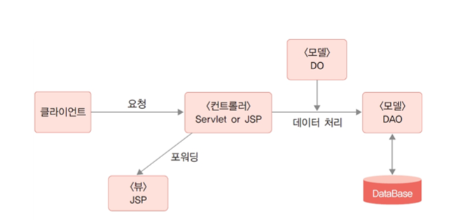

* DAO는 DB만 접속하는게 아닌 파일을 접속해서 무언가를 할 수가 있다.

### 모델(Model)

* 데이터를 처리하는 영역
* 일반적으로 데이터베이스와 연동을 위한 DAO(Data Access Object) 클래스와 데이터 구조를 표현하는 DO(Data Object, 엔티티 클래스) 등으로 구성됨
* 모델은 뷰나 컨트롤러에 독립적인 구조로 데이터베이스 처리를 필요로 하는 여러 애플리케이션에서 공유할 수 있으며, 웹 애플리케이션이 아닌 경우에도 사용할 수 있음
* 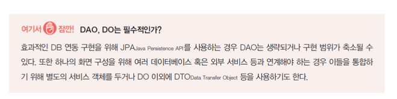

* JPA와 스프링프레임워크의 JPA는 좀 다른개념이다. 주의해야한다.

### 뷰(View)

* 화면 구성을 담당하는 영역
* 주어진 데이터를 출력하는 용도로만 사용하는 것이 바람직함 
* 뷰에서 데이터를 직접 가져오는 방식은 권장하지 않음
* 뷰 영역의 구현을 위해 뷰 템플릿 엔진이 사용되며 JSP 역시 이러한 뷰 템플릿 엔진 중 하나임 
* HTML 이외에 EL, JSTL 등을 사용해 컨트롤러로부터 전달받은 데이터를 출력하고 HTML, CSS 등을 통해 화면을 디자인함 
* 뷰는 기본적으로 모델, 컨트롤러와의 종속성이 없도록 구현해야 함
  * 요즘 뷰는 리액트와,vue.js를 사용한다.
  * 하지만 뷰 모델은 많이 바뀌는데 해당 모델이 바뀌더라도 컨트롤러와 모델은 영향을 받지않게 코드를 짜야한다.

### 컨트롤러(Controller)

* MVC 패턴의 핵심으로 모든 사용자 요청의 중심에 위치함 
* 사용자 요청은 특정 뷰에 바로 전달되지 않고 컨트롤러를 통해야 함 
* 컨트롤러는 사용자 요청에 따라 모델을 통해 데이터베이스와 연동하여 데이터를 처리하고 뷰에 전달함 
* 뷰로 전달하기 위해 데이터가 들어 있는 DO 혹은 List<DO> 형태의 객체를 request에 저장한 후 포워딩함
* 컨트롤러는 특정 뷰를 지정해야 하기 때문에 뷰와 종속관계가 발생할 수밖에 없음
* 따라서 프로젝트의 규모가 클수록 컨트롤러는 복잡해지고 관리가 어려워지는 문제가 있음

### 컨트롤러의 구현

* JSP, 서블릿 모두 가능함 
* JSP: 간단한 기능을 구현할 때 유리함
* 서블릿: 규모 확장과 향후 스프링 프레임워크로의 확장 등에 유리함
  * 컨트롤러를 호출하기
* 

### 구성하는 세가지 방법

1. 사용자 요청마다 컨트롤러를 만들기
2. 특정 모듈 단위로 하나의 컨트롤러 안에서 여러 요청 단위를 구분해 처리하기
   * 2학년2학기때 한 방법이 해당 방법이다.
3. 프런트 컨트롤러를 따로 두어 모든 요청을 하나의 컨트롤러로 모은 다음 요청에 따라 구현 컨트롤러를 호출하기
   * 해당 방법이 mvc2방법이라고 한다.

# 2. 서블릿 컨트롤러 설계

### 컨트롤러의 가장 기본적인 기능 세 가지

1. 클라이언트 요청 처리

   * 클라이언트 요청을 단일 컨트롤러에서 처리할 것인지 개별 컨트롤러에서 처리할 것인지 결정해야 함 

   * 서블릿은 URL 요청을 GET, POST 등의 HTTP 메서드를 통해 처리하는 구조이기 때문에 여러 URL 패턴을 하나의 서블릿에서 처리할 수 있지만 URL에 따라 다른 처리를 구현할 수는 없음

   * 예시1) 어떤 쇼핑몰의 제품 등록과 삭제 기능

     * 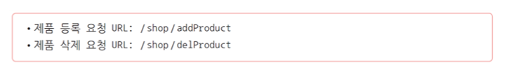
     * 이때 두 URL 요청을 하나의 서블릿으로 처리하도록 URL 매핑 설정을 할 수 있으나, 두 요청 모두 GET 방식이라면 URL이 다르더라도 동일한 doGet( ) 메서드가 호출되기 때문에 어떤 요청이 호출된 것인지 구분할 수 없음 
       * 한가지는 doget 한가지는 dopost 형식으로 하던지 다 다른 방식의 주소로 바꾸던지로 결정해야한다.
     * 따라서 각각의 URL 요청을 별도의 서블릿으로 구현해야 함
     * 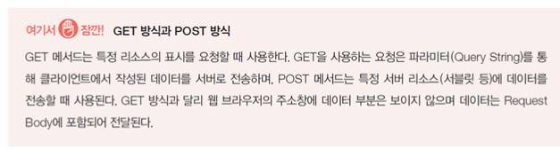

     

   * 예시2) 회원 관리 프로그램의 회원 가입, 승인, 수정, 탈퇴(삭제), 로그인 기능

     * 
     * 각각의 요청을 처리하기 위한 컨트롤러가 있어야 함
     * 즉 입력/요청 화면과 입력 데이터를 받아 이를 처리하는 컨트롤러, 처리된 결과를 보여주기 위한 화면이 필요함
     * 이 경우 각각의 컨트롤러를 구현해야 하지만 같은 단위의 업무를 하나의 컨트롤러에서 처리하는 것이 구조적으로 관리가 쉬울 수 있음 
       * 물론 하나의 컨트롤러에서 처리할 요청이 지나치게 많은 경우 오히려 코드 관리가 어려울 수 있으므로 주의해야 함

   * 사용자의 요청을 구분해 하나의 서블릿에서 처리하기 위한 두 가지 방법

     1. URL의 파라미터 이용
     2. 프런트 컨트롤러 구현

   * URL의 파라미터 이용

     * ​    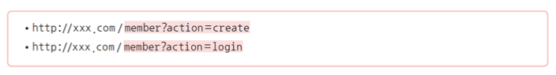
       * **member**: 서블릿 URL 매핑값
       * **action**: 요청을 구분하기 위한 파라미터
     * 요청에는 회원 정보, 로그인 아이디 등의 사용자 데이터가 추가로 포함됨
     * GET, POST 방식이 모두 가능함
     * 컨트롤러에서는 action 값을 비교하여 별도의 메서드 구현 등의 방식으로 처리함
     * 비교적 간단한 방법이지만 action 파라미터의 구조가 변경되며 관련된 HTML, JSP, 컨트롤러의 수정이 필요하다는 단점이 있음

     

   * **프런트 컨트롤러 구현(1)**

     * 모든 요청의 진입점이 되는 컨트롤러가 있고 여기서 서브 컨트롤러를 호출하는 구조 
     * 좀 더 복잡한 구조를 체계적으로 처리할 수 있음 
     * 프런트 컨트롤러 패턴으로 정립되어 있어 여러 구현에 응용되는 디자인 패턴임
     * 모든 요청을 하나로 모으는 방법이 필요하며, 일반적으로는 서블릿 매핑의 구조적인 특징을 활용함
     * ​          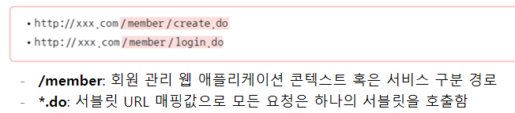
     * 컨트롤러에서는 .do 앞의 요청 이름(create, login)으로 구분하여 별도의 메서드 혹은 서브클래스를 통해 실행함

   * 프론트 컨트롤러의 장점 

     * 요청에 대한 파라미터 없이 명확한 이름(전 예시의 create, login)으로 요청할 수 있음 

     * 요청에 대한 URL 관리가 필요 없음

       

   * 프론트 컨트롤러의 단점

     * 전체 시스템이 세부 시스템이 분리되어 있는 경우: 콘텍스트를 분리하는 것은 세션 관리 등에 부담이 갈 수 있음 

       * 예) 네이버와 같은 포털 형태

     * 단일 콘텍스트에 경로로 구분하는 경우: 프런트 컨트롤러에서 모든 요청을 조건문과 메서드 구현만으로 처리하기에는 컨트롤러 클래스가 비대해짐

     * → 규모가 어느 수준 이상이 되면 경로에 따라 **서브 컨트롤러로 포워딩하는 처리**가 필요함 

       

   * 서브 컨트롤러 구현하기

     * URL 요청을 분석해 사용자 요청을 구분하는 작업이 우선적으로 필요함

     * 메서드를 이용해 사용자 요청을 분리해서 처리함 

       * switch(혹은 if) 문을 사용하는 구조는 기능 추가 또는 변경이 필요할 때 조건문도 함께 관리해야 하는 문제가 있음 

     * 

       

   * 서브 컨트롤러 구현하기

     * Command 패턴을 사용하면 switch(혹은 if) 구조 없이해당 요청에 맞는 특정 컨트롤러가 실행되도록 구현할 수 있음
     * 
     * Map에 해당 주소를 키값으로 저장하고 해당 클래스를 값으로 집어넣은 후, 해당 경로를 가진애를 Map에서 호출하는 형식이다.

   * 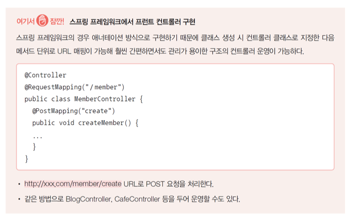

2. 입력값 핸들링
   * 서블릿에서 클라이언트의 입력값을 처리하려면 request.getParameter( )를 이용해야 함 
   * 파라미터가 한두 개라면 문제없겠지만 회원 가입과 같이 여러 정보가 전달되는 경우  모든 값을 request.getParameter( )로 받는 것은 문제가 됨 
   * 또한 DAO 클래스와 연동을 위해서는 입력값을 Member 객체로 만든 후에 전달해야 하므로 기본적으로 다음과 같은 코드 구현이 필요함
   * 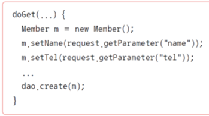
   * JSP에서는 useBean 액션을 통해 입력값을 Member 객체로 쉽게 만들 수 있었음 
   * 서블릿에서는 그런 기능이 제공되지 않기 때문에 별도의 라이브러리를 사용해야 함 
   * 대표적으로 Apache Commons BeanUtils가 쓰임
   * 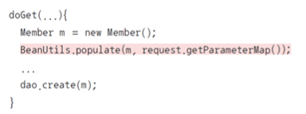
   * 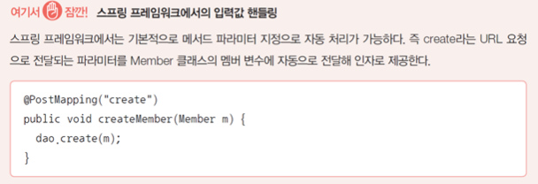

3. 뷰 이동

   * 컨트롤러에서 사용자 요청을 처리한 다음에는 적절한 뷰로 이동할 수 있어야 함 

   * 뷰에서 보여줄 데이터를 포함해서 이동해야 하는 경우와 그렇지 않은 경우로 나뉨

     

   * 데이터를 포함하지 않는 경우

     * 사용자 요청 처리 후 별도의 데이터를 포함하지 않는다면 해당 페이지로 리디렉션Redirection할 수 있음 

     * JSP, 서블릿 모두 response.sendRedirect( )를 사용함

     * 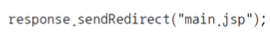

       

   * 데이터를 포함하는 경우

     * request scope object에 속성으로 데이터를 넣은 후 원하는 페이지로 포워딩함 
     * 데이터 활용 목적에 따라 session 또는 application을 사용할 수도 있으며 여러 데이터를 포함하는 것도 가능함
     * 
     * 

# 3.[실습 8-1] 컨트롤러 기초 예제 : 계산기 구현

### calcForm.html

### calcResult.jsp

### calcController.java

# 4. [실습 8-2] 고급 컨트롤러 서블릿 구현

### productList.jsp

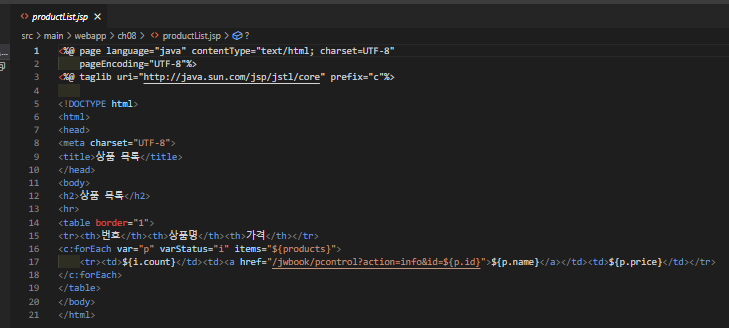

### productInfo.jsp

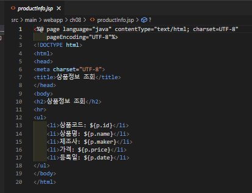

### product.java

### productService.java

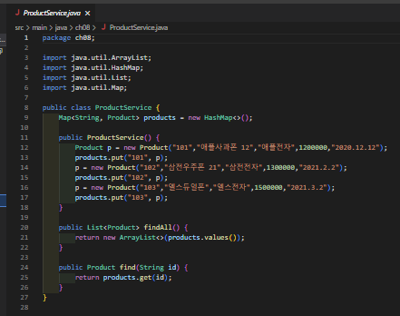

### productControllder.java

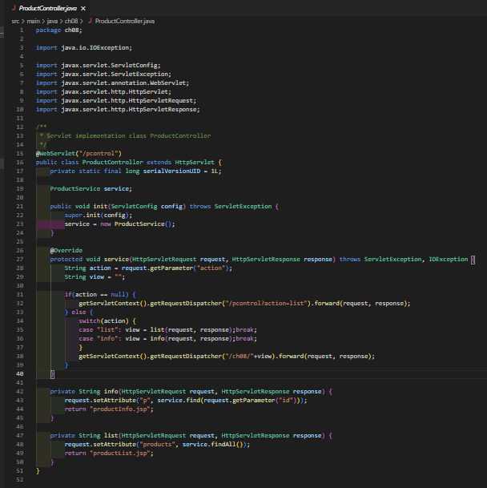

### 실습 사

# 9장_데이터베이스와JDBC

# 1. 데이터베이스의 개요

### 데이터베이스(Database)

* 사전적으로 여러 사람이 공유하여 사용할 목적으로 체계화하여 통합, 관리하는 데이터의 집합을 의미함 

* 데이터베이스는 방대한 데이터를 쉽게 검색하거나 찾을 수 있도록 체계적으로 분류하고 정리해둔 정보의 집합

* 디지털화된 정보만 의미하는 것은 아님

### DBMS(DataBase Management System)

* 데이터베이스는 DBMS라고 불리는 소프트웨어 시스템을 사용함
* DBMS는 효과적인 데이터 파일 관리와 운영을 위한 구조와 함께 인덱싱, 캐싱, 네트워크 서버, 사용자 및 권한 관리, 백업/복원, 클러스터링 등 다양한 기능을 제공함
* DBMS의 종류: Oracle, MySQL, IBM DB2, MS SQL 등
* 데이터베이스와 데이터베이스 관리 시스템인 DBMS는 다른 의미이지만 보통 데이터베이스라고 하면 DBMS를 포함한 개념을 의미함

### 데이터베이스의 일반적인 특징

* 데이터 중복을 최소화할 수 있음
* 데이터를 쉽게 공유할 수 있음
* 일관성, 무결성, 보안성이 유지됨
* 최신 데이터를 유지할 수 있음
* 데이터의 표준화가 가능함
* 데이터의 논리적·물리적 독립성이 유지됨
* 데이터 접근이 용이함
* 데이터 저장 공간을 절약할 수 있음

### 관계형 데이터베이스(Relational DataBase Management System, RDBMS)

* 전통적이고 가장 보편적인 형태의 데이터베이스이며, 관계를 가지는 데이터 구조가 필요한 경우 가장 적합한 데이터베이스임
* 테이블(Table): 칼럼과 로우 구조로 데이터 구조를 정의하고 관리함 
* SQL(Structured Query Language): 데이터를 관리하는 질의어임. 특히 테이블과 테이블의 관계 지정을 통해 연관성 있는 데이터를 체계적으로 구조화할 수 있음
* 관계형 데이터베이스의 종류: Oracle, IBM DB2, MS SQL, MySQL 등
* 

#### 관계형 데이터베이스의 장점

* 다양한 용도로의 사용이 가능하며 높은 성능을 보여줌
* 데이터의 일관성이 보장됨
* 정규화를 통해 갱신 비용을 최소화할 수 있음
* 구조화되어 있고 동일한 구조를 가지는 데이터를 다룰 때 유리함

​    

#### 관계형 데이터베이스의 단점

* 데이터 구조의 변경(칼럼의 수정이나 확장)이 어려움

* 빠른 속도를 요구하는 단순한 처리에 대응하기 어려움

* 데이터 관계는 유용하지만 그로 인한 처리 속도 저하가 발생할 수 있음

### NoSQL 데이터베이스

* 말 그대로 SQL을 ‘사용하지 않는다(No)’는 의미로, ‘SQL을 사용하는 전통적인 RDBMS가 아니다.’라는 의미로 사용되는 데이터베이스를 말함 
* SQL과 다를 수 있지만 데이터 관리를 위해 별도의 쿼리 언어나 구조는 존재함
* NoSQL은 RDBMS의 가장 큰 특징인 테이블 형태의 데이터 구조를 사용하지 않기 때문에 형태가 고정되지 않은 비정형 데이터 처리에 유용함 
* NoSQL의 종류: MongoDB, Redis, Casandra, Hbase, CouchDB 등
* 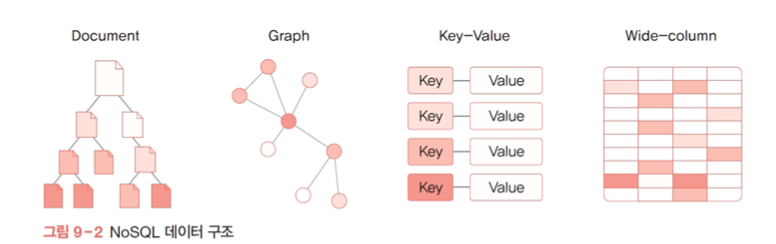

### NoSQL 데이터베이스의 장단점

* 대용량 데이터 처리에 유리함
* 분산 처리에 적합함
* 클라우드 컴퓨팅 환경에 적합함
* 빠른 읽기/쓰기 속도를 제공함
* 유연한 데이터 모델링(비정형)이 가능함
* 복잡한 데이터 관계를 표현할 때 중복 데이터가 발생할 수 있음
* 모든 데이터가 동일한 구조를 가지고 있지 않은 경우에 유리함 
* 빠른 처리 속도를 위해 필요한 데이터를 다른 테이블 등에서 참조하지 않고 데이터 자체에 포함하는 구조에 적합함

### 데이터베이스 특징 비교

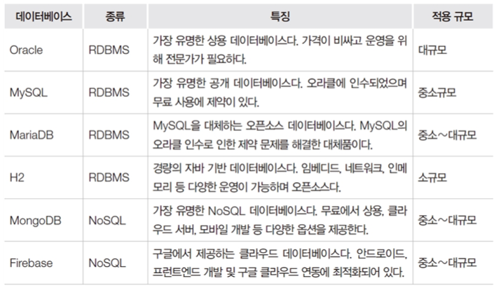

* 오라클이 가장 비싸고 제일 많이 사용하는 데이터베이스다.
* 본인에게 맞는 데이터베이스를 사용하면 된다.
* 일반적으론 mySQL추

### H2 데이터베이스를 추천하는 이유

* 별도의 설치나 관리가 필요 없음(JDBC 드라이버만으로 사용 가능)
* 임베디드 모드, 네트워크, 인메모리 등 다양한 운영이 가능함
* 앱 배포 시 포함이 가능함
* 용량과 메모리 사용이 적음
* 표준 SQL을 모두 지원하고 JPA와의 연계도 용이함
  * 자바 스프링 연습할때 많이 사용한다.

# 2. 관계형 데이터베이스

### 테이블

* 관계형 데이터베이스에서 데이터 관리의 기본 구조 
* 데이터가 가지는 공통적인 속성을 모아 정의한 칼럼(필드)으로 구성됨 
* 칼럼에 저장되는 데이터는 숫자형, 문자형, 날짜형, 불형(Boolean) 등으로 구분됨 
* 파일과 같은 바이너리 데이터를 저장하거나 매우 긴 텍스트를 저장할 수 있는 자료형도 있음
* 

### 칼럼(Column)

* 테이블을 구성하는 기본 속성으로 필드, 어트리뷰트라고도 불림
* 각각의 칼럼에 저장되는 데이터는 동일한 타입이어야 하며 구체적인 자료형은 데이터베이스마다 차이가 있음

​    

### 로우(Row)

* 하나의 데이터셋을 의미하며 레코드 혹은 튜플이라고도 함

### 자료형

* 칼럼에 들어갈 수 있는 데이터 유형
* 일반적으로 숫자형, 문자형, 날짜형, 불형(Boolean) 등으로 구분
* 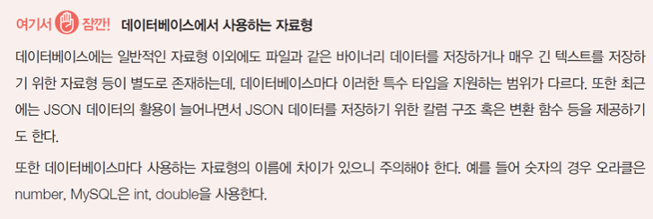

​    

### 제약 조건(Constraint)

* 칼럼에 부여되는 일종의 속성으로 저장될 데이터에 대한 요구사항 
* 제약 조건은 데이터베이스 자체적으로 저장될 데이터에 대한 요구 조건을 설정함
* 따라서 제약 조건을 벗어나는 데이터는 원천적으로 차단됨 
* 데이터베이스의 무결성(Integrity)을 지키기 위한 방법이 됨
* 

### 키(Key) 

* 관계형 데이터베이스의 제약 조건 중 하나 
* 데이터의 유일성 및 관계 설정을 위해 사용됨 
* 적절한 키의 사용은 데이터베이스 설계에서 매우 중요한 요소임

### 기본키(Primary Key, PK)

* 주키, 프라이머리키라고도 불림 
* 테이블에 저장된 레코드(로우)를 서로 구분할 수 있도록 특정 칼럼에 설정하는 제약 조건 
* 기본키가 존재하지 않으면 데이터가 중복되고 특정 데이터 검색에 오류가 발생하기 때문에 꼭 설정되어 있어야 함
* 보통 기본키는 시퀀스(Sequence)라 불리는 단순 증가 값을 사용함 
* 단순 증가 값은 1부터 시작해서 1씩 단계적으로 증가하는 숫자로, 단순히 데이터를 서로 구분하는 용도로만 사용함

### 외래키(Foreign Key, FK)

* 테이블 간의 관계를 설정하기 위해 사용하며 참조 무결성을 제공하기 위한 용도
* 데이터의 의미는 동일하지만 검색에서 문제가 발생함 
  * 같은 학교임에도 AA대학교 or AA 대학교 or 에이에이 대학교 등과 같이 조건 검색을 해야 하는 문제가 발생함
* 이러한 문제를 원천적으로 차단하기 위해서는 등록 가능한 대학정보 테이블을 별도로 두고 이를 참조할 수 있도록 외래키를 등록해 사용해야 함

​    

### 시퀀스(Sequence)

* 기본키 칼럼을 관리하기 위해 사용하는 데이터베이스 객체
* 보통 데이터를 추가할 때 순차적으로 증가하는 값을 자동으로 생성함
* 최근의 데이터베이스는 auto increment, auto_increment와 같은 속성을 칼럼에 추가하는 것으로 자동 증가 값을 사용할 수 있음

### 트랜잭션(Transaction)

* 프로그램에서 어떤 이벤트가 발생했을 때 여러 테이블의 데이터를 차례로 변경해야 하는 경우가 많이 발생함

* 예) 동일 은행의 A계좌에서 B계좌로 이체한다고 했을 때 

  * 계좌는 테이블로 볼 수 있음 

  * A계좌에서 100만 원을 차감한 후 B계좌에 100만 원을 추가하면 계좌이체가 완료됨 

  * 이때 A계좌에서 차감 후 B계좌에 추가하는 과정에서 에러가 발생하면 A계좌에서 차감했던 금액은 다시 원래대로 되돌려야 함
  * 이렇게 안하면 시스템에 문제가 생겨서 에러가발생하면 돈은 날라가고 추가가안되는 상황이 되는 둥 문제가 심각해 질 수 있음.
  * 그래서 A의 돈 100만원을 뺴서 B계좌에 넣는 행동을 하나의 트랜잭션으로 묶어서 처리해야한다.

* 이때 트랜잭션이란 하나의 논리적 기능을 수행하기 위해 여러 작업을 묶어서 처리하는 것을 의미함
* 이러한 트랜잭션은 데이터베이스 혹은 미들웨어 레벨에서 처리할 수 있어야 함

### Commit 과 rollback

데이터베이스에서 제공하는 트랜잭션 관리를 위한 명령

* commit: 모든 데이터의 변화를 실제 적용함

* rollback: 문제 발생 시 현재까지의 변화를 원래대로 되돌림

* A~C 순으로 진행되는 트랜잭션의 처리 과정
* 

​    

# 3. H2 데이터베이스

### H2 데이터베이스

* 보통 임베디드 데이터베이스로 알려져 있으며 MySQL과 같은 관계형 데이터베이스 관리 시스템임 
* 복잡한 프로그램의 설치가 필요 없고 데이터베이스 파일만 있으면 언제든지 데이터베이스를 실행할 수 있어 프로그램에 포함해서 배포하는 것도 가능함
* 운영 데이터베이스와 상관없이 관계형 데이터베이스를 사용하고 특정 데이터베이스 종속 기능 없이 구현하는 경우 H2와 같은 경량 데이터베이스를 이용해 개발하기도 함

​    

### H2 데이터베이스의 세 가지 모드

* 임베디드 모드

  * 프로그램에서 JDBC URL을 이용해 접속하거나 console 웹을 통해 관리함

  * 데이터 파일만 있으면 동작함

  * 가장 간단하고 지정된 데이터 파일이 없다면 자동 생성하므로 언제든 실행 가능함

  * 톰캣이 실행된 상태에서는 별도의 도구를 통해 데이터베이스 관리가 불가능함

  * 파일을 사용하기 때문에 동시 다중 접속이 불가능하므로 개발이나 테스트가 불편함

    ​    

* 인메모리 모드

  * 프로그램에서 JDBC URL을 이용해 접속하거나 console 웹을 통해 관리함
  * 데이터베이스를 메모리상에서만 운영하는 모드로 처리 속도가 빠름
  * 프로그램 종료 시 데이터가 소멸되기 때문에 일반적인 애플리케이션에는 부적합함

  

* 네트워크 서버 모드

  * H2 데이터베이스를 내려받아 설치한 후에 JDBC를 이용해 접속하거나 console 웹을 통해 관리함
  * 일반적인 데이터베이스와 같이 네트워크 서버로 동작하는 방식임
  * 동시 다중 접속이 가능함
  * 별도의 프로그램 실행과 관리가 필요하기 때문에 데이터베이스 서버를 별도로 실행해야 함
  * 이번 실습에서는 일반적인 데이터베이스 운영 형태인 네트워크 서버 모드를 사용함

# 4. SQL의 개요

### SQL(Structured Query Language)

* 관계형 데이터베이스에서 데이터를 관리하기 위한 쿼리 언어로 대부분의 프로그래밍 언어보다는 단순한 구조를 가지고 있음 
* SQL 자체는 표준 언어이지만 데이터베이스마다 세부적인 차이가 있을 수 있기 때문에 데이터베이스와 호환이 되지 않을 수도 있음
* SQL은 단순히 데이터 관련 작업 이외에 데이터베이스 자체의 관리 기능 수행에도 사용됨

### SQL에서 할 수 있는 일

* 새로운 테이블 생성
* 내장 프로시저Stored Procedure 생성
* 뷰 생성
* 테이블, 프로시저, 뷰 등의 접근 권한 부여
* 데이터베이스에 대해 쿼리 실행
* 데이터베이스로부터 데이터 조회
* 데이터베이스에 기록 삽입, 갱신, 삭제
* 새로운 데이터베이스 생성

### DDL(Data Definition Language)

* 테이블의 생성, 수정, 삭제와 같은 관리 기능을 제공하는 SQL 문
* 스키마, 테이블, 시퀀스, 인덱스, 사용자, 권한 객체를 생성하고 관리하기 위한 명령
* 테이블의 생성, 수정, 삭제와 같은 관리 기능을 제공하는 SQL 문을 의미함 
* DDL을 통해 데이터베이스 스키마, 테이블, 인덱스 등 데이터 저장 및 운영을 위한 객체의 생성과 관리가 가능함

* CREATE

  * 테이블을 생성할 때 사용하는 명령어
  * 각 칼럼의 자료형과 최대 크기를 명시해야 함 
  * 필요에 따라 칼럼에 제약 조건과 속성을 추가할 수 있음 
  * 마지막 칼럼 설정 뒤에 ‘,’를 넣지 않도록 주의

  

* ALTER

  * 테이블 구조를 수정할 때 사용하는 명령어

  * 테이블에 데이터가 들어가 있는 상태에서는 구조 변경에 여러 제약이 따름 

  * 따라서 테이블을 수정하기 전에 신중히 테이블을 생성하는 것이 좋음

  * 테이블에 데이터가 들어가 있을 때 수정 제약 사항

    * 칼럼의 자료형은 변경할 수 없음
    * 칼럼의 크기를 줄일 수는 없고 늘리는 것만 가능함
    * NOT NULL 속성을 갖는 필드는 추가할 수 있으나, NULL 속성이 있는 필드는 추가할 수 없음

    

* DROP

  * 테이블 자체를 삭제하는 명령어 
  * 데이터와 함께 테이블과 연관되어 정의된 인덱스, 룰, 트리거, 제약 조건도 함께 삭제되므로 주의해야 함    
  * RESTRICT: 기본값으로 삭제 테이블이 다른 곳에서 참조되고 있다면 삭제를 중지함
  * CASCADE: 삭제 테이블과 의존관계가 있는 모든 개체를 함께 삭제함

  

* SHOW

  * 테이블 정보를 조회하기 위해서는 데이터베이스마다 제공되는 별도의 명령 혹은 스키마 구조에 접근하는 쿼리를 사용해야 함 
  * H2에서는 다음과 같이 SHOW 명령어를 이용하여 테이블 정보를 확인할 수 있음

​    

### DML(Data Manipulation Language)

* 테이블의 데이터를 조작할 때 사용하는 SQL 문

* 데이터 조작의 기본 기능인 CRUD(Create, Read, Update, Delete)와 관계된 명령으로 이루어짐

* INSERT

  * 테이블에 데이터를 추가하기 위한 명령어
  * 전체 칼럼값을 모두 추가하는 경우 
    * VALUES에 오는 값의 순서는 테이블을 생성할 때 지정한 칼럼 순서와 반드시 일치해야 함
    * 
  * 부분 칼럼 데이터만 저장하는 경우
    * NOT NULL 칼럼은 반드시 포함되어야 하며 auto_increment 속성이 적용될 칼럼은 비움
    * 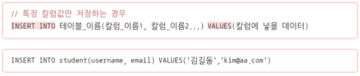

* SELECT

  * 테이블에서 데이터를 조회하기 위한 명령어

  * 전체 데이터 혹은 조건에 맞는 데이터만 조회가 가능함 

  * 데이터베이스에서 제일 중요한 쿼리임

  * 효율적인 조회를 위한 작업

    * 여러 테이블의 데이터를 조합해서 조회하기

    * 외래키 칼럼의 코드 데이터를 참조 테이블의 이름 칼럼으로 대체하기

    * 날짜 형식 변경하기

    * 데이터 정렬 또는 집계하기

      

  * SELECT를 통한 단일 테이블 조회

    * 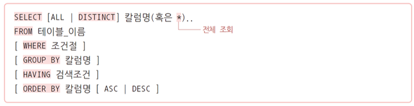
    * 특정 칼럼을 지정하거나 전체 칼럼(*)을 조회할 수 있음
    * DISTINCT: 중복된 값은 제거하고 가지고 옴
    * WHERE: 검색 조건을 지정할 때 사용함
    * GROUP BY: 특정 칼럼을 그룹화할 때 사용함
    * HAVING: 특정 칼럼을 그룹화한 결과에 조건을 설정할 때 사용함
    * ORDER BY: 특정 칼럼을 기준으로 오름차순(ASC)/내림차순(DESC) 정렬할 때 사용함
    * 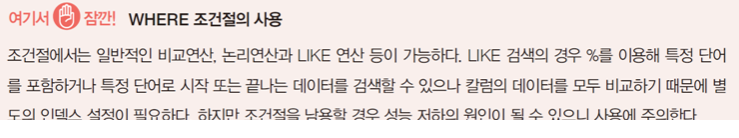

    

* DELETE

* UPDATE

* 데이터 조회 함수

  * 데이터 조회의 편의를 위해 제공되는 데이터베이스마다의 전용 함수
  * 이번 예제는 데이터 조회 함수 테스트를 위해 가상의 테이블인 DUAL과 SELECT 문을 사용함

* 숫자 관련 함수

  * 숫자를 조작하기 위한 함수
  * ABS(절댓값), CEILING(올림), ROUND(반올림), FLOOR(버림), SQRT(제곱근) 등
  * 

* 문자 관련 함수

  * 문자, 문자열을 조작하기 위한 함수
  * ASCII(아스키코드값), LENGTH(길이), CONCAT(문자열 결합), TRIM(양쪽 공백 제거) 
  * LOWER(소문자 변환), UPPER(대문자 변환), SUBSTRING(부분 선택) 등

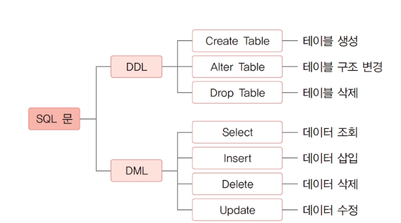

### 조인

* 관계형 데이터베이스에서 2개 이상의 테이블이나 데이터베이스를 조합해 데이터를 검색하는 것

* 조회하고자 하는 칼럼이 서로 다른 테이블에 있을 경우에 주로 사용함

* 여러 개의 테이블을 마치 하나의 테이블인 것처럼 사용할 수 있는 방법임

* 기본키(PK)와 외래키(FK)로 연결된 두 테이블의 데이터를 조합하기 위해 사용할 수 있음

* 조인은 여러 유형이 있으며 조인을 통해 여러 번 쿼리를 보내거나 결과를 프로그램에서 조합할 필요 없이 한 번의 쿼리로 원하는 데이터 구조를 받아볼 수 있

* 조인 형태: Inner Join, Outer Join, Cross Join, Self Join 등

  

* 학생과 부서 테이블이 존재하는데 애네 두개를 많이 조인해서 보여준다면

  * DB에 view를 만들어서 조인한 결과를 보여주는것이 효과적이다.
  * view는 테이블이 아니다 일시적으로 보여주는것일뿐.

* 정규화는 결국 테이블을 계속해서 쪼개는 것이다.

* 서브쿼리로 통계같은거를 보여줄때도 view를 통해서 보여주는게 효과적일 수 있다.

# 5. [실습 9-1] SQL 실습 : 학생정보 목록생

# 6. JDBC 기본 구조와 API의 이해

### JDBC의 등장 배경

* 데이터베이스의 종류가 다양하기 때문에 개발에 많은 어려움이 있음 
* JDBC는 이러한 문제를 해결하기 위한 자바 애플리케이션에서 표준화된 방법으로 다양한 데이터베이스에 접속할 수 있도록 설계된 인터페이스임
* 따라서 애플리케이션 개발자는 각 데이터베이스에 대해 자세히 알지 못해도 JDBC API만 알면 모든 데이터베이스에서 동작할 수 있는 애플리케이션을 개발할 수 있음
* 응용 프로그램에서는 자바에 기본적으로 포함된 JDBC API(인터페이스로 규격만 정의하고 있음)를 사용해 프로그램 코드를 작성하고 실제 데이터베이스 연결은 각 데이터베이스 회사가 제공하는 JDBC 드라이버(JDBC API 구현 클래스)를 이용해 SQL 문으로 데이터를 조작하는 형태로 동작한다.

### JDBC의 구조

* JDBC API: 응용 프로그램에서는 자바에 기본적으로 포함된 JDBC API를 사용해 프로그램 코드를 작성함
* JDBC 드라이버(JDBC API 구현 클래스): 실제 데이터베이스 연결은 각 데이터베이스 회사가 제공하는 JDBC 드라이버를 이용함 
* SQL 문으로 데이터를 조작하는 형태로 동작함
* 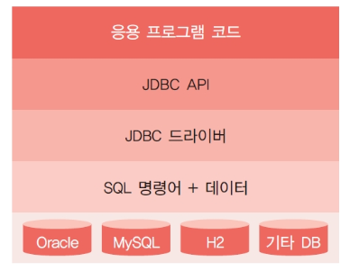

### JDBC 드라이버

* 자바 인터페이스로 정의된 일종의 규격이기 때문에 실제 구현된 클래스가 없으면 동작하지 않음
* 이때 실제 구현된 클래스를 JDBC 드라이버라고 부르며 라이브러리와 같은 개념임
* JDBC API를 사용하는 프로그램을 개발하거나 실행하는 과정에 해당 라이브러리가 반드시 필요함
* JDBC 드라이버는 보통 데이터베이스를 만드는 회사에서 직접 배포함

### JDBC 프로그래밍

# 7. [실습9-2] JDBC 종합 실습 : 학생 정보 b 조회와 등록

### Student.java

### StudentController.java

### StudentDAO.java

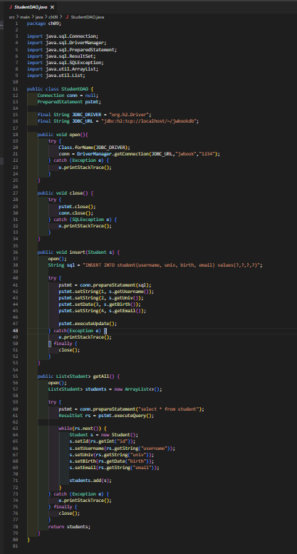

### studentInfo.jsp

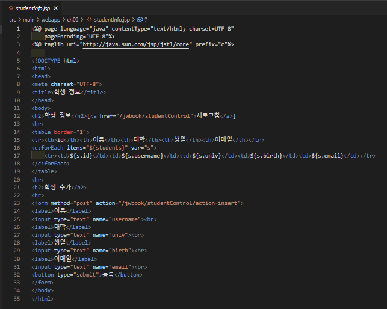

### sql_exam.sql

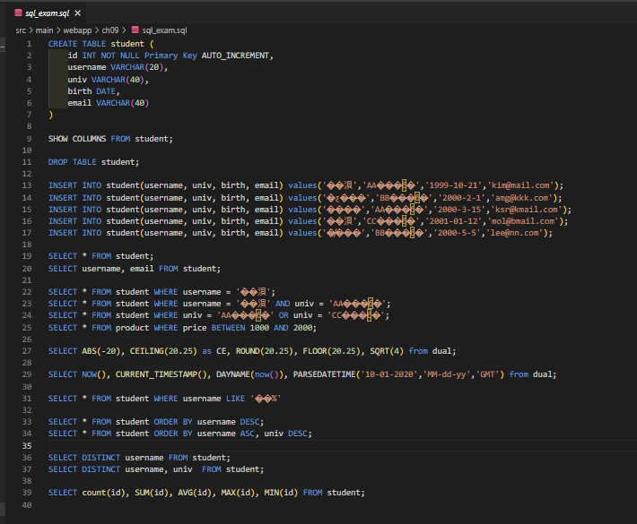

### 실습 화면

# 10장_[프로젝트]뉴스 기사 관리 웹 서비스

# 1. 뉴스 기사 관리 서비스 설계

### 이번 프로젝트 개요

* 지금까지 배운 내용을 종합해 간단한 뉴스 기사 관리 서비스를 단계별로 구현함
* 재활용 가능한 컨트롤러 구조 설계
* 데이터베이스 연동을 통한 모델 구현
* 부트 스트랩을 이용한 화면 구현
* 뉴스 기사 관리 웹 서비스란? 
  * 인터넷 포털, 신문사 등의 뉴스 기사를 제공하는 회사에서 웹 또는 모바일로 뉴스를 제공하기 위한 서비스 
  * 뉴스 DB에 새로운 뉴스를 등록, 조회, 삭제할 수 있으며 모든 조작은 웹 화면을 통해 이루어짐

### 구현할 내용

* 부트스트랩을 이용한 화면 구현
* 데이터베이스 연동
* 이미지 파일 첨부를 포함한 뉴스 등록
* 뉴스 목록에서 등록한 뉴스 확인
* 뉴스 에러 처리

### 프로젝트 구성요소

* 데이터베이스

  * 9장에서 설치한 H2 데이터베이스를 그대로 사용함 
  * 접속 모드: 네트워크 모드
  * 테이블명: news

* 모델

  * news 테이블과 연동해 데이터를 처리하기 위한 클래스
  * 컨트롤러 이외의 다른 자바 애플리케이션에서도 사용이 가능한 독립적 구조를 가짐
  * News.java: 뉴스 테이블 구조와 매핑되는 DO 클래스
  * NewsDAO.java: 뉴스 데이터 처리를 위한 DAO 클래스

  

* 뷰

  * 뉴스 등록, 목록, 보기, 삭제의 네 가지 기능을 제공하며, 화면은 2개로 구성됨
  * newsList.jsp: 뉴스 관리 메인 화면으로 목록을 보여주고 삭제와 등록을 위한UI 제공
  * newsView.jsp: 특정 뉴스를 선택했을 때 사진과 함께 기사 내용을 보여줌

* 컨트롤러

  * NewsController.java: 뉴스 관리 서비스 컨트롤러

  

  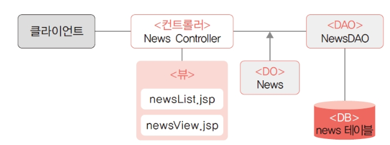

### 

# 2. 모델 구현

### 데이터베이스 생성

* 뉴스 기사 데이터베이스는 제목, 이미지, 내용, 등록 날짜와 시간으로 구성됨 
* H2를 실행하고 웹 콘솔로 로그인한 후에 테이블 생성 SQL을 작성하여 실행 
* ​    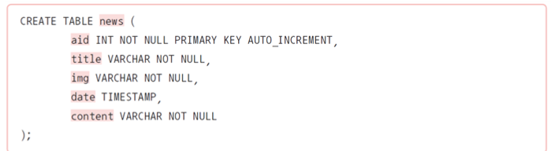
* 테이블의 이름: news
* aid: 기사 고유 아이디인 기본키(PK), 자동 증가 칼럼
* title: 기사 제목, 문자열
* img: 사진 경로, 문자열
* date: 등록 날짜와 시간, 타임스탬프 타입
* content: 기사 내용, 긴 텍스트

### News 클래스

* 뉴스 데이터 구조를 표현하기 위한 DO 클래스로, 테이블 구조와 일치해야 함
* 화면에 보이는 날짜/시간 정보를 처리하기 위해서는 Date 타입보다 문자열이 유리하므로 News 클래스에서는 날짜/시간 정보를 문자열로 처리함 
* 실제 데이터베이스 테이블에 저장되거나 검색할 때는 날짜 형식이 적용되도록 구현함
* 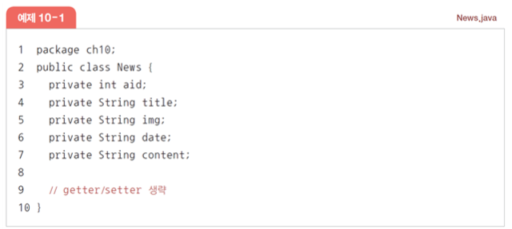

### NewsDAO 클래스

* news 테이블과 연동해서 뉴스 등록, 목록 가져오기, 삭제 기능을 제공하기 위한 DAO 클래스
* 기본 구현 기능 이외의 기능(수정, 검색 등)이 필요한 경우 DAO 클래스에 메서드를 추가해 사용함

### open( ) 메서드 구현

* 데이터베이스 연결을 위한 클래스 기본 구조 작성 
* JDBC 관련 패키지를 import할 때는 java.sql을 사용함
* 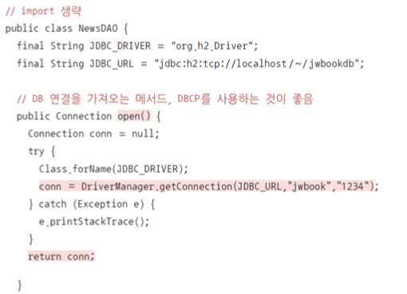

### addNews( ) 메서드 구현

* 뉴스를 추가하는 메서드 
* 인자로 DO 클래스인 News 타입을 받아 SQL을 완성해 실행하는 구조
* 
  * CURRENT_TIMESTAMP( )를 이용해 현재 날짜/시간 정보가 등록
  * try(conn; pstmt) 부분은 try-with-resource 기법이 적용된 부분으로 예외 발생 시 해당 리소스를 자동으로 close함

### getAll( ) 메서드 구현

* 뉴스 기사 목록 전체를 가지고 오기 위한 getAll( ) 메서드
* 뉴스 목록을 컨트롤러로 전달하기 위해 List 타입을 리턴
* 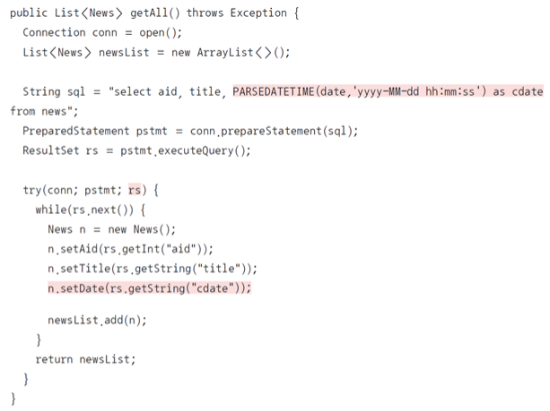

### getNews() 메소드 구현

* 뉴스 목록에서 뉴스를 선택했을 때 특정 뉴스 기사의 세부 내용을 보여주는 메서드
* 선택한 기사의 aid(PK)를 인자로 받아 News 타입을 리턴하며 모든 필드 항목을 포함
* getAll( )과 비슷한 구조이지만 검색 결과는 하나이기 때문에 ResultSet에서 next( ) 메서드는 한 번만 호출하고 데이터를 가지고 옴 
* 문제가 발생해 선택된 aid의 뉴스 기사가 없을 경우
  * if(rs.next( ) == null)인 경우 예외를 발생시킴
  * 

### delNews() 메소드 구현

* NewsDAO의 마지막 부분인 뉴스 삭제를 위한 delNews( ) 메서드
* 삭제할 뉴스의 aid를 받아 뉴스를 삭제함 
* 별도의 리턴은 없고, 실행 결과 삭제된 뉴스가 없는 경우 예외를 발생시킴
* 

# 3. 컨트롤러 구현

### **init( )** **메서드 구현**

#### NewsController 서블릿 클래스 생성

* 서블릿 생성 메뉴 혹은 클래스 구현을 통한 서블릿 클래스 생성
* 컨트롤러 호출 url 매핑: ‘/news.nhn’으로 설정 
  * 네이버에서 사용하는 뉴스 기사 서비스와 유사하게 표현함
  * 

### **service( )** **메서드 구현**

#### ervice( ) 메서드의 기본 구조

* service( ) 메서드는 HttpServlet 클래스에 있는 메서드를 오버라이딩한 것으로 서블릿이 호출될 때마다 실행되는 메서드임
* 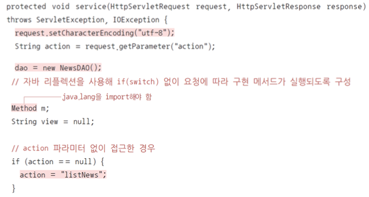

#### 자바 리플렉션으로 메서드 호출

* 자바 리플렉션을 이용해 action으로 전달된 이름의 메서드를 자동으로 호출함
* 

#### 뷰 이동

* 요청 처리 메서드를 호출한 다음 리턴된 뷰 페이지로 이동
* 앞에서 구현했던 것처럼 forward를 하면 되는데, post 요청을 forward로 처리하면 웹 브라우저를 새로 고침할 경우 이전 요청이 한 번 더 실행되는 문제가 있음
* 따라서 컨트롤러에서는 페이지 이동 시 포워딩과 리디렉션 모두 지원할 수 있어야 함
* 이때 일관된 방법으로 리디렉션을 지원하기 위한 별도의 규격화된 접근이 필요함
* 스프링 프레임워크에서는 return “redirect:/뷰 페이지 경로”와 같이 리턴하면 리디렉션이 이루어지는 구조를 제공함
  * 이번 컨트롤러에서도 동일한 규격을 지원하도록 다음과 같이 리턴에 따라 포워딩과 리디렉션이 구분되도록 함
  * 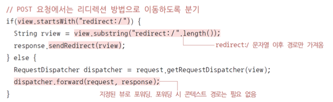

### addNews( ) 메서드 구현

### getAll( ) 메서드 구현

* newsList.jsp에서 뉴스 목록을 보여주기 위한 요청을 처리하는 메서드 
* dao.getAll( ) 메서드를 호출해 목록을 가지고 온 다음 request에 저장하고 newsList.jsp로 포워딩되도록 리턴
* 

### getNews( ) 메서드 구현

* 특정 뉴스 기사를 클릭했을 때 호출하기 위한 요청을 처리하는 메서드 
* 기본적인 구조는 다른 요청 메서드와 동일함 
* 여기서는 선택한 뉴스의 aid 값을 파라미터에서 읽어와 dao.getNews( )에 전달함
* 
* 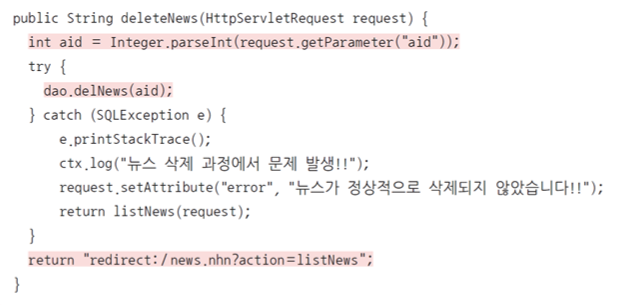

# 4. 뷰 구현

### newsList.jsp의 기본 구조

* 메인 화면으로 뉴스 목록을 보여주는 화면 
* [webapp]에 [ch10] 폴더를 생성하고 ‘newsList.jsp’를 만들기
* 생성된 ‘newsList.jsp’ 파일에 JSTL 사용을 위한 taglib 지시어를 추가하고 부트스트랩 css와 자바스크립트 라이브러리를 등록하기
* 

### 목록 출력

* 먼저 전체 화면 영역을 부트스트랩 컨테이너로 묶고 가로 크기를 75%로 지정함 
* 상단 마진 설정과 가운데 배치를 위해 mx-auto로 좌우 마진을 동일하게 설정함
* 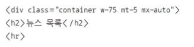
* 목록을 보여주는 부분은 <ul>, <li>를 이용하여 목록 형식으로 구성함
* <c:forEach>를 이용해 request에 저장된 newsList를 가져와 반복해서 출력함 
* 화면에 보이는 뉴스 번호는 실제 aid가 아니라 {status.count}를 이용해 순차 번호로 나타나게 함
* 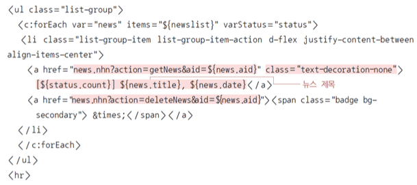

### 에러 출력부

* 뉴스 목록 아래 부분에는 에러 메시지를 출력하는 부분을 추가함 
* 다만 에러 메시지는 request에 “error”가 저장된 경우에만 보여야 하기 때문에 JSTL의 if 태그를 사용해 부트스트랩의 alert 컴포넌트로 출력함 
* 뉴스 삭제에서와 유사하게 삭제 버튼을 추가해 에러 메시지를 닫을 수 있도록 함
* 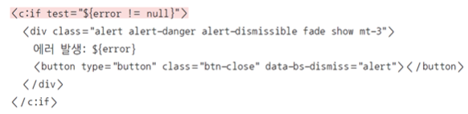

### 뉴스 등록 양식

* 뉴스를 등록하기 위한 버튼을 만들고 버튼을 눌렀을 때 입력 양식이 보이도록 함 
* 부트스트랩의 버튼과 Collapse 컴포넌트로 이벤트가 발생했을 때만 보이는 영역으로 구성 
* 버튼과 Collapse 컴포넌트는 data-bs-toggle, data-bs-target 속성으로 연결함
* 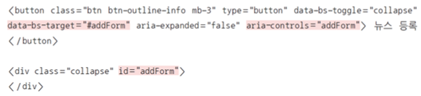
* Collapse 부분에 들어갈 입력 양식은 일반적인 html <form>으로 구현함 
* 부트스트랩의 form-label, form-control로 구성하고 입력 양식을 테두리가 있는 박스 형태로 만들기 위해 card를 적용
* <submit> 버튼을 클릭하면 <form>의 action에 지정된 url로 입력값이 전달됨 
  * 컨트롤러를 호출하면서 action 파라미터를 addNews로 전달함 
  * 또한 등록 양식이기 때문에 get이 아닌 post 방식을 사용함
* 

### newsView.jsp

* ‘newsList.jsp’에서 뉴스 제목을 클릭했을 때 뉴스를 보여주는 화면임 
* 기본 jsp 구조는 ‘newsList.jsp’와 동일함
* 여기서는 화면 구성과 관련된 부분만 설명함
* 뉴스 제목과 사진, 기사 내용, 등록 날짜/시간 등은 EL을 이용해 출력함 
* 박스 형태의 화면 구성을 위해 부트스트랩의 card, card-img-top, card-body, card-title, card-text 등을 활용함

# 5. 모든 코드 총 정리

### news.sql

### newsList.jsp

### newsView.jsp

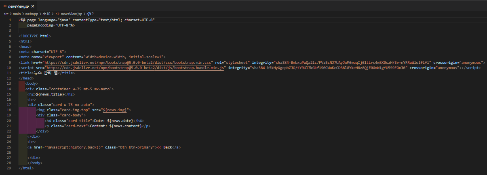

### news.java

### NewsController.java

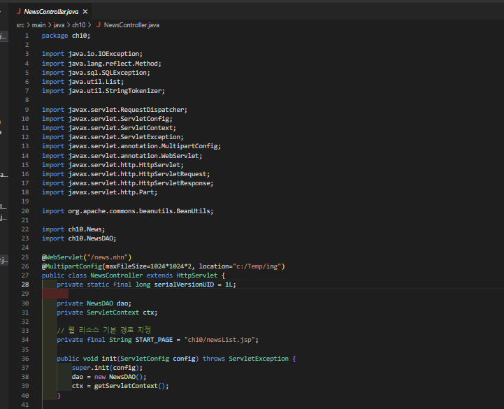

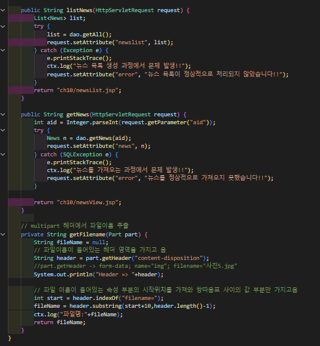

### NewsDAO.java

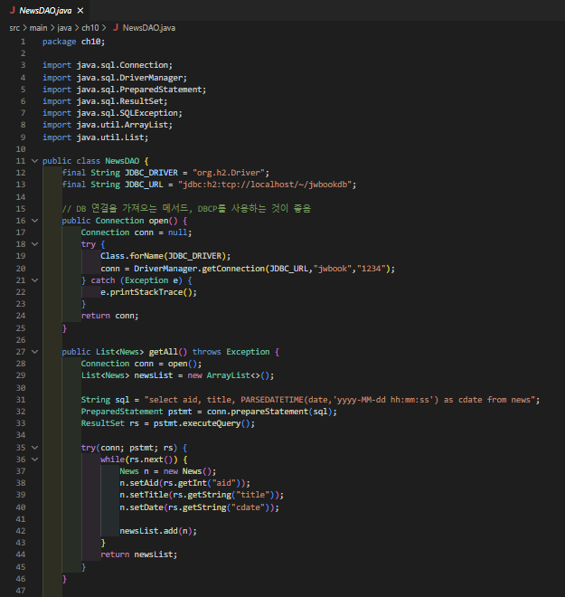

### 실습

# 후기

### 8장

Service라는 생소한 개념이 나타났다.

사실 이부분에 대해서는 Beer를 생각해서 보면 ~~action으로 시작한 파일이 서비스라는애가 대신역할을 하는것같다.

또한 이번 실습에서는 데이터베이스가 없어서 서비스에서 DB의 역할까지 수행하는 것같은데

정상적인 구조를 조사해보니 컨트롤러 -> 서비스-> DAO(레포지토리) -> DTO -> DB 접근 이런순서로 진행되는걸 알 수가 있었다.

스프링에서는 JPA를 사용하면 간단한 sql문장을 DAO 대신 레포지토리라는 클래스를 생성해서 처리하는것을 조사할 수 있었다.

어노테이션을 활용해서 스프링에서 컴파일시에 알아서 생성자를 만들어주고 객체를 선언해주고 의존성을 주입해주기에

코드도 엄청나게 짧은것을 확인 할 수 있었다.

지금 실습에서 배운것과 비교해도 더 짧은 코드를 가지는 느낌을 받았지만 해당 사항을 사용하기 위해서는 긴밀하게 공부를 할 필요성을 느끼게되었다.

### 9장

데이터베이스에 관한 공부를 진행하였고 DBMS종류중 H2에 대해 조사를 진행했다.

실제로 H2는 간단하게 자바에 적재시켜서 테스트용으로 많이 사용하는것을 알게되었고

스프링 같은거를 공부할때도 간단하게 메이븐 형식으로 H2를 추가시켜서 사용하는것을 볼 수가 있었다.

아직 스프링에 관한 제대로된 공부를 진행하지 못했지만 스프링의 연습을 한다면 DB는 H2를 사용해서 간단하게 사용하는식으로 공부를진행하면 될것같다는 느낌을 받았다.

전반적으로 이번기회에 데이터베이스와 관련된 내용을 복습 할 수 있는 시간을 가졌으며 스프링과 관련되어서 선행학습을 어느정도 진행한 시간이었는것 같다.

### 10장

8장과9장에서 배운내용을 바탕으로 뉴스기사관리 웹서비스를 만드는 시간이었다.

데이터베이스는 H2를 사용하였고 NewsDAO를 생성하여서 SQL 처리를 진행하였으며 DTO로는 News를 만들었다.

NewsController를 사용해서 사용자가 원하는 처리가 들어올때마다 응답을 해주는식의 구조를 가지고있다.

만약에 뉴스 작성이 들어온다면 컨트롤러에서 DTO에 내용을 담아 DAO에 전달 후 DAO가 전달받은 내용을 DB에 넣는 구조를 가지는 것 같다.

Beer를 만들때 구조와 비교하면 훨씬더 간략하고 간단한 구조라는 느낌을 받게되었으며 구조가 진화하고 있다는 생각을하게되었다.

스프링을 배운다면 더 간단한 구조 및 간단한 코드를 통해 서비스를 제공하지않을까? 라는 추측을 하게되었다.

이번시간을 통해서 많은 것을 복습을 하고 학습을 할 수 있었는 시간이었던 것 같습니다.

앞으로 학교에서 공부를 할 시간이 많이 부족하기에 바짝 땡겨서 많이해놔야겠다는 생각이 든것같습니다.

더더욱 많은것을 배우기위해 정진하도록 하겠습니다.

