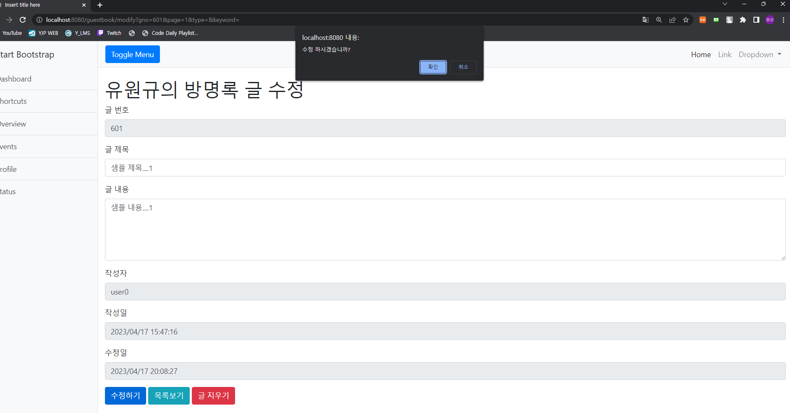

[toc]

# 유원규_2101151_웹프로그래밍2_보고서06


## 파일 구조


# 실습 코드

## GuestbookController.java

``` java
package com.kong.king.spring.guest04.controller;

import org.springframework.stereotype.Controller;
import org.springframework.ui.Model;
import org.springframework.web.bind.annotation.GetMapping;
import org.springframework.web.bind.annotation.ModelAttribute;
import org.springframework.web.bind.annotation.PostMapping;
import org.springframework.web.bind.annotation.RequestMapping;
import org.springframework.web.servlet.mvc.support.RedirectAttributes;

import com.kong.king.spring.guest04.dto.GuestbookDTO;
import com.kong.king.spring.guest04.dto.PageRequestDTO;
import com.kong.king.spring.guest04.service.GuestbookService;

import lombok.RequiredArgsConstructor;
import lombok.extern.log4j.Log4j2;

@Controller
@RequestMapping("/guestbook")
@Log4j2
@RequiredArgsConstructor
public class GuestbookController {

	private final GuestbookService service;


    @GetMapping("/") public String index() {
    	log.info("list rot.................");
        return "redirect:/guestbook/list";
    } // index() 끝

    @GetMapping("/list") 
    public void list(PageRequestDTO pageRequestDTO, Model model) {

        log.info("list()가 동작 중 입니다!" + pageRequestDTO);

        model.addAttribute("result", service.getList(pageRequestDTO));

    } // list() 끝

    @GetMapping("/register") 
    public void register() {

        log.info("regist get....");

    } // register() 끝

    @PostMapping("/register") 
    public String registerPost(GuestbookDTO dto, RedirectAttributes redirectAttributes) {

        log.info("dto......." + dto );


        // 새로 추가된 Entity Number
        Long gno = service.register(dto);

        redirectAttributes.addFlashAttribute("msg", gno);

        return "redirect:/guestbook/list";

    } // registerPost() 끝

    @GetMapping({"/read", "/modify"}) 
    public void read(long gno, @ModelAttribute("requestDTO") PageRequestDTO requestDTO, Model model) {
      

        log.info("gno " + gno);
        
        GuestbookDTO dto = service.read(gno);
        model.addAttribute("dto", dto);
        

    } // read() 끝

    @PostMapping("/modify") 
    public String modify(GuestbookDTO dto, 
    		@ModelAttribute("requestDTO") PageRequestDTO requestDTO, 
    		RedirectAttributes redirectAttributes) {

        log.info("post modify..............");
        log.info("dto" + dto);

        service.modify(dto);
        
//        redirectAttributes.addFlashAttribute("page", requestDTO.getPage());
//        redirectAttributes.addFlashAttribute("type", requestDTO.getType());
//        redirectAttributes.addFlashAttribute("keyword", requestDTO.getKeyword());
//        redirectAttributes.addFlashAttribute("gno", dto.getGno());
        
        redirectAttributes.addAttribute("page", requestDTO.getPage());
        redirectAttributes.addAttribute("type", requestDTO.getType());
        redirectAttributes.addAttribute("keyword", requestDTO.getKeyword());
        redirectAttributes.addAttribute("gno", dto.getGno());
      

        return "redirect:/guestbook/read";

    } // modify() 끝
    
    @PostMapping("/remove") 
    public String remove(long gno, RedirectAttributes redirectAttributes) {

        log.info("글번호 : " + gno);
        
        service.remove(gno);
        
        redirectAttributes.addFlashAttribute("msg", gno);
        
        return "redirect:/guestbook/list";

    } // remove() 끝

} // class 끝
```


## GeustbookService

``` java
package com.kong.king.spring.guest04.service;

import com.kong.king.spring.guest04.dto.GuestbookDTO;
import com.kong.king.spring.guest04.dto.PageRequestDTO;
import com.kong.king.spring.guest04.dto.PageResultDTO;
import com.kong.king.spring.guest04.entity.Guestbook;

public interface GuestbookService {
	Long register(GuestbookDTO dto);
	
	PageResultDTO<GuestbookDTO, Guestbook> getList(PageRequestDTO requestDTO);
	
	void remove(Long gno);
	
	void modify(GuestbookDTO dto);
	
	GuestbookDTO read(Long gno);
	
	default Guestbook dtoToEntity(GuestbookDTO dto) {
		Guestbook entity = Guestbook.builder()
				.gno(dto.getGno())
				.title(dto.getTitle())
				.content(dto.getContent())
				.writer(dto.getWriter())
				.build();
		return entity;
	}
	
	default GuestbookDTO entityToDto(Guestbook entity) {
		GuestbookDTO dto = GuestbookDTO.builder()
				.gno(entity.getGno())
				.title(entity.getTitle())
				.content(entity.getContent())
				.writer(entity.getWriter())
				.regDate(entity.getRegDate())
				.modDate(entity.getModDate())
				.build();
		return dto;
	}
}

```


## GeustbookServiceImpl

```java
package com.kong.king.spring.guest04.service;

import java.util.Optional;
import java.util.function.Function;

import org.springframework.data.domain.Page;
import org.springframework.data.domain.Pageable;
import org.springframework.data.domain.Sort;
import org.springframework.stereotype.Service;

import com.kong.king.spring.guest04.dto.GuestbookDTO;
import com.kong.king.spring.guest04.dto.PageRequestDTO;
import com.kong.king.spring.guest04.dto.PageResultDTO;
import com.kong.king.spring.guest04.entity.Guestbook;
import com.kong.king.spring.guest04.entity.QGuestbook;
import com.kong.king.spring.guest04.repository.GuestbookRepository;
import com.querydsl.core.BooleanBuilder;
import com.querydsl.core.types.dsl.BooleanExpression;

import lombok.RequiredArgsConstructor;
import lombok.extern.log4j.Log4j2;

@Service
@Log4j2
@RequiredArgsConstructor
public class GuestbookServiceImpl implements GuestbookService {

		private final GuestbookRepository repository;
		
	@Override
	public Long register(GuestbookDTO dto) {
		// TODO Auto-generated method stub
		log.info("DTO.......");
		log.info(dto);
		
		Guestbook entity = dtoToEntity(dto);
		
		log.info(entity);
		
		repository.save(entity);
		return entity.getGno();
	}

	@Override
	public PageResultDTO<GuestbookDTO, Guestbook> getList(PageRequestDTO requestDTO) {
		Pageable pageable = requestDTO.getPageable(Sort.by("gno").descending());
		
		BooleanBuilder booleanBuilder = getSearch(requestDTO); //검색조건 처리
		
		Page<Guestbook> result = repository.findAll(booleanBuilder,pageable); //Querydsl 사용
		
		Function<Guestbook, GuestbookDTO> fn = (entity -> entityToDto(entity));
		
		return new PageResultDTO<>(result , fn);
	}

	@Override
	public void remove(Long gno) {
		// TODO Auto-generated method stub
		repository.deleteById(gno);

	}

	@Override
	public void modify(GuestbookDTO dto) {
		// TODO Auto-generated method stub
		Optional<Guestbook> result = repository.findById(dto.getGno());
		
		if(result.isPresent()) {
			Guestbook entity = result.get();
			
			entity.changeTitle(dto.getTitle());
			entity.changeContent(dto.getContent());
			
			repository.save(entity);
		}

	}

	@Override
	public GuestbookDTO read(Long gno) {
		Optional<Guestbook> result = repository.findById(gno);
		
		return result.isPresent() ? entityToDto(result.get()) : null ;
	}
	
	private BooleanBuilder getSearch(PageRequestDTO requestDTO) {
		String type = requestDTO.getType();
		BooleanBuilder booleanBuilder = new BooleanBuilder();
		QGuestbook qGuestbook = QGuestbook.guestbook;
		String keyword = requestDTO.getKeyword();
		
		BooleanExpression expression = qGuestbook.gno.gt(0L);
		
		booleanBuilder.and(expression);
		
		if(type==null || type.trim().length() == 0) {
			return booleanBuilder;
		}
		
		BooleanBuilder conditionBuilder = new BooleanBuilder();
		
		if(type.contains("t")) {
			conditionBuilder.or(qGuestbook.title.contains(keyword));
		}
		if(type.contains("c")) {
			conditionBuilder.or(qGuestbook.content.contains(keyword));
		}
		if(type.contains("w")) {
			conditionBuilder.or(qGuestbook.writer.contains(keyword));
		}
		
		booleanBuilder.and(conditionBuilder);
		
		
		return booleanBuilder;
	}
	
	

}

```


## GuestbookRepository

``` java
package com.kong.king.spring.guest04.repository;

import java.util.List;

import org.springframework.data.domain.Page;
import org.springframework.data.jpa.repository.JpaRepository;
import org.springframework.data.querydsl.QuerydslPredicateExecutor;

import com.kong.king.spring.guest04.entity.Guestbook;

public interface GuestbookRepository extends JpaRepository<Guestbook, Long>,
							QuerydslPredicateExecutor<Guestbook>{
	
//	List<Guestbook> findAll(builder peageable);
}
//
```


## BeseEntity

``` java
package com.kong.king.spring.guest04.entity;

import java.time.LocalDateTime;

import javax.persistence.Column;
import javax.persistence.EntityListeners;
import javax.persistence.MappedSuperclass;

import org.springframework.data.annotation.CreatedDate;
import org.springframework.data.annotation.LastModifiedDate;
import org.springframework.data.jpa.domain.support.AuditingEntityListener;

import lombok.Getter;

@MappedSuperclass
@EntityListeners(value = {AuditingEntityListener.class})
@Getter
 abstract class BaseEntity {
	 @CreatedDate
	 @Column(name="regdate", updatable=false) //엔티티 객체 DB반영시 값 변경되지 않는다. 
	 private LocalDateTime regDate;
	 
	 @LastModifiedDate
	 @Column(name="moddate")
	 private LocalDateTime modDate;
	 
}
```


## GuestBook

```java
package com.kong.king.spring.guest04.entity;

import javax.persistence.Column;
import javax.persistence.Entity;
import javax.persistence.GeneratedValue;
import javax.persistence.GenerationType;
import javax.persistence.Id;

import lombok.AllArgsConstructor;
import lombok.Builder;
import lombok.Getter;
import lombok.NoArgsConstructor;
import lombok.ToString;

@Entity
@Getter
@Builder
@AllArgsConstructor
@NoArgsConstructor
@ToString
public class Guestbook extends BaseEntity{
	@Id
	@GeneratedValue(strategy=GenerationType.IDENTITY)
	private Long gno;
	
	@Column(length=100, nullable=false)
	private String title;
	
	@Column(length = 1500 ,nullable= false)
	private String content;
	
	@Column(length=50, nullable= false )
	private String writer;
	
	
	public void changeTitle(String title) {
		this.title = title;
	}
	
	public void changeContent(String content) {
		this.content = content;
	}
	

}

```


## GuestbookDTO

``` java
package com.kong.king.spring.guest04.dto;

import java.time.LocalDateTime;

import lombok.AllArgsConstructor;
import lombok.Builder;
import lombok.Data;
import lombok.NoArgsConstructor;

@Builder
@NoArgsConstructor
@AllArgsConstructor
@Data
public class GuestbookDTO {
	private Long gno;
	private String title;
	private String content;
	private String writer;
	private LocalDateTime regDate, modDate;
}

```


## PageRequestDTO

``` java
package com.kong.king.spring.guest04.dto;

import org.springframework.data.domain.PageRequest;
import org.springframework.data.domain.Pageable;
import org.springframework.data.domain.Sort;

import lombok.AllArgsConstructor;
import lombok.Builder;
import lombok.Data;

@Builder
@AllArgsConstructor
@Data
public class PageRequestDTO {
	private int page;
	private int size;
	
	private String type;
	private String keyword;
	
	public PageRequestDTO() {
		this.page = 1;
		this.size = 10;
	}
	
	public Pageable getPageable(Sort sor) {
		return PageRequest.of(page-1, size, sor);
	}
}

```


## PageResultDTO

``` java
package com.kong.king.spring.guest04.dto;

import java.util.List;
import java.util.function.Function;
import java.util.stream.Collectors;
import java.util.stream.IntStream;

import org.springframework.data.domain.Page;
import org.springframework.data.domain.Pageable;

import lombok.Data;

@Data
public class PageResultDTO <DTO, EN>{
	private List<DTO> dtoList;
	
	private int totalPage;
	private int page;
	private int size;
	private int start, end;
	private boolean prev, next;
	private List<Integer> pageList;
	
	public PageResultDTO(Page<EN> result, Function<EN,DTO> fn) {
		dtoList = result.stream().map(fn).collect(Collectors.toList());
		totalPage = result.getTotalPages();
		makePageList(result.getPageable());
		
	}
	
	public void makePageList(Pageable pageable) {
		this.page = pageable.getPageNumber()+1;	
		this.size = pageable.getPageSize();
		
		int tempEnd = (int)(Math.ceil(page/10.0)) * 10;
		
		start = tempEnd - 9;
		prev = start > 1;
		end = totalPage > tempEnd ? tempEnd : totalPage;
		next = totalPage > tempEnd;
		pageList = IntStream.rangeClosed(start,end).boxed().collect(Collectors.toList());
		
		
	}
}

```


## GuestbookRepository.java 

``` java
package com.kong.king.spring.guest04.repository;

import org.junit.jupiter.api.Test;
import org.springframework.beans.factory.annotation.Autowired;
import org.springframework.boot.test.context.SpringBootTest;
import org.springframework.data.domain.Page;
import org.springframework.data.domain.PageRequest;
import org.springframework.data.domain.Pageable;
import org.springframework.data.domain.Sort;

import com.kong.king.spring.guest04.entity.Guestbook;
import com.kong.king.spring.guest04.entity.QGuestbook;
import com.querydsl.core.BooleanBuilder;
import com.querydsl.core.types.dsl.BooleanExpression;

@SpringBootTest
public class GuestbookRepositoryTests {

	@Autowired
	private GuestbookRepository guestbookRepository;
	
	//테스트 데이터 생성
//	@Test
//	public void insertDummies() {
//		IntStream.rangeClosed(1, 300).forEach(i -> {
//			Guestbook guestbook = Guestbook.builder()
//					.title("Title...." + i)
//					.content("Content....." +i%5)
//					.writer("user" + (i%10))
//					.build();
//			
//			System.out.println(guestbookRepository.save(guestbook));
//		});
//	}
	
	//테스트 데이터 업데이트
//	@Test
//	public void updateTest() {
//		Optional<Guestbook> result = guestbookRepository.findById(302L);
//		
//		if(result.isPresent()) {
//		Guestbook guestbook = result.get();	
//		
//		guestbook.changeTitle("Changed Title......");
//		guestbook.changeContent("Changed Content.....");
//		guestbookRepository.save(guestbook);
//		}
//	}
	
	//Querydsl 테스트 키워드조회 
//	@Test
//	public void testQuery1() {
//		Pageable pageable = PageRequest.of(0,10,Sort.by("gno").descending());
//		QGuestbook qGuestbook = QGuestbook.guestbook;
//		
//		String keyword = "1";
//		
//		BooleanBuilder builder = new BooleanBuilder();
//		
//		BooleanExpression expression = qGuestbook.title.contains(keyword);
//		
//		builder.and(expression);
//		
//		Page<Guestbook> result = guestbookRepository.findAll(builder,pageable);
//		
//		result.stream().forEach(guestbook -> {
//			System.out.println(guestbook);
//		});
//	}
	
	//Queryds2 테스트 다중항목 검색 
	@Test
	public void testQuery2() {
		Pageable pageable = PageRequest.of(0, 10, Sort.by("gno").descending());
		
		QGuestbook qGuestbook = QGuestbook.guestbook;
		
		String keyword = "3";
		String keyword2 = "1";
		
		BooleanBuilder builder = new BooleanBuilder();
		
		BooleanExpression exTitle = qGuestbook.title.contains(keyword);
		BooleanExpression exContent = qGuestbook.content.contains(keyword2);
		BooleanExpression exAll = exTitle.and(exContent);
		
		builder.and(exAll);
		builder.and(qGuestbook.gno.gt(250L));
		
		Page<Guestbook> result = guestbookRepository.findAll(builder,pageable);
		
		result.stream().forEach(guestbook -> {
			System.out.println(guestbook);
		});
	}
	
	
	
}

```


### 실습 결과

    


​        


    

    

## GuestbookServiceTests

```java
package com.kong.king.spring.guest04.service;

import org.junit.jupiter.api.Test;
import org.springframework.beans.factory.annotation.Autowired;
import org.springframework.boot.test.context.SpringBootTest;

import com.kong.king.spring.guest04.dto.GuestbookDTO;
import com.kong.king.spring.guest04.dto.PageRequestDTO;
import com.kong.king.spring.guest04.dto.PageResultDTO;
import com.kong.king.spring.guest04.entity.Guestbook;

@SpringBootTest
public class GuestbookServiceTests {
	
	@Autowired
	private GuestbookService service;
	
//	@Test
//	public void testRegister() {
//		GuestbookDTO guestbookDTO = GuestbookDTO.builder()
//				.title("샘플 제목....")
//				.content("샘플 내용....")
//				.writer("user0")
//				.build();
//		
//		System.out.println(service.register(guestbookDTO));
//	}
	
//	@Test
//	public void testList() {
//		PageRequestDTO pageRequestDTO = PageRequestDTO.builder().page(1).size(10).build();
//		PageResultDTO<GuestbookDTO, Guestbook> resultDTO = service.getList(pageRequestDTO);
//		
//		System.out.println("PREV" + resultDTO.isPrev());
//		System.out.println("Next" + resultDTO.isNext());
//		System.out.println("TOTAL" + resultDTO.getTotalPage());
//		System.out.println("-----------------------------------");
//		for(GuestbookDTO guestbookDTO : resultDTO.getDtoList()) {
//			System.out.println(guestbookDTO);
//		}
//		System.out.println("-----------------------------------");
//		resultDTO.getPageList().forEach(i -> System.out.println(i));
//		
//	}

}

```

  ### 실습 결과


     


     

    

## list.html

``` html
<!DOCTYPE html>
<html lang="en" xmlns:th="http://www.thymeleaf.org">

<link th:href="@{/vender/bootstrap/css/bootstrap.min.css}" rel="stylesheet"/>
<script th:src=@{/vender/jquery/jquery.min.js}></script>
<script th:src=@{/vender/bootstrap/js/bootstrap.bundle.min.js}></script>

<th:block th:replace="~{/layout/basic :: setContent(~{this::content})}">
    <th:block th:fragment="content">
        <h1 class="mt-4">Guestbook 리스트 페이지
            <span>
                <a th:href="@{/guestbook/register}">
                    <button type="button" class="btn btn-outline-primary">Resister</button>
                </a>
            </span>
        </h1>

        <form action="/guestbook/list" method="get" id="searchForm">
            <div class="input-group">
                <input type="hidden" name="page" value = "1">
                <div class="input-group-prepend">
                    <select class="custom-select" name="type">
                        <option th:selected="${pageRequestDTO.type == null}">-------</option>
                        <option value="title" th:selected="${pageRequestDTO.type =='t'}" >제목</option>
                        <option value="content" th:selected="${pageRequestDTO.type =='c'}"  >내용</option>
                        <option value="writer"  th:selected="${pageRequestDTO.type =='w'}" >작성자</option>
                        <option value="titlecontent"  th:selected="${pageRequestDTO.type =='tc'}" >제목 + 내용</option>
                        <option value="titlecontentwriter"  th:selected="${pageRequestDTO.type =='tcw'}" >제목 + 내용 + 작성자</option>
                    </select>
                </div>
                <input class="form-control" name="keyword" th:value="${pageRequestDTO.keyword}">
                <div class="input-group-append" id="button-addon4">
                    <button class="btn btn-outline-secondary btn-search" type="button">Search</button>
                    <button class="btn btn-outline-secondary btn-clear" type="button">Clear</button>
                </div>
            </div>
        </form>

        <table class="table table-striped">
            <thead>
                <tr>
                    <th th:scope="col">#</th>
                    <th th:scope="col">Title</th>
                    <th th:scope="col">Writer</th>
                    <th th:scope="col">Regdate</th>
                </tr>
            </thead>

            <tbody>

                <tr th:each="dto : ${result.dtoList}" >
                    <th scope="row">
                        <a th:href="@{/guestbook/read(gno = ${dto.gno}, page= ${result.page}, type=${pageRequestDTO.type}, keyword = ${pageRequestDTO.keyword})}">
                            [[${dto.gno}]]
                        </a>
                    </th>
                    <td>[[${dto.title}]]</td>
                    <td>[[${dto.writer}]]</td>
                    <td>[[${#temporals.format(dto.regDate, 'yyyy/MM/dd')}]]</td>
                </tr>

            </tbody>
        </table>

        <ul class="pagination h-100 justify-content-center align-items-center">

            <li class="page-item" th:if="${result.prev}">
                <a class="page-link" th:href="@{/guestbook/list(page= ${result.start -1}, type=${pageRequestDTO.type}, keyword = ${pageRequestDTO.keyword})}" tabindex="-1">Previous</a>
            </li>

            <li th:class=" 'page-item ' + ${result.page == page?'active':''} " th:each="page: ${result.pageList}">
                <a class="page-link" th:href="@{/guestbook/list(page = ${page}, type=${pageRequestDTO.type}, keyword = ${pageRequestDTO.keyword})}">
                    [[${page}]]
                </a>
            </li>

            <li class="page-item" th:if="${result.next}">
                <a class="page-link" th:href="@{/guestbook/list(page= ${result.end + 1}, type=${pageRequestDTO.type}, keyword = ${pageRequestDTO.keyword})}">Next</a>
            </li>

        </ul>

        <div class="modal" tabindex="-1" role="dialog">
            <div class="modal-dialog" role="document">
                <div class="modal-content">
                    <div class="modal-header">
                        <h5 class="modal-title">Modal 제목</h5>

                        <button type="button" class="close" data-dismiss="modal" aria-label="Close">
                            <span aria-hidden="true">&times;</span>
                        </button>
                    </div>

                    <div class="modal-body">
                        <p>Modal body text goes here</p>
                    </div>

                    <div class="modal-footer">
                        <button type="button" class="btn btn-secondary" data-dismiss="modal">닫기</button>

                        <button type="button" class="btn btn-primary">수정하기</button>
                    </div>
                </div>
            </div>
        </div>

        <script th:inline="javascript">
            var msg = [[${msg}]];
            console.log(msg);

            if(msg) {
                $(".modal").modal();
            }

            var searchForm = $("#searchForm");

            $('.btn-search').click(function(e){

                searchForm.submit();

            });

            $('.btn-clear').click(function(e){

                searchForm.empty().submit();

            });
        </script>

    </th:block>
</th:block>
```

### 실습결과


## modify.html


``` html
<!DOCTYPE html>
<html lang="en" xmlns:th="http://www.thymeleaf.org">

<th:block th:replace="~{/layout/basic :: setContent(~{this::content} )}">

    <th:block th:fragment="content">
        <h1 class="mt-4">유원규의 방명록 글 수정</h1>

        <form action="/guestbook/modify" method="post">

            <!-- 페이지 번호 -->
            <input type="hidden" name="page" th:value="${requestDTO.page}">
            <input type="hidden" name="type" th:value="${requestDTO.type}">
            <input type="hidden" name="keyword" th:value="${requestDTO.keyword}">

        <div class="form-group">
            <label >글 번호</label>
            <input type="text" class="form-control" name="gno" th:value="${dto.gno}" readonly>
        </div>

        <div class="form-group">
            <label >글 제목</label>
            <input type="text" class="form-control" name="title" th:value="${dto.title}">
        </div>

        <div class="form-group">
            <label >글 내용</label>
            <textarea class="form-control" rows="5" name="content">[[${dto.content}]]</textarea>
        </div>

        <div class="form-group">
            <label >작성자</label>
            <input type="text" class="form-control" name="writer" th:value="${dto.writer}" readonly>
        </div>

        <div class="form-group">
            <label >작성일</label>
            <input type="text" class="form-control" th:value="${#temporals.format(dto.regDate, 'yyyy/MM/dd HH:mm:ss')}" readonly>
        </div>

        <div class="form-group">
            <label >수정일</label>
            <input type="text" class="form-control" th:value="${#temporals.format(dto.modDate, 'yyyy/MM/dd HH:mm:ss')}" readonly>
        </div>

        </form>

        <button type="button" class="btn btn-primary modifyBtn">수정하기</button>

        <button type="button" class="btn btn-info listBtn">목록보기</button>

        <button type="button" class="btn btn-danger removeBtn">글 지우기</button>

        <script th:inline="javascript">
            var actionForm = $("form"); //form Tag 객체

            $(".removeBtn").click(function () {
            	 if(!confirm("삭제 하시겠습니까?")) {
                     return ;
                 }
                actionForm
                .attr("action", "/guestbook/remove")
                .attr("method","post");

                actionForm.submit();
            });

            $(".modifyBtn").click(function () {
                if(!confirm("수정 하시겠습니까?")) {
                    return ;
                }

                actionForm
                .attr("action", "/guestbook/modify")
                .attr("method","post")
                .submit();
            });

            $(".listBtn").click(function () {
                 var pageInfo = $("input[name='page']");
                var type = $("input[name='type']");
                var keyword = $("input[name='keyword']");

                actionForm.empty();             // form Tag의 모든 내용 지우기

                actionForm.append(pageInfo);    // 목록 Page 이동에 필용한 내용 다시 추가
                actionForm.append(type);
                actionForm.append(keyword);

                actionForm
                .attr("action", "/guestbook/list")
                .attr("method","get");

                console.log(actionForm.html()); // 먼저 확인하고, 주석 처리
                actionForm.submit();            // 확인 뒤 주석 해제
            });
        </script>
    </th:block>

</th:block>
```


### 실습결과





## read.html

```html
<!DOCTYPE html>
<html lang="en" xmlns:th="http://www.thymeleaf.org">

<th:block th:replace="~{/layout/basic :: setContent(~{this::content} )}">

    <th:block th:fragment="content">

        <h1 class="mt-4">GuestBook Read Page</h1>

        <div class="form-group">
            <label >Gno</label>
            <input type="text" class="form-control" name="gno" th:value="${dto.gno}" readonly >
        </div>

        <div class="form-group">
            <label >Title</label>>
            <input type="text" class="form-control" name="title" th:value="${dto.title}" readonly >
        </div>
        <div class="form-group">
            <label >Content</label>
            <textarea class="form-control" rows="5" name="content" readonly>[[${dto.content}]]</textarea>
        </div>
        <div class="form-group">
            <label >Writer</label>
            <input type="text" class="form-control" name="writer" th:value="${dto.writer}" readonly>
        </div>
        <div class="form-group">
            <label >RegDate</label>
            <input type="text" class="form-control" name="regDate" th:value="${#temporals.format(dto.regDate, 'yyyy/MM/dd HH:mm:ss')}" readonly>
        </div>
        <div class="form-group">
            <label >ModDate</label>
            <input type="text" class="form-control" name="modDate" th:value="${#temporals.format(dto.modDate, 'yyyy/MM/dd HH:mm:ss')}" readonly>
        </div>

<!--        <a th:href="@{/guestbook/modify(gno = ${dto.gno}, page=${requestDTO.page})}"><button type="button" class="btn btn-primary">Modify</button></a>-->

<!--        <a th:href="@{/guestbook/list(page=${requestDTO.page})}"><button type="button" class="btn btn-info">List</button></a>-->

        <a th:href="@{/guestbook/modify(gno = ${dto.gno}, page=${requestDTO.page}, type=${requestDTO.type}, keyword =${requestDTO.keyword})}">
            <button type="button" class="btn btn-primary">Modify</button>
        </a>

        <a th:href="@{/guestbook/list(page=${requestDTO.page} , type=${requestDTO.type}, keyword =${requestDTO.keyword})}">
            <button type="button" class="btn btn-info">List</button>
        </a>

    </th:block>

</th:block>

```


### 실습결과


## register.html

``` html
<!DOCTYPE html>
<html lang="en" xmlns:th="http://www.thymeleaf.org">

<th:block th:replace="~{/layout/basic :: setContent(~{this::content})}">

    <th:block th:fragment="content">

        <h1 class="mt-4">유원규 방명록 Resister Page</h1>

        <form th:action="@{/guestbook/register}" th:method="post">
            <div class="form-group">
                <label>글 제목</label>
                <input type="text" class="form-control" name="title" placeholder="Enter Title">
            </div>

            <div class="form-group">
                <label>글 내용</label>
                <textarea class="form-control" rows="5" name="content"></textarea>
            </div>

            <div class="form-group">
                <label>작성자</label>
                <input type="text" class="form-control" name="writer" placeholder="Enter Wirter">
            </div>

            <button type="submit" class="btn btn-primary">글 저장</button>
        </form>
    </th:block>

</th:block>
```


### 실습결과


# 실습 후기


지금 보고서 말고 작성해둔 보고서가 존재했습니다. 그런데 실수로 파일이 날라가게 되어서 완성된 보고서가 삭제되어서 지금 재작성한 보고서입니다.

보고서 작성할때 작성한 게시글을 수정후 내용을 변경한 뒤에 수정확인을 누르면 에러가 발생했는데 알고보니 컨트롤러 부분에서 addAttribute를 해야하는데.

addFlashAttribute를 했습니다. 위에 존재하는 코드를 그냥 그대로 복붙을 하다가 실수를 한거같습니다. 다음에는 제대로 확인을 하고 복붙을 해야겠다 라는 생각을 가지게 되었습니다.


이번 실습을 하게되면서 qdsl이라는 것에 대해서 처음접하게 되었고 이런게 존재했구나를 알게되었습니다. 아직 이부분에 대해서 학습을 해보지 않았지만 추후에는 학습을 해봐야겠다는 생각이들었습니다.

실제로 회사에서도 모듈하나를 만든후에 해당 모듈을 테스트하기 위해 여러 작업을 거치는 걸로 알고 있습니다. 시설이 좋은 회사에서는 모듈을 완성한 후 해당 모듈과 관련된 테스트를 자동으로 해준다는 시스템이 존재한다고하던데 이부분에 대해서는 어떻게 돌아가는지는 모르겠지만 회사에서도 모듈을 테스트하는것에대해 중요하게 생각한다는게 키포인트이지 않나 싶습니다. 스프링부트에서 테스트코드를 작성해서 테스트를 하는 방법을 이번기회에 배우게 되었고 해당 방법을 통해 모듈하나를 완성할때마다 테스트를 하는게 중요하다 라는 생각이 들었습니다. 

