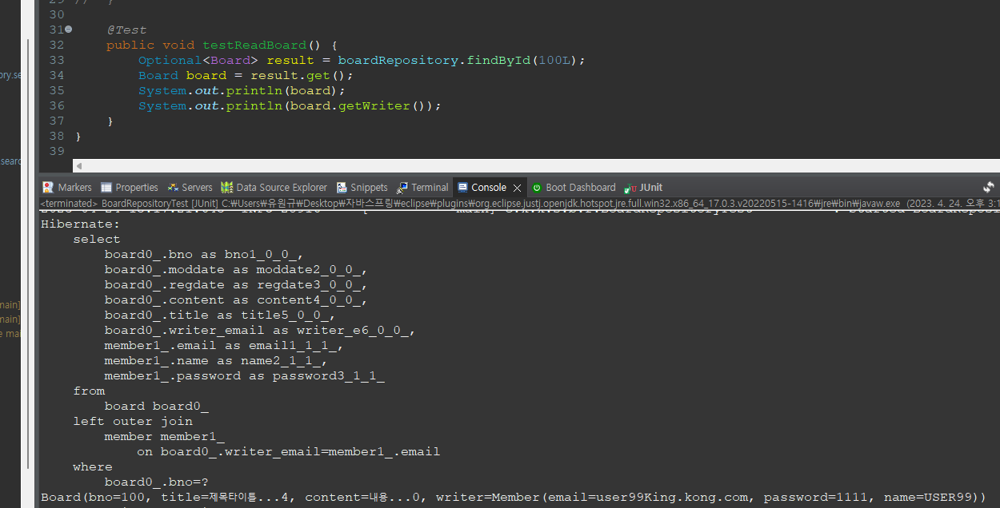
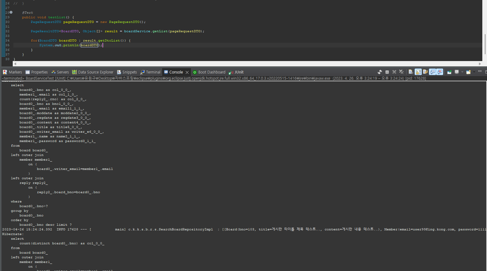
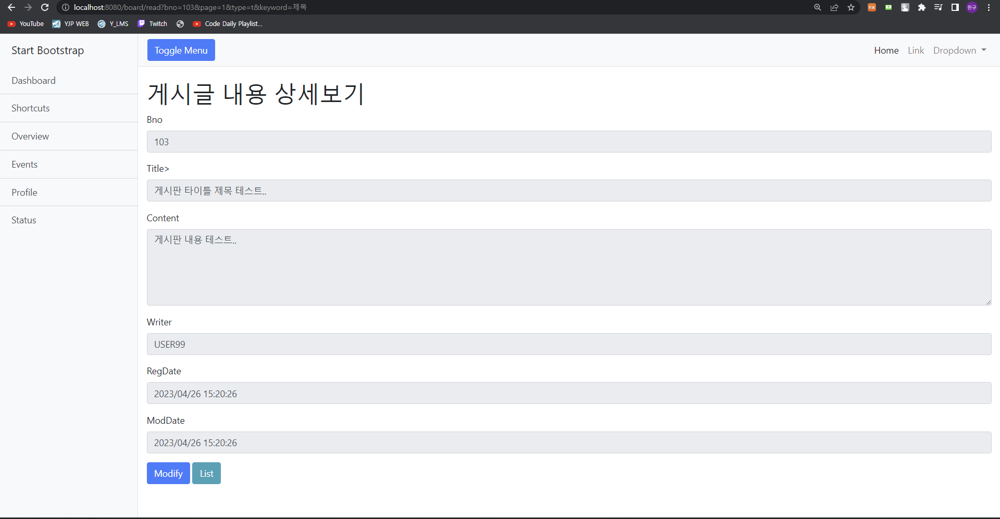
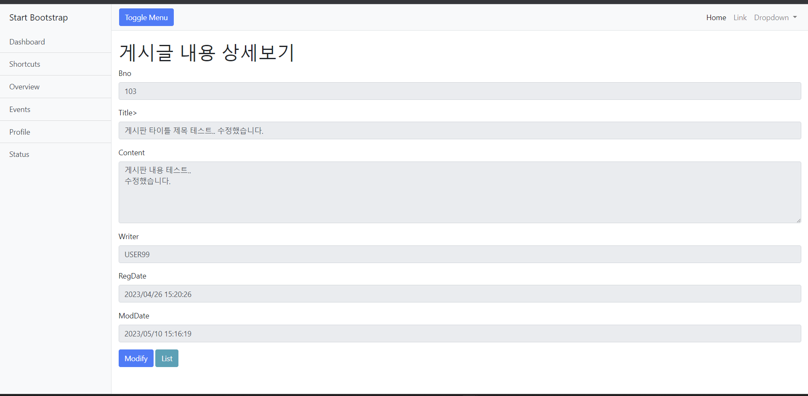
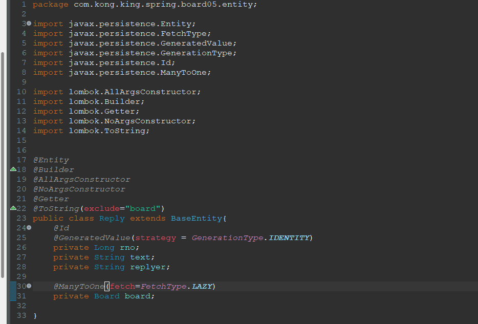

[toc]


# 유원규_2101151_웹프로그래밍2_보고서07


## 웹프로그래밍 5장 (Spring boot - 답글형 게시판)


## 패키지 및 템플릿 구조 구성	


## 실습


### 클래스 생성


#### BaseEntity

``` java
package com.kong.king.spring.board05.entity;

import java.time.LocalDateTime;

import javax.persistence.Column;
import javax.persistence.EntityListeners;
import javax.persistence.MappedSuperclass;

import org.springframework.data.annotation.CreatedDate;
import org.springframework.data.annotation.LastModifiedDate;
import org.springframework.data.jpa.domain.support.AuditingEntityListener;

import lombok.Getter;

@MappedSuperclass
@EntityListeners(value = {AuditingEntityListener.class})
@Getter

abstract class BaseEntity {
	
	@CreatedDate
	@Column(name="regdate" , updatable=false)
	private LocalDateTime regDate;
	
	@LastModifiedDate
	@Column(name="moddate")
	private LocalDateTime modDate;

}
```


#### Member

``` java
package com.kong.king.spring.board05.entity;

import javax.persistence.Entity;
import javax.persistence.Id;

import lombok.AllArgsConstructor;
import lombok.Builder;
import lombok.Getter;
import lombok.NoArgsConstructor;
import lombok.ToString;

@Entity
@Builder
@AllArgsConstructor
@NoArgsConstructor
@Getter
@ToString

public class Member {

	@Id
	private String email;
	private String password;
	private String name;
}

```


#### Board

```` java
package com.kong.king.spring.board05.entity;

import javax.persistence.Entity;
import javax.persistence.GeneratedValue;
import javax.persistence.GenerationType;
import javax.persistence.Id;
import javax.persistence.ManyToOne;

import lombok.AllArgsConstructor;
import lombok.Builder;
import lombok.Getter;
import lombok.NoArgsConstructor;
import lombok.ToString;

@Entity
@Builder
@AllArgsConstructor
@NoArgsConstructor
@Getter
@ToString
public class Board extends BaseEntity{
	@Id
	@GeneratedValue(strategy = GenerationType.IDENTITY)
	private Long bno;
	private String title;
	private String content;
	
	@ManyToOne
	private Member writer;

}

````


#### Reply

``` java
package com.kong.king.spring.board05.entity;

import javax.persistence.Entity;
import javax.persistence.GeneratedValue;
import javax.persistence.GenerationType;
import javax.persistence.Id;
import javax.persistence.ManyToOne;

import lombok.AllArgsConstructor;
import lombok.Builder;
import lombok.Getter;
import lombok.NoArgsConstructor;
import lombok.ToString;


@Entity
@Builder
@AllArgsConstructor
@NoArgsConstructor
@Getter
@ToString
public class Reply extends BaseEntity{
	@Id
	@GeneratedValue(strategy = GenerationType.IDENTITY)
	private Long rno;
	private String text;
	private String replyer;
	
	@ManyToOne
	private Board board;

}
```


### 디비 생성


### RepositoryTest


#### MemberRepositoryTest


#### BoardRepositoryTest


##### Eager 테스트(1)




##### Lazy 테스트


##### left(outer) join 1


##### left(outer) join 2


##### 목록화면 JPQL 


##### 조회화면 JPQL


#### ReplyRepositoryTest


##### Eager 테스트(2)


### ServiceTest


#### BoardSerivceTest


##### 게시글록


##### 게시판 조회




##### 특정 게시판 조회


##### 특정 게시판 삭제


##### 특정 게시글 수정


### 실습 화면


#### 게시글 리스트


#### 게시글 조건조회


#### 게시글 상세보기




#### 게시글 수정





#### 게시글 삭제


## 웹프로그래밍 6장 (Spring  boot - 답글 JSON 처리)


### Reply 클래스 수정




### ReplyRepository 수정


### ReplyRepository 테스트


### ReplyDTO 클래스


### ReplyService 클래스


### ReplyService Impl 클래스


### ReplyController


### Controller 수정 1,2번 


### read.html 수정


read.html 자바스크립트 


``` javascript
 <script th:inline="javascript">
            $(document).ready(function() {

                var bno = [[${dto.bno}]];

                var listGroup  = $(".replyList");

                $(".replyCount").click(function(){

                    $.getJSON('/replies/board/'+bno, function(arr){

                        console.log(arr);

                    })//end getJSON

                })//end click


                //댓글이 추가될 영역
                var listGroup  = $(".replyList");

//날짜 처리를 위한 함수
                function formatTime(str){
                    var date = new Date(str);

                    return date.getFullYear() + '/' +
                        (date.getMonth() + 1) + '/' +
                        date.getDate() + ' ' +
                        date.getHours() + ':' +
                        date.getMinutes();
                }

//특정한 게시글의 댓글을 처리하는 함수
                function loadJSONData() {
                    $.getJSON('/replies/board/'+bno, function(arr){

                        console.log(arr);

                        var str ="";

                        $('.replyCount').html(" Reply Count  " + arr.length);

                        $.each(arr, function(idx, reply){
                            console.log(reply);
                            str += '    <div class="card-body" data-rno="'+reply.rno+'"><b>'+reply.rno +'</b>';
                            str += '    <h5 class="card-title">'+reply.text+'</h5>';
                            str += '    <h6 class="card-subtitle mb-2 text-muted">'+reply.replyer+'</h6>';
                            str += '    <p class="card-text">'+ formatTime(reply.regDate) +'</p>';
                            str += '    </div>';
                        })

                        listGroup.html(str);

                    });
                }

                $(".replyCount").click(function(){

                    loadJSONData();
                })//end click

                //모달 창
                var modal = $('.modal');

                $(".addReply").click(function () {

                    modal.modal('show');

                    //댓글 입력하는 부분 초기화 시키기
                    $('input[name="replyText"]').val('');
                    $('input[name="replyer"]').val('');


                    $(".modal-footer .btn").hide(); //모달 내의 모든 버튼을 안 보이도록
                    $(".replySave, .replyClose").show(); //필요한 버튼들만 보이도록

                });

                $(".replySave").click(function() {

                    var reply = {
                        bno: bno,
                        text: $('input[name="replyText"]').val(),
                        replyer: $('input[name="replyer"]').val()
                    }
                    console.log(reply);
                    $.ajax({
                        url: '/replies/',
                        method: 'post',
                        data:  JSON.stringify(reply),
                        contentType: 'application/json; charset=utf-8',
                        dataType: 'json',
                        success: function(data){
                            console.log(data);

                            var newRno = parseInt(data);

                            alert(newRno +"번 댓글이 등록되었습니다.")
                            modal.modal('hide');
                            loadJSONData();
                        }
                    })
                });

                $('.replyList').on("click", ".card-body", function(){

                    var rno = $(this).data("rno");

                    $("input[name='replyText']").val( $(this).find('.card-title').html());
                    $("input[name='replyer']").val( $(this).find('.card-subtitle').html());
                    $("input[name='rno']").val(rno);

                    $(".modal-footer .btn").hide();
                    $(".replyRemove, .replyModify, .replyClose").show();

                    modal.modal('show');

                });

                $(".replyRemove").on("click", function(){

                    var rno = $("input[name='rno']").val(); //모달 창에 보이는 댓글 번호 hidden처리되어 있음

                    $.ajax({
                        url: '/replies/' + rno,
                        method: 'delete',

                        success: function(result){
                            console.log("result: " + result);
                            if(result ==='success'){
                                alert("댓글이 삭제되었습니다");
                                modal.modal('hide');
                                loadJSONData();
                            }
                        }
                    })
                });

                $(".replyModify").click(function() {

                    var rno = $("input[name='rno']").val();

                    var reply = {
                        rno: rno,
                        bno: bno,
                        text: $('input[name="replyText"]').val(),
                        replyer: $('input[name="replyer"]').val()
                    }

                    console.log(reply);
                    $.ajax({
                        url: '/replies/' + rno,
                        method: 'put',
                        data:  JSON.stringify(reply),
                        contentType: 'application/json; charset=utf-8',
                        success: function(result){

                            console.log("RESULT: " + result);

                            if(result ==='success'){
                                alert("댓글이 수정되었습니다");
                                modal.modal('hide');
                                loadJSONData();
                            }
                        }
                    });
                });


            });
        </script>
```


### read.html 실습 화면


댓글 작성 


내용수정


댓글삭제


# 실습후기


이번에 과제를 진행하는데에 있어서 중간발표를 많이 신경쓴다고 과제를 드문드문 진행한거같습니다.

그래서 과제를 중간에하다가 말고 하다가 말고를 반복하다보니 학습을 하는데에 있어서 리마인드하는 시간을 가졌던거 같습니다.

캡스톤에서 저희조 같은경우에는 피드형식으로 게시글을 만들었고 피드를 클릭하거나 혹은 댓글 클릭시에 피드 디테일 창을 키면서 댓글을 부를 생각이었는데 

이번 학습을 통해서 배운 ajax 통신으로 댓글을 불러와서 view구성을 하면 되겠다는 생각이 들었습니다.

또한 피드 검색 기능을 첨부해야 하는게 있었는데 그냥 JPA를 사용할 경우 Query문이 되게 지저분해질거 같으므로 QueryDSL을 사용해서 검색기능을

구현해야하지 않을까란 생각을 가지고있으므로 해당 챕터에서 구현된 쿼리DSL문을 참조하면 되지않을까란 생각이 들기도했지만

전반적으로 QueyDSL에 대한 개념이 약하기 때문에 해당부분에 대해 개인적인 학습을 진행후에 사용하면서 익히는게 옳바르지않은가란 생각을 가지고있긴합니다.


이번학습을 통해서 게시글을 어떻게 불러오고 댓글을 어떻게 불러올지에대해 학습을 할 수 있었고 해당 개념을 바탕으로 캡스톤을 진행할때 써먹으면되겠다 라는 생각을 가지게되는 학습이었습니다.

더욱더 공부를 진행하면서 캡스톤 및 스프링 지식을 키우도록하겠습니다.
