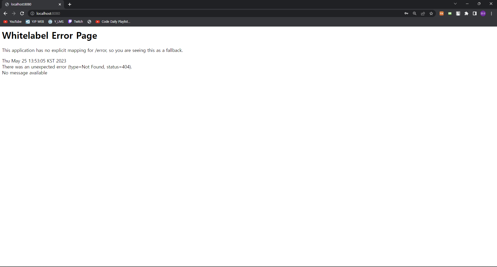
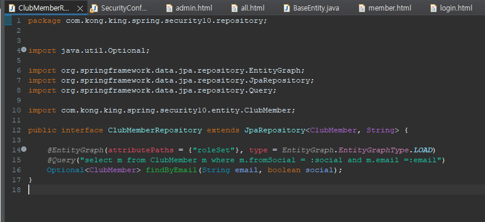

[toc]

# 2101151_유원규_웹프로그래밍2_보고서08

## Spring Security에 의한 비번 생성(임시비번)

## Spring Security에 의한 기본 로그인 테스트

## 시큐리티 설정 클래스 작성

## 샘플 컨트롤러 클래스 작성

## 테스트용 템플릿 페이지 작성

## 컨트롤러 동작 확인

## 스프링 시큐리티 용어와 흐름

**인증** **(Authentication)**

-> 유저가 로그인시 해당 유저가 누구인지 확인 

-> 정당한 사람인지 판별을 우선적으로 한다.

**인가** **(Authorization)**

-> 인증 절차가 끝나면 해당 유저의 권한을 확인 후에 허락을 해준다.

-> 만약에 로그인 한 유저가 일반 사용자라면 관리자 페이지에 접근을 하지못하게 막는등의 행동.

해당 필터중 핵심동작은 AuthenticationManager를 통해 인증(Authentication) 이라는 타입의 객체로 작업을한다.

인증과정에서 사용자가 로그인을 시도할때 UsernamePasswordAuthenticationToken가 생기고 AuthenticationManger가 해당 토큰을 통해서 인증 절차를 가진다. 

인증 절차를 마치게 되면  AuthenticationManager는 Authentication이라는 객체를 반환하게 된다.

반환된 Authentication객체에는 사용자의 정보와 권한정보를 포함하고 있다. 

하지만 여기서 중요한점은 인증과정을 거친다는 것이고, 인증과 인가가 로그인시에 동시에 이루어진다라고는 조금 보기어렵다.

또한 지금 작성한 내용을 읽게 되면 궁금증을 가지게 된다. 왜냐하면 로그인을 한다는건 아이디와 비밀번호를입력해서 서버에다가 전송하는 과정인것이고,

해당 데이터가일치하는 데이터가 서버의 DB에 존재해야한다. 

지금 설명한 부분에는 이러한 부분이 빠지게 되었는데 이부분에 대해서 설명을 하자면 AuthenticationManger가 로그인시도시 발급된 토큰을 가지고 AuthenticationProvider에 정보를 전달하고 해당 객체의 구현체인 DaoAuthenticationProvider라는 구현체가 UserDetailsService를 통해서 DB에 접근후 해당 유저가 있는지 없는지에대해 판별을 하는 과정을 거친다. 만약 해당과정에서 토큰에 담긴 정보가 DB에 저장된 경우 해당 유저에 대한 인증과정을 마치게된다.

이렇게 인증된 유저가 다시 서버에 특정 행동을 요구할 경우 해당 유저에 대한 인가 과정을 거치게된다.

만약에 해당 유저의 권한이 user인데 요청한 권한 내용이 admin의 영역일 경우에 인가 과정을 통해서 접근권한이 없다는걸 판별을 하고

해당 과정을 통해서 유저를 올바르게 인도할 수 있다.

## 스프링 시큐리티 커스터마이징 

커스터마이징을 하기전에 알아야할 사항이 법적으로 사용자의 비밀번호는 DB에 저장할때 모르게 데이터를 저장해야한다.

BCryptPasswordEncoder 의 역할은

패스워드 암호화 전용 

동일한 메시지도 매번 다르게 암호화 생성

복호화 불가 

올바르게 암호화 된 것인지만 확인  등의 작업을 해준다.

crsf를 disable 후 get방식으로 로그인을 처리한 모습입니다. 

## 프로젝트를 위한 JPA 처리 

프로젝트 파일 구조 

## 시큐리티를 위한 UserDetailsService 

## Thymeleaf/Controller에서 정보 출력

## 권한에 따른 인증/인가 실습 - 실습환경 구성 : thymeleaf 페이지

## 실습후기

일단 이번에는 이론적으로 무언가를 배운다는 느낌보다는 실습을 통해서 시큐리티가 무엇인가?에 대해 배운거같습니다.

물론 중간에 조금씩 궁금한점이나 이해가안되는 부분이 있어서 그 부분에대해서는 따로 공부를 조금 진행했습니다.

그러다보니 스프링시큐리티가 지금 배운 내용보다 더 복잡하게 설계되어있을거같다 라는 느낌을 받게되었습니다.

그래서 추후에는 스프링시큐리티에대해 조금더 자세하게 공부를 해야하지않을까 라는 생각을 가지게 되었습니다.

또한 이번에 배운 내용을 바탕으로 스프링시큐리티에 대해 조금더 학습을 통해 우리조의 캡스톤프로젝트에 적용시킬 수 있지않을까 란 생각도 가지고있습니다.

다만 JWT 토큰도 발급을해서 프론트에 넘겨주는 형식으로 진행을 할것같기 때문에  스프링시큐리티를 통한 인증인과후 프론트에 jwt토큰을 어떤형식으로 발급을하고 jwt 토큰을 어떻게 관리할지에 대해 학습을 진행해야지 가능하지않을까란 생각이 들었습니다.
