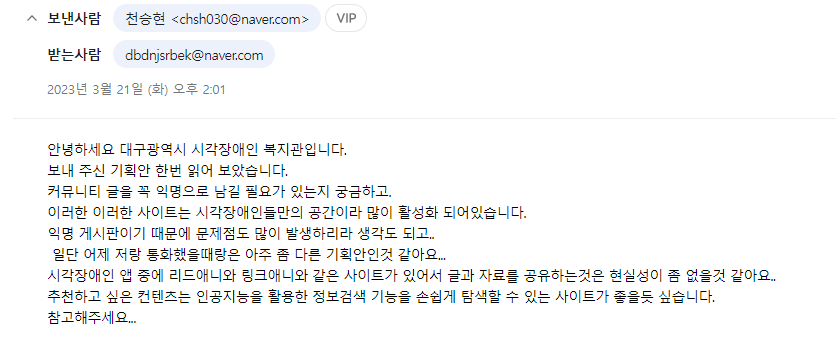
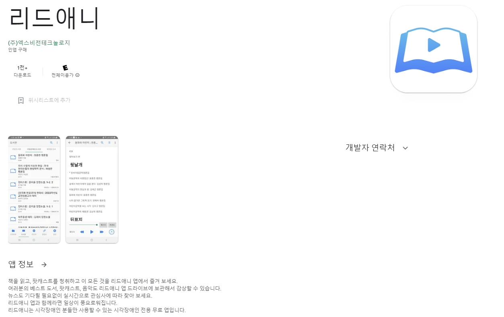
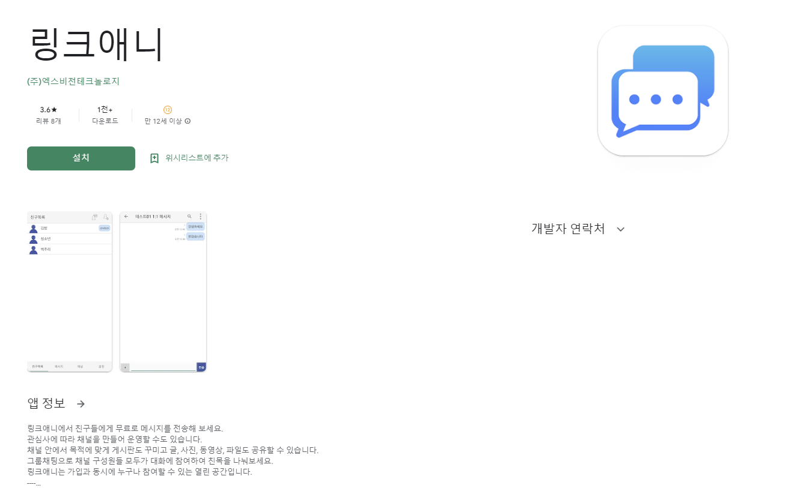
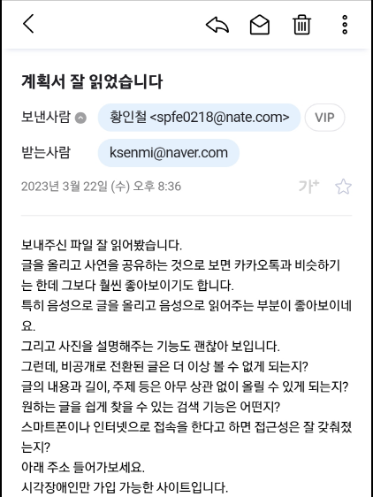
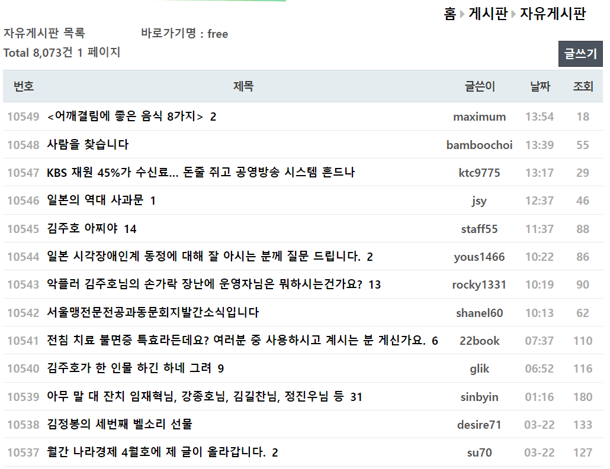
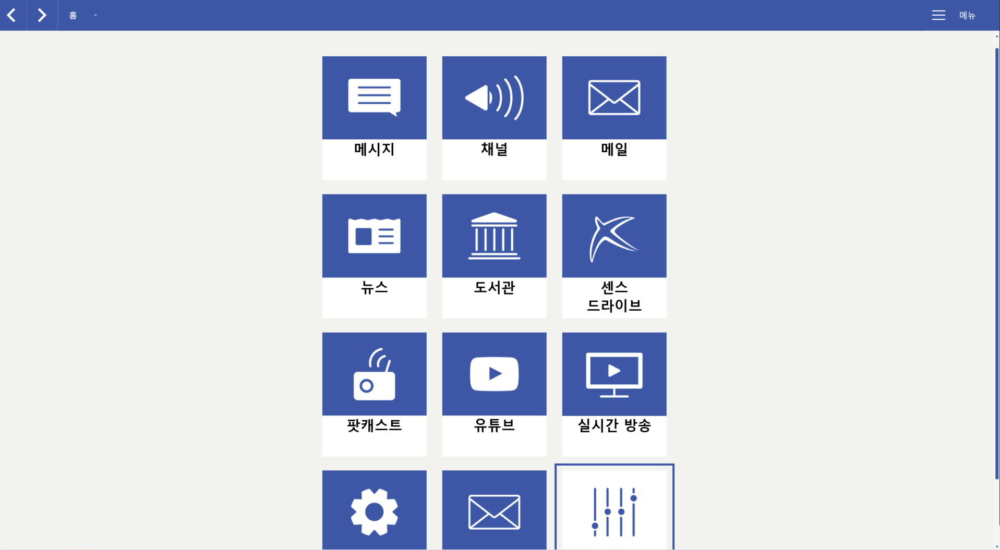
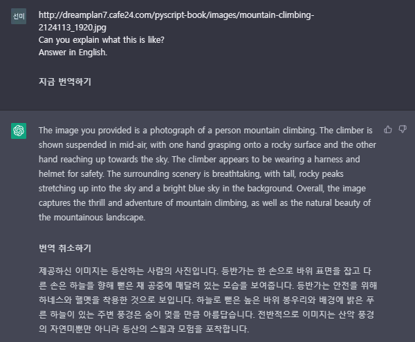
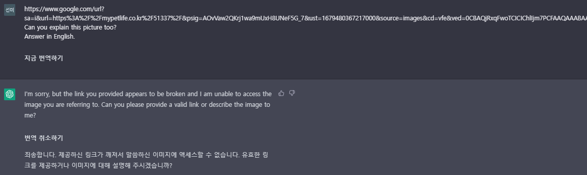

# 2조 투게더 23.3.24.금 주간보고서

**목차**

[toc]

# 시각장애인 인터뷰

## 조사한 장소 목록

* 서울효정학교(서울 강북구, 02-981-1022)

* 서울맹학교(서울 종로구,02-731-6605)

* 부산맹학교 (부산 동래구, 051-523-0057)

* 대전맹학교(대전 동구, 042-280-3526)

* 인천혜광학교(인천 부평구 ,032-452-8804)

* 광주세광학교 ( 광주 서구 , 062-606-0408)

* 아름학교(경기 수원시, 070-4423-9700)

* 울산혜인학교(울산 중구, 052-283-8008)

* 청주맹학교 (충북 청주시 , 043-253-7761)

* 충주성모학교(충북 충주시, 043-852-1374)

* 전북맹아학교(전북 익산시, 063-835-0646)

* 강원명진학교(강원 춘천시 , 033-253-3011)

* 은광학교(전남 영암군,061-462-5602)

* 대구광명학교(대구 남구, 053-231-3300)

* 대구시각장애인연합회(대구 중구, 053-940-2655)

* 대구 장애인종합복지관(대구,수성구,053-763-1011)

* 대구 시각장애인 복지관 (대구광역시 달서구 053-526-9080)

  

**많은 장소에 문의를 드렸으나 실제 인터뷰는 2명  가능했습니다.**

#### 인터뷰 내용

두분다 이메일로 기획서를 hwp문서로 작성해서 보내주시면 검토를 진행해주시겠다 하셨습니다.

두분은 대구 시각장애인 복지관에서 일을 하시는 분들이며 실제 시각장애인 이십니다.

복지관에서 실제 시각장애인분들에게 휴대폰 , 컴퓨터를 어떻게 사용하는지 교육을 하고 계십니다.

### 대구시각장애인복지관 자립생활지원팀(천승현님)

**기획서에 관한 답변**

**리드애니**

IOS에서만 사용가능합니다.

시각 장애인분들만 사용할 수 있어서 저희가 사용해보지는 못했습니다.

해당 어플은 책을 읽어주고 팟캐스트, 유튜브를 사용을 보조해줍니다.

**리드애니**

해당 어플을 사용할려면 제공기관에 가입되어있거나 사용동의를 얻어야 사용이 가능합니다.

해당 앱은 채널을 만들고 해당 채널 목적에 따라 게시판도 꾸미고 글,사진,동영상,파일을 공유하며 일대일, 다대다 채팅이 가능합니다.

하지만 두개의 어플은 특정 사용자들만 사용가능 합니다.

또한 저희가 기획중인 커뮤니티와는 다른 느낌인 것 같습니다.

천승현님께서는 **긍정적이지 않은 답변**을 하신것 같습니다.

### 대구시각장애인복지관 정보접근성지원팀(황인철님)

**기획서에 대한 답변**

 답변으로 사이트와 어플을 알려주셨고 저희가 참고할 수 있게 아이디 비밀번호를 알려주셨습니다. 

아이디 비밀번호 사이트 주소는 비밀 준수를 위해 검열을 했습니다.

이메일 맨마지막에 적혀있듯이 실제로 시각장애인분들만 사용중 입니다.

해당 이메일을 받은 후 저희가 전화 인터뷰를 진행했습니다.

인터뷰 내용은 첫번째로는 이메일에 작성된 궁금증에 답변해드렸습니다.

 두번째로는 우리사이트에 대해 어떻게 생각하는지 인터뷰를 진행했습니다.

자세한거는 녹음을 한내용이 있으니 다음주 발표때 첨부해서 알려드리겠습니다.

간단하게 요약하면 이대로 진행해도 될 것같다라고 **긍정적인 답변**을 하셨습니다.

#### 시각장애인 관련 사이트 및 어플

**사이트**

**어플**

### 정리

인터뷰에 대한 어려움이 존재해서 단 두명을 대상으로 인터뷰를 진행한 결과 긍정적 의견 한분 부정적 한분이 존재했습니다. 

인터뷰 대상자의 수가 적어서 확실하게 강렬한 어필은 하기 힘든 실정입니다.

그래서 주요 타겟층으로 선정하는데에는 어려움이 있으나 실제로 서비스를 하게된다면 잠재적 고객층으로 생각은 가능하지 않을까 라는 생각은 듭니다.

# 아이디어 기술 검토

### 인공지능 비서api

* 구글어시스턴트 6월13일 작업종료
* 마이크로소프트 코타나 서비스 종료
* 삼성 빅스비 자체적인 언어를 사용해야합니다.
* 인공지능 비서를 통한 퀄리티 높은 서비스를 제공하는건 힘들거 같아서 TTS+STT api 결합을 통한 특정단어 인식으로 처리할 생각입니다.

### chatgpt api

* gpt4 api발급키에 관한 수락은 없습니다.

* 다른 방법으로는 chatgpt plus 구독을 통한 openAI사이트에서 사용가능하지만 월 20달러라 비용적 부담이 존재합니다. 

  * 또한 실제로 이미지 인식 기능을 사용하지 못합니다.

* chatgpt3가 공개된 url을 통한 사진 분석을 해준다는 것을 확인했습니다.

  * 아래 사진이 chatgpt를 사용한 사진분석입니다.

  * 

  * 2

  * 

  * 링크 형식으로 사진을 인식해서 설명을 해주긴하나 AI접근을 해당 사이트에서 허용해줘야 가능한것을 확인했습니다.

    * 하지만 이 부분은 우리 사이트에서 허용해주는 것이라 상관없다고 봅니다.

  * gpt4가 잘 안된다면 이런방식을 통해 gpt3 api로 처리를 하는 차선책 방법이 존재할 것 같습니다.

    

