# 2조 투게더 캡스톤 프로젝트 뭉게 구름

[toc]

# 기획 배경

## 첫번째 기획안

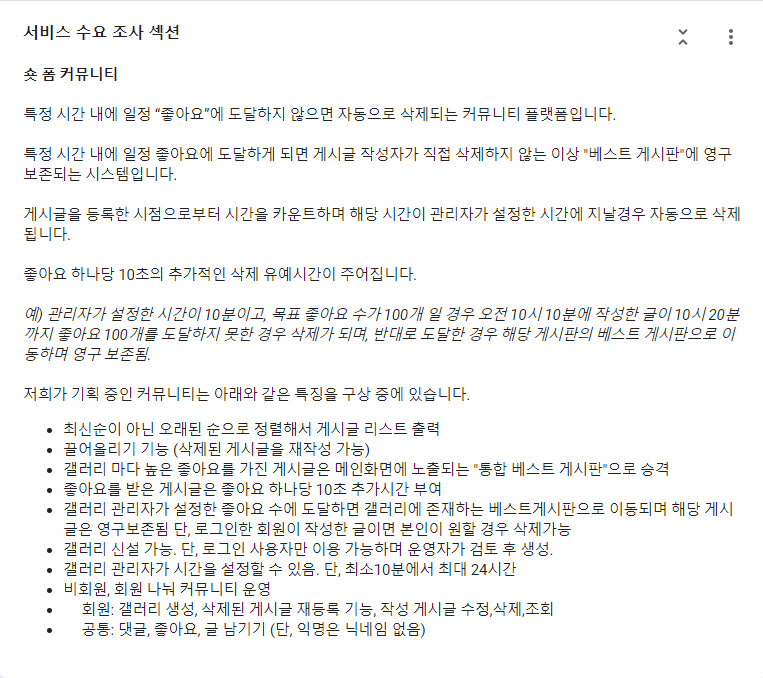

* 작성한 게시글이 48시간 이내에 특정 좋아요를 받지못하면 비공개 되는 커뮤니티 사이트를 생각했습니다.
* 하지만 커뮤니티 자체의 주제가 광범위하여 타겟층이 불명확하다는 판단을 내리게되었습니다.

## 두번째 기획안

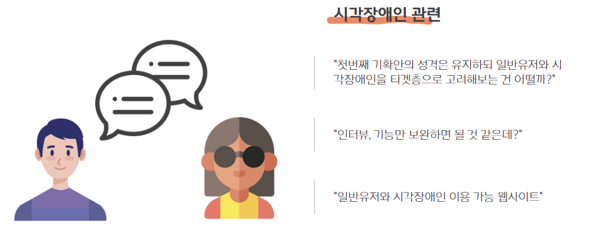

* 첫번째 기획안의 타겟층 불명확성, 주제 광범위를 해소하기위해 기존 아이디어를 고려하되 타겟층을 좁히기 위해 맹인분들을 대상으로 삼게되었습니다.
* 맹인분들이 원활하게 커뮤니티 생활을 할 수 있고 본인이 작성한 글이 48시간 뒤에 삭제가되며 일반인들하고 의사소통을 나눌 수 있는 사이트
* TTS, STT. 인공지능 비서를 활용한 커뮤니티 사이트 사용을 원활하게 돕는 프로젝트를 생각했습니다.
* 하지만 해당 프로젝트와 관련되어서 시각장애인 대상으로 실행한 설문조사가 4명 밖에 없어서 프로젝트 타당성의 근거와 서비스 제공, 기술적한계를 느끼게 되었습니다. 

이런 과정을 통해 탄생을 하게된게 해당 프로젝트 뭉게구름입니다.

# 사이트 주제

* 음악 연주자와 창작자가 우리 사이트에서 창작물을 공유하고 재창작하며 감상할 수 있는 사이트

 

# 목적

* 우리 사이트의 창작물 주제와 관련된 재능이 있는 사람들이 본인의 재능을 자랑 할 수 있습니다.
* 사이트에 올라온 창작물을 바탕으로 유저 간의 상호작용을 할 수 있는 사이트입니다.
* 유저간에 상호작용을 통해 하나의 작품, 동영상, 라디오 등 다양한 주제로 뻣어나 갈 수 있습니다.
* 해당 직업의 전문적인 프로가 아닌 아마추어들이 자신의 꿈을 펼칠 수 있습니다.

# 정책

## 1. 회원 정책

- 회원가입시에 본인이 올린 창작물에 대해서 사이트 안에서 재사용되는 허락 동의를 받을 것 입니다.
- 버튼을 사용하여 등록 및 로그인 프로세스를 간소화할 수 있습니다.
- 간편로그인(카카오, 네이버) 시스템도 지원이됩니다.
- 회원가입 하지 않은 사용자는 웹사이트 조회만 가능합니다.

## 2. 게시글 정책

- 사용자가 게시글을 업로드하는 순간 해당 게시글은 사이트 회원 누구나 퍼가서 변경이 가능합니다(재창작)
- 모든 게시글의 저작권은 “저작자표시-비영리(CC BY-NC)”를 따릅니다.
- 다른사람의 창작물을 가져갈때는 다운로드 버튼을 통해서 가져갈 수 있습니다.
- 다운로드 버튼을 클릭할 경우 본인 프로필에 존재하는 타임라인에 로그가 남습니다.
- 게시글 올린사용자의 id를 클릭을하면 해당 사용자의 프로필 조회가 가능합니다.
- 재창작 게시글 인경우 본인이 가져온 자료에 대한 로그가 남습니다.
  - 로그 예시 : 원본게시글 작성자 , 원본 게시글제목, 날짜 
- 재창작 게시글은 본인이 가져온 로그를 삽입을 통한 출처를 밝혀야 합니다.

## 3. 재창작 정책

- 본인이 재창작한 자료에 대한 참조한 자료에 대한 출처를 작성해야합니다.

  - 본인이 다운로드를 할 경우 타임라인에 다운로드한 흔적이 남습니다. 재창작으로 게시글을 등록할 때에는 본인이 다운로드 한 목록중에서 참조한 창작물 로그를 클릭해서 올려야합니다(여러개 가능)

  - 이를 지키지 않은 것을 목격했을 때 신고 기능을 통해 재제를 가할 수 있습니다.

    

# 핵심 기능

## 로그 기능

- 무단 복제와 표절로 인한 문제점을 고려하여 사용자는 자신이 다운로드한 작품에 대한 기록이 남습니다.
- 사용자가 언제 게시글을 작성했는지도 기록이 남습니다.
- 해당 기록은 모든 사용자가 볼 수 있습니다.
- 로그기능을 통해 해당 사용자가 올바르게 사이트를 이용하고 있는지, 올린 게시글이 다른사람의 파일을 다운로드해서 만들고 제대로된 표시를 하였는지를 점검가능합니다.

## 재창작 

- 사용자들이 올린 창작물을 다운로드 할 수 있습니다.
- 다운로드를 하면 본인이 다운로드한 기록이 본인의 타임라인에 저장됩니다.
- 추후에 다운로드한 컨텐츠로 재창작후 재창작 게시판에 글을 작성할 경우 본인의 타임라인 로그에 등록된 기록을 명시해야합니다.
  - 등록하는 칸이 따로 존재합니다.

## 데이터 시각화

* 게시글등록 로그와 다운로드 로그를 활용한 연관관계를 나타냅니다.
* 데이터시각화를 통해 창작물이 어떤 게시글과 관련이 있는지, 얼마나 많은 작품이 탄생하였는지 등을 확인 할 수 있습니다.

* 우리 사이트 

## 로그인 화면

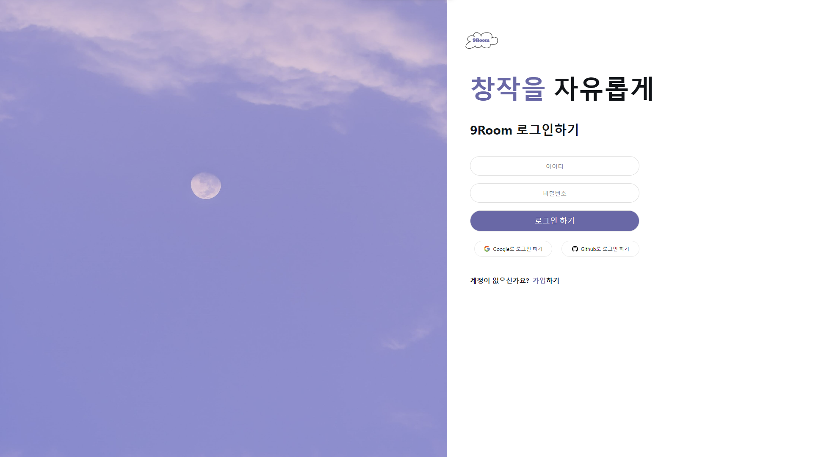

## 회원가입

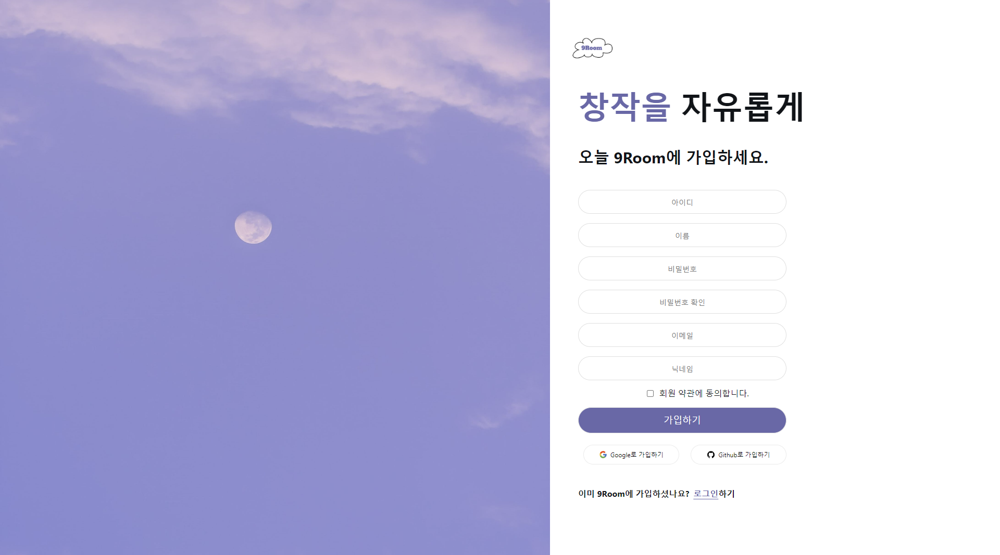

## 메인 화면

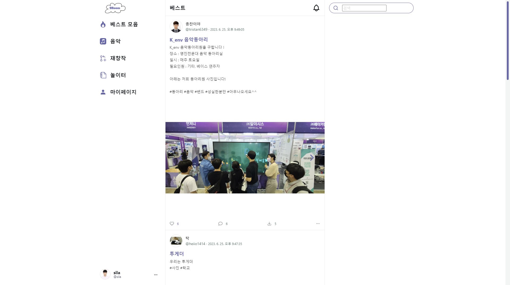

# 마이페이지

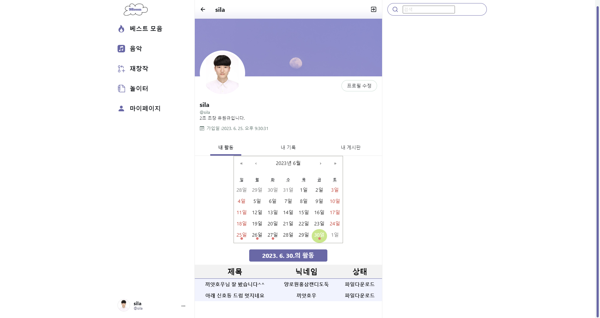

* 마이페이지는 다른 회원들도 상대방 조회가 가능합니다.
* 상대방의 활동기록을 통해 해당 사용자가 누구의 파일을 다운로드 했는지, 언제 글 등록을 하였는지를 체크가 가능합니다.
* 

# 다운로드 알림

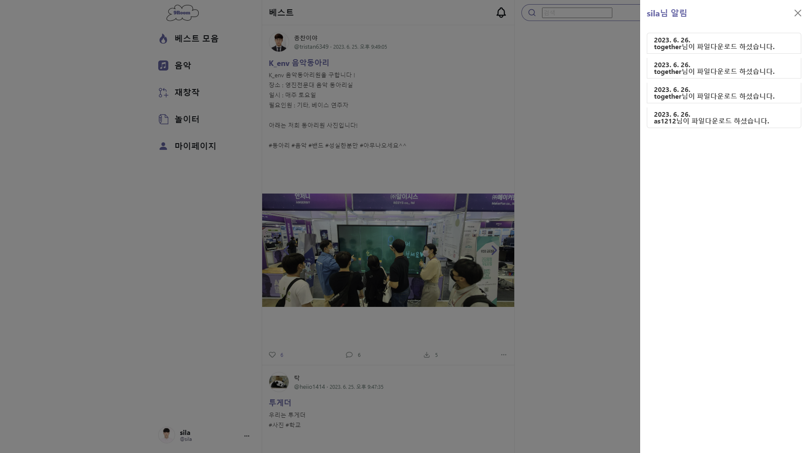

* 다른 사용자가 내가 올린 파일을 다운로드 했다면 확인이 가능합니다.

* 메인 페이지에서 검색 옆 종모양을 누르면 확인이 가능합니다.

  

# 재창작

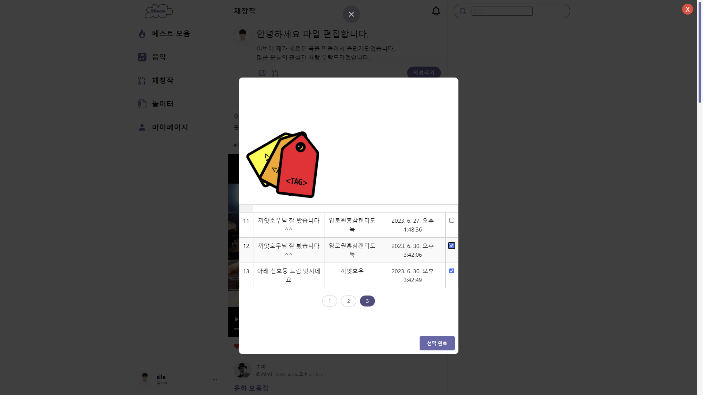

* 재창작 피드를 작성할 경우 본인이 다운로드 받은 기록을 통해 선택할 수 있습니다.
* 

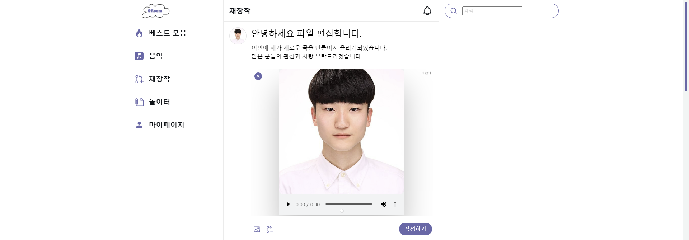

* 제목,내용,파일,태그 삽입을 선택한 후 작성하기 버튼을 누를경우 정상적인 작성이 완료가 됩니다.
* 

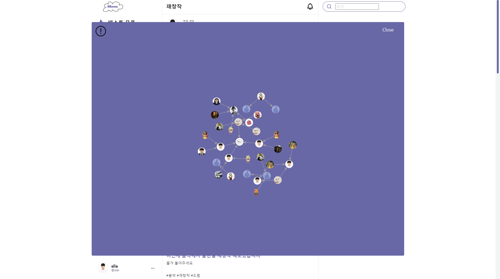

* 작성이 완료가 되면 그래프 조회하기를 통해 재창작의 연관관계를 확인 할 수 있습니다.
* 노드(동그라미)는 작성한 사용자의 프로필 사진입니다.
* 화살표를 받는쪽이 재창작 된 피드 이며 화살표를 주는쪽은 해당 재창작 파일을 만들때 참고한 피드 입니다.
* 노드에 마우스를 올리게 되면 작성자 닉네임, 작성시간, 작성 제목이 나오게 됩니다.
* 해당 노드를 클릭하게 될 경우 피드 상세 조회가 됩니다.

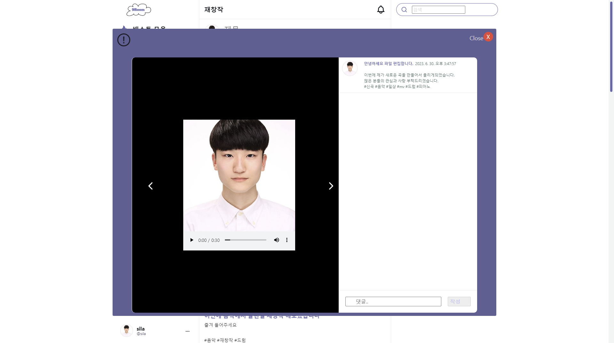

* 이런 시스템을 통해 재창작하기 위해 참고한 자료들도 클릭이 가능하게 되면서 올바르게 자료를 참고했는지, 어떤 자료를 사용해서 만들었는지 확인이 가능합니다.

* 해당 그림에서 사용자 프로필을 클릭하게 되면 사용자의 페이지로 이동하게됩니다.

  

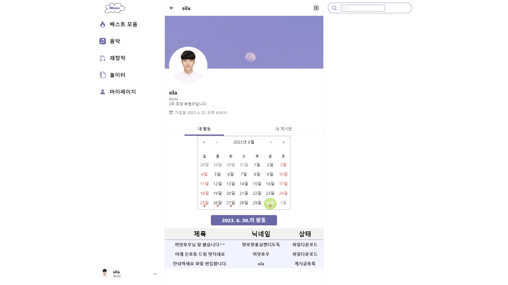

* 해당 사용자가 언제 파일을 다운로드했는지. 언제 글을 작성했는지 확인이 가능합니다.
* 이런 시스템을 통해 해당 사용자가 올바르게 다운로드를 하고 편집을 통해 재창작 피드에 글을 작성했는지 검사가 가능합니다.
* 의심되는 경우 피드 신고가 존재하며 피드를 신고할 경우 관리자에게 해당 정보가 전달됩니다.
* 관리자는 해당 신고를 통해 적절한 조치를 취할 수 있습니다.

## 관리자 모드

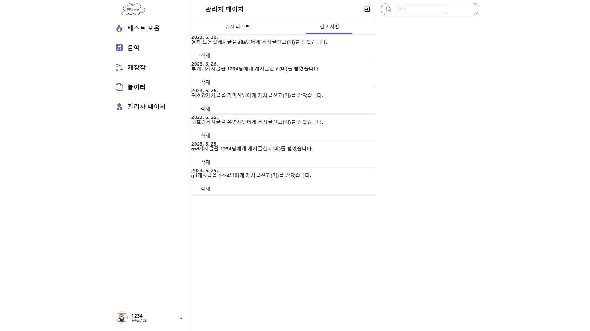

* 관리자로 로그인을 할 경우 사용자 수정 및 삭제 , 피드 수정 및 삭제,신고 확인이 존재합니다.

* 사용자가 신고한 내용이 관리자에게 전달이 됩니다.

* 해당 내용을 클릭할 경우 피드에 대한 내용이 나옵니다.

  

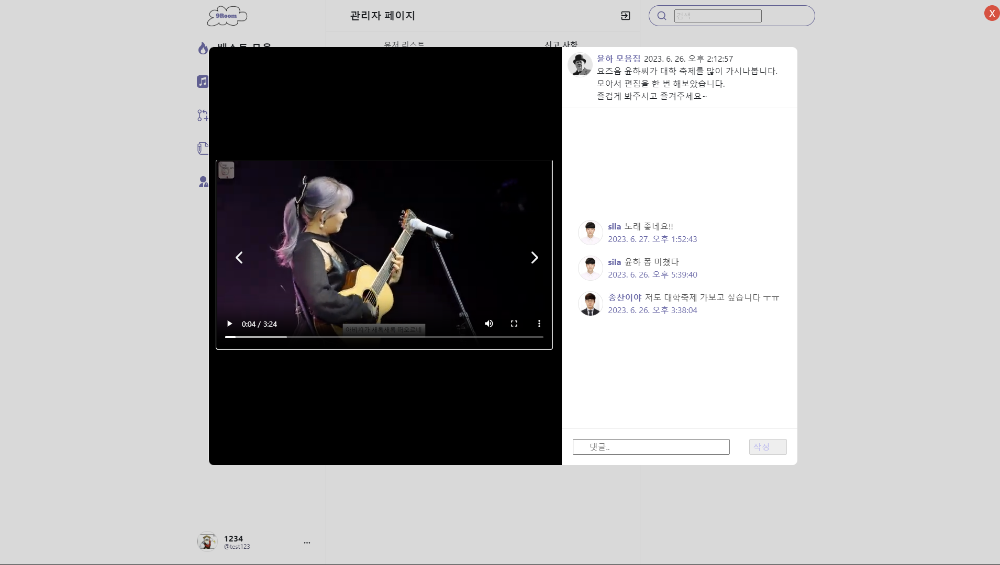

* 관리자는 해당 피드를 본 후 적절하게 조치를 취 할수 있습니다. 
