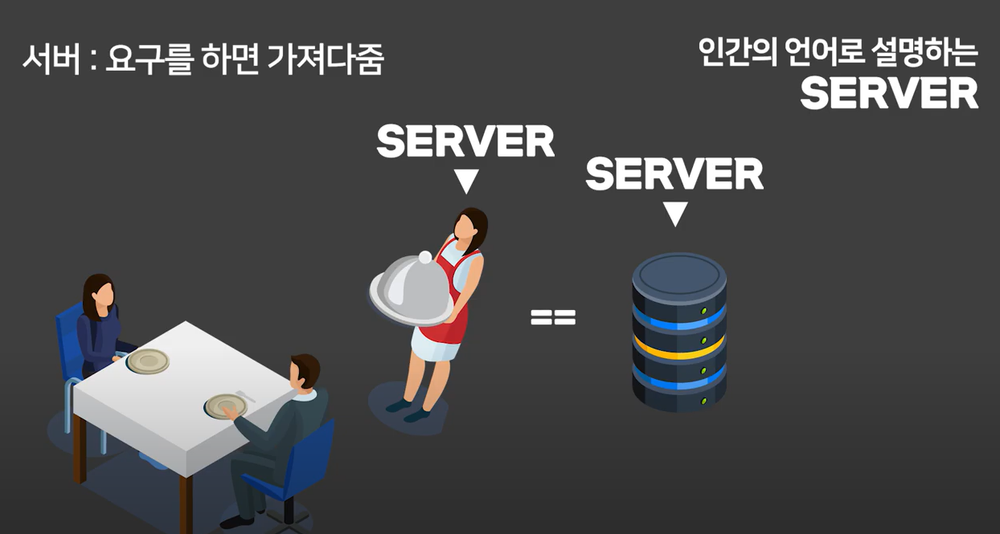

[toc]

# Server

### 사전적 정의

클라이언트에게 네트워크를 통해 정보나 서비스를 전달하는 컴퓨터

클라이언트 요청에 의해 서비스 제공함.

### 쉽게 설명하면

닭갈비 집에가서 닭갈비 2인분 달라고 시키면 서빙해주는 사람이 Server다.

#### **즉 서버는 요청을 받으면 요청한 내용을 보내주는 프로그램이다.** 

그러면 해당 닭갈비집 알바생을 누가 채용할까?

바로 서버개발자다.

서버개발자는 특정 요청이 들어오면 특정응답을 하도록 프로그램을 설계하는 역할을 담당한다.

즉 본인이 원하는 알바생을 생성한 후 서비스를 사용자들에게 제공하는 것이다.

그러면 사용자는 어떤 방식으로 요청을 하는 것일까? 

사용자가 서버에게 요청하는 방식이 존재한다.

#### 서버의 요청 방식

1. 읽기(get 요청)
   * 나 이런 페이지 읽고싶음! 이라는 요청 가능
   * user get -> 사용자 전체조회
   * user:id get -> 특정 사용자 조회 
2. 쓰기(post 방식)
   * 나 이런 페이지 생성해주세요(게시글, 댓글 같은 것)
   * user post -> 사용자 추가(회원가입)
3. 수정(put 방식)
   * 기존에 있는 게시글이나 댓글을 수정하는 것
   * user:id put 
4. 삭제(delete 방식)
   * 기존에 있는 게시글이나 댓글을 삭제하는 것

####  **요런 방식으로 서버와 사용자가 요청하고 응답한다.** 

출처 https://www.youtube.com/watch?v=NoLV5iP5FNY