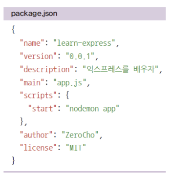
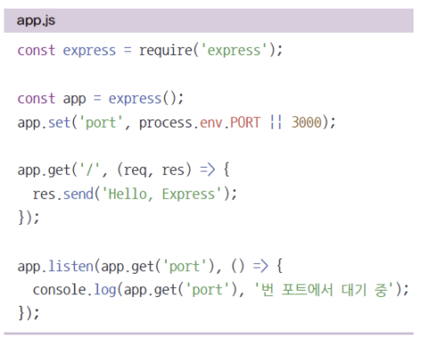

[toc]

# package.json 

1. npm init
2. npm i express
3. npm i -D nodemon
4. npm i morgan 
5. npm i cookie-parser 
6. npm i express-session 
7. npm i dotenv

순으로 명령어를 입력해서 package.json을 만든다.




# app.js

* app.set('port' , 포트) 서버가 실행될 포트를 지정한다.
* app.get('주소' , 라우터)로 GET 요청이 올때 어떤 동작을 할지 지정한다.
* app.listen('포트' , 콜백) 몇번 포트에서 서버를 실행할지 지정한다.
* 

**이렇게 작성한 후 npm start를 콘솔에 입력하면 기본적인 서버가 작동된다.**


# 서버 폴더

* app.js: 핵심 서버 스크립트 
* public: 외부에서 접근 가능한 파일들 모아둠 
* views: 템플릿 파일을 모아둠
*  routes: 서버의 라우터와 로직을 모아둠 추후에 
* models를 만들어 데이터베이스 사용

최상위 폴더 기준에서 만들어 놓으면 된다.


# 미들웨어

**익스프레스는 미들웨어로 구성된다**

* 요청과 응답의 중간에 위치하여 미들웨어 
* app.use(미들웨어)로 장착 
* 위에서 아래로 순서대로 실행됨. 
* 미들웨어는 req, res, next가 매개변수인 함수 
* req: 요청, res: 응답 조작 가능 
* next()로 다음 미들웨어로 넘어감


``` javascript
app.set('port' , process.env.PORT || 3000);
app.use((req,res,next) => {
    console.log('모든 요청에 다 실행됩니다.')
    next();
});
app.get('/' , (req,res,next) => {
    console.log('Get / 요청에서만 실행됩니다.');
    next();
} , (req, res) => {
    throw new Error('에러는 에러 처리 미들웨어로 갑니다.')
});

app.use((err,req,res,next) => {
   console.error(err);
    res.statuse(500).send(err.message);
});
```


### 에러처리 미들웨어

**에러가 발생하면 에러 처리 미들웨어로 간다**

* err, req, res, next까지 매개변수가 4개 
* 첫 번째 err에는 에러가 관한 정보가 담김 
* res.status 메서드로 HTTP 상태 코드를 지정 가능(기본값 200) 
* 에러 처리 미들웨어를 안 연결해도 익스프레스가 에러를 알아서 처리해주긴 함. 
* 특별한 경우가 아니면 가장 아래에 위치하도록 함.


# req

* req.app: req 객체를 통해 app 객체에 접근할 수 있습니다. req.app.get('port')와 같 은 식으로 사용할 수 있습니다.
*  req.body: body-parser 미들웨어가 만드는 요청의 본문을 해석한 객체입니다. 
* req.cookies: cookie-parser 미들웨어가 만드는 요청의 쿠키를 해석한 객체입니다. 
* req.ip: 요청의 ip 주소가 담겨 있습니다. req.params: 라우트 매개변수에 대한 정보가 담긴 객체입니다. 
* req.query: 쿼리스트링에 대한 정보가 담긴 객체입니다. 
* req.signedCookies: 서명된 쿠키들은 req.cookies 대신 여기에 담겨 있습니다. 
* req.get(헤더 이름): 헤더의 값을 가져오고 싶을 때 사용하는 메서드입니다


# res

* res.app: req.app처럼 res 객체를 통해 app 객체에 접근할 수 있습니다. 
* res.cookie(키, 값, 옵션): 쿠키를 설정하는 메서드입니다.
*  res.clearCookie(키, 값, 옵션): 쿠키를 제거하는 메서드입니다. 
* res.end(): 데이터 없이 응답을 보냅니다. res.json(JSON): JSON 형식의 응답을 보냅니다.
* res.redirect(주소): 리다이렉트할 주소와 함께 응답을 보냅니다. 
* res.render(뷰, 데이터): 다음 절에서 다룰 템플릿 엔진을 렌더링해서 응답할 때 사용하 는 메서드입니다. 
* res.send(데이터): 데이터와 함께 응답을 보냅니다. 데이터는 문자열일 수도 있고HTML일 수도 있으며, 버퍼일 수도 있고 객체나 배열일 수도 있습니다.
* res.sendFile(경로): 경로에 위치한 파일을 응답합니다. 
* res.setHeader(헤더, 값): 응답의 헤더를 설정합니다. 
* res.status(코드): 응답 시의 HTTP 상태 코드를 지정합니다.