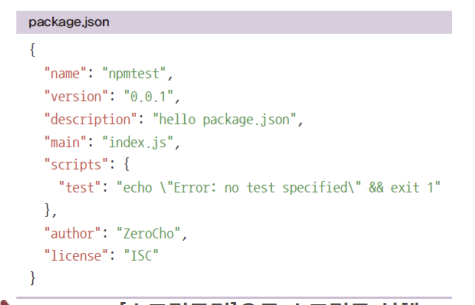
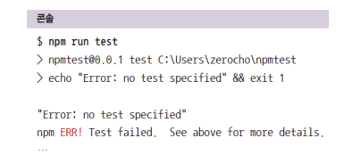
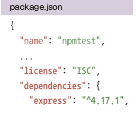
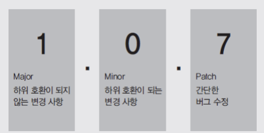

[toc]

# npm(Node Package Manager)

* 노드의 패키지 매니저

* 다른 사람들이 만든 소스 코드들을 모아둔 저장소

* 남의 코드를 사용하여 프로그래밍 가능

* 오픈소스생태계를 구성중

* 이미있는 기능을 다시 구현할 필요가 없어 효율적

* 패키지  : npm에 업로드된 노드 모듈

* 모듈이 다른 모듈을 사용할 수 있듯 패키지도 다른 패키지를 사용 할 수 있음

* 의존관계라고 부름

  * 일례로 npm에 업로드한 패키지를 특정 제작자가 삭제한 경우가 있었다.
  * 그 사람이 삭제한 npm을 많은 기업이 사용하고있었고 그중 페이스북도 존재
  * 페이스북 서버가 잠시 다운되는 사건이 있었음

  

  

   

# package.json

**현재 프로젝트에 대한 정보와 사용중인 패키지에 대한 정보를 담은 파일**

* 같으 패키지라도 버전별로 기능이 다를 수 있으므로 버전을 기ㅗㄺ해두어야 한다.
* 동일한 버전을 설치하지 않으면 문제가 생길 수 있다.
  * 팀원들끼리 협력을 할 경우 버전을 다 맞춰놓고 시작을 해야한다.
* 노드 프로젝트 시작전 package.json부터 만들고 시작한다.
  * npm init을 실행하면 설치가 된다.
  * 
  * 시작은 npm run [스크립트명] 이다.
  * 

# express

**명령어 : npm install express**

* 해당 명령어를 입력하게 되면 package.json에 express가 추가가 된다. 
* 
* npm install 패키지1 , 패키지2 ,패키지3 ... 패키지n 을 통해 여러 패키지를 동시에 다운로드 받을 수 있다.
* npm install --save-dev nodemon 을 통해 개발용패키지 설치가능 (필)

# npm ci

* npm i 를 할때마다 package.json과 package-lock.json이 변할 수 있다.
  * 배포 시에는 npm ci로 배포한다.
* node_modules는 git 같은 버전 관리 시스템에 커밋할 필요가 없다.
  * npm i나 npm ci를 하면 동일하게 복구된다.

# 패키지 버전

**노드 패키지의 버전은 SemVer(유의적 버저닝) 방식을 따른다.**

* Major(주 버전) , Minor(부 버전), Patch(수 버전)
* 노드에서는 배포할때 항상 버전을 올려야한다.
* Major는 하위 버전과 호환되지 않은 수정사항이 생겼을때 올린다.
* Minor는 하위 버전과 호환되는 수정사항이 생겼을때 올린다.
* Patch는 기능에 버그를 해결했을때 올린다.
* 

### 버전 기호 사용

* ^1.1.1: 패키지 업데이트 시 minor 버전까지만 업데이트 됨(2.0.0버전은 안 됨)

*  ~1.1.1: 패키지 업데이트 시 patch버전까지만 업데이트 됨(1.2.0버전은 안 됨)

* @latest는 최신 버전을 설치하라는 의미 실험적인 버전이 존재한다면 @next로 실험적인 버전 설치 가능(불안정함) 

* 각 버전마다 부가적으로 알파/베타/RC 버전이 존재할 수도 있음(1.1.1-alpha.0, 2.0.0- beta.1, 2.0.0-rc.0)

* > =, <=, >, <는 이상, 이하, 초과, 미만. 

# 기타 명령어

* npm update: package.json에 따라 패키지 업데이트 
* npm uninstall 패키지명: 패키지 삭제(npm rm 패키지명으로도 가능) 
* npm search 검색어: npm 패키지를 검색할 수 있음(npmjs.com에서도 가능)
*  npm info 패키지명: 패키지의 세부 정보 파악 가능 
* npm login: npm에 로그인을 하기 위한 명령어(npmjs.com에서 회원가입 필요) 
* npm whoami: 현재 사용자가 누구인지 알려줌 npm logout: 로그인한 계정을 로그아웃
* npm version 버전: package.json의 버전을 올림(Git에 커밋도 함)
  * npm version 5.3.2, npm version minor
*  npm deprecate [패키지명][버전] [메시지]: 패키지를 설치할 때 경고 메시지를 띄우 게 함(오류가 있는 패키지에 적용) 
* npm publish: 자신이 만든 패키지를 배포 
* npm unpublish --force: 자신이 만든 패키지를 배포 중단(배포 후 24시간 내에만  가능) 다른 사람이 내 패키지를 사용하고 있는데 배포가 중단되면 문제가 생기기 때문 
* 기타 명령어는 https://docs.npmjs.com의 CLI Commands에서 확인

# 빠른 서버 세팅 명령어

1. npm init
2. npm i express
3. npm i morgan
4. npm i nunjucks (또는 pug)
5. npm i sequelize 
6. npm i sequelize-cli mariadb (mysql2도 가능)
7. npx i sequelize init
8. npm i -D nodemon
9. npm i 

# 폴더 세팅

public, views , routers 세개를 만들면된다.
