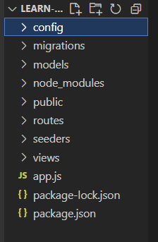
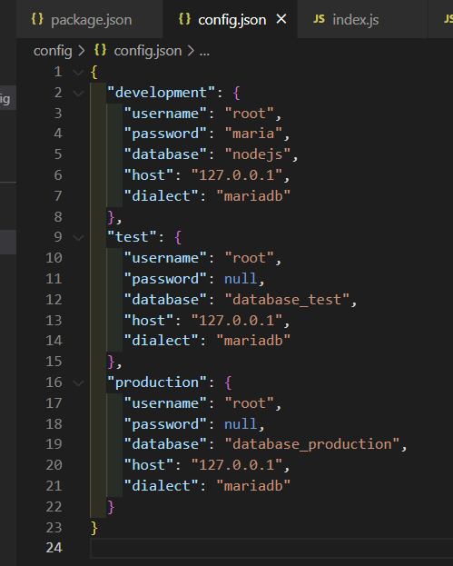
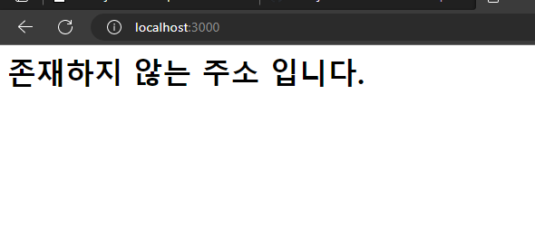
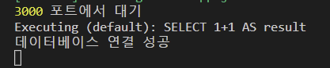
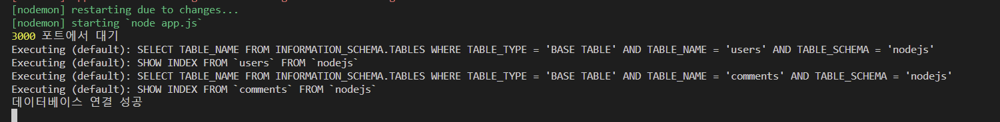
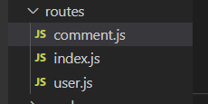

[toc]

# 마리아 디비 세팅

**마리아 디비를 다운로드 한 기준으로 설명하겠다. 마리아 디비를 다운로드 하지못했다면 다운로드 후 **

**아래내용대로 실행하면 된다.**


**database**

```sql
create database nodejs
```


**user table**

``` sql
create table users(
id int not null auto_increment,
name varchar(20) not null,
age int unsigned not null,
married tinyint not null,
comment text null,
created_at datetime not null default now(),
primary key(id),
unique index name_unique (name asc))
comment = '사용자 정보'
engine = InnoDB;

)
```


**comments table**

```sql
create table comments (
id int not null auto_increment,
commenter int not null,
comment varchar(100) not null,
created_at datetime not null default now(),
primary key(id),
index commenter_idx(commenter asc),
constraint commenter
foreign key(commenter)
references users (id)
on delete cascade
on update cascade )
comment = '댓글'
engine = InnoDB;
```


# 폴더 세팅




해당 사진처럼 폴더를 만들면 된다.

# config.json 세팅



* 나 같은 경우 mariadb를 사용하기 때문에 사진처럼 작성을 하였다.

# model/index.js 최소세팅

models/index.js

```js
const Sequelize = require('sequelize');

const env = process.env.NODE_ENV || 'development';
const config = require(__dirname + '/../config/config.json')[env];
const db = {};

const sequelize = new Sequelize(
  config.database,
  config.username,
  config.password,
  config
);
db.sequelize = sequelize;

module.exports = db;
```

해당 코드가 최소한 db연결에 필요한 코드다.


# 서버 세팅

app.js

``` js
//모듈 세팅
const express = require('express');
const path = require('path');
const morgan = require('morgan');
const nunjucks = require('nunjucks');

const app = express();
app.set('port' , process.env.PORT || 3000);
app.set('view engine' , 'html');

nunjucks.configure('views' , {
    express: app,
    watch : true
});

//변수세팅
app.use(morgan('dev'));
app.use(express.static(path.join(__dirname, 'public')));
app.use(express.json()) //json.parse를 자동으로 해준다.
app.use(express. urlencoded({extended:false}));

//my routes


//404
app.use((req,res,next) => {
    const err = new Error('존재하지 않는 주소 입니다.');
    err.status = 404;
    next(err);
});


app.use((err,req,res, next) => {
    const status = err.status || 500; //err.status의 값을 설정 안해주고 넘기면 500을 사용한다.
    res.locals.message = err.message;
    res.locals.err = err;

    res.status(status);
    res.render('error'); 
});

app.listen(app.get('port'), () => {
    console.log(app.get('port') , '포트에서 대기');
});
```

* 해당 코드를 작성한 후 views 폴더에 error.html을 만들어준다.
* 그 후 아래 코드를 작성한다.


``` html
<h1>{{message}}</h1>
<h2>{{error.status}}</h2>
<pre>{{error.stack}}</pre>
```

* 서버를 실행 할 경우 주소로 접속할 경우 아래의 사진이 뜬다.





# DB연동

app.js

``` js
//모듈 세팅
const { sequelize } = require('./models');

sequelize.sync({force : false})
    .then(()=> {
        console.log('데이터베이스 연결 성공');
    })
    .catch((err) => {
        console.error(err);
    });
//변수세팅

```

 이렇게 코드를 추가해주면 된다. 그 후 서버를 실행시키면 콘솔창에 '데이터베이스 연결 성공' 이라는 문장이 뜬다.




# 모델 생성하기


### model/user.js

```js
const Sequelize = require('sequelize');

//static initiate가 모델을 시퀄라이즈와 연결
//static associate는 모델 간 관계 설정

class User extends Sequelize.Model {
  static initiate(sequelize) {
    User.init({
      name: {
        type: Sequelize.STRING(20),
        allowNull: false,
        unique: true,
      },
      age: {
        type: Sequelize.INTEGER.UNSIGNED,
        allowNull: false,
      },
      married: {
        type: Sequelize.BOOLEAN,
        allowNull: false,
      },
      comment: {
        type: Sequelize.TEXT,
        allowNull: true,
      },
      created_at: {
        type: Sequelize.DATE,
        allowNull: false,
        defaultValue: Sequelize.NOW,
      },
    }, {
      sequelize,
      timestamps: false,
      underscored: false,
      modelName: 'User',
      tableName: 'users',
      paranoid: false,
      charset: 'utf8',
      collate: 'utf8_general_ci',
    });
  }

  static associate(db) {
    db.User.hasMany(db.Comment, { foreignKey: 'commenter', sourceKey: 'id' });
  }
};

module.exports = User;
```


### models/comments.js

``` javascript
const Sequelize = require('sequelize');

class Comment extends Sequelize.Model {
  static initiate(sequelize) {
    Comment.init({
      comment: {
        type: Sequelize.STRING(100),
        allowNull: false,
      },
      created_at: {
        type: Sequelize.DATE,
        allowNull: true,
        defaultValue: Sequelize.NOW,
      },
    }, {
      sequelize,
      timestamps: false,
      modelName: 'Comment',
      tableName: 'comments',
      paranoid: false,
      charset: 'utf8mb4',
      collate: 'utf8mb4_general_ci',
    });
  }

  static associate(db) {
    db.Comment.belongsTo(db.User, { foreignKey: 'commenter', targetKey: 'id' });
  }
};

module.exports = Comment;

```


#### 댓글 모델 활성화

model/index.js

```js
const Sequelize = require('sequelize');
const User = require('./user');
const Comment = require('./comment');

db.sequelize = sequelize; //이미 이부분은 쳐놓았기에 이 부분 아래에 아래코드 첨부하면된다.

db.User = User;
db.Comment = Comment;

User.initiate(sequlize);
Comment.initiate(sequlize);

User.associate(db);
Comment.associate(db);

moudle.exports = db;
```


**서버실행을하면 아래와 같은 결과물이 출력이된다.**




# routes 설정

routes 폴더에 user.js , index.js, comments.js를 생성한다.



세 개의 폴더에 해당 js 코드를 넣는다.

``` js
const express = require('express');

const router = express.Router();

module.exports = router;
```


그 후 app.js에 해당 코드를 삽입한다.

``` js
const indexRouter = require('./routes');
const userRouter = require('./routes/user');
const commentRouter = require('./routes/comment');
```

여기서 index.js 같은경우에는 './routes'만 작성해도 자동으로 인식이 된다.

즉 '/routes/index'라고 작성하지 않아도 인식이 된다.

그 후 /my routes라는 주석 밑에 해당 코드를 추가한다.

```js
//my routes
app.use('/' , indexRouter);
app.use('/user' , userRouter);
app.use('/comment', commentRouter);
```

이렇게 작성하면 [localhost:3000](http://localhost:3000/)/user 혹은 [localhost:3000](http://localhost:3000/)/comment를 작성하면 app.use 에 작성된 userRouter로 가던가 혹은 commentRouter로 넘어가게된다.


/routes/index.js

``` js
const express = require('express');
const User = require('../models/user');


const router = express.Router();

router.get('/' , async(res, req, next) => {
    try{
        const users =  await User.findAll({});
        res.render('index', {users});
    }catch(err){
        next(err);

    }
});
module.exports = router;
```

코드를 요렇게 다시 짜준다.

router.get 을할때 async를 꼭 작성해주어야한다. 왜냐하면 user 테이블 값을 가져오지도 않고 index.html로 넘어갈 수 있다.

그렇기에 async를 작성하고 테이블 값을 받아오면 index.html페이지로 이동하는 것이다.

그리고 만약에 서버는 켜져있는데 데이터베이스가 안켜져있으므로 try-catch를 사용해 그런 상황을 방지한다.

