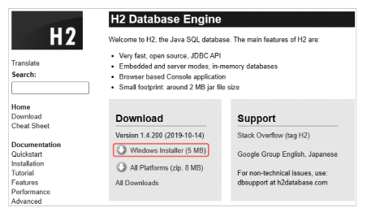
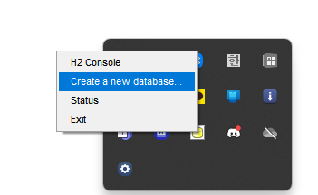
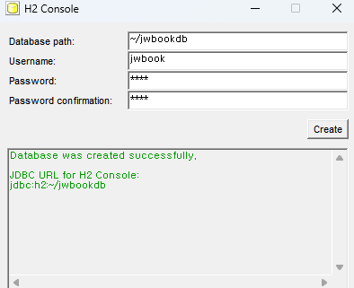
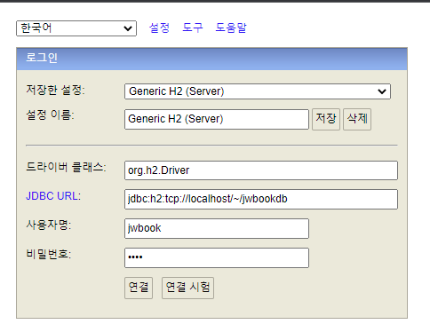
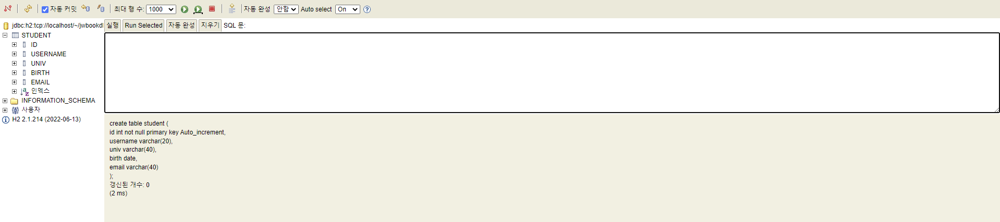
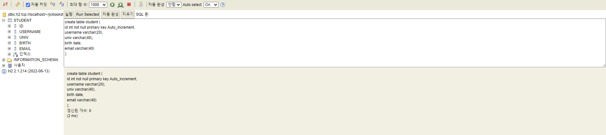

[toc]


# H2database 설치


https://www.h2database.com/에 접속하기



윈도우 installer로 다운 받기


설치가완료되면 윈도우 시작버튼에 H2Console 앱을 실행하고 관리콘솔화면을 마우스 오른쪽 클릭하여 Create a new database를 선택한다.



그 후 다음과 같은 화면이 띄워지게 된다.



나는 유저이름 jwbook

비밀번호는 1234로 설정을 했다. 


그 다음 H2console을 실행시키면 다음과 같은 화면이 뜬다.



해당화면처럼 설정후 사용자명은 jwbook 비밀번호는 1234로 설정을 했다.

그리고 연결을 클릭하면 이런화면이 뜬다.'




# 간단한 명령어


해당 명령어를 작성해서 붙여준후 실행버튼을 클릭하면 왼쪽에 student테이블이 생성이 된다.

### create table

``` sql
create table student (
    id int not null primary key Auto_increment,
    username varchar(20),
    univ varchar(40),
    birth date,
    email varchar(40)
);
```




### alter table

``` sql
alter table student add(tel varchar(30) not null);
alter table student alter username varchar(10);
alter table student drop primary key 
```

* 해당명령어를 입력하면 전화번호 컬럼이 추가가 된다.
* 기존에 존재하는 username의 사이즈를 20에서 10으로 조정 가능하다.
* id를 기본키로 설정한 걸 해제할 수 있다.


### drop table

``` sql
drop table student;
```

* 기존에 생성한 테이블을 삭제할 수 있다.


### insert

``` sql
insert into student(username, univ, birth, email) values ('박사랑' , 'BB대학교', '2000-1-21', 'park@bb.com')
insert into student(username, univ, birth, email) values ('나최고' , 'cc대학교', '1998-1-21', 'nark@bb.com')
insert into student(username, univ, birth, email) values ('홍길동' , 'AA대학교', '2000-1-21', 'hong@bb.com')
```


### select

```sql
select * from student;
```

