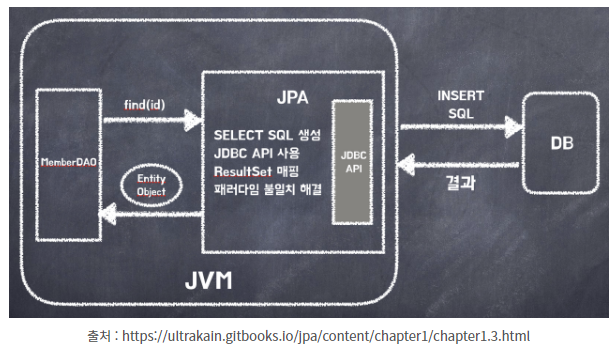

# ORM(Object-Relational Mapping)

애플리케이션 Class와 RDB(Relational DataBase)의 테이블을 매핑한다는 뜻이다.

어플리케이션의 객체를 RDB테이블에 자동으로 영속화 해주는것이라 생각하면 된다.

#### 장점

- SQL문이 아닌 Method를 통해 DB를 조작할 수 있어, 개발자는 객체 모델을 이용하여 비즈니스 로직을 구성하는데만 집중할 수 있음.
  (내부적으로는 쿼리를 생성하여 DB를 조작함. 하지만 개발자가 이를 신경 쓰지 않아도됨)
- Query와 같이 필요한 선언문, 할당 등의 부수적인 코드가 줄어들어, 각종 객체에 대한 코드를 별도로 작성하여 코드의 가독성을 높임
- 객체지향적인 코드 작성이 가능하다. 오직 객체지향적 접근만 고려하면 되기때문에 생산성 증가
- 매핑하는 정보가 Class로 명시 되었기 때문에 ERD를 보는 의존도를 낮출 수 있고 유지보수 및 리팩토링에 유리
- 예를들어 기존 방식에서 MySQL 데이터베이스를 사용하다가 PostgreSQL로 변환한다고 가정해보면, 새로 쿼리를 짜야하는 경우가 생김. 이런 경우에 ORM을 사용한다면 쿼리를 수정할 필요가 없음

#### 단점

- 프로젝트의 규모가 크고 복잡하여 설계가 잘못된 경우, 속도 저하 및 일관성을 무너뜨리는 문제점이 생길 수 있음
- 복잡하고 무거운 Query는 속도를 위해 별도의 튜닝이 필요하기 때문에 결국 SQL문을 써야할 수도 있음
- 학습비용이 비쌈

# JPA(Java Persistence API)

* Java 진영에서 ORM(Object-Relational Mapping) 기술 표준으로 사용하는 인터페이스 모음

* 자바 어플리케이션에서 관계형 데이터베이스를 사용하는 방식을 정의한 인터페이스

* 인터페이스 이기 때문에 Hibernate, OpenJPA 등이 JPA를 구현함

* 

  

# Hibernate

* Hibernate는 JPA의 구현체이다.
* JPA 인터페이스를 직접 구현한 라이브러리다. 
* JPA와 Hibernate는 자바의 interface와 해당 interface를 구현한 class와 같은 관계다.

* JPA와 Hibernate의 상속 및 구현관계를 나타낸 사진이다.
*  JPA의 핵심인 `EntityManagerFactory`, `EntityManager`, `EntityTransaction`을 Hibernate에서는 각각 `SessionFactory`, `Session`, `Transaction`으로 상속받고 각각 `Impl`로 구현하고 있음을 확인할 수 있다.
* 단 JPA를 사용하기위해서 반드시 Hibernate를 사용할 필요가 없다.
  * DataNucleus, EclipseLink등 다른 JPA 구현체 사용가능
  * 혹은 본인이 직접 JAP를 구현해서 사용가능하다.

# Spring Data JPA

여태까지 말한 JPA와 Spring Data JPA의 차이점은 Spirng Data JPA는 JPA를 쓰기 편하게 만들어 놓은 모듈이다.

JPA를 한단계 추상화 시킨 Repository라는 인터페이스를 제공함으로써 사용자가 Repository인터페이스에 정해진 규칙대로 메소드를 입력하면, Spring이 알아서 해당 메소드 이름에 적합한 쿼리를 날리는 구현체를 만들어서 Bean으로 등록해준다.

## JAP 사용하는 이유

* JPA는 반복적인 CRUD SQL을 처리해준다.
* 어려운 동작의 경우 SQL을 직접 작성가능하다.
* 객체 중심으로 개발가능하다.
  * 생산성이 좋아짐
  * 유지보수가 수월해짐
  * 패러다임의 불일치도 해결하였다.
  * 예를들자면 JAVA에서는 부모클래스와 자식클래스의 관계 즉, 상속관계가 존재하는데 데이터베이스에서는 이러한 객체의 상속관계를 지원하지 않는다. (상속 기능을 지원하는 DB도 있지만 객체상속과는 다르다.) 

 

# CRUD

### 저장

### 조회

